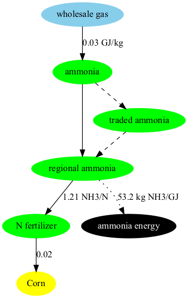

# Table of Contents

- [Inputs to the Module](#inputs-to-the-module)
- [Description](#description)
- [Equations](#equations)
- [Insights and intuition](#insights-and-intuition)
- [Policy options](#policy-options)
- [IAMC Reference Card](#iamc-reference-card)
- [References](#references)

## Inputs to the Module

**Table 1: Inputs required by the demand module [1](#table_footnote)**

| Name | Resolution | Unit | Source |
| :--- | :--- | :--- | :--- |
| Historical energy demand (used for calibration) | By region, technology, and year | EJ/yr | [Exogenous](inputs_demand.html) |
| Cost | By region, technology, and year | 1975$/GJ | [Exogenous](inputs_demand.html) |
| Income and price elasticity | By region, demand, and year | unitless | [Exogenous](inputs_demand.html) |
| GDP per capita | By region and year | thous 1990$ per person | [Economy module](economy.html) |
| Population | By region and year | thousand | [Economy](economy.html) |
| Commodity prices | By region, commodity, and year | 1975$/GJ | [Marketplace](marketplace.html) |
| Logit exponents | By region and sector or subsector | unitless | [Exogenous](inputs_demand.html) |
| Share weight interpolation rules | By region, technology or subsector, and year | unitless | [Exogenous](inputs_demand.html) |
| Fuel preference elasticity | By region, technology or subsector, and year | unitless | [Exogenous](inputs_demand.html) |

<a name="table_footnote">1</a>: Note that this table differs from the one provided on the <a href="inputs_demand.html#energy">Demand Inputs Page</a> in that it lists all inputs to the energy demand module, including information passed from other modules. Additionally, the units listed are the units GCAM requires, rather than the units the raw input data uses.

 

## Description

### Buildings

GCAM disaggregates the building sector into residential and commercial sectors and models three aggregate services (heating, cooling, and other). Within each region, each type of building and each service starts with a different mix of fuels supplying energy (see Figure below). The future evolution of building energy use is shaped by changes in (1) floorspace, (2) the level of building service per unit of floorspace, and (3) fuel and technology choices by consumers. Floorspace depends on population, income, the average price of energy services, and exogenously specified satiation levels. The level of building service demands per unit of floorspace depend on climate, building shell conductivity, affordability, and satiation levels. The approach used in the buildings sector is documented in [Clarke et al. 2018](demand_energy.html#clarke2018), which has a focus on heating and cooling service and energy demands. Within building services, the structures and functional forms are similar to any other GCAM sector, described in [Energy Technologies](en_technologies.html).

### Industry

With the exception of cement and fertilizer, which are explicitly modeled in GCAM, the industrial sector is represented as a consumer of generic energy services and feedstocks. Within energy use there is cost-based competition between fuels, but with a low elasticity of substitution, as the specific uses of the energy are not specified. Cogeneration of electricity is tracked, and represented as a separate technology option for each fuel consumed by the industrial sector (other than electricity). Cogeneration technology options are characterized by higher capital costs, but are credited with the revenue from electricity sold; as such the deployment of cogeneration in any scenario will depend on future fuel and electricity prices. Output of aggregate industrial sectors is represented in generic terms.

#### Cement

GCAM includes a physical representation of the manufacture of cement, that tracks both the fuel- and limestone-derived emissions of CO2. Production volumes are indicated in Mt of cement; input-output coefficients of heat and electricity are indicated in GJ per kg of cement, and the input-output coefficient of limestone is unitless. The energy input-output coefficients are specific to each region, based on [Worrell et al. (2001)](demand_energy.html#worrell2001) and Tables 6.9 and 6.10 in [IEA (2007)](demand_energy.html#iea2007). The limestone input-output coefficient is calculated to return the region's cement-related emissions reported by [CDIAC 2017](demand_energy.html#CDIAC2017). Each region's calibrated fuel shares in this industry are from Table 6.6 in [IEA 2007](demand_energy.html#iea2007). A simple schematic with example input-outout coefficients is shown below; note that in the structure, "process heat cement" is treated as a specific energy commodity, so as to avoid allowing electricity to compete for market share of this input to the cement production process.

 
Structure of GCAM's representation of cement production, with example input-output coefficients shown (GJ/kg of energy, and unitless for limestone)
{: .fig}

Cement is treated as a final demand in GCAM; demands are driven by population and income, and the commodity is not an input to any further modeled processes.

Note that there is a CO2 capture and storage technology for cement production, wherein the CO2 from limestone calcination is captured. The costs of the capture technology are parameterized around [Mahasenan et al. 2005](demand_energy.html#mahasenan2005).

#### N Fertilizer

The representation of nitrogenous fertilizers ("N fertilizer"), indicated in Mt of fixed N in synthetic fertilizers, includes both the specific production technologies for transforming various feedstocks into N fertilizer, as well as the demands for the commodity in the agricultural sectors. Nitrogenous fertilizers manufactured for non-agricultural purposes are excluded from the commodity modeled in GCAM.

Fuel and feedstock sources and input-output coefficients are calibrated based on Table 4.15 of [IEA 2007](demand_energy.html#iea2007). The schematic below shows how N fertilizer is situated between the energy and agricultural systems of GCAM.

 
**Structure of GCAM's representation of N fertilizer supply and demand, with example input-output coefficients shown (GJ/kg of N fertilizer on the energy inputs, and unitless for the N fertilizer inputs to crop production). Note that the fuel/feedstock sources are competing technologies, not fixed inputs to a production function.**
{: .fig}

The hydrogen production stage of ammonia production emits a relatively pure stream of CO2 that is often captured for commercial purposes. Technologies with CCS are modeled in GCAM; additional capture and compression costs and energy inputs are based on H2A [DOE 2015](demand_energy.html#doe2015).

### Transportation

The approach to modeling transportation in GCAM has been documented in [Kim et al. 2006](demand_energy.html#kim2006), [Kyle and Kim 2011](demand_energy.html#kyle2011), and the dataset in the current version of GCAM is documented in [Mishra et al. 2013](demand_energy.html#mishra2013). The modeling approach is consistent with the other sectors in the model, though with several different functional forms, and a higher level of detail than is found in the other sectors of the model.

#### System Boundaries and Structure

The transportation sector in GCAM is subdivided into four final demands: long-distance passenger air travel, (other) passenger travel, international freight shipping, and (other) freight. The transportation sector excludes energy consumption and materials moved via pipeline transport (but see [gas supply system](supply_energy.html#gas-processing)). Energy used by mobile mining, agricultural, industrial, and construction equipment is similarly not considered as transportation energy use, unless used on roadways and for the primary purpose of moving passengers and/or freight.

The passenger sector consists of up to five nesting levels, corresponding to different modes (e.g., road, rail), sub-modes (e.g., bus, light duty vehicle), size classes, and drivetrain technologies. The passenger sector also includes non-motorized modes (walking and cycling, not shown), which are not represented as energy consumers. Their market share in future periods largely depends on income, prices, elasticities, and also the time value of transportation, described below.

#### Functional Forms

Demand for transportation services depends on income and the price of these services (see [equations for transportation service demand](#transportation-service-demand)). These final service demands are supplied by transportation supply sectors, which, as with other supply sectors in GCAM, are composed of subsectors and ultimately technologies. The functional forms for computing costs in both the subsectors and technologies differ slightly from other parts of the model (see [equations for transportation subsector competition](#transportation-subsector-competition)). This competition requires a wage rate. The wage rate is calculated as the per-capita GDP divided by the number of working hours in the year, and the speed of each mode is exogenous (see [Inputs to the Module](#inputs-to-the-module) above for a list of exogenous variables). The time value multiplier is assumed for each mode, according to literature estimates of peoples' valuation of their time in transport (e.g., [Zamparini and Reggiani 2007](demand_energy.html#zamparini2007), [VTPI 2013](demand_energy.html#vtpi2013)), also considering the waiting times (and costs thereof) inherent in each mode ([Polzin and Chu 2005](demand_energy.html#polzin2005)). Note that the time value term does not influence technology-level competition (e.g., between different vehicle sizes or fuels). Time value is also not considered in the freight sector, where the future inter-modal competition takes place on the basis of the evolution of the weighted average technology costs alone.

The time value term is only used for modeling the competition between passenger modes. The net effects of including the time value in the modal competition are (1) a shift towards faster modes of transportation as incomes increase, and (2) relative stabilization of the number of hours per person per day spent in transportation. This is because the time value of all forms of transportation increases with GDP, which tends to increase transportation costs at high levels of income. These effects are consistent with the econometric literature on modal shifting and time travel budgets (e.g., [Shafer 1998](demand_energy.html#shafer1998), [Shafer and Victor 2000](demand_energy.html#shafer2000)). 

Transportation services in GCAM are ultimately supplied by [transportation technologies](en_technologies.html#transportation-technologies), which take inputs of energy and produce outputs of service-distance (e.g., passenger-km, tonne-km) (see [equation](#transportation-technology-cost) below). The non-fuel costs are estimated for some technologies (e.g., light-duty vehicles) from exogenous assumptions about vehicle capital costs, non-fuel operations and maintenance costs, financing assumptions, and annual vehicle utilization (vehicle-km per year). For others, such as all freight technologies and passenger bus and rail, the non-fuel cost is estimated by deducting estimated fuel costs from reported total service costs (e.g., [BTS 2015](demand_energy.html#bts2015)). In either case, the non-fuel cost is converted to dollars per vehicle-km for the equation above. The model then computes market shares of the different technologies as described in [logit choice](choice.html).

## Equations 
The equations that determine energy demand are described here.

### Technology or subsector share

GCAM uses one of [two different logit formulations](choice.html#the-logit) to calculate the shares for each technology or subsector. 

The first option, also known as the `relative-cost-logit`, is:

$$
s_i = \frac{\alpha_i c_i^\gamma}{\sum_{j=1}^{N} \alpha_j c_j^\gamma}
$$

where $$s_i$$ is the share of technology or subsector $$i$$, $$alpha_i$$ is the share weight, $$c_i$$ is the cost of technology or subsector $$i$$, and $$beta$$ is the logit exponent.

The second option, also known as the `absolute-cost-logit`, is: 

$$
s_i = \frac{\alpha_i \exp(\beta c_i)}{\sum_{j=1}^{N} \alpha_j
\exp(\beta c_j)}.
$$

where $$s_i$$ is the share of technology or subsector $$i$$, $$alpha_i$$ is the share weight, $$c_i$$ is the cost of technology or subsector $$i$$, and $$beta$$ is the logit exponent.

See [relative cost logit](https://github.com/JGCRI/gcam-core/blob/master/cvs/objects/functions/source/relative_cost_logit.cpp) and [absolute cost logit](https://github.com/JGCRI/gcam-core/blob/master/cvs/objects/functions/source/absolute_cost_logit.cpp).

#### Per Capita floorspace

The demand for per-capita floorspace, *f*, in future time period *t* is shown below. In this and subsequent equations, "satiation" indicates the level of service demand at which increases in income do not lead to further demands for services.

$$
f_{t}=(s-a)[1-exp(-\frac{ln(2)}{\mu}I_{t}(\frac{P_{t}}{P_{t0}})^\beta)]+a
$$

where *s* is the exogenous satiation level of per-capita floorspace, *μ* is the per-capita GDP at 50% of the satiation level, *a* is an exogenous tuning parameter, *P* is the total levelized cost of the modeled energy services per unit floorspace, *I* is per capita GDP, and $$\beta$$ is the price elasticity of averaged energy services.

#### Building service demand

The demands of generic services per unit floorspace, *d*, are shown in the equation below:

$$
d_{t}=k[1-exp(-\frac{ln(2)}{\mu}\frac{I_{t}}{P_{t}})]
$$

where *k* is a calibration parameter that captures satiation effects, and the other parameters are the same as the equation above, with the exception that here *P* refers to the price of the service. Space heating (*h*) and cooling (*c*) services use a similar approach with some additional considerations, shown below:

$$
h_{t}=k*(HDD_{t}*\eta_{t}*R_{t}-\lambda_{h}*IG_{t})[1-exp(-\frac{ln(2)}{\mu}\frac{I_{t}}{P_{t}})]
$$

$$
c_{t}=k*(CDD_{t}*\eta_{t}*R_{t}+\lambda_{c}*IG_{t})[1-exp(-\frac{ln(2)}{\mu}\frac{I_{t}}{P_{t}})]
$$

where *HDD* and *CDD* refer to heating and cooling degree days, respectively, η is the exogenous average building shell conductance, R is the exogenous average floor-to-surface ratio of buildings, IG is the internal gain heat from other building services, and λ is an exogenous internal gain scaler. In this way, the demands of heating and cooling services per unit of floorspace may vary depending on changes in climate, building shell characteristics, and the amount of internal gain heat coming from other modeled services.

#### Transportation service demand

The demand ($$D$$) for transportation services (e.g., passenger-km, tonne-km) in region $$r$$ and time period $$t$$ is given by the following equation:

$$
D_{r,t}=D_{r,t-1}(\frac{Y_{r,t}}{Y_{r,t-1}})^\alpha (\frac{P_{r,t}}{P_{r,t-1}})^\beta (\frac{N_{r,t}}{N_{r,t-1}})
$$

Where $$Y$$ is the per-capita GDP, $$P$$ is the total service price aggregated across all modes, $$N$$ is the population, and $$\alpha$$ and $$\beta$$ are income and price elasticities, respectively.

See `calcDemand` in [minicam_price_elasticity_function.cpp](https://github.com/JGCRI/gcam-core/blob/master/cvs/objects/functions/source/minicam_price_elasticity_function.cpp).

### Transportation subsector competition

At the subsector level, the subsector competition may add the time value of transportation, as shown in the equation for the price ($$P$$) of mode $$i$$, in region $$r$$ and time period $$t$$:

$$
P_{i,r,t}=\sum_{j=1}^{N} (\alpha_{j,i,r,t}*P_{j,i,r,t}) + \frac{W_{r,t}*V_{i,r,t}}{S_{i,r,t}}
$$

In the equation above, $$j$$ refers to any of N technologies within subsector $$i$$, and $$\alpha$$ is the share of technology $$j$$ in subsector $$i$$. Where this equation differs from the subsectors elsewhere in GCAM is the final term, the wage rate ($$W$$) multiplied by the "time value multiplier" ($$V$$), divided by the average speed of the mode ($$S$$).

See `getGeneralizedPrice` and `getTimeValue` in [tran_subsector.cpp](https://github.com/JGCRI/gcam-core/blob/master/cvs/objects/sectors/source/tran_subsector.cpp).

#### Transportation technology cost

The costs of transportation technologies are computed as follows, for technology $$j$$ in subsector $$i$$, region $$r$$, and time period $$t$$:

$$
P_{j,i,r,t}=\frac{P_{f,r,t}*I_{j,i,r,t}+N_{j,i,r,t}}{L_{j,i,r,t}}
$$

In this equation, $$P_f$$ stands for the fuel price, $$I$$ is the vehicle fuel intensity, N is the levelized non-fuel cost (expressed per vehicle-km), and L is the load factor (persons or tonnes per vehicle).

See `calcCost` in [tran_technology.cpp](https://github.com/JGCRI/gcam-core/blob/master/cvs/objects/technologies/source/tran_technology.cpp).

#### Industry service demand

The demand ($$D$$) for industrial services in region $$r$$ and time period $$t$$ is given by the following equation:

$$
D_{r,t}=D_{r,t-1}(\frac{Y_{r,t}}{Y_{r,t-1}})^\alpha (\frac{P_{r,t}}{P_{r,t-1}})^\beta (\frac{N_{r,t}}{N_{r,t-1}})
$$

Where $$Y$$ is the per-capita GDP, $$P$$ is the total service price aggregated across all modes, $$N$$ is the population, and $$\alpha$$ and $$\beta$$ are income and price elasticities, respectively.

See `calcDemand` in [minicam_price_elasticity_function.cpp](https://github.com/JGCRI/gcam-core/blob/master/cvs/objects/functions/source/minicam_price_elasticity_function.cpp).

#### Fertilizer demand

The demand for fertilizer is determined by the fertilizer input-output coefficient and the level of crop production, i.e.,

$$
D_{r,t} = \sum_{j=1}{n} Prod_{j,t} * Coef_{j,t}
$$

where $$D_{r,t}$$ is the demand for fertilizer in region $$r$$ at time $$t$$, $$Prod_{j,t}$$ is the crop production for technology $$j$$ at time $$t$$, $$Coef__{j,t}$$ is the fertilizer input-output coefficient for technology $$j$$ at time $$t$$, and $j$ is the set of all agricultural technologies within region $$r$$.

See `production` in [ag_production_techology.cpp](https://github.com/JGCRI/gcam-core/blob/master/cvs/objects/technologies/source/ag_production_technology.cpp).

## Policy options 

To be completed...

## Insights and intuition

### Effects of climate on energy demand

Changes in climate will affect residential energy demand [(Zhou et al. 2013)](https://link.springer.com/article/10.1007/s10584-013-0772-x) and building energy expenditures [(Clarke et al., 2018)](https://www.sciencedirect.com/science/article/pii/S0140988318300112), differently across world regions.

### Future changes in energy demand

Residential energy will increase by the end of the century given the projected increase in population and GDP. The implementation of a climate policy promotes the electrification of the sector [(Eom et al.,  2013)](https://www.sciencedirect.com/science/article/pii/S0360544212006214).

## IAMC Reference Card

Passenger transportation
- [X] Passenger trains
- [X] Buses
- [X] Light Duty Vehicles (LDVs)
- [X] Electric LDVs
- [X] Hydrogen LDVs
- [X] Hybrid LDVs
- [X] Gasoline LDVs
- [X] Diesel LDVs
- [X] Passenger aircrafts
- [X] CNG Buses
- [X] CNG Three-wheelers
- [X] Diesel Three-wheelers
- [X] Electric Buses
- [X] Electric Three-wheelers
- [X] LPG/CNG LDVs

Freight transportation
- [X] Freight trains
- [X] Heavy duty vehicles
- [X] Freight aircrafts
- [X] Freight ships

Industry
- [ ] Steel production
- [ ] Aluminium production
- [X] Cement production
- [ ] Petrochemical production
- [ ] Paper production
- [ ] Plastics production
- [ ] Pulp production

Residential and commercial
- [X] Space heating
- [X] Space cooling
- [ ] Cooking
- [ ] Refrigeration
- [ ] Washing
- [ ] Lighting
- [ ] Other electrical uses
- [ ] Water heating

## References

<a name="bts2015">[BTS 2015]</a> Bureau of Transportation Statistics, 2015, *Table 3-21: Average Freight Revenue Per Ton-mile (Current cents)*, U.S. Department of Transportation, Office of the Assistant Secretary for Research and Technology. [Link](http://www.rita.dot.gov/bts/sites/rita.dot.gov.bts/files/publications/national_transportation_statistics/html/table_03_21.html)

<a name="CDIAC2017">[CDIAC 2017]</a> Boden, T., and Andres, B. 2017, *National CO2 Emissions from Fossil-Fuel Burning, Cement Manufacture, and Gas Flaring: 1751-2014*, Carbon Dioxide Information Analysis Center, Oak Ridge National Laboratory. [Link](http://cdiac.ess-dive.lbl.gov/ftp/ndp030/nation.1751_2014.ems)

<a name="clarke2018">[Clarke et al. 2018]</a> Clarke, L., Eom, J., Hodson Marten, E., et al. 2018. Effects of long-term climate change on global building energy expenditures. *Energy Economics* 72, pp. 667-677. [Link](https://www.sciencedirect.com/science/article/pii/S0140988318300112)

<a name="doe2015">[DOE 2015]</a> U.S. Department of Energy. 2015. *DOE H2A Production Analysis*, DOE Hydrogen and Fuel Cells Program. [Link](https://www.hydrogen.energy.gov/h2a_production.html)

<a name="iea2007">[IEA 2007]</a> International Energy Agency, 2007, *Tracking Industrial Energy Efficiency and CO2 Emissions*, International Energy Agency, Paris, France. [Link](https://www.iea.org/publications/freepublications/publication/tracking_emissions.pdf)

<a name="kim2006">[Kim et al. 2006]</a> Kim, S., Edmonds, J., Lurz, J., Smith, S.J., and Wise, M. 2006. The objECTS Framework for integrated Assessment: Hybrid Modeling of Transportation. *The Energy Journal* 27, Special Issue: Hybrid Modeling of Energy-Environment Policies: Reconciling Bottom-up and Top-down, pp. 63-91. [Link](http://www.iaee.org/en/publications/ejarticle.aspx?id=2168)

<a name="kyle2011">[Kyle and Kim 2011]</a> Kyle, P., and Kim, S. 2011. Long-term implications of alternative light-duty vehicle technologies for global greenhouse gas emissions and primary energy demands. *Energy Policy* 39, pp. 3012-3024. [Link](http://www.sciencedirect.com/science/article/pii/S0301421511001960)

<a name="mahasenan2005">[Mahasenan et al. 2005]</a> Mahasenan, N., Dahowski, R.T., and Davidson, C.L. 2005. The role of carbon dioxide capture and storage in reducing emissions from cement plants in North America. *Proceedings of the 7th International Conference on Greenhouse Gas Control Technologies* 1, pp. 901-909. [Link](https://www.sciencedirect.com/science/article/pii/B9780080447049500914)

<a name="mishra2013">[Mishra et al. 2013]</a> Mishra, G.S., Kyle, P., Teter, J., Morrison, G.M., Kim, S., and Yeh, S. 2013. *Transportation Module of Global Change Assessment Model (GCAM): Model Documentation*, Research Report UCD-ITS-RR-13-05, Institute of Transportation Studies, University of California, Davis. [Link] (https://itspubs.ucdavis.edu/wp-content/themes/ucdavis/pubs/download_pdf.php?id=1884)

<a name="polzin2005">[Polzin and Chu 2005]</a> Polzin, S., and Chu, X. 2005. *Public Transit in America: Results from the 2001 National Household Travel Survey*, Center for Urban Transportation Research, University of South Florida, Tampa. [Link](http://www.nctr.usf.edu/pdf/527-09.pdf)

<a name="shafer1998">[Shafer 1998]</a> Shafer, A. 1998. The global demand for motorized mobility. *Transportation Research Part A: Policy and Practice* 32(6), pp. 455-477. [Link](http://www.sciencedirect.com/science/article/pii/S0965856498000044)

<a name="shafer2000">[Shafer and Victor 2000]</a> Shafer, A., and Victor, D. 2000. The future mobility of the world population. *Transportation Research Part A: Policy and Practice* 34(3), pp. 171-205. [Link](http://www.sciencedirect.com/science/article/pii/S0965856498000718)

<a name="vtpi2013">[VTPI 2013]</a> Victoria Transport Policy Institute. 2013. Chapter 5.2: Travel Time, in *Transportation Costs and Benefits II: Techniques, Estimates and Implications*, Victoria Transport Policy Institute. [Link](http://www.vtpi.org/tca/tca0502.pdf)

<a name="worrell2001">[Worrell et al. 2000]</a> Worrell, E., Price, L., Martin, N., Hendriks, C., and Ozawa Meida, L. 2001. Carbon dioxide emissions from the global cement industry. *Annual Reviews of Energy and the Environment* 26, pp. 303-329. [Link](https://www.annualreviews.org/doi/abs/10.1146/annurev.energy.26.1.303)

<a name="zamparini2007">[Zamparini and Reggiani 2007]</a> Zamparini, L., and Reggiani, A. 2007. Meta-analysis and the value of time savings: a transatlantic perspective in passenger transport. *Networks and Spatial Economics* 7, pp. 377-396. [Link](http://link.springer.com/article/10.1007/s11067-007-9028-5)

