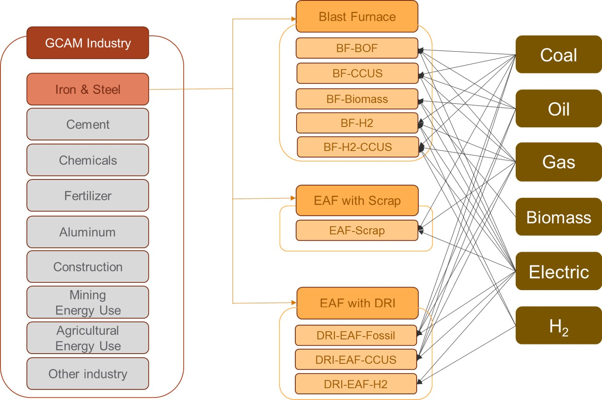
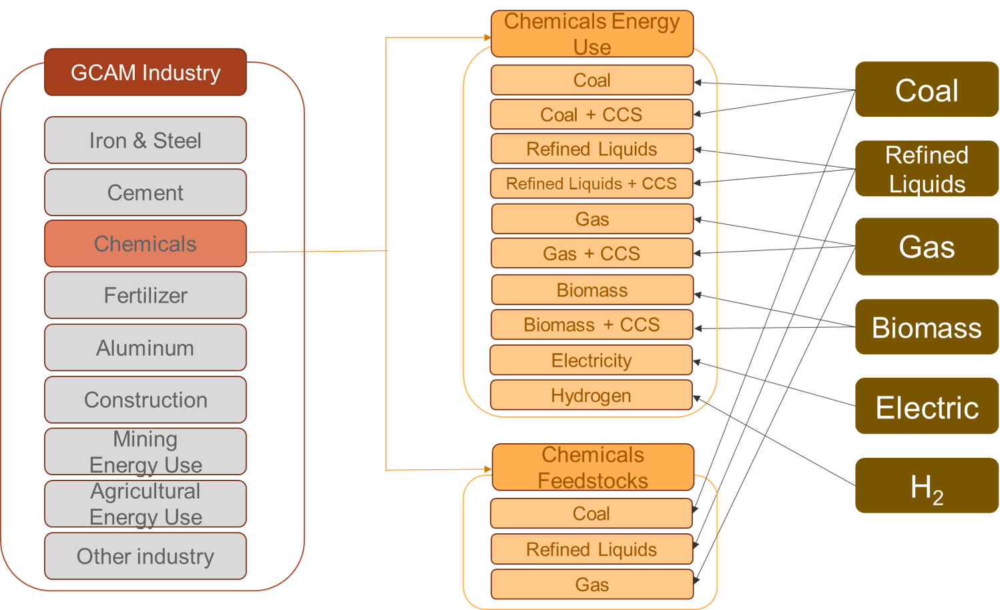
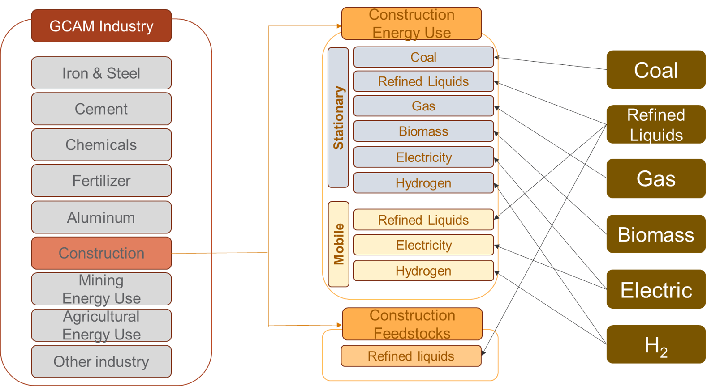
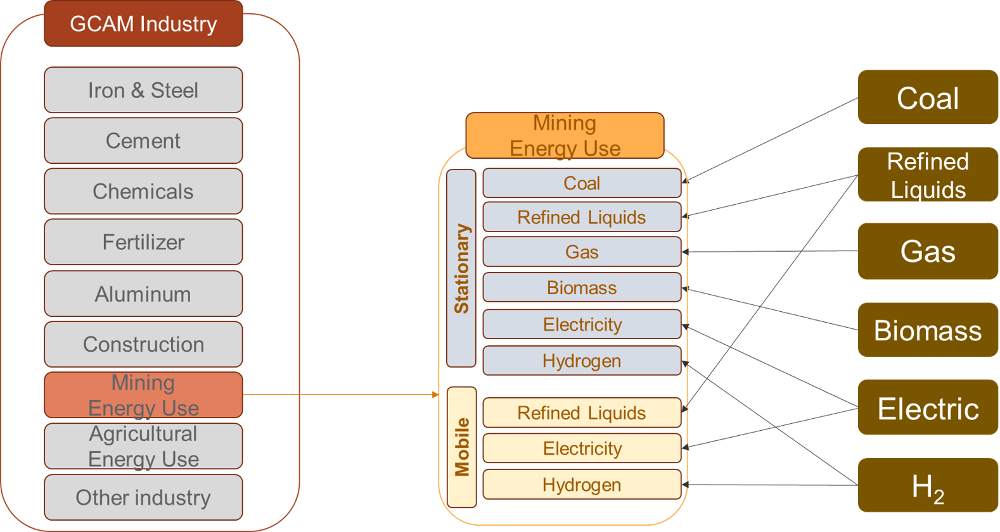
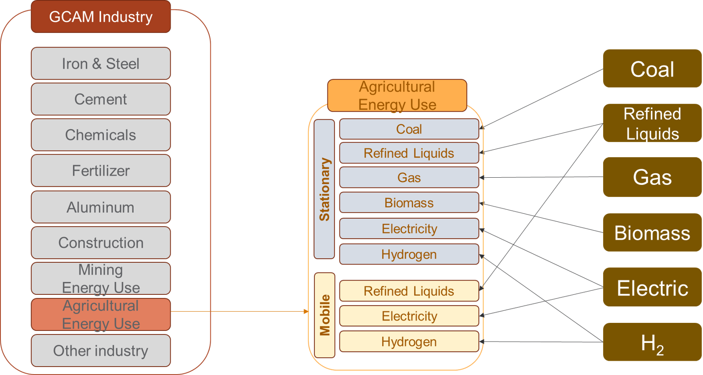
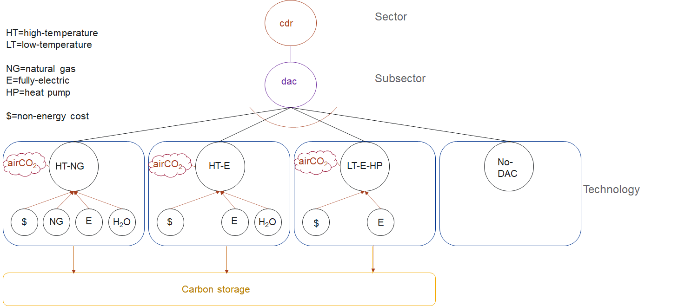

# Table of Contents

- [Inputs to the Module](#inputs-to-the-module)
- [Description](#description)
- [Equations](#equations)
- [Insights and intuition](#insights-and-intuition)
- [Policy options](#policy-options)
- [IAMC Reference Card](#iamc-reference-card)
- [References](#references)

## Inputs to the Module

**Table 1: Inputs required by the demand module [1](#table_footnote)**

| Name | Resolution | Unit | Source |
| :--- | :--- | :--- | :--- |
| Historical energy demand (used for calibration) | By region, technology, and year | EJ/yr | [Exogenous](inputs_demand.html) |
| Historical floorspace demand (used for calibration) | By region and year | BM2/yr | [Exogenous](inputs_demand.html) |
| Cost | By region, technology, and year | 1975$/GJ | [Exogenous](inputs_demand.html) |
| Income and price elasticity | By region, demand, and year | unitless | [Exogenous](inputs_demand.html) |
| Residential floorspace demand parameters | By region | unitless | [Exogenous](inputs_demand.html) |
| Satiation levels | By region and building type / service | m2/pers and EJ/pers | [Exogenous](inputs_demand.html) |
| GDP per capita | By region and year | thous 1990$ per person | [Economy module](economy.html) |
| Population | By region and year | thousand | [Economy](economy.html) |
| Habitable Land | By region and year | thousand km2 | [Land](land.html) |
| Commodity prices | By region, commodity, and year | 1975$/GJ | [Marketplace](marketplace.html) |
| Logit exponents | By region and sector or subsector | unitless | [Exogenous](inputs_demand.html) |
| Share weight interpolation rules | By region, technology or subsector, and year | unitless | [Exogenous](inputs_demand.html) |
| Fuel preference elasticity | By region, technology or subsector, and year | unitless | [Exogenous](inputs_demand.html) |
| Energy intensities of EFW processes (desalination, abstraction, treatment, distribution, wastewater treatment) | Global | GJ per $$m^3$$ | [Exogenous](inputs_demand.html) |
| Irrigation water withdrawals | By region, GLU, crop, and year | $$km^3$$ per year | [GCAM water demand](demand_water.html) |
| Municipal water withdrawals | By region and year | $$km^3$$ per year | [Water demand module](demand_water.html) |
| Industrial water withdrawals | By region and year | $$km^3$$ per year | [Water demand module](demand_water.html) |
| Desalinated water production | By region and year | $$km^3$$ per year | [Water supply module](supply_water.html) |
| Shares of wastewater treated | By region and year | Unitless | [Exogenous](inputs_demand.html) |
| Non-renewable groundwater supply curves - electricity inputs | 20 grades per geopolitical region and GLU | GJ per $$m^3$$ | [Exogenous](inputs_demand.html) |

<a name="table_footnote">1</a>: Note that this table differs from the one provided on the <a href="inputs_demand.html#energy">Demand Inputs Page</a> in that it lists all inputs to the energy demand module, including information passed from other modules. Additionally, the units listed are the units GCAM requires, rather than the units the raw input data uses.

 

## Description

### Buildings

GCAM disaggregates the building sector into residential and commercial sectors and models three aggregate services (heating, cooling, and other). Within each region, each type of building and each service starts with a different mix of fuels supplying energy (see Figure below). The future evolution of building energy use is shaped by changes in (1) floorspace, (2) the level of building service per unit of floorspace, and (3) fuel and technology choices by consumers. Residential floorspace depends on population, income, population density, and exogenously estimated parameters. Commercial floorspace depends on population, income, the average price of energy services, and exogenously specified satiation levels. Note that GCAM also includes the option to specify [floorspace exogenously](details_energy.html#optional-exogenous-floorspace). The level of building service demands per unit of floorspace depend on climate, building shell conductivity, affordability, and satiation levels. The approach used in the buildings sector is documented in [Clarke et al. 2018](demand_energy.html#clarke2018), which has a focus on heating and cooling service and energy demands. Within building services, the structures and functional forms are similar to any other GCAM sector, described in [Energy Technologies](en_technologies.html).

### Industry

Nine detailed industrial sectors are modeled in GCAM. These include six manufacturing sectors (Iron & Steel, Chemicals, Aluminum, Cement, Fertilizer, and Other Industry) and three non-manufacturing sectors (Construction, Mining energy use, and Agricultural energy use). IEA energy balances are used to calibrate the sectoral energy consumption (except in Cement and Fertilizer where historical energy use is estimated bottom-up). Sectoral outputs such as physical commodity flows are calibrated based on historical data from different industrial associations. For each sector, the future industrial output growth is driven by GDP, income elasticities, and price elasticities. The current industry representation does not consider global trade. Output of the detailed industry sectors is represented in physical outputs (Mt) and/or generic terms (EJ of energy services).

The remaining industrial sectors are collectively modeled as "Other industry", and represented as a consumer of generic energy services and feedstocks. Within "Other industry" there is cost-based competition between fuels, but with a low elasticity of substitution, as the specific uses of the energy are not specified. Cogeneration of electricity is tracked, and represented as a separate technology option for each fuel consumed by "Other industry" (other than electricity). Output of aggregate industrial sectors is represented in generic terms.

#### Iron and Steel

The Iron and Steel sector in GCAM consists of three distinct subsectors: Basic Oxygen Furnace (BOF), Electric Arc Furnace with scrap (EAF), and EAF with Direct Reduced Iron (DRI). Each subsector includes several competing technologies, such as fossil fuels w/ & w/o CCS, electricity, hydrogen, and biomass. Globally consistent cost assumptions for technologies in each subsector are estimated from the literature ([Ren et al. 2021](demand_energy.html#Ren2021)
;[Santos 2013](demand_energy.html#Santos2013)). Historical Iron and steel energy use is calibrated using energy data from IEA (flow codes include IRONSTL, TBLASTFUR, EBLASTFUR, TCOKEOVS, and ECOKEOVs; for definitions see [IEA 2021](demand_energy.html#iea2021)) and steel production from the World Steel Association (WSA). The income elasticities that drive future iron and steel production across GCAM regions are estimated using NLIT (Non-linear inverse with time-efficiency-factor) function ([Van Ruijven et al. 2016](demand_energy.html#VanRuijven2016)).

 
GCAM's representation of iron and steel production technologies and subsectors.
{: .fig}

#### Chemicals

The chemicals sector represents the chemicals and petrochemicals industry, which is the largest industrial consumer of oil and gas. The chemicals sector is disaggregated into chemicals energy use and feedstocks. Historical chemicals energy use and feedstocks are calibrated from IEA energy balances (flow codes include CHEMICAL and NECHEM). For regions that only have feedstock use but no energy consumption in the IEA data, feedstocks are adjusted to zero (e.g., Africa_Eastern and South Asia).

 
GCAM's representation of Chemicals sector.
{: .fig}

#### Aluminum

The aluminum production in GCAM involves two main steps: (1) alumina refining, to refine bauxite ore into alumina, and (2) aluminum smelting, to convert alumina to aluminum. Alumina refining has multiple competing technologies, such as coal, refined liquids, gas, and biomass with and without CCS. Aluminum smelting uses alumina as an input and consumes electricity. The aluminum and alumina subsectors are calibrated using production and energy use data from the International Aluminum Association (IAA). This data from IAA is provided by broader aggregate regions and is down-scaled to individual countries and GCAM regions using country-level data on electrolytic aluminum production from the United States Geological Survey (USGS). For countries with recorded energy use but no production, energy use is adjusted to zero. The intensity coefficients for alumina/aluminum production technologies are estimated from IEA energy data and the country-level production data.

 
GCAM's representation of Aluminum sector.
{: .fig}

#### Construction

The construction sector includes energy use and feedstocks for construction of buildings, roads, railways, utility projects, and other civil engineering projects, as classified in the IEA energy balances (CONSTRUC and NECONSTRUC flow codes). Historical and base year construction energy use and feedstocks are calibrated using IEA energy balances. In 2017, refined liquids made up 51% of construction energy use, electricity was 26%, gas was 15%, and coal was 6%. Construction feedstocks are primarily bitumen. Construction energy use is further disaggregated into mobile and stationary uses. The reason for doing this is that the mobile equipment relies 100% on liquid hydrocarbon fuels at present, with no options for substitution, whereas the stationary uses rely on a variety of fuels whose relative shares can be expected to be price-elastic. For calibration, 80% of the liquid fuel consumption for construction energy-use is assigned to mobile equipment, and 20% is assigned to the stationary uses. In future time periods, battery-electric and hydrogen-powered technology options are allowed to compete for market share within the mobile segment.

 
GCAM's representation of Construction sector.
{: .fig}

#### Mining Energy use

In GCAM, mining energy use includes mining of metal ores and other materials such as stone, sand, clay, peat, and chemical/fertilizer minerals, as classified in the IEA energy balances (MINING flow). To better represent technology competition and fuel substitution, mining energy use is also disaggregated into mobile and stationary uses, in similar fashion to construction energy use described above. 

 
GCAM's representation of Mining sector.
{: .fig}

#### Agricultural Energy use

Agricultural Energy use includes energy use to operate machinery and equipment, and for heating, cooling, and power in buildings. Refined liquids currently make up about half of agricultural energy consumption, and electricity about a quarter. To better represent technology competition and fuel substitution, agricultural energy use is also disaggregated into mobile and stationary uses, with hydrogen and battery-electric mobile technologies introduced in future periods.

 
GCAM's representation of Agricultural energy use sector.
{: .fig}

#### Cement

GCAM includes a physical representation of the manufacture of cement, that tracks both the fuel- and limestone-derived emissions of CO2. Production volumes are indicated in Mt of cement; input-output coefficients of heat and electricity are indicated in GJ per kg of cement, and the input-output coefficient of limestone is unitless. The energy input-output coefficients are specific to each region, based on [Worrell et al. (2001)](demand_energy.html#worrell2001) and Tables 6.9 and 6.10 in [IEA (2007)](demand_energy.html#iea2007). The limestone input-output coefficient is calculated to return the region's cement-related emissions reported by [CDIAC 2017](demand_energy.html#CDIAC2017). Each region's calibrated fuel shares in this industry are from Table 6.6 in [IEA 2007](demand_energy.html#iea2007). A simple schematic with example input-outout coefficients is shown below; note that in the structure, "process heat cement" is treated as a specific energy commodity, so as to avoid allowing electricity to compete for market share of this input to the cement production process.

 
Structure of GCAM's representation of cement production, with example input-output coefficients shown (GJ/kg of energy, and unitless for limestone)
{: .fig}

Cement is treated as a final demand in GCAM; demands are driven by population and income, and the commodity is not an input to any further modeled processes.

Note that there is a CO2 capture and storage technology for cement production, wherein the CO2 from limestone calcination is captured. The costs of the capture technology are parameterized around [Mahasenan et al. 2005](demand_energy.html#mahasenan2005).

#### N Fertilizer

The representation of nitrogenous fertilizers ("N fertilizer"), indicated in Mt of fixed N in synthetic fertilizers, includes both the specific production technologies for transforming various feedstocks into N fertilizer, as well as the demands for the commodity in the agricultural sectors. Nitrogenous fertilizers manufactured for non-agricultural purposes are excluded from the commodity modeled in GCAM.

Fuel and feedstock sources and input-output coefficients are calibrated based on Table 4.15 of [IEA 2007](demand_energy.html#iea2007). The schematic below shows how N fertilizer is situated between the energy and agricultural systems of GCAM.

 
**Structure of GCAM's representation of N fertilizer supply and demand, with example input-output coefficients shown (GJ/kg of N fertilizer on the energy inputs, and unitless for the N fertilizer inputs to crop production). Note that the fuel/feedstock sources are competing technologies, not fixed inputs to a production function.**
{: .fig}

The hydrogen production stage of ammonia production emits a relatively pure stream of CO2 that is often captured for commercial purposes. Technologies with CCS are modeled in GCAM; additional capture and compression costs and energy inputs are based on H2A [DOE 2015](demand_energy.html#doe2015).

### Transportation

The approach to modeling transportation in GCAM has been documented in [Kim et al. 2006](demand_energy.html#kim2006), [Kyle and Kim 2011](demand_energy.html#kyle2011), and the dataset in the current version of GCAM is documented in [Mishra et al. 2013](demand_energy.html#mishra2013). The modeling approach is consistent with the other sectors in the model, though with several different functional forms, and a higher level of detail than is found in the other sectors of the model.

#### System Boundaries and Structure

The transportation sector in GCAM is subdivided into four final demands: long-distance passenger air travel, (other) passenger travel, international freight shipping, and (other) freight. The transportation sector excludes energy consumption and materials moved via pipeline transport (but see [gas supply system](supply_energy.html#gas-processing)). Energy used by mobile mining, agricultural, industrial, and construction equipment is similarly not considered as transportation energy use, unless used on roadways and for the primary purpose of moving passengers and/or freight.

The passenger sector consists of up to five nesting levels, corresponding to different modes (e.g., road, rail), sub-modes (e.g., bus, light duty vehicle), size classes, and drivetrain technologies. The passenger sector also includes non-motorized modes (walking and cycling, not shown), which are not represented as energy consumers. Their market share in future periods largely depends on income, prices, elasticities, and also the time value of transportation, described below.

#### Functional Forms

Demand for transportation services depends on income and the price of these services (see [equations for transportation service demand](#transportation-service-demand)). These final service demands are supplied by transportation supply sectors, which, as with other supply sectors in GCAM, are composed of subsectors and ultimately technologies. The functional forms for computing costs in both the subsectors and technologies differ slightly from other parts of the model (see [equations for transportation subsector competition](#transportation-subsector-competition)). This competition requires a wage rate. The wage rate is calculated as the per-capita GDP divided by the number of working hours in the year, and the speed of each mode is exogenous (see [Inputs to the Module](#inputs-to-the-module) above for a list of exogenous variables). The time value multiplier is assumed for each mode, according to literature estimates of peoples' valuation of their time in transport (e.g., [Zamparini and Reggiani 2007](demand_energy.html#zamparini2007), [VTPI 2013](demand_energy.html#vtpi2013)), also considering the waiting times (and costs thereof) inherent in each mode ([Polzin and Chu 2005](demand_energy.html#polzin2005)). Note that the time value term does not influence technology-level competition (e.g., between different vehicle sizes or fuels). Time value is also not considered in the freight sector, where the future inter-modal competition takes place on the basis of the evolution of the weighted average technology costs alone.

The time value term is only used for modeling the competition between passenger modes. The net effects of including the time value in the modal competition are (1) a shift towards faster modes of transportation as incomes increase, and (2) relative stabilization of the number of hours per person per day spent in transportation. This is because the time value of all forms of transportation increases with GDP, which tends to increase transportation costs at high levels of income. These effects are consistent with the econometric literature on modal shifting and time travel budgets (e.g., [Shafer 1998](demand_energy.html#shafer1998), [Shafer and Victor 2000](demand_energy.html#shafer2000)). 

Transportation services in GCAM are ultimately supplied by [transportation technologies](en_technologies.html#transportation-technologies), which take inputs of energy and produce outputs of service-distance (e.g., passenger-km, tonne-km) (see [equation](#transportation-technology-cost) below). The non-fuel costs are estimated for some technologies (e.g., light-duty vehicles) from exogenous assumptions about vehicle capital costs, non-fuel operations and maintenance costs, financing assumptions, and annual vehicle utilization (vehicle-km per year). For others, such as all freight technologies and passenger bus and rail, the non-fuel cost is estimated by deducting estimated fuel costs from reported total service costs (e.g., [BTS 2015](demand_energy.html#bts2015)). In either case, the non-fuel cost is converted to dollars per vehicle-km for the equation above. The model then computes market shares of the different technologies as described in [logit choice](choice.html).

### Energy for water

#### System boundaries
The specific system boundaries are explained in [Kyle et al. (2016)](demand_energy.html#kyle2016), and are set so as to include all energy for activities whose primary output is water, and to exclude from this domain production technologies that use both energy and water as inputs to produce some other good. For example, in thermoelectric power generation, energy is applied to water, and several studies of energy-for-water (e.g., [Sanders and Webber 2012](demand_energy.html#sanders2012)) have included it. This is not represented in GCAM as an "energy-for-water" process; rather, GCAM's representation of thermoelectric power generation consists of technologies that consume inputs of energy and water, and produce electricity as an output. The system boundaries of "energy-for-water" (EFW) consist of the following activities:

* Water abstraction
* Water treatment
* Water distribution
* Wastewater treatment

Within the following sectors:

* Desalinated water supply
* Irrigated crop production
* Industrial manufacturing
* Municipal water supply

#### Modeling Energy-for-Water
The modeling approach is documented in [Kyle et al. (2021)](demand_energy.html#kyle2021), and consists of the following steps:

* Estimation of water flow volumes of EFW processes and sectors
* Multiplication of water flow volumes by assumed energy intensities
* Adjustment of historical energy consumption in the commercial and industrial sectors to accommodate explicitly represented EFW

## Equations 
The equations that determine energy demand are described here.

### Technology or subsector share

GCAM uses one of [two different logit formulations](choice.html#the-logit) to calculate the shares for each technology or subsector. 

The first option, also known as the `relative-cost-logit`, is:

$$
s_i = \frac{\alpha_i c_i^\gamma}{\sum_{j=1}^{N} \alpha_j c_j^\gamma}
$$

where $$s_i$$ is the share of technology or subsector $$i$$, $$alpha_i$$ is the share weight, $$c_i$$ is the cost of technology or subsector $$i$$, and $$beta$$ is the logit exponent.

The second option, also known as the `absolute-cost-logit`, is: 

$$
s_i = \frac{\alpha_i \exp(\beta c_i)}{\sum_{j=1}^{N} \alpha_j
\exp(\beta c_j)}.
$$

where $$s_i$$ is the share of technology or subsector $$i$$, $$alpha_i$$ is the share weight, $$c_i$$ is the cost of technology or subsector $$i$$, and $$beta$$ is the logit exponent.

See [relative cost logit](https://github.com/JGCRI/gcam-core/blob/master/cvs/objects/functions/source/relative_cost_logit.cpp) and [absolute cost logit](https://github.com/JGCRI/gcam-core/blob/master/cvs/objects/functions/source/absolute_cost_logit.cpp).

### Per Capita floorspace

#### Residential

The demand for residential per-capita floorspace, f, in future time period t is shown below:

$$ f_{t,r} = (UnadjSat_{r} – a * log(PD_{t,r})) * exp(-b * exp(-c * log(GDPpc_{t,r})))  + k_{r} $$

`UnadjSat` is the maximum per capita floorspace value a consumer demands at his maximum income level. Below this satiation point, the marginal utility of floorspace is positive. Above that point, the marginal utility is negative. As shown in the equation, this value is adjusted based on the population density (`PD`), which is calculated as the population divided by “habitable” land (all land except “rock and dessert” and “tundra” ). `GDPpc` is per capita GDP.  
`a`, `b`, and `c` are constant parameters that have been estimated in the econometric analysis developed in the model data system ([LA144.building_det_flsp.R](https://github.com/JGCRI/gcam-core/blob/master/input/gcamdata/R/zchunk_LA144.building_det_flsp.R#L400)). They represent the effect of the population density and the per capita income, respectively, in the estimation of per capita floorspace.  
Note that for USA, parameters have been estimated outside the model (using subnational data) and are read in by the DS.  
Finally, parameter `k` is the regional bias adder, which represents the difference between the observed and estimated per capita floorspace in the final calibration year (2015). It captures the “unobservable” effects that cannot be captured with the used variables, and it is kept constant over the whole time horizon.

#### Commercial

The demand for per-capita commercial floorspace, *f*, in future time period *t* is shown below. In this equation, "satiation" indicates the level of service demand at which increases in income do not lead to further demand.

$$
f_{t}=(s-a)[1-exp(-\frac{ln(2)}{\mu}I_{t}(\frac{P_{t}}{P_{t0}})^\beta)]+a
$$

where *s* is the exogenous satiation level of per-capita floorspace, *μ* is the per-capita GDP at 50% of the satiation level, *a* is an exogenous tuning parameter, *P* is the total levelized cost of the modeled energy services per unit floorspace, *I* is per capita GDP, and $$\beta$$ is the price elasticity of averaged energy services.

### Building service demand

The demands of generic services per unit floorspace, *d*, are shown in the equation below. Note that the satiation level indicates the demand at which increases in income do not lead to further demands for services (above this point, marginal utility of the service becomes negative).

$$
d_{t}=k[1-exp(-\frac{ln(2)}{\mu}\frac{I_{t}}{P_{t}})]
$$

where *k* is a calibration parameter that captures satiation effects, and the other parameters are the same as the equation above, with the exception that here *P* refers to the price of the service. Space heating (*h*) and cooling (*c*) services use a similar approach with some additional considerations, shown below:

$$
h_{t}=k*(HDD_{t}*\eta_{t}*R_{t}-\lambda_{h}*IG_{t})[1-exp(-\frac{ln(2)}{\mu}\frac{I_{t}}{P_{t}})]
$$

$$
c_{t}=k*(CDD_{t}*\eta_{t}*R_{t}+\lambda_{c}*IG_{t})[1-exp(-\frac{ln(2)}{\mu}\frac{I_{t}}{P_{t}})]
$$

where *HDD* and *CDD* refer to heating and cooling degree days, respectively, η is the exogenous average building shell conductance, R is the exogenous average floor-to-surface ratio of buildings, IG is the internal gain heat from other building services, and λ is an exogenous internal gain scaler. In this way, the demands of heating and cooling services per unit of floorspace may vary depending on changes in climate, building shell characteristics, and the amount of internal gain heat coming from other modeled services.

### Transportation service demand

The demand ($$D$$) for transportation services (e.g., passenger-km, tonne-km) in region $$r$$ and time period $$t$$ is given by the following equation:

$$
D_{r,t}=D_{r,t-1}(\frac{Y_{r,t}}{Y_{r,t-1}})^\alpha (\frac{P_{r,t}}{P_{r,t-1}})^\beta (\frac{N_{r,t}}{N_{r,t-1}})
$$

Where $$Y$$ is the per-capita GDP, $$P$$ is the total service price aggregated across all modes, $$N$$ is the population, and $$\alpha$$ and $$\beta$$ are income and price elasticities, respectively.

See `calcDemand` in [minicam_price_elasticity_function.cpp](https://github.com/JGCRI/gcam-core/blob/master/cvs/objects/functions/source/minicam_price_elasticity_function.cpp).

### Transportation subsector competition

At the subsector level, the subsector competition may add the time value of transportation, as shown in the equation for the price ($$P$$) of mode $$i$$, in region $$r$$ and time period $$t$$:

$$
P_{i,r,t}=\sum_{j=1}^{N} (\alpha_{j,i,r,t}*P_{j,i,r,t}) + \frac{W_{r,t}*V_{i,r,t}}{S_{i,r,t}}
$$

In the equation above, $$j$$ refers to any of N technologies within subsector $$i$$, and $$\alpha$$ is the share of technology $$j$$ in subsector $$i$$. Where this equation differs from the subsectors elsewhere in GCAM is the final term, the wage rate ($$W$$) multiplied by the "time value multiplier" ($$V$$), divided by the average speed of the mode ($$S$$).

See `getGeneralizedPrice` and `getTimeValue` in [tran_subsector.cpp](https://github.com/JGCRI/gcam-core/blob/master/cvs/objects/sectors/source/tran_subsector.cpp).

### Transportation technology cost

The costs of transportation technologies are computed as follows, for technology $$j$$ in subsector $$i$$, region $$r$$, and time period $$t$$:

$$
P_{j,i,r,t}=\frac{P_{f,r,t}*I_{j,i,r,t}+N_{j,i,r,t}}{L_{j,i,r,t}}
$$

In this equation, $$P_f$$ stands for the fuel price, $$I$$ is the vehicle fuel intensity, N is the levelized non-fuel cost (expressed per vehicle-km), and L is the load factor (persons or tonnes per vehicle).

See `calcCost` in [tran_technology.cpp](https://github.com/JGCRI/gcam-core/blob/master/cvs/objects/technologies/source/tran_technology.cpp).

### Industry service demand

### Direct Air Capture for Carbon Dioxide Removal

GCAM has the capability to model three technologies which consume thermal and/or electrical energy for the sole purpose of removing carbon dioxide from the atmosphere, broadly referred to as direct air capture with carbon storage (DACCS). The first is an aqueous hydroxide solvent process requiring water, high-temperature thermal energy from natural gas for solvent regeneration, and electricity to run ancillary equipment.  The second archetype relies on the same aqueous hydroxide solvent process but uses electricity to generate the high temperatures (>900 ˚C) required for regeneration. The third uses solid adsorbents, with the lower-temperature heat required for sorbent regeneration generated by an electric heat pump. These technologies remove CO2 from the atmosphere and send it to geologic storage, along with any captured combustion emissions from process heat.  The techno-economic assessment for the input parameters of DACCS was based on the work of [Keith et. al. 2018](https://www.sciencedirect.com/science/article/pii/S2542435118302253), [Mazzotti et. al. 2013](https://link.springer.com/article/10.1007/s10584-012-0679-y), [Beuttler et. al. 2019](https://www.frontiersin.org/articles/10.3389/fclim.2019.00010/full), and [Fasihi et. al. 2019](https://www.sciencedirect.com/science/article/pii/S0959652619307772).  

[Fuhrman et. al. 2020 (a)](https://www.nature.com/articles/s41558-020-0876-z), and [Fuhrman et al 2020 (b)](https://academic.oup.com/oocc/article/1/1/kgab004/6284217) used GCAM to study the global and regional potential of DACCS processes using natural gas for high temperature heat as well as the implications of their deployment for the food-energy-water systems. The Methods and Supplementary Information of these studies document the general approach to modeling DACCS in GCAM, which is summarized in more detail below. 

In GCAM, DACCS technologies indirectly compete with (a) emissions abatement; and (b) other carbon removal technologies such as BECCS and afforestation based on its cost and the subsidy paid for CO2 removal (i.e., the carbon emissions price). This competition is created by defining an additional "no-DAC" technology which does not capture carbon and has zero cost. 

 

**Schematic of DACCS technology competition in GCAM's CO2 Removal (CDR) Sector**

## Equations 
The equations that determine energy demand are described here.

The demand ($$D$$) for industrial services in region $$r$$ and time period $$t$$ is given by the following equation:

$$
D_{r,t}=D_{r,t-1}(\frac{Y_{r,t}}{Y_{r,t-1}})^\alpha (\frac{P_{r,t}}{P_{r,t-1}})^\beta (\frac{N_{r,t}}{N_{r,t-1}})
$$

Where $$Y$$ is the per-capita GDP, $$P$$ is the total service price aggregated across all modes, $$N$$ is the population, and $$\alpha$$ and $$\beta$$ are income and price elasticities, respectively.

See `calcDemand` in [minicam_price_elasticity_function.cpp](https://github.com/JGCRI/gcam-core/blob/master/cvs/objects/functions/source/minicam_price_elasticity_function.cpp).

### Fertilizer demand

The demand for fertilizer is determined by the fertilizer input-output coefficient and the level of crop production, i.e.,

$$
D_{r,t} = \sum_{j=1}{n} Prod_{j,t} * Coef_{j,t}
$$

where $$D_{r,t}$$ is the demand for fertilizer in region $$r$$ at time $$t$$, $$Prod_{j,t}$$ is the crop production for technology $$j$$ at time $$t$$, $$Coef__{j,t}$$ is the fertilizer input-output coefficient for technology $$j$$ at time $$t$$, and $j$ is the set of all agricultural technologies within region $$r$$.

See `production` in [ag_production_techology.cpp](https://github.com/JGCRI/gcam-core/blob/master/cvs/objects/technologies/source/ag_production_technology.cpp).

### Energy for water

The primary equation used in estimating energy-for-water by sector and process is as follows:

$$
EFW_{s,p}=W_{s,p}*EI_{s,p}
$$

Where $$EFW$$ is energy-for-water, $$s$$ is sector, $$p$$ is process, $$W$$ is water flow volume, and $$EI$$ is energy intensity. The energy intensity values for each process and sector were shown in the table above, and the water flow volumes are generally determined in [GCAM water demand](demand_water.html).

Non-renewable groundwater pumping energy intensity is estimated in Superwell for any well *i* according to the following equations, reproduced from [superwell.R](https://github.com/JGCRI/superwell/blob/master/R/superwell.R):

$$
Power_{i}=\frac{SpecificWeight*TotalHead_{i}*WellYield_{i}}{PumpEfficiency*WattsPerKW}
$$

$$
ElectricEnergyPerYear_{i}=Power_{i}*\frac{AnnualOperationTime}{SecondsPerHour}
$$

$$
ElectricEnergyIntensity_{i}=\frac{ElectricEnergyPerYear_{i}}{WellYield_{i}*AnnualOperationTime}
$$

Where $$Power$$ is in $$kW$$, $$SpecificWeight$$ is in $$kg/m^2/s^2$$, $$WellYield$$ is in $$m^3/s$$, PumpEfficiency is unitless, assumed to be 50%, and $$WattsPerKW$$ is a constant, equal to 1000.

$$ElectricEnergyPerYear$$ is in $$kWh/yr$$, $$AnnualOperationTime$$ is in seconds per year, and $$SecondsPerHour$$ is a constant, equal to 3600.

$$ElectricEnergyIntensity$$ is in $$kWh/m^3$$.

### Direct Air Capture for Carbon Dioxide Removal

We use GCAM’s (unmodified) logit choice model for economic choice between DACCS technologies. This includes the “choice” to not deploy DACCS and instead use other mitigation or negative emissions technologies (i.e., the "no-DAC" technology). The share $$s_i$$ of any DACCS technology with price pi is computed as follows:

$$
s_i=\frac{α_i * exp⁡(β*p_i)}{\sum_{j=1}^{N}α_j * exp(β*p_j))}
$$

Where:

$$α_i$$ = the shareweight of the technology. 

$$β$$ = the logit coefficient, which determines how large a cost difference is required to produce a given difference in market share. 

Shareweights are used to represent societal preferences, infrastructure buildup, and barriers or accelerants to market entry. Consistent with GCAM’s treatment of other new and emerging technologies, we set shareweights for DACCS technologies to zero in 2020, and linearly increase to 1 by 2050 for most scenarios. This means that by 2100, DACCS technologies are competing solely based on their cost minus the subsidy for removing carbon dioxide from the atmosphere (again, equal to the carbon emissions price). 

In each region, the base year service demand for the CO2 removal sector (currently, the sum of “no DAC” + “DAC” technologies for which the share of each technology is computed) is set for the USA region at an arbitrarily-high value, with the deployment share of DAC technologies being determined by the sum of their energy, water, and non-energy costs, minus any carbon price subsidy.  The choice of each region's base year service demand ultimately sets the maximum limit on the amount of DACCS that may be deployed in that region in the model. The 2000 MtC base year service demand for the USA region was selected to allow a maximum of over 7 Gt-CO2 per year of DACCS deployment in this region. However, the modeled DACCS deployment would likely never reach this very high ceiling due to indirect competition with emissions abatement and other CO2 removal technologies (e.g., renewables, BECCS, afforestation). Base year service demand for other regions is scaled linearly by each region's cumulative onshore carbon storage capacity relative to the USA region.

## Policy options 

There are a number of policy available to the user when it comes to energy demand. Many of these policy options are implemented as a part of the SSP scenarios. For example, there are different income elasticities for demand that are implemented for the different industry sectors such as intron-steel, aluminum and chemicals.  

## Insights and intuition

### Effects of climate on energy demand

Changes in climate will affect residential energy demand [(Zhou et al. 2013)](https://link.springer.com/article/10.1007/s10584-013-0772-x) and building energy expenditures [(Clarke et al., 2018)](https://www.sciencedirect.com/science/article/pii/S0140988318300112), differently across world regions.

### Future changes in energy demand

Residential energy will increase by the end of the century given the projected increase in population and GDP. The implementation of a climate policy promotes the electrification of the sector [(Eom et al.,  2013)](https://www.sciencedirect.com/science/article/pii/S0360544212006214).

### Modeling Energy-for-water in GCAM

[Kyle et al. (2021)](demand_energy.html#kyle2021) demonstrate a surprisingly small net impact on future global energy use from disaggregating energy-for-water in GCAM, as the water-related demands of electricity often parallel the future projected energy growth in the commercial and industrial sectors from which EFW energy is re-allocated. For example, energy for industrial water abstraction, treatment, and post-use wastewater treatment scale with the sector's water demands, which are driven by the sector's output, which is also what drives its demands for energy in the first place. So, representing energy-for-water explicitly in the model does not necessarily cause a departure in projected future energy demands, depending on the sector and region. The study also demonstrates that efforts to improve water provision and quality, as specified in Sustainable Development Goal #6, build off of one another in terms of energy-for-water. Expanding municipal water access to all people will increase the volume of wastewater generated, and parallel efforts to treat the maximum possible portion of wastewater will further increase the energy required for wastewater treatment, to levels that are multiples above a "business-as-usual" scenario.

## IAMC Reference Card

Passenger transportation
- [X] Passenger trains
- [X] Buses
- [X] Light Duty Vehicles (LDVs)
- [X] Electric LDVs
- [X] Hydrogen LDVs
- [X] Hybrid LDVs
- [X] Gasoline LDVs
- [X] Diesel LDVs
- [X] Passenger aircrafts
- [X] CNG Buses
- [X] CNG Three-wheelers
- [X] Diesel Three-wheelers
- [X] Electric Buses
- [X] Electric Three-wheelers
- [X] LPG/CNG LDVs

Freight transportation
- [X] Freight trains
- [X] Heavy duty vehicles
- [X] Freight aircrafts
- [X] Freight ships

Industry
- [X] Steel production
- [X] Aluminium production
- [X] Cement production
- [X] Petrochemical production
- [ ] Paper production
- [ ] Plastics production
- [ ] Pulp production

Residential and commercial
- [X] Space heating
- [X] Space cooling
- [ ] Cooking
- [ ] Refrigeration
- [ ] Washing
- [ ] Lighting
- [ ] Other electrical uses
- [ ] Water heating

## References

<a name="bts2015">[BTS 2015]</a> Bureau of Transportation Statistics, 2015, *Table 3-21: Average Freight Revenue Per Ton-mile (Current cents)*, U.S. Department of Transportation, Office of the Assistant Secretary for Research and Technology. [Link](http://www.rita.dot.gov/bts/sites/rita.dot.gov.bts/files/publications/national_transportation_statistics/html/table_03_21.html)

<a name="beuttler2019">[Beuttler et al. 2019]</a> Beuttler, C., Charles, L., and Wurzbacher, J. “The Role of Direct Air Capture in Mitigation of Anthropogenic Greenhouse Gas Emissions” *Frontiers in Climate* 1, (2019)[Link](https://www.frontiersin.org/article/10.3389/fclim.2019.00010/full)

<a name="CDIAC2017">[CDIAC 2017]</a> Boden, T., and Andres, B. 2017, *National CO2 Emissions from Fossil-Fuel Burning, Cement Manufacture, and Gas Flaring: 1751-2014*, Carbon Dioxide Information Analysis Center, Oak Ridge National Laboratory. [Link](http://cdiac.ess-dive.lbl.gov/ftp/ndp030/nation.1751_2014.ems)

<a name="clarke2018">[Clarke et al. 2018]</a> Clarke, L., Eom, J., Hodson Marten, E., et al. 2018. Effects of long-term climate change on global building energy expenditures. *Energy Economics* 72, pp. 667-677. [Link](https://www.sciencedirect.com/science/article/pii/S0140988318300112)

<a name="doe2015">[DOE 2015]</a> U.S. Department of Energy. 2015. *DOE H2A Production Analysis*, DOE Hydrogen and Fuel Cells Program. [Link](https://www.hydrogen.energy.gov/h2a_production.html)

<a name="fasihi2019">[Fasihi 2019]</a> Fasihi, M., Efimova, O., and Breyer, C. “Techno-Economic Assessment of CO 2 Direct Air Capture Plants” *Journal of Cleaner Production* 224, (2019): 957–980. [Link](doi:10.1016/j.jclepro.2019.03.086)

<a name="fuhrman2020a">[Fuhrman et al. 2020a]</a> Fuhrman J, McJeon H, Patel P, Doney S C, Shobe W M and Clarens A F 2020 Food–energy–water implications of negative emissions technologies in a +1.5 °C future Nat. Clim. Chang. 10 920–7 [Link](http://dx.doi.org/10.1038/s41558-020-0876-z)

<a name="fuhrman2020b">[Fuhrman et al. 2020b]</a> Fuhrman J Clarens A F, McJeon H, Patel P, Ou Y, Doney S C, Shobe W M and Pradhan S 2021. The role of negative emissions in meeting China’s 2060 carbon neutrality goal Oxford Open Clim. Chang. 1 1–15 [Link](https://academic.oup.com/oocc/article/1/1/kgab004/6284217)

<a name="iea2007">[IEA 2007]</a> International Energy Agency, 2007, *Tracking Industrial Energy Efficiency and CO2 Emissions*, International Energy Agency, Paris, France. [Link](https://www.iea.org/publications/freepublications/publication/tracking_emissions.pdf)

<a name="iea2021">[IEA 2021]</a> International Energy Agency, 2007, *World Energy Balances Database Documentation*, International Energy Agency, Paris, France. [Link](http://wds.iea.org/wds/pdf/worldbal_documentation.pdf)

<a name="keith2018">[Keith et al 2018]</a> Keith, D. W., Holmes, G., St Angelo, D., and Heidel, K. “A Process for Capturing CO 2 from the Atmosphere” (2018) [Link](https://doi.org/10.1016/j.joule.2018.05.006) 

<a name="kim2006">[Kim et al. 2006]</a> Kim, S., Edmonds, J., Lurz, J., Smith, S.J., and Wise, M. 2006. The objECTS Framework for integrated Assessment: Hybrid Modeling of Transportation. *The Energy Journal* 27, Special Issue: Hybrid Modeling of Energy-Environment Policies: Reconciling Bottom-up and Top-down, pp. 63-91. [Link](http://www.iaee.org/en/publications/ejarticle.aspx?id=2168)

<a name="kyle2011">[Kyle and Kim 2011]</a> Kyle, P., and Kim, S. 2011. Long-term implications of alternative light-duty vehicle technologies for global greenhouse gas emissions and primary energy demands. *Energy Policy* 39, pp. 3012-3024. [Link](http://www.sciencedirect.com/science/article/pii/S0301421511001960)

<a name="kyle2016">[Kyle et al. 2016]</a> Kyle, P., Johnson, N., Davies, E., Bijl, D.L., Mouratiadou, I., Bevione, M., Drouet, L., Fujimori, S., Liu, Y., and Hejazi, M. 2016. Setting the system boundaries of “energy for water” for integrated modeling. *Environmental Science & Technology 50(17), 8930-8931. [Link](https://pubs.acs.org/doi/abs/10.1021/acs.est.6b01066)

<a name="kyle2021">[Kyle et al. 2021]</a> Kyle, P., Hejazi, M., Kim, S., Patel, P., Graham, N., and Liu, Y. 2021. Assessing the future of global energy-for-water. *Environmental Research Letters* 16(2), 024031. [Link](https://iopscience.iop.org/article/10.1088/1748-9326/abd8a9)

<a name="liu2016">[Liu et al. 2016]</a> Liu, Y., Hejazi, M., Kyle, P., Kim, S., Davies, E., Miralles, D., Teuling, A., He, Y., and Niyogi, D. 2016. Global and Regional Evaluation of Energy for Water. *Environmental Science & Technology* 50(17), 9736-9745. [Link](https://pubs.acs.org/doi/abs/10.1021/acs.est.6b01065)

<a name="mahasenan2005">[Mahasenan et al. 2005]</a> Mahasenan, N., Dahowski, R.T., and Davidson, C.L. 2005. The role of carbon dioxide capture and storage in reducing emissions from cement plants in North America. *Proceedings of the 7th International Conference on Greenhouse Gas Control Technologies* 1, pp. 901-909. [Link](https://www.sciencedirect.com/science/article/pii/B9780080447049500914)

<a name="mazzotti2013">[Mazzotti et al. 2013]</a> Mazzotti, M., Baciocchi, R., Desmond, M. J., and Socolow, R. H. “Direct Air Capture of CO2 with Chemicals: Optimization of a Two-Loop Hydroxide Carbonate System Using a Countercurrent Air-Liquid Contactor” *Climatic Change* 118, no. 1 (2013): 119–135. [Link](http://link.springer.com/10.1007/s10584-012-0679-y) 

<a name="mishra2013">[Mishra et al. 2013]</a> Mishra, G.S., Kyle, P., Teter, J., Morrison, G.M., Kim, S., and Yeh, S. 2013. *Transportation Module of Global Change Assessment Model (GCAM): Model Documentation*, Research Report UCD-ITS-RR-13-05, Institute of Transportation Studies, University of California, Davis. [Link] (https://itspubs.ucdavis.edu/wp-content/themes/ucdavis/pubs/download_pdf.php?id=1884)

<a name="polzin2005">[Polzin and Chu 2005]</a> Polzin, S., and Chu, X. 2005. *Public Transit in America: Results from the 2001 National Household Travel Survey*, Center for Urban Transportation Research, University of South Florida, Tampa. [Link](http://www.nctr.usf.edu/pdf/527-09.pdf)

<a name="Ren2021">[Ren et al. 2021]</a> Ren, Ming, et al. "Decarbonizing China's iron and steel industry from the supply and demand sides for carbon neutrality." Applied Energy298 (2021): 117209. (Supplementary Material)

<a name="rohwer2007">[Rohwer et al. 2007]</a> Rohwer, J., Gerten, D., and Lucht, W. 2007. *Development of Functional Irrigation Types for Improved Global Crop Modelling*. PIK Report No. 104, Potsdam Institute for Climate Impact Research. [Link](https://www.pik30 potsdam.de/research/publications/pikreports/.files/pr104.pdf)

<a name="sanders2012">[Sanders and Webber 2012]</a> Sanders, K., and Webber, M. 2012. Evaluating the energy consumed for water use in the United States. *Environmental Research Letters* 7(3), 0034034. [Link](https://iopscience.iop.org/article/10.1088/1748-9326/7/3/034034/meta)

<a name="Santos2013">[Santos 2013]</a> Santos, S. "Iron and steel ccs study (techno-economics integrated steel mill)." IEAGHG, Cheltenham 1 (2013).

<a name="shafer1998">[Shafer 1998]</a> Shafer, A. 1998. The global demand for motorized mobility. *Transportation Research Part A: Policy and Practice* 32(6), pp. 455-477. [Link](http://www.sciencedirect.com/science/article/pii/S0965856498000044)

<a name="shafer2000">[Shafer and Victor 2000]</a> Shafer, A., and Victor, D. 2000. The future mobility of the world population. *Transportation Research Part A: Policy and Practice* 34(3), pp. 171-205. [Link](http://www.sciencedirect.com/science/article/pii/S0965856498000718)

<a name="turner2019">[Turner et al. 2019]</a> Turner, S.W.D., Hejazi, M., Yonkofski, C., Kim, S.H., and Kyle, P. 2019. Influence of groundwater extraction costs and resource depletion limits on simulated global nonrenewable water withdrawals over the twenty-first century. *Earth’s Future* 7, 123-135. [Link](https://agupubs.onlinelibrary.wiley.com/doi/full/10.1029/2018EF001105)

<a name="VanRuijven2016">[Van Ruijven et al. 2016]</a> Van Ruijven, Bas J., et al. "Long-term model-based projections of energy use and CO2 emissions from the global steel and cement industries." Resources, Conservation and Recycling 112 (2016): 15-36.

<a name="vtpi2013">[VTPI 2013]</a> Victoria Transport Policy Institute. 2013. Chapter 5.2: Travel Time, in *Transportation Costs and Benefits II: Techniques, Estimates and Implications*, Victoria Transport Policy Institute. [Link](http://www.vtpi.org/tca/tca0502.pdf)

<a name="worrell2001">[Worrell et al. 2000]</a> Worrell, E., Price, L., Martin, N., Hendriks, C., and Ozawa Meida, L. 2001. Carbon dioxide emissions from the global cement industry. *Annual Reviews of Energy and the Environment* 26, pp. 303-329. [Link](https://www.annualreviews.org/doi/abs/10.1146/annurev.energy.26.1.303)

<a name="zamparini2007">[Zamparini and Reggiani 2007]</a> Zamparini, L., and Reggiani, A. 2007. Meta-analysis and the value of time savings: a transatlantic perspective in passenger transport. *Networks and Spatial Economics* 7, pp. 377-396. [Link](http://link.springer.com/article/10.1007/s11067-007-9028-5)
