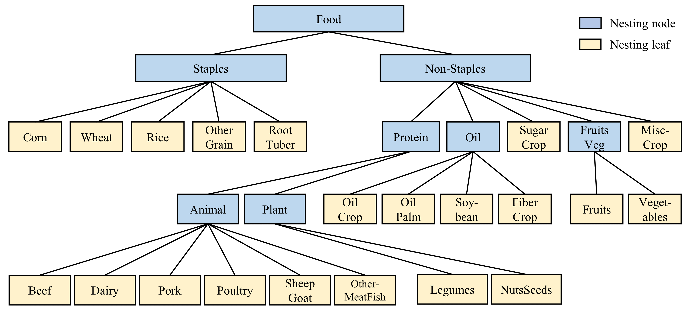
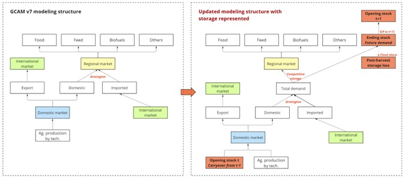

# Table of Contents

- [Inputs to the Module](#inputs-to-the-module)
- [Description](#description)
- [Equations](#equations)
- [Insights and intuition](#insights-and-intuition)
- [Policy options](#policy-options)
- [IAMC Reference Card](#iamc-reference-card)
- [References](#references)

## Inputs to the Module

**Table 1: Inputs required by the demand module [1](#table_footnote)**

| Name | Resolution | Unit | Source |
| :--- | :--- | :--- | :--- |
| Historical demand for agriculture (used for calibration) | By region, demand, commodity, and year | Mt/yr | [Exogenous](inputs_demand.html) |
| Historical demand for livestock (used for calibration) | By region, demand, commodity, and year | Mt/yr | [Exogenous](inputs_demand.html) |
| Historical demand for forest (used for calibration) | By region and year | billion km3/yr | [Exogenous](inputs_demand.html) |
| Commodity prices | By region, commodity, and year | 1975$/kg or 1975$/m3 | [Marketplace](marketplace.html) |
| Income and price elasticity (for non-food, non-feed, and nonenergy agricultural demand) | By region, demand, and year | unitless | [Exogenous](inputs_demand.html) |
| Scale parameter, self-price elasticity, cross-price elasticity, income elasticity, regional bias, price scaling parameters (for food demand) | By region | unitless | [Exogenous](inputs_demand.html) |
| Logit exponents | By region and sector or subsector | unitless |  [Exogenous](inputs_demand.html) |
| GDP per capita | By region and year | thous 1990$ per person | [Economy module](economy.html) |
| Population | By region and year | thousand | [Economy module](economy.html) |

<a name="table_footnote">1</a>: Note that this table differs from the one provided on the <a href="inputs_demand.html#food-feed-and-forestry">Demand Inputs Page</a> in that it lists all inputs to the land demand module, including information passed from other modules. Additionally, the units listed are the units GCAM requires, rather than the units the raw input data uses.

 

## Description

### Food demand

Food demand, i.e., income and own-/cross-price responses of staples and non-staples composites, is based on the approach documented in [Edmonds et al. (2017)](#edmonds2017). A nested logit structure is used to aggregate GCAM food commodities (calorie-based) and connect them to the top-level food demand model. See additional details in food data updates in [CMP #360](cmp/360-AgLU_data_and_methods.pdf) and related parameter updates in [CMP #393](cmp/CMP393_AgLU_Parameters_Update.pdf).

 
Food demand nesting structure in GCAM.  Note, FiberCrop is moved to the Oil nest since over 99% of the FiberCrop for food consumption is cottonseed oil.
{: .fig}

### Feed demand

Shares of feed are determined by a [logit sharing approach](choice.html), which depends on the relative costs of the different feed options. Demand for feed is determined by the scale of livestock demand and these feed shares

In GCAM-Macro-KLEAM, food demand remains governed by the food demand model, but the value of agricultural food consumption is also tracked as `ag-food-service-value` in national accounts. This accounting linkage does not replace the food demand model; it allows agricultural food consumption to be represented consistently in macroeconomic final demand.

### Non-food, non-feed demand

Non-food, non-feed, and nonenergy demand, including selected forestry and agricultural product demands, is determined by price, income, and population size. In GCAM-Macro-KLEAM, these demands also provide the physical basis for an agricultural nonfood-service input to the Materials production function. Recent KLEAM updates revised selected nonfood demand elasticities to improve consistency with this macroeconomic linkage. Income elasticity was added for `NonFoodDemand_Crops` and `NonFoodDemand_Meat`, increased for `NonFoodDemand_sawnwood`, and price elasticity was added for these nonfood demand categories. 
 

### Future demand (storage)
GCAM incorporates agricultural stockholding behavior as a technology of regional consumers who allocate regional supply to current consumption or future consumption (storage carried over to the next period). The schematic showing the structure updates is presented in the following figure.

The development leveraged the recently compiled supply-utilization accounts to separate stock variations, opening stock, closing stock, and loss associated with stockholding behavior. The competitive storage model employs a logit sharing structure, where changes in the ratio between closing stock and “current consumption” (i.e., stock-to-use ratio) are responsive to current market prices and expected prices for storage in the next period. We use a lagged price expectation and apply a loss parameter to closing stock to derive the loss associated with interannual storage in a region for a given sector. Currently, agricultural storage is introduced for 13 GCAM crop commodities. See additional details in [CMP #382](cmp/382-AgFoodStorage.pdf).

 
 
Schematic of the updating GCAM modeling structure to represent stockholder behaviors. Source: Zhao et al. (2024). 
{: .fig}

## Equations 
The equations that determine food, feed, and forest demand are described here.

### Food demand

$$
q = A * (x^{h(x)}) * (w_{self}^{e_{self}(x)}) * (w_{cross}^{e_{cross}(x)})
$$

where $$A$$ is a scale parameter, $$x$$ is the income divided by price of materials, $$h(x)$$ is the income elasticity, and $$w_i$$ is the price of the food input divided by the price of materials times some scale factor, and $$e_i$$ are price elasticities. $$x^{h(x)}$$ is calculated all together depending on the type of FoodDemandInput. 

See `StaplesFoodDemandInput::calcIncomeTerm` and `NonStaplesFoodDemandInput::calcIncomeTerm` in [food_demand_input.cpp](https://github.com/JGCRI/gcam-core/blob/master/cvs/objects/functions/source/food_demand_input.cpp).

$$e_{self} =  g_{self} - \alpha * f(x)$$, $$e_{cross} = g_{cross} - \alpha_{cross} * f(x)$$, where $$g_{self}$$ is self price elasticity parameter, $$g_{cross}$$ is the cross price elasticity, $$\alpha$$ is the share of the total budget for the good, and $$f(x)$$ is the derivative of the income term. See `StaplesFoodDemandInput::getCrossPriceElasticity`, `NonStaplesFoodDemandInput::getCrossPriceElasticity`, `StaplesFoodDemandInput::calcIncomeTermDerivative`, and `NonStaplesFoodDemandInput::calcIncomeTermDerivative` in [food_demand_input.cpp](https://github.com/JGCRI/gcam-core/blob/master/cvs/objects/functions/source/food_demand_input.cpp). 

See also [food_demand_function.cpp](https://github.com/JGCRI/gcam-core/blob/master/cvs/objects/functions/source/food_demand_function.cpp)

#### Non-food, non-feed demand

Per-capita non-food, non-feed demands (*D*) from time period *t-1* to time period *t*.

$$
D_t = D_{t-1} * (\frac{pcGDP_t}{pcGDP_{t-1}})^{\alpha^i_t} *
  (\frac{P_t}{P_{t-1}})^{\alpha^p_t} 
$$

where $$pcGDP$$ is per-capita GDP, $$P$$ is the commodity price, $$\alpha^i_t$$ is the income elasticity in time $$t$$ and $$\alpha^p_t$$ is the price elasticity at time t

See `calcDemand` in [minicam_price_elasticity_function.cpp](https://github.com/JGCRI/gcam-core/blob/master/cvs/objects/functions/source/minicam_price_elasticity_function.cpp).

## Policy options 

One of the main policy options is the usage of the food preference elasticity for SSPs (especially SSP1) which increases the demand for certain food types which correspond to a more sustainable diet which reduces meat consumption. Moreover, the bio-externality cost adds restrictions to the amount of bio-energy that will be demanded. This is also a user modifiable parameter. 

## Insights and intuition

### A food demand model that is responsive to changes in incomes and prices

Future food demand is determined dynamically by changes in income and prices. This also dictates changes in demand for land since preferences of food dictates the amount of land that is dedicated to crop production. [(Edmonds et al. 2017)](https://www.worldscientific.com/doi/abs/10.1142/S2010007817500129)

### Land conservation effectively limits the supply of productive land, while biofuel consumption increases the demand and competition for that land

This paper looked at demand pathways across sectors under different land scarcity scenarios. [(Dolan et al. 2022)](https://agupubs.onlinelibrary.wiley.com/doi/full/10.1029/2021EF002466) 

## IAMC Reference Card

Agriculture and forestry demands
- [X] Agriculture food
- [X] Agriculture food crops
- [X] Agriculture food livestock
- [X] Agriculture feed
- [X] Agriculture feed crops
- [X] Agriculture feed livestock
- [X] Agriculture non-food
- [X] Agriculture non-food crops
- [X] Agriculture non-food livestock
- [X] Agriculture bioenergy
- [X] Agriculture residues
- [X] Forest industrial roundwood
- [X] Forest fuelwood
- [X] Forest residues

## References

<a name="edmonds2017">[Edmonds et al. (2017)]</a> EDMONDS, J. A., R. LINK, S. T. WALDHOFF, and R. CUI, 2017: A GLOBAL FOOD DEMAND MODEL FOR THE ASSESSMENT OF COMPLEX HUMAN-EARTH SYSTEMS. Clim. Chang. Econ., 08, 1750012, https://doi.org/10.1142/S2010007817500129.

