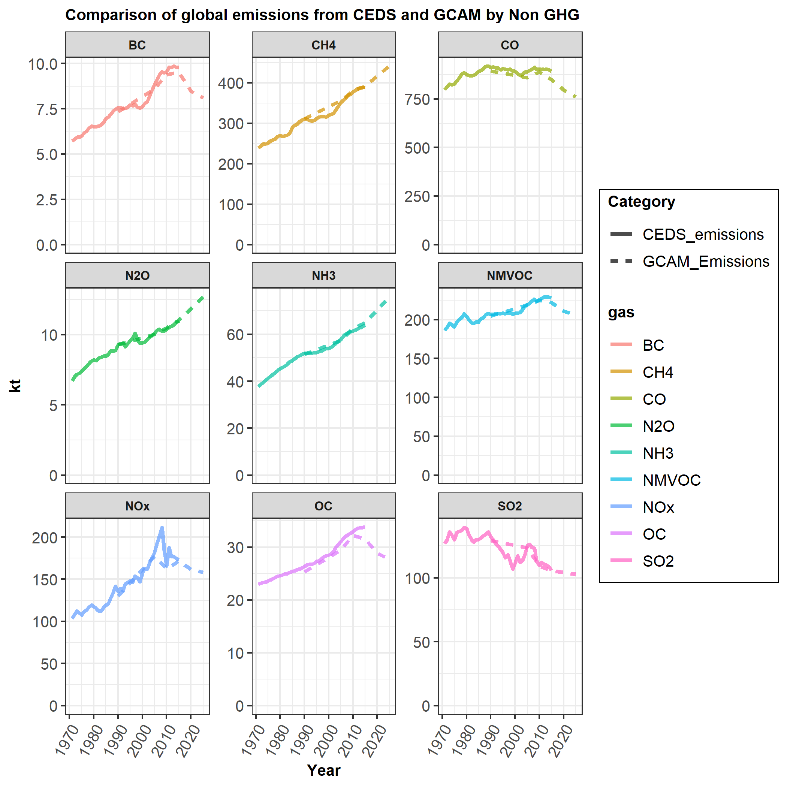
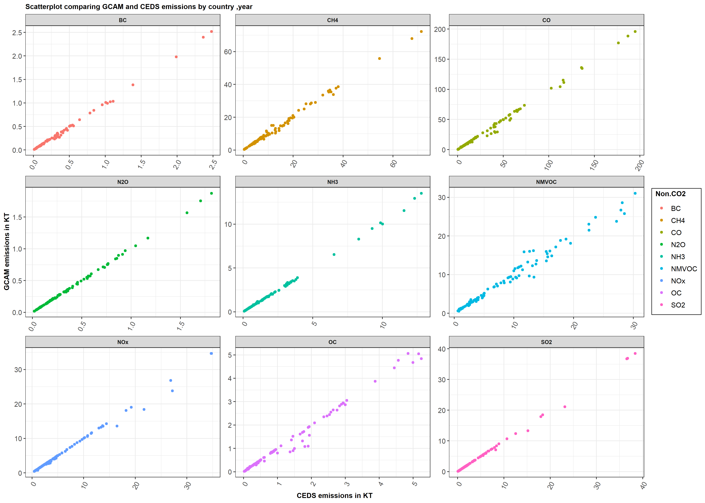

## Calibration year differences between CEDS and GCAM

Figures 1 and 2 compare historical emissions from CEDS with the emissions from GCAM after initialization . Figure 1 compares global emissions by species and Figure 2 presents a scatter plot comparing emissions by species and year for each region.  As seen in the figures, emissions translate mostly correctly for all species of gases. 

However, there are reasons for the differences. One reason is that deforestation emissions from protected land are zeroed out in GCAM in the historical period since protected land is held constant in the calibration years. Also deforestation emissions in the final base year are initialized using deforestation coefficients calculated on the basis of deforestation over a 5 year period (2000 and 2005). This leads to a difference in the total deforestation emissions from the CEDS inventory when compared to the numbers initialized in  GCAM. 
