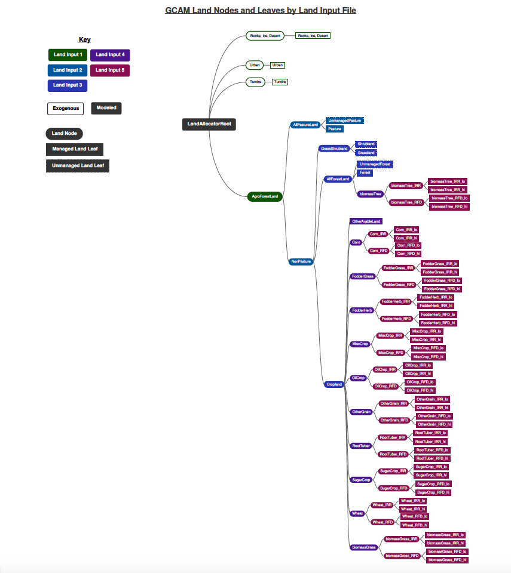
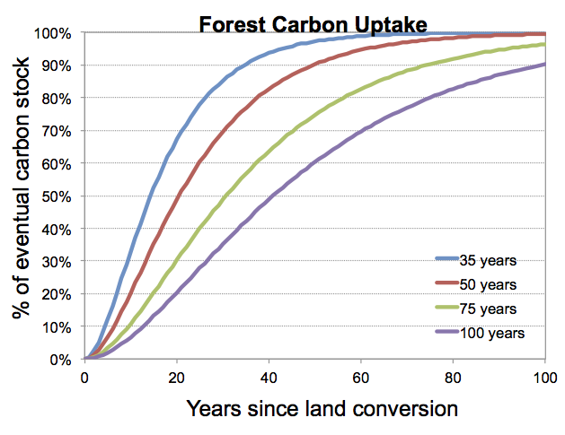

This page provides more detailed explanations of the descriptions provided in the [land](land.html) modeling page.

{:toc}

## Land Sharing Approach 

Economic land use decisions in GCAM are based on a logit model of sharing based on relative inherent profitability of using land for competing purposes. The logit approach was developed by McFadden (1974) to describe the distribution of consumer choice, but a similar mathematical approach works well here for our purposes. The interpretation of this sharing system in GCAM is that there is a distribution of profit behind each competing land use within a region, rather than a single point value. Each competing land use option has a potential average profit over its entire distribution. The share of land allocated to any given use is based on the probability that that use has a highest profit among the competing uses. The relative potential average profits are used in the logit formulation, where an option with a higher average profit will get a higher share than one with a lower average profit. However, at the margin, the profits of competing options are equal. In essence, the sharing can therefore be considered optimal, but the assumption of a distribution of profits makes it very different from a constrained linear optimization approach.

In GCAM, competing uses of land are nested within land nodes. Within each land node, it is generally assumed to be easier to substitute products, so logit exponents are higher to indicate tighter competition. Examples include switching food crops from one to another and converting forests from unmanaged categories to logging forests. Substitution across land nodes is also allowed but is assumed to be more difficult than within land nodes.  We implement this philosophy by setting lower logit exponents via input data. For example, the expansion of cropland into pasture is more difficult than expansion of wheat land into corn land.

Although relative average profit rates are used in the logit sharing equations, the theory behind the math is that land shares are determined so the land is allocated across uses up until the point at which the marginal profit rates are equal to each other.  Therefore, the land values at the margin are also equal. As a result, all land uses within a nesting structure have equal value at the margin and further substitution will not increase total profits. If one option has a higher potential average profit rate than a second, it is assumed that option has a greater proportion of its distribution of profit rates that will exceed the marginal profit rate than the second option.  Therefore, this option will receive a higher share, but unlike a simple optimization model it will not get all of the land in the node.

Finally, because the logit sharing approach reflects non-linear representations of crop profits and market share, it results in diminishing returns to scale as land uses expand further from historical values. In contrast to a linear model with constant returns to scale, the GCAM approach does not require explicit constraints on land use to govern behavior. See Wise et al. (2014) for more discussion about this effect and the relationship between logit exponents and land use change elasticities.

## Land Nesting Strategy

The strategy for nesting both competing land uses and nests of competing land uses has involved some expert judgment, as does the choice of logit exponents that govern substitution within each of the level of the nesting structure. Note that in standard GCAM runs, calibration and reproduction of historical results does not depend on the nesting strategy or the logit exponents used. Instead, these assumptions affect future period results as conditions or policies change from history.

Before discussing our nesting approach, it is useful to consider the space of possible nesting strategies. One approach is that of a single nest: the assumption that the land regions are small enough that all competing options are equally substitutable.  This assumption implies that it is just as easy to switch from forest to wheat as it is to switch from corn to wheat. However, this conversion would not happen unless wheat was more profitable than forest or corn.  With a high enough logit exponent for this single nest, the land sharing approaches an optimal “winner-take-all” result in that all land within a region will be dedicated to the most profitable product in that region. A single nest with a high exponent represents the extreme end of unconstrained optimization in which there is no transition cost or other hurdle for switching from one land type to another.

The other extreme is that of no substitution. This would be accomplished with near zero or zero logit exponents, whether in a single nest or multiple nests. This implies that either it is physically impossible or the transition costs are too high to allow switching from one land type to another. Currently, in GCAM, we use zero logit exponents in a very limited number of situations, where we do not want any substitution (e.g., we do not allow cropland to expand into desert or tundra).  However, in most situations, we employ positive logit exponents and allow economics to dictate the land allocation within a region. 

Our approach is to use a nesting strategy that allows the logit exponents to reflect differences in substitutability across land categories. Figure 1 shows the nesting diagram of land with a subregion. At the top is all land, which is divided into two main types of nodes: agro-forestry land and the remaining categories of land that are not suitable for agriculture. This second category could be divided further if useful. The next node layer contains two further nodes: all agro-forestry, non-pasture land and all pasture land. The pasture land node contains two competing uses (land leaves in the code): managed pasture (that which feeds marketed livestock) and unmanaged pasture. The figure also indicates which file in the `gcamdata` system processes the inputs for each type of land (e.g., processing for purple leafs is found in [zchunk_L2242.land_input_4_irr_mgmt.R](https://github.com/JGCRI/gcam-core/blob/master/input/gcamdata/R/zchunk_L2242.land_input_4_irr_mgmt.R) and [zchunk_batch_land_input_4_IRR_MGMT_xml.R](https://github.com/JGCRI/gcam-core/blob/master/input/gcamdata/R/zchunk_batch_land_input_4_IRR_MGMT_xml.R), with the final inputs set in a file called `land_input_4_IRR_MGMT.xml`).

 
Figure 1: AgLU Land Nest
{: .fig}

The agro-forestry (non-pasture) node contains three competing nodes: shrub and grass lands, forest lands, and croplands. Shrublands and grasslands are separated from the rest as they are both classified as unmanaged land categories and we want to control their substitutability between each other separately. Finally, the forestland node competes with the total cropland node. Within forestland, there are managed and unmanaged forest leaves,  and we have added a woody biomass option there in some regions and scenarios. Under cropland are all food and other agriculture products (e.g., corn, wheat, sugars, etc.), including biomass crops, along with an unmanaged land category called other arable land. Note that several crops are included explicitly in the CropLand node, and the grouping of “AllOtherCrops” is simply a convenience for this figure.  Additionally, crops are further divided beyond what is in Figure 1, nesting irrigated/rainfed and hi/lo fertilizer.

With this specification, we can make substitution across categories
more or less difficult by choosing lower or higher logit parameters.

## Calibration

While the profit-based logit land sharing is fairly straightforward, it must be calibrated to match historical data on land use shares and profit rates in the base year. The calibration method is algebraically simple, but it can be difficult conceptually. The aim of the calibration is to infer distributions and underlying parameters from the historical data. Based on the logit model chosen, including nesting and exponents, underlying economic values of the various land types are implied from the real world shares of each land. 

The approach to calibration is to solve for parameters that adjust observed profit rates, which are based on base year data, such that they equal the potential average profit rates implied by base year shares and the assumed average price of unmanaged land. The potential average profit rates implied by the shares can be interpreted as the average profit if all land were devoted to that use. Here, we will refer to these rates as the calibration profit rates. The calibration parameters, which we have called calibration profit scalers in the code, should not be confused with the logit share weights that we use in the energy model. They serve much the same function, but their derivation is more complicated, and they should not be assumed to be transformable. Unlike the share weights, the absolute values of the calibration profit scalers have meaning, not just their relative values. Therefore, they cannot be transformed by indexing them around a value of one for convenience like we can do with the share weights in the energy sector.

In future model periods, the calibration profit scalers are used to adjust the future profit rates in the logit sharing and profit equations. The calibration routine ensures that the future is grounded in history. If profits (i.e., prices, demand, crop yields, and the cost of fertilizer and water inputs) were unchanged in future modeling periods, shares and land allocations would equal the base year values. When future conditions evolve in the model such that profits deviate from historical values, land shares will also change from their base year values. 

## Modeling Land Uses and Crops that are New to a Region

The calibration process can accommodate gaps or imprecisions in the profit data for the crops and land uses in base year calibration data set. Changing the values of inputs such as land prices, product prices, and product variable costs will change the values of the calibration parameters internal to the model. Algebraically, the calibration parameters adjust or compensate to make the profit rates consistent with the base year shares and crop yields. In most situations, these changes will not affect model results either in the calibration year or future years. The calibration is to an extent self-correcting.

However, there are a few important exceptions to this rule.  First, as discussed in the [supply modeling](supply_land.html#variable-costs), variable costs introduce price floors and thus, increasing these values may result in some regions ceasing production in future years.  Second, exceptions occur when we introduce crops, technologies, or policies that are not part of the base year calibration data set. One example is when new biomass crops are introduced. To introduce a new crop or a new crop technology, the model has to evaluate how its profitability compares to all other crops and uses of land. In this case, the actual values of the prices and costs that determine profits do matter. In the biomass example, it is important not only to have the variable costs and yields of the biomass correct, we also have to have the magnitudes of the profits of the competing crops correct for the competition to be valid. That means we have to have the prices and costs for all of the crops correct. Calibration cannot compensate for this problem. 

The same would be true for introducing new technologies for growing existing crops that are part of the calibration data set. For example, if we introduce a new management technique for growing corn to compete with the existing technique, the variable costs for both the new technology and the existing technology would have to be correct for the competition to be valid.

Land prices are for the most part factored out by the calibration. They behave almost like numeraires, with at least one important exception. Land prices, along with land shares, set the values for unmanaged land categories. At the margin, we assume the value of unmanaged land is equal to the land price. This is of course also true of managed land categories, but unmanaged lands are special in that they do not produce a product other than this intrinsic value represented by the land price. The land price becomes important when we introduce a carbon subsidy on land, as the amount of the subsidy relative to the land price will determine its impact. For example, if the land price is high, a carbon subsidy may have a small impact on the relative value of unmanaged land. However, if the land price is low, the same carbon subsidy will have a higher relative impact on the value of unmanaged land. We see this effect in the model where there is a greater response to a carbon subsidy in regions with lower land prices.

## Crop Outliers

There are many places in the crop production data where a small amount of land produces a crop at a high yield that is not representative of the potential yield of that region. Some of these cases are data errors, but some cases are real observations where crop production is intensively managed or irrigated. In the current calibration data set, the amount of food, fiber, and fodder produced in these high-yielding regions is small relative to regional or global crop production.  Through the calibration process, we have ensured that the model cannot expand that these high-yielding crops throughout that region without substantial costs.

For example, the current data set has very high-yielding wheat in the panhandle of Alaska.  The data suggest that there is a very small amount of land producing wheat with a very high yield.  This wheat land accounts for a small share of cropland in that subregion.  Because the share of cropland is low, the calibration process will compute parameters that reflect limitations on the potential expansion of this land due to cost or factors not otherwise modeled.  Literally, the math will calculate very low profit share scalers for wheat in Alaska.  This also is the case if wheat share of cropland is high but the cropland share of arable land is low, implying something is preventing cropland from expanding.  Perhaps the real world cropland extent reflects something about the soil quality that is not explicitly modeled in AgLU.

## Regional Production and Comparative Advantage

In its determination of the economic allocation of crop production and
land use across regions of the globe, GCAM follows the well-known but
often misunderstood basic economic principle of comparative
advantage. The theory of comparative advantage was identified and
explained by David Ricardo in the early 19th Century (Ricardo, 1817)
to explain patterns in the study of international production and trade
(Samuelson and Nordhaus, 2004). In simplest terms, countries or
regions will produce more of what they are better at and import more
of what they are not as good at producing.

This appears obvious, but the distinction between comparative advantage and an “absolute” advantage is often confused. First, consider a situation of two crop products, Crop 1 and Crop 2 produced in two countries, A and B. The solution is trivial if Country A produces Crop 1 better (at a higher profit) than Country B while Country B produces Crop 2 better than Country A. In this example, Country A will tend to produce more of Crop 1 to export to Country B while importing more of Crop 2 from Country B, and the world is better off from the trade. Although the principle of comparative advantage is satisfied here, the fact that it also a situation of absolute advantage trivializes the concept and is not fully explanatory. 

To clarify the distinction between absolute and comparative advantage, consider a more realistic situation in which Region A has higher yields and lower costs of producing both Crop 1 and Crop 2 than Region B: Region A has an absolute advantage over Region B in both crops. Does that mean Region A will grow both crops and Region B will grow nothing?  Clearly not. Assume that Crop 1 has a much higher value or price than Crop 2. The comparative advantage solution is that will be that Region A will maximize it profits by growing more of Crop 1 and exporting it to Region B. This will leave a market opportunity for Region B to specialize in Crop 2 and export it to Region A. Region B has a comparative advantage in Crop 2 and thus have higher profits than if it grew Crop 1, for which it would not be competitive with Region A.

The GCAM representation of global land and allocation is much more complicated than this simple example in modeling economic decisions as it assumes a distribution of profit rates over land areas and must be calibrated to reflect real-world data where regions grow a mix of crops rather than completely specializing. However, the simple example above is relevant and powerful in interpreting GCAM’s approach and results. Within each land use subregion in GCAM, economic uses of land are allocated based on that subregion’s own relative profit rate distributions of agriculture, forestry, and other competing uses for land. In essence, this means that land use allocations are based on comparative advantage rather than absolute advantage. Within a land subregion, land use allocations are based on what it can earn the higher profit rates among its own set of options, not what its yields or its profit rates are compared with the rest of the globe.  That is, a farmer in an individual region will choose to grow the crop that results in the highest profit, regardless of how his profit/yield for that crop compares to the profit/yield of that crop in other regions.

Consider the example of a future scenario with a high global demand for a bioenergy crop such as switchgrass. A developed region with favorable climate such as Western Europe may have much higher potential yields, and thus higher potential profit rates for growing a bioenergy crop than Africa. However, that does not mean that Western Europe would grow more bioenergy crops than Africa. Western Europe will also have higher yields and profits for high-valued food crops, as well as high land prices that would limit expansion of agricultural land. Africa may find in this scenario that it is profitable to expand agricultural land for bioenergy crops for export, even though its bioenergy yields are lower on an absolute basis. Similar examples can be made with food crops and forestry.

Although GCAM is not structured as an optimization model, the allocation of production of crops and products across regions and subregions of the globe based on comparative advantage can be considered optimal in terms of maximizing global profits (which is not the same as minimizing land requirements). While each land subregion makes its own independent allocation, the subregions communicate these decisions with each other through economic markets. The global markets for agricultural and forest products react to these allocations by comparing global supplies to demands and adjusting prices to equilibrate supplies and demands. The resulting prices are sent back to each land subregion as signals as to how its land allocation should be changed.  The process of allocation and price adjustment continues until the markets are in equilibrium.  This market equilibrium is an economically efficient allocation of land resources among regions (Samuelson and Nordhaus, 1985).

## Land Use Change Emissions
When land is converted to forests, the vegetation carbon content of that new forest land gradually approaches an exogenously-specified, region- and land-type-dependent value. The rate at which this value is reached depends on the mature age of forests. Mature age is specified by region, GLU, and land type. In the figure below, the rate of growth as a function of time since planting is shown for four different mature ages. In this figure, the y-axis indicates the percentage of the exogenously-specified, region- and land-type-dependent value accumulated.

 
Figure 1: Timescales for forest regrowth in GCAM.
{: .fig}
