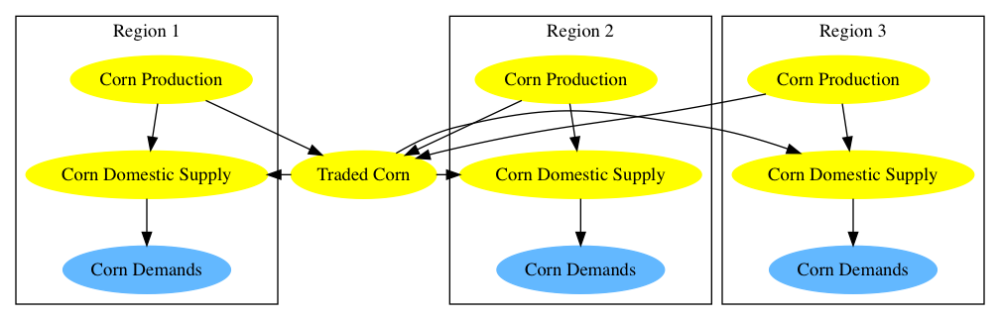
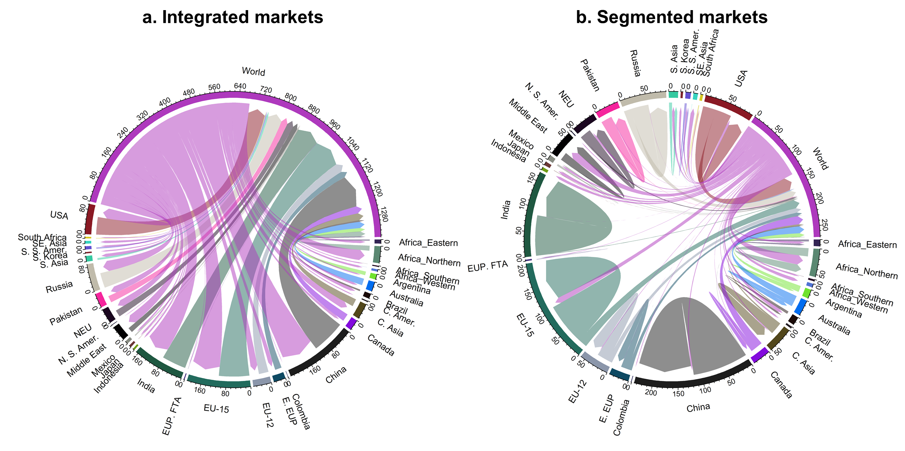

International trade in most commodities in GCAM is done by one of three methods: (1) Heckscher-Ohlin or single global markets, (2) global trade with regionally-differentiated markets with Armington-like preferences between domestic and imported commodities, and (3) fixed interregional trade.  Other approaches for trade can also be implemented in the GCAM framework (such as [GCAM USA](gcam-usa.html) where logit based decisions are made to facilitating trade between the 50-states).

## Heckscher-Ohlin

The Heckscher-Ohlin theorem explains trade using factor endowments and predicts that each country produces goods with more intensive use of its abundant factor of production (Peter Debaere, 2003; Vanek, 1968). The empirical use of the Heckscher-Ohlin approach assumes products are homogeneous across sources and traded in a single global market (i.e., fully integrated world market). Markets clear at the world level and each region will see the same global price and independently decide how much each will supply and demand of each commodity given that price. A region's net trade position is dynamic depending on economics, technical change, demand, growth, resources, etc.  Under this method for trading goods there is no modeled preference for a given region to demand a commodity from any other specific region. 

The trade of agricultural products were mostly modeled using the Heckscher-Ohlin approach in early versions of GCAM (e.g., GCAM v4), and trade of livestock products was fixed in these versions. But GCAM has been updated to the Armington style trade modeling approach for most of the agricultural and livestock proudcts. However, FodderHerb is modeled using the Heckscher-Ohlin approach and FodderGrass is not traded. Also, major energy commodities such as coal, gas, oil, bio-energy, etc. are also traded in a single world market with the Heckscher-Ohlin approach.      

## Armington Style Trade
For the agricultural, livestock, and forestry commodities in GCAM (except fodder crops and fish & other meats), we use an Armington style distinction between domestic and imported goods. The Armington approach assumes products are differentiated by source and consumers view goods produced in different countries as imperfect substitutes (Armington, 1969). The theoretical background and the derivation of the logit-based Armington approach is documented in Zhao et al. (2020). In this approach, the competition between imports and domestic is governed by a logit. Imports are from a single global pool that draws from all regions and is also governed by a logit. The logit-based Armington approach requires a segmented regional market, as oppose to the integrated world market in the Heckscher-Ohlin approach. Thus, it allows differentiating regional prices and tracing gross trade flows. 

The structural implementations of a "global-market" versus a "regional-market" representation are shown in Figure 1 with an example of corn trade.

  
Figure 1: Global (upper) and regional (lower) agricultural markets structures, for a representative crop and three representative regions.
{: .fig}

In the global-market representation, each region's production is output to a global market, which in turn supplies each region's demand sectors (i.e., food, feed, biofuel production, and other uses). As there is only one global market per crop commodity, all regions see the same price. Similarly, the impacts of a supply (demand) shock within any region do not directly cause a shock to the demand (supply) of that region; these sorts of within-region impacts are buffered by the global market.

In the regional-market representation, one additional sector per crop is added to each region for representing domestic supplies; consistent with GCAM terminology elsewhere, these sectors are named, e.g., "regional corn". The total domestic supply of any crop and region is equal to production minus exports plus imports. The production sector's prices are region-specific, as are the "regional crop" prices seen by the demand sectors. Therefore, a shock to the producer prices of an agricultural commodity in some region has a direct impact on the consumption sectors within that region.

Furthermore, the two market structures are also compared in Figure 2 with an example of a global wheat market equilibrium with demand and supply flows in 2010. 

  
Figure 2: Global wheat market equilibrium in 2010: integrated world markets vs. segmented regional markets. In fully integrated world markets (a), arrows represent regional production and consumption volume flows and markets clear at the world level. In segmented regional markets (b), arrows in a single region represent domestic wheat supply, arrows between regions and the world represent trade volume flows, and markets clear at the regional level. Regional supplies are distinguished by color. The flows shown are in million tons (MT). Note that the scales are different in each diagram. Each tick mark represents 15 MT of wheat in Fig. 2a and 10 MT in Fig. 2b.
{: .fig}

For each traded commodity with the logit-based Armington approach, this structure introduces two new nests with [calibrated logit choice](choice.html):

1. The global "traded commodity" is supplied by gross exports from each of GCAM's geopolitical regions.
2. The "regional commodity" sector within each region allocates market share to domestic production versus imports of the global "traded commodity".

The logit parameters are calibrated based on literature information of trade elasticities. For example, (1) livestock products have generally higher logit exponents (Hertel et al., 2007), and (2) the regional logit exponent and interantional logit exponent are tied with "rule of two" (Liu et al., 2004).

## Fixed Interregion Trade
Livestock products were held fixed at their historical value for the rest of the simulation, in early versions of GCAM (e.g., GCAM v4). But they have been updated using the logit-based Armington approach.

## No Trade of Secondary energy goods
Note that secondary energy products such as [Electricity](supply_energy.html#electricity) or [Refined Liquids](supply_energy.html#refining) are assumed to not be traded at all between the GCAM geo-political regions.

## IAMC Reference Card

Trade 
- [X] Coal
- [X] Oil
- [X] Gas
- [X] Uranium
- [ ] Electricity
- [X] Bioenergy crops
- [X] Food crops
- [ ] Capital
- [X] Emissions permits
- [ ] Non-energy goods

## References

Armington, P.S. (1969) A theory of demand for products distinguished by place of production. Staff Papers 16, 159-178. 

Hertel, T., Hummels, D., Ivanic, M., Keeney, R. (2007) How confident can we be of cge-based assessments of free trade agreements? Economic Modelling 24, 611-635. https://doi.org/10.1016/j.econmod.2006.12.002

Liu, J., Arndt, C., Hertel, T.W.J.J.o.E.I. (2004) Parameter estimation and measures of fit in a global, general equilibrium model. 626-649. 

Peter Debaere (2003) Relative factor abundance and trade. Journal of Political Economy 111, 589-610. 10.1086/374179

Vanek, J. (1968) The factor proportions theory: The n—factor case. Kyklos 21, 749-756. 10.1111/j.1467-6435.1968.tb00141.x

Zhao, X., Wise, M., Waldhoff, S., Kyle, G.P., Huster, J., Ramig, C., Rafelski, L., Patel, P., Calvin, K, (2020). "The impact of agricultural trade approaches on global economic modeling" (Under review)
