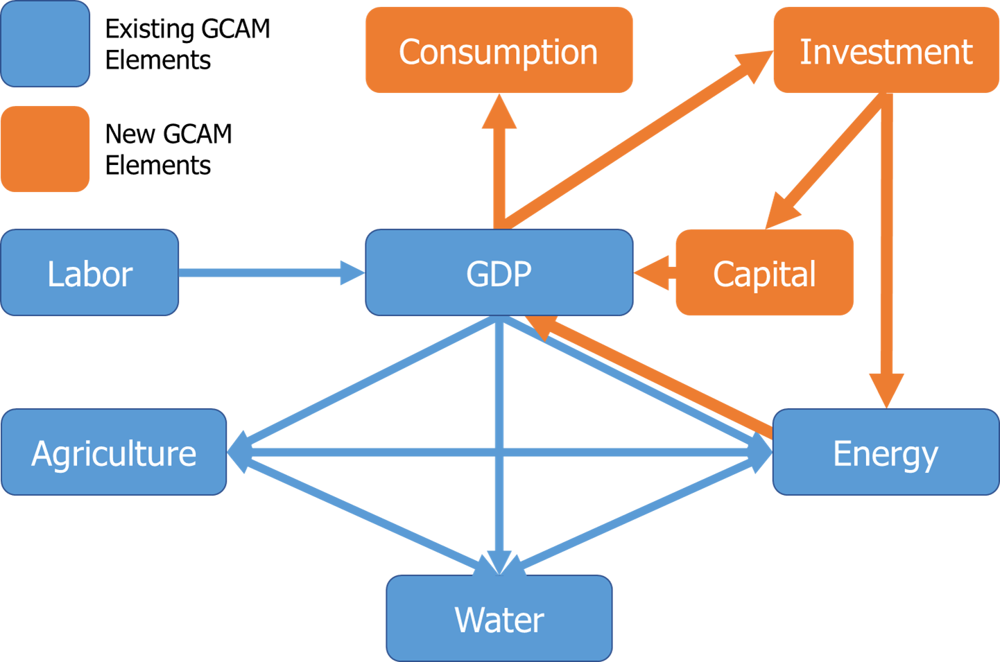
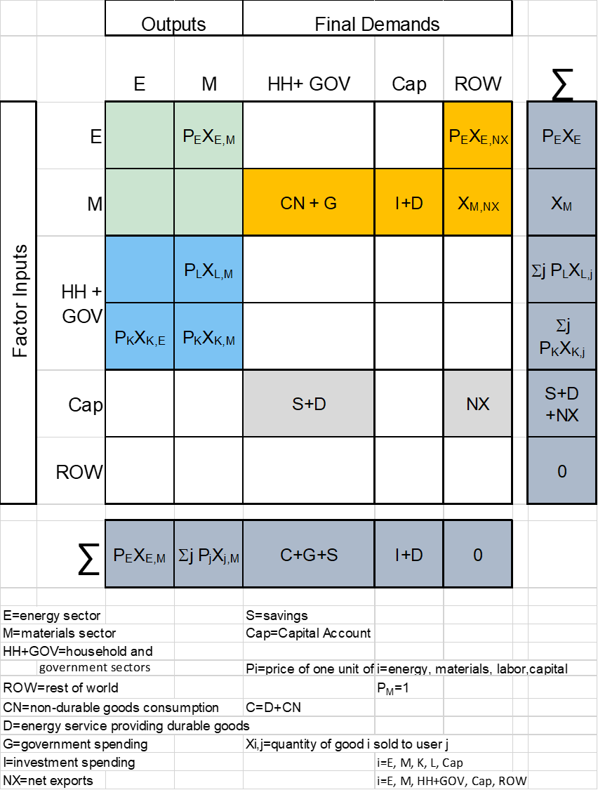

# Table of Contents

- [Inputs to the Module](#inputs-to-the-module)
- [Description](#description)
- [Equations](#equations)
- [Insights and intuition](#insights-and-intuition)
- [IAMC Reference Card](#iamc-reference-card)

## Inputs to the Module
**Table 1: Inputs required by the economic module [1](#table_footnote)**

| Name | Resolution | Unit | Source |
| :--- | :--- | :--- | :--- |
| Population | Region and year | thousands | [Exogenous](inputs_economy.html) |
| Labor productivity growth rate | Region and year | unitless | [Exogenous](inputs_economy.html) |
| Labor force participation rate | Region and year | unitless | [Exogenous](inputs_economy.html) |
| Base year GDP | Region | million 1990$ | [Exogenous](inputs_economy.html) |
| Base year national accounts | Region | million 1990$ | [Exogenous](inputs_economy.html) |

## Description

The socioeconomic component of GCAM sets the scale of economic activity and associated demands for model simulations. Assumptions about population and per capita GDP growth for each of the 32 geo-political regions together determine the Gross Domestic Product (GDP). GDP and population both can drive the demands for a range of different demands within GCAM. 

One of the most important determinants of energy, agriculture, and land-use is the scale of economic activity, which we assume is proportional to GDP. In previous versions of GCAM, dating back to the model's earliest formulations, the level of GDP was prescribed exogenously. There has been an option to endogenously modify the initial GDP assumption to reflect changes in the cost of delivering energy services within a scenario (Edmonds and Reilly, 1983; Edmonds and Reilly, 1985). However, that feedback elasticity was not determined structurally and was a simple scalar parameter. In other words, population and economic activity are used in GCAM through a one-way transfer of information to other GCAM components. For example, neither the price nor quantity of energy nor the quantity of energy services provided to the economy affect the calculation of the principle model output of the GCAM macro-economic system, GDP.

Since GCAM v7, GCAM incorporates a macroeconomic module that allows for fully endogenizing GDP responses. This model creates a two-way coupling between the scale of economic activity, measured as GDP, and the existing energy sector module. In the simple macro-economic model that we employ here, the two-way interaction is developed for each geo-political region in GCAM. The system is assumed to be open, with each of the regions interacting with others in the global economy via trade. Figure 1 shows the new elements in relation to existing GCAM elements.

 
Figure 1: Schematic of the major components of the GCAM macroeconomic model (earlier version in blue; the version in this CMP in blue and orange
{: .fig}

### GCAM-macro (KLEM) Description 

At the heart of the "production" of GDP in the macroeconomic model is the materials sector ($$X$$). The materials sector is the source of all net output not originating in the energy system ($$E$$). $$X_{M}$$ represents the sale of new final goods and services. Additionally, the materials sector consumes all net $E$ output, measured here as efficiency-weighted end-use energy. $$X_{M}$$ therefore serves as the retailer to the economy.

$$
X_M = F_M (X_{K,M}, X_{L,M}, X_{E,M})  
$$

$$
X_{i,j} = \text{sale of product i to sector j, } i=K,L,E,M \text{ and } j=M
$$

$$
F_M \text{ is the production function for materials, with output of } X_M.
$$

The production function $$F_M$$ is homogeneous of degree one and thus carries all of the properties of such functions.

We implement the materials production function as a nested constant elasticity of substitution (CES) production function:

$$
X_M = \left( a \left( bX_{L,M}^{\eta} + X_{K,M}^{\eta} \right)^{\frac{\rho}{\eta}} + cX_{E,M}^{\rho} \right)^{\frac{1}{\rho}}
$$
where $$a$$, $$b$$, $$c$$, $$\rho$$, and $$\eta$$ are constants.

We calculate GDP for a region using equation (3), where: 
$$
GDP = P_M F_M (X_{K,M}, X_{L,M}, X_{E,M}) + NX_E + X_{I,M} \label{eq:3}
$$
$$X_{i,j}$$ represents the sale of product $i$ to sector $j$, with $$i = K, L, E, M$$ and $$j = E, M, NX$$. $$NX_E$$ represents net exports of $E$, and $$P_M$$ is the price of $M$ (assumed to be 1). $$X_{I,M}$$ represents the net balance of trade.

$$X_{E,M}$$ and $$NX_E$$ are taken directly from the GCAM energy module. The materials sector is the sole consumer of final-energy production. For simplicity, all labor is assumed to be employed by the materials sector.
$$
L = L_M
$$

$$
X_{L,M} = L_M h_L(t)
$$

where $$h_L(t)$$ is an exogenous labor productivity scalar.

Similarly, effective energy is given by:

$$
X_{E,M} = E_M h_E(t)g_E(t)
$$
where $$h_E(t)$$ is an exogenous energy productivity scalar, and $$g_E(t)$$ is an endogenous energy service efficiency scalar calculated as an energy service index within the GCAM energy module.

The capital investment market distributes savings and international capital flows between energy and investment:

$$
S = X_{I,M} + X_{I,E} + NX_K
$$
$$NX_K$$ represents net international capital flows.

Savings, in turn, is assumed to be a function of GDP:

$$
S = f(GDP)
$$
Investment in capital stocks employed to produce energy services includes those deployed in industry as well as those deployed in the household sector, such as cars, air conditioners, furnaces, and hot water heaters. The concept of savings is similarly expanded to include resources devoted to expenditures on energy services providing durable goods.

The energy module in GCAM uses a putty-clay representation of capital. In other words, once an investment is made, that capital stock remains productive throughout its assigned lifetime as long as the vintage can cover its operating costs. If a vintage of capital cannot cover its operating costs, the model retires that vintage.

The materials sector capital stock is determined by the following capital accumulation equation:
$$
X_{K,M}(t) = (1-\lambda)X_{K,M}(t-1) + X_{I,M}
$$
Prices of inputs to the materials sector are given by:
$$
P_i = P_M \left(\frac{\partial F_M}{\partial X_{i,M}}\right), \quad i=K,L,E
$$
Across regions, net exports must sum to zero:
$$
0 = \sum_R NX_{i,R}
$$
where $$i=E,K,M$$ and $$R=regions$$.

For code updates, see scripts in [national_account.cpp](https://github.com/JGCRI/gcam-core/blob/master/cvs/objects/containers/source/national_account.cpp).

### GCAM-macro (KLEM) Social Accounting Matrix

The two-way interactions between energy and the economy require the articulation of a set of simplifying assumptions about an economy. Those simplifying assumptions carry implications for the way national income and product accounts are tracked. To facilitate the appropriate accounting within the GCAM macro-economic system, we articulate an implied national Social Accounting Matrix (SAM). We use the SAM to help ensure macroeconomic consistency.

A SAM organizes an economy's transactions and resource transfers between production activities, factors of production, and institutions into a consistent set of accounts. The process of drafting the GCAM SAM provides the occasion for explicitly confronting the simplifying assumptions that go into the model.

A SAM is a series of double-entry bookkeeping accounts for which each row has a corresponding column and vice versa. An important feature of a SAM is that row sums and the corresponding column sums **MUST** be equal. This system of equalities enables post-calculation cross-checks on GCAM macro-economy solutions. If a row and column are not equal, the model has failed to solve correctly. The GCAM-macro SAM follows the approach developed by Hogan and Manne (Hogan and Manne 1978) and is given in Figure 2. In the SAM accounting framework that we have developed, light green cells report inter-industry transactions. While important for ensuring consistency in our representation of the macro economy, these transactions are not part of the GDP.

The GDP is the value of new, final goods and services produced in a given year. Entries in the gold cells represent purchases of new, final goods and services by three categories of economic agents. Our aggregate agents are households and government ($$HH+G$$), capital ($$Cap$$), and the rest of the world ($$ROW$$). Our materials sector ($$M$$) is the retailer to the economy, and thus, all sales of new, final goods and services are sold by the materials sector ($$M$$), with one important exception, the net export of energy products to the $$ROW$$. GDP is the sum of $$C+I+G+net exports$$ or the sum of all of the values in the gold cells.

Because each row and column must sum to exactly the same thing, we can also calculate our GDP as the sum of payments to factors of production, reported in the blue cells. That is, GDP also equals payments to the primary factors of production, which we aggregate into payments to capital ($$K$$) and labor ($$L$$). By definition, all primary factor rewards are paid to either households ($$HH$$) or government ($$G$$).

Another useful cross-check that is enabled by the SAM is the savings-investment cross-check where Savings ($$S$$) plus net international financial transfers ($$NX$$) equals Investment ($$I$$). Note that we have chosen to include energy-consuming consumer durable goods purchases, such as cars and household appliances, in our capital account (rather than lumped into consumption). They are not formally investment purchases but represent part of the underlying energy-using infrastructure of the economy. The net international financial transfers will be inherited from the historical national accounts data. In the data system, we provide a constant to allow users to phase it out by a certain year or hold it constant for all years. It is currently configured to phase out by 2035.

Another example of a useful cross-check is the equality between net exports of new, final goods and services and offsetting international capital transfers. That is, both the "$$ROW$$" column and "$$ROW$$" row must sum to zero.

 
Figure 2: GCAM-macro (KLEM) Social Accounting Matrix
{: .fig}

### Historical Data for Calibration

Historical calibration of national income accounts, such as GDP, capital stock, wages, and savings, and additional inputs and parameters such as population, labor force, and savings and depreciation rates of the capital stock, were based on the Penn World Tables (Feenstra et al., 2015) and the GTAP Data Base (Aguiar et al. 2019) when sectoral information is needed. Country-level data was aggregated to the 32-region representation in GCAM.

Final energy service expenditure for each GCAM region was calculated from calibrated energy quantities and endogenous service prices from GCAM to ensure consistency of historical and projected future energy expenditures at the 32-region representation. Calibration of energy quantities for all fuels and energy carriers for historical periods is based on the IEA Energy Balances (IEA, 2022). This, along with historical global fuel prices, ensures robust estimates of energy expenditures for GCAM regions. Calculation of future final energy service is determined endogenously in response to changes in the demand for energy and prices resulting from the interplay of resource supplies and demands. Investment demands by the energy sector are determined endogenously. Energy sector investments include all capital investments associated with the production, transformation, and delivery of energy services. All other investments are attributed to the Materials sector.

For any projected labor force and GDP pathway, total factor productivity values can be selected to reproduce that pathway. That is, the model can be calibrated to replicate reference scenario GDP values or to match any alternative future scenarios of GDP pathways, such as the Shared-Socioeconomic Pathways (SSPs) (IIASA, 2018). Alternatively, estimates of future labor supply and assumptions of total factor/labor/capital/energy productivity improvements can be used directly to determine future GDP outcomes. In all cases, these projects can subsequently be run in open GDP mode (the default option in GCAM v7). 

Assumptions of savings and depreciation rates for future periods are exogenous inputs and can be readily changed. A simple regression model of the relationship between historical per capita GDP and savings rates was applied to adjust future savings rates from initial historical rates by region. Depreciation rates were held fixed at historical values, as they are more uniform across regions.

### Calculating economic consequences of perturbations in GCAM

In previous versions of GCAM, the cost of emissions mitigation was calculated using a "deadweight loss" approach, where the area under a marginal abatement cost schedule (MAC) was determined through multiple GCAM runs. You can find a description of this approach at [Policies Page](policies.html). As mentioned there, the cost of GHG emissions mitigation is a concept with various measures used in the literature, such as the price of carbon, reduction in Gross Domestic Product (GDP), consumption loss, deadweight loss, and equivalent variation. GCAM focuses on calculating the resource cost of emissions reduction and the social cost of carbon, without attempting to quantify the benefits of emissions mitigation.

The inclusion of the GCAM macro module expands the range of options available for reporting the economic consequences of any model perturbation. The GCAM model now provides the ability to report changes in GDP, consumption, and/or deadweight loss. Each measure offers unique insights. Deadweight loss takes a "bottom-up" approach by considering the cost of each technology switch, while consumption and GDP are macroeconomic measures. Consumption is directly linked to welfare, while GDP provides a better measure of overall economic activity.

A significant advantage of the macroeconomic module is that it enables the direct output of GDP and/or consumption consequences for a broader range of perturbations, eliminating the need for post-processing. In contrast, the deadweight loss approach requires case-by-case development of methods when the economy is perturbed by factors other than emissions mitigation enforced through a carbon price. Changes in consumption and/or GDP can be observed, for example, in response to regulatory interventions, variations in water availability, or weather/climate-related factors.

## References

Edmonds, Jae, and John Reilly. "A long-term global energy-economic model of carbon dioxide release from fossil fuel use." *Energy Economics* 5, no. 2 (1983): 74-88.

Edmonds, Jae A., and J. M. Reilly. "Future global energy and carbon dioxide emissions." *Atmospheric carbon dioxide and the global carbon cycle* (1985): 215-246.

Manne, Allen, and W. M. Hogan. "Energy-economy interactions: The fable of the elephant and the rabbit?." *Advances in the Economics of Energy and Resources* 1 (1978).

Feenstra, Robert C., Robert Inklaar, and Marcel P. Timmer. "The next generation of the Penn World Table." *American economic review* 105, no. 10 (2015): 3150-3182.

Aguiar, Angel, Maksym Chepeliev, Erwin L. Corong, Robert McDougall, and Dominique Van Der Mensbrugghe. "The GTAP data base: version 10." *Journal of Global Economic Analysis* 4, no. 1 (2019): 1-27.

IEA. "World Energy Outlook 2022." (2022).

IIASA. "SSP Database." (2018).

## IAMC Reference Card

Population
- [X] Yes (exogenous)
- [ ] Yes (endogenous)

Population age structure
- [ ] Yes (exogenous)
- [ ] Yes (endogenous)

Education level
- [ ] Yes (exogenous)
- [ ] Yes (endogenous)

Urbanization rate
- [ ] Yes (exogenous)
- [ ] Yes (endogenous)

GDP
- [ ] Yes (exogenous)
- [X] Yes (endogenous)

Income distribution
- [ ] Yes (exogenous)
- [ ] Yes (endogenous)

Employment rate
- [ ] Yes (exogenous)
- [ ] Yes (endogenous)

Labor productivity
- [X] Yes (exogenous)
- [ ] Yes (endogenous)

Total factor productivity
- [X] Yes (exogenous)
- [ ] Yes (endogenous)

Autonomous energy efficiency improvements
- [X] Yes (exogenous)
- [ ] Yes (endogenous)

<a name="table_footnote">1</a>: Note that this table differs from the one provided on the [Economy Inputs Page](inputs_economy.html#description) in that it lists all inputs to the economy module, including information passed from other modules. Additionally, the units listed are the units GCAM requires, rather than the units the raw input data uses.

