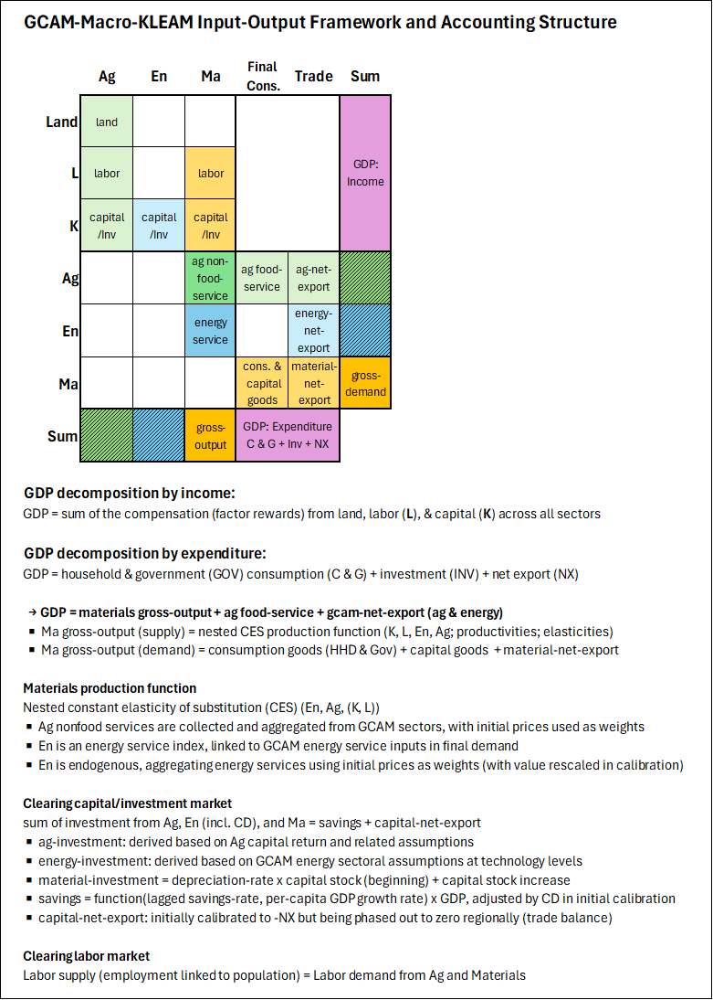

# Table of Contents

- [Inputs to the Module](#inputs-to-the-module)
- [Description](#description)
- [Equations](#equations)
- [Insights and intuition](#insights-and-intuition)
- [IAMC Reference Card](#iamc-reference-card)

## Inputs to the Module
**Table 1: Inputs required by the economic module [1](#table_footnote)**

| Name | Resolution | Unit | Source |
| :--- | :--- | :--- | :--- |
| Population | Region and year | thousand people | [Exogenous](inputs_economy.html) |
| GDP | Region, scenario, and year | million 1990 USD | [Exogenous](inputs_economy.html) |
| GDP per capita | Region, scenario, and year | thousand 1990 USD per capita | [Exogenous](inputs_economy.html) |
| Employment / labor supply | Region, scenario, and year | million people | [Exogenous](inputs_economy.html) |
| Labor-force share | Region, scenario, and year | share | [Exogenous](inputs_economy.html) |
| Base-year national accounts | Region and year | million 1990 USD | [Exogenous](inputs_economy.html) |
| Savings-rate parameters | Region | unitless | [Exogenous](inputs_economy.html) |
| Depreciation rates | Region and year | share | [Exogenous](inputs_economy.html) |
| Capital stock and factor compensation | Region and year | million 1990 USD | [Exogenous](inputs_economy.html) |
| Materials production-function parameters | Region / production-function nest | unitless | [Exogenous](inputs_economy.html) |
| Total factor productivity | Region, scenario, and year | index | [Exogenous / calibrated](inputs_economy.html) |
| Agricultural labor and capital inputs | Region, sector, technology, and year | various | [Land supply module](supply_land.html) |
| Energy capital and investment inputs | Region, sector, technology, and year | various | [Energy supply module](supply_energy.html) |

  

## Description

The socioeconomic component of GCAM sets the scale of economic activity and associated demands for model simulations. Assumptions about population and per capita GDP growth for each of the 32 geo-political regions together determine the Gross Domestic Product (GDP). GDP and population both can drive the demands for a range of different demands within GCAM. 

One of the most important determinants of energy, agriculture, and land-use is the scale of economic activity, which we assume is proportional to GDP. In previous versions of GCAM, dating back to the model's earliest formulations, the level of GDP was prescribed exogenously. There has been an option to endogenously modify the initial GDP assumption to reflect changes in the cost of delivering energy services within a scenario (Edmonds and Reilly, 1983; Edmonds and Reilly, 1985). However, that feedback elasticity was not determined structurally and was a simple scalar parameter. In other words, population and economic activity are used in GCAM through a one-way transfer of information to other GCAM components. For example, neither the price nor quantity of energy nor the quantity of energy services provided to the economy affect the calculation of the principle model output of the GCAM macro-economic system, GDP.

Since GCAM v7, GCAM incorporates a macroeconomic module (KLEM) that allows for fully endogenizing GDP responses. This model creates a two-way coupling between the scale of economic activity, measured as GDP, and the existing energy sector module. In the simple macro-economic model that we employ here, the two-way interaction is developed for each geo-political region in GCAM. The system is assumed to be open, with each of the regions interacting with others in the global economy via trade. 

Beginning with GCAM v9.1, GCAM-Macro is extended to GCAM-Macro-KLEAM, which adds primary Agriculture (A) to the Capital-Labor-Energy-Materials (KLEM) framework. KLEAM explicitly represents labor and capital in primary agricultural production, links agricultural labor to regional employment, incorporates agricultural investment into the savings-investment closure, and adds agricultural food and nonfood services to the macroeconomic accounting structure. This strengthens two-way feedbacks among sectoral production, factor markets, capital accumulation, and aggregate economic outcomes such as GDP, wage rates, and capital rental prices.

More detailed documentation of the original GCAM-Macro KLEM implementation and the GCAM-Macro-KLEAM extension is available in [CMP-332](cmp/332-GCAM_Macro_Economic_Module_KLEM.pdf) and [CMP-411](cmp/411-GCAM_Macro_KLEAM.pdf), respectively.

### GCAM-macro Description 

GCAM-Macro links Capital, Labor, Agriculture, Energy, and Materials. The Materials sector represented the rest of the economy outside the agriculture and energy system. Agriculture, Energy, and Materials are linked through national accounting, labor supply, capital accumulation, investment demand, and factor-price feedbacks. Primary agriculture now includes explicit labor and capital inputs, agricultural food services are represented in final consumption, and agricultural nonfood services enter Materials production.

GCAM-Macro is designed to preserve GCAM's detailed sectoral representations while improving consistency between physical production systems and value-based macroeconomic accounting. Physical quantities are still determined within GCAM's energy, agriculture, land, water, and other sectoral systems. Macroeconomic consistency is enforced in value terms through national-account identities and market-clearing conditions.

 
Figure 1: Overview of the GCAM-Macro input–output and accounting framework. Agriculture (Ag), Energy (En), and Materials (Ma) use primary factors of production and supply services and goods to final demand. GDP is defined consistently by income and expenditure.
{: .fig}

## Accounting structure

GCAM-Macro maintains consistency between income-side and expenditure-side measures of GDP in its base data construction.

Income-side GDP is represented as the sum of factor compensation across sectors:

$$
GDP = \sum \text{factor compensation from land, labor, and capital}
$$

Expenditure-side GDP is represented as final consumption, investment, and net exports:

$$
GDP = C + G + INV + NX
$$

Within the KLEAM accounting structure, the GCAM national-account identity can be summarized as:

$$
GDP = \text{materials-gross-output} + \text{ag-food-service-value} + \text{gcam-net-export}
$$

where `materials-gross-output` represents the output of the Materials sector, `ag-food-service-value` represents the value of agricultural food services entering final consumption, and `gcam-net-export` represents net exports from GCAM sectors, including agriculture and energy.

Agricultural nonfood services and energy services are treated as intermediate inputs to the Materials production function. Agricultural food services are kept separate because food demand is governed by GCAM's food demand model and enters final consumption directly.

## Materials production function

The Materials sector represents the rest of the economy outside the detailed GCAM energy and agricultural systems. Materials production is represented with a nested constant elasticity of substitution (CES) production function that combines value-added inputs and intermediate service inputs.

The main inputs are:
* capital used in Materials production,
* labor allocated to Materials,
* energy services supplied by GCAM energy technologies, and
* agricultural nonfood services supplied by GCAM agricultural sectors.

Conceptually:

$$
\text{materials-gross-output} = F(K_M, L_M, E_M, A_M)
$$

where $$K_M$$ is Materials capital, $$L_M$$ is Materials labor, $$E_M$$ is energy service input, and $$A_M$$ is agricultural nonfood service input.

Energy services and agricultural nonfood services are aggregated from detailed GCAM sectoral outputs using initial prices as weights. Total factor productivity is calibrated so that open-GDP reference runs reproduce the corresponding reference GDP trajectory.

## Labor and capital markets

Total regional labor supply is linked to population and employment assumptions. Labor is allocated between Agriculture and Materials. Agriculture and Materials are connected through this regional labor allocation system, while sectoral labor markets clear within the model.

Within primary agriculture, a common regional agricultural wage rate is assumed across agricultural sectors. This reflects the assumption that labor is mobile within primary agriculture. Agricultural labor inputs are represented explicitly in crop, livestock, and forestry production where applicable.

Capital is represented through a regional savings-investment closure. Aggregate investment demand includes investment from Agriculture, Energy, Energy services, and Materials. Regional investment is constrained by regional savings and capital net exports:

$$
INV_{Ag} + INV_{En} + INV_{Ma} = S + NX_K
$$

where $$INV_{Ag}$$, $$INV_{En}$$, and $$INV_{Ma}$$ are agricultural, energy, and Materials investment, $$S$$ is savings, and $$NX_K$$ is capital net export.

GCAM-Macro includes an endogenous regional capital rental price. This capital price links macroeconomic savings-investment conditions to investment costs in Agriculture, Energy, and Materials. For energy technologies, the capital-related portion of technology costs can respond to changes in the regional capital price while preserving the detailed bottom-up technology representation.

For code updates, see scripts in [national_account.cpp](https://github.com/JGCRI/gcam-core/blob/master/cvs/objects/containers/source/national_account.cpp).

## Historical Data for Calibration

Historical calibration of the macroeconomic accounts uses a combination of socioeconomic, national-account, labor, capital, and sectoral data. Population and GDP are processed from historical data and extended with SSP assumptions. National-account variables such as capital stock, labor compensation, capital compensation, depreciation rates, savings rates, and capital net exports are processed from datasets including the Penn World Table, the Global Macro Database, FAOSTAT-based GDP inputs, GTAP-based sectoral information, and other mapping files.

With GCAM-Macro, the historical calibration also includes more detailed labor-market and agricultural value-added information. Total employment is used as a labor-supply input, and labor is allocated between Agriculture and Materials. Agricultural labor and capital inputs are compiled from sources including FAO, USDA, ILO, and GTAP-based data, then downscaled to agricultural sectors and technologies.

Energy service quantities are still derived from GCAM energy-sector outputs and aggregated into an energy-service input to the Materials production function. Agricultural nonfood outputs are similarly aggregated into an agricultural nonfood-service input. Agricultural food services are treated separately and enter final consumption directly.

For future periods, total factor productivity is calibrated so that open-GDP reference scenarios reproduce the corresponding reference GDP trajectories. Savings-rate parameters, depreciation rates, labor supply assumptions, and trade-balance assumptions remain exogenous inputs that can be modified by users. Capital net exports are initialized from historical national-account data and are phased out over time according to the trade-balance assumption.

Historical value and price outputs should be interpreted carefully. Some historical calibration uses base-year or final historical prices, and sectoral investment is not fully calibrated to historical observations because consistent historical data are limited.

## Fixed-GDP and open-GDP modes

GCAM can be run with fixed GDP or open GDP.

In fixed-GDP mode, GDP follows exogenous socioeconomic assumptions and is not affected by GCAM sectoral outcomes. This mode is useful for scenario comparison when users want to hold the socioeconomic pathway fixed, or re-calibrate total factor productivity.

In open-GDP mode, GCAM-Macro allows GDP to respond endogenously. In reference scenarios, total factor productivity is calibrated so that open-GDP results reproduce the corresponding reference GDP trajectory. In policy or perturbation scenarios, changes in energy, agriculture, labor, capital, savings, investment, and other sectoral conditions can affect GDP and related macroeconomic outputs.

The key outputs used to interpret these responses are summarized below.

## Outputs

Economy-related outputs include socioeconomic drivers, endogenous macroeconomic outcomes, and national-account variables used to diagnose GCAM-Macro behavior. These outputs are available through ModelInterface queries and XML database outputs. Exact query names are defined in [Main_queries.xml](https://github.com/JGCRI/gcam-core/blob/master/output/queries/Main_queries.xml), and availability may depend on the model configuration.

**Table 2: Selected economy-related outputs**

| Output group | Example outputs | Notes |
| :--- | :--- | :--- |
| Socioeconomic indicators | `GDP`, `population`, `gdp-per-capita`, `gdp-per-capita-ppp` | GDP is exogenous in fixed-GDP mode and endogenous in open-GDP mode. PPP-adjusted GDP per capita is mainly used in food demand. |
| Productivity | `total-factor-productivity` | Materials-sector TFP is calibrated so that open-GDP reference runs reproduce reference GDP trajectories. |
| Savings and investment | `investment`, `savings-rate`, `savings`, `capital-net-export` | Regional investment is constrained by savings and capital net exports in GCAM-Macro. |
| Materials-sector accounts | `materials-gross-output`, `materials-value-added`, `materials-labor-wages`, `materials-labor-force`, `materials-capital-stock`, `materials-capital-investment`, `materials-net-export`, `depreciation` | These variables describe the aggregate Materials sector, representing the rest of the economy outside the detailed GCAM agriculture and energy systems. |
| Capital market diagnostics | `capital-price` | Gross capital rental price, defined as capital compensation divided by capital stock. This links savings-investment conditions to capital-related technology costs. |
| Agricultural service accounts | `ag-food-service-value`, `ag-nonfood-service`, `ag-nonfood-service-value`, `ag-investment` | GCAM-Macro separates agricultural food services in final consumption from agricultural nonfood services entering Materials production. |
| Energy service accounts | `energy-service`, `energy-service-value`, `energy-consumer-durable`, `energy-investment` | Energy services enter Materials production, while energy and energy-service technologies contribute to investment demand. |
| GCAM sector net exports | `gcam-net-export` | Net exports from detailed GCAM sectors, including agriculture and energy. | 

  
Most value-based national-account variables are reported in million 1990 USD unless otherwise noted. Historical price and value outputs should be interpreted carefully because only selected historical or base-year prices are used for calibration.

For GCAM-Macro runs, these outputs are mainly intended to support interpretation of macroeconomic feedbacks and accounting consistency. At the global level, aggregate investment is constrained by savings. At the regional level, capital net exports represent the financial-account counterpart to value net exports and are phased out over time according to the trade-balance assumptions.

## Calculating economic consequences of perturbations in GCAM

In earlier versions of GCAM, the cost of emissions mitigation was often calculated using a “deadweight loss” approach, where the area under a marginal abatement cost curve was estimated from multiple model runs. A description of this approach is provided on the [Policies Page](policies.html).

The cost of greenhouse gas mitigation can be measured in several ways, including carbon prices, GDP changes, consumption changes, deadweight loss, and equivalent variation. GCAM focuses on estimating resource costs and economic responses to mitigation or other perturbations; it does not directly quantify the avoided damages or benefits of emissions reductions.

GCAM-Macro expand the set of outputs available for evaluating perturbations. In fixed-GDP mode, GDP follows the exogenous socioeconomic pathway, so macroeconomic consequences are not reflected through aggregate GDP changes. In open-GDP mode, perturbations can affect GDP and related national-account variables through changes in sectoral production, prices, energy services, agricultural services, labor allocation, capital accumulation, savings, and investment.

These macroeconomic responses can be useful for evaluating a broader set of shocks than carbon pricing alone, including technology changes, energy-market disruptions, water or land constraints, agricultural productivity changes, climate impacts, and other sectoral perturbations. The resulting outputs should be interpreted as model-consistent economic responses within the GCAM-Macro accounting framework, not as a complete welfare analysis.

## References

Edmonds, Jae, and John Reilly. "A long-term global energy-economic model of carbon dioxide release from fossil fuel use." *Energy Economics* 5, no. 2 (1983): 74-88.

Edmonds, Jae A., and J. M. Reilly. "Future global energy and carbon dioxide emissions." *Atmospheric carbon dioxide and the global carbon cycle* (1985): 215-246.

Manne, Allen, and W. M. Hogan. "Energy-economy interactions: The fable of the elephant and the rabbit?." *Advances in the Economics of Energy and Resources* 1 (1978).

Feenstra, Robert C., Robert Inklaar, and Marcel P. Timmer. "The next generation of the Penn World Table." *American economic review* 105, no. 10 (2015): 3150-3182.

Aguiar, Angel, Maksym Chepeliev, Erwin L. Corong, Robert McDougall, and Dominique Van Der Mensbrugghe. "The GTAP data base: version 10." *Journal of Global Economic Analysis* 4, no. 1 (2019): 1-27.

IEA. "World Energy Outlook 2022." (2022).

IIASA. "SSP Database." (2024).

## IAMC Reference Card

Population
- [X] Yes (exogenous)
- [ ] Yes (endogenous)

Population age structure
- [ ] Yes (exogenous)
- [ ] Yes (endogenous)

Education level
- [ ] Yes (exogenous)
- [ ] Yes (endogenous)

Urbanization rate
- [ ] Yes (exogenous)
- [ ] Yes (endogenous)

GDP
- [ ] Yes (exogenous)
- [X] Yes (endogenous)

Income distribution
- [ ] Yes (exogenous)
- [ ] Yes (endogenous)

Employment rate
- [ ] Yes (exogenous)
- [ ] Yes (endogenous)

Labor productivity
- [X] Yes (exogenous)
- [ ] Yes (endogenous)

Total factor productivity
- [X] Yes (exogenous)
- [ ] Yes (endogenous)

Autonomous energy efficiency improvements
- [X] Yes (exogenous)
- [ ] Yes (endogenous)

<a name="table_footnote">1</a>: Note that this table differs from the one provided on the [Economy Inputs Page](inputs_economy.html#description) in that it lists all inputs to the economy module, including information passed from other modules. Additionally, the units listed are the units GCAM requires, rather than the units the raw input data uses.

