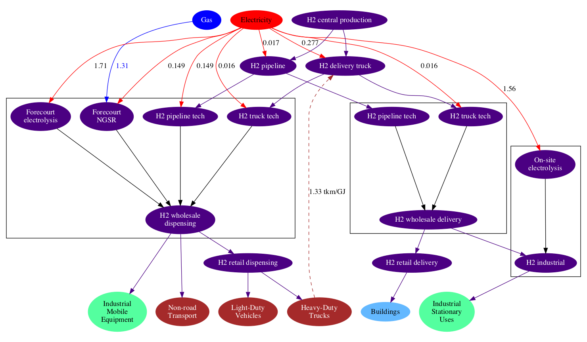

Hydrogen in GCAM is modeled purely as a future energy commodity; while industrial scale volumes of hydrogen are currently produced (e.g., at oil refineries or ammonia plants), the present-day use of hydrogen is almost entirely for non-energy purposes. Hydrogen is not treated as a fuel in the IEA Energy Balances, or most other energy statistics. As such, the use of hydrogen as an energy carrier is assumed zero in the base years of GCAM, and starting in 2020 it is allowed to compete for market share supplying heat and power in the industrial sector, and for vehicle fuel in the transportation sector.

The representation of hydrogen in GCAM includes 10 production technologies in two production sectors, with cost mark-ups to reflect levelized infrastructural costs, as well as variable transmission and distribution costs. The structure of the hydrogen production and distribution sectors and technologies in GCAM is shown in Figure 1.

Figure 1: Hydrogen structure, with example input-output coefficients shown.
{: .fig}

### Hydrogen Production

The production of hydrogen takes place in two distinct sectors: H2 Forecourt Production (i.e., on-site generation) and H2 Central Production. The hydrogen produced at central facilities incurs additional cost mark-ups to reflect the distribution costs, whereas forecourt production typically entails higher energy intensities on the production side, and higher per-unit costs. Central production also has a greater diversity of feedstock options, described below.

The most common production technology today is natural gas steam reforming, though coal chemical transformation is the dominant technology in China. In GCAM, all regions have access to all technologies when hydrogen as an energy carrier becomes available; as shown in Figure 1, hydrogen can be produced from up to 7 energy sources. Three of these sources (coal, gas, and biomass) include production technologies with CCS, characterized by higher costs and higher energy intensities, but lower CO2 emissions.

The wind and solar technologies are electrolysis technologies, but are specifically disaggregated because these uses of wind and solar energy do not incur any backup-related costs, unlike in the electricity sector where backup costs increase as a function of their share of total grid capacity (see [electricity](en_electricity.html)). In contrast, the nuclear technology represents thermal splitting, which does not use electricity as an intermediate energy product.

