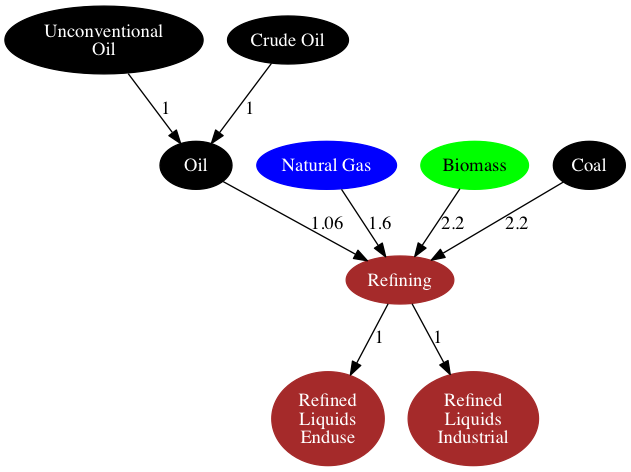
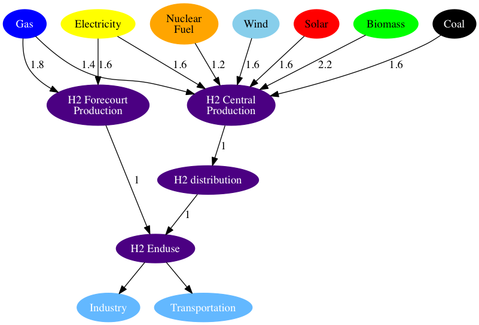
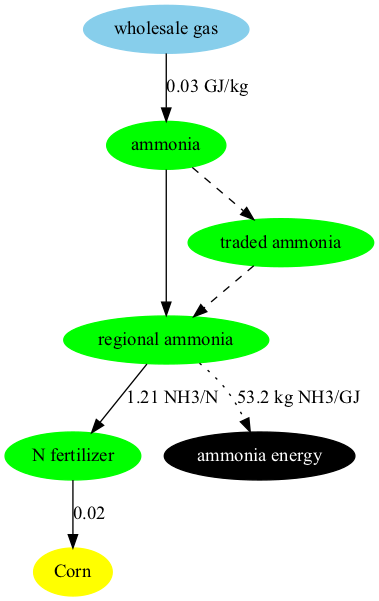
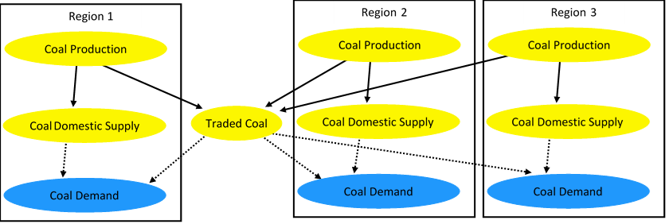

## Overview

GCAM structure are user defined, based on the data inputs provided to the model. This page describes the overall structure of the energy system as constructed in the current release version of GCAM. 

The overall structure of the energy system can be thought of as consisting of three main elements: energy resources, energy transformation, and final energy demands. It also tracks international trade in energy commodities. Consistent with the overall structure of GCAM, all the different elements of GCAM interact through market prices and physical flows of, for example, electricity. Technology choices are made based on prices using discrete [choice methods](choice.html).

 
**Schematic of Major Energy Pathways in GCAM**
{: .fig}

We have partitioned the energy system documentation as follows:

* [Resources](#resources)
* [Renewable Resources](#renewable-resources)
* [Energy Transformation](#energy-transformation)
    * [Electricity](#electricity)
    * [Refining](#refining)
    * [Gas processing](#gas-processing)
    * [District Services](#district-services)
    * [Hydrogen](#hydrogen)
* [Final Energy Consumption](#final-energy-consumption)
    * [Buildings](#buildings)
    * [Industry](#industry)
    * [Transportation](#transportation)
* [Energy Trade](#energy-trade)
* [Mapping the IEA Energy Balances](#mapping-the-iea-energy-balances)
* [References](#references)

## Resources

### Depletable Resources 

GCAM models depletable resources (oil, unconventional oil, natural gas, coal, and uranium) using graded resource supply curves. The fossil resources are produced from these supply curves using a "Resource / Reserve" model.  In this approach as the market price of the resource increases, we look up the supply curve to determine the additional quantity available and move that quantity of "resource" into a "reserve".  We assume production of that reserve over some well / mine lifetime appropriate for each fuel.  Technical change can be applied to reduce the extraction cost of the "resource" in future years. Resource curves for fossil fuels are shown below.

{: .fig}

{: .fig}

**Illustrative examples of supply curves and totall supplies for fossil resources in GCAM (from GCAM 5.3)**
{: .fig}

#### Representation of unconventional oil as a technology within crude oil

Unconventional oil and crude oil into 1 resource (crude oil). Note that the ability for countries to produce unconventional oil is maintained by adding it as a subresource and technology within crude oil. This structure allows GCAM to load all costs related to unconventional oil production directly as technology costs. Since unconventional oil is not a resource, unconventional oil now uses crude oil's global resource price.   

### Renewable Resources 

GCAM's renewable resources include wind, solar, geothermal, hydropower, and biomass; some regions are also assigned a "traditional biomass" resource. In contrast to the depletable resources, whose cumulative stocks are explicitly tracked, renewable resource quantities in GCAM are always indicated in terms of annual flows. Wind, solar, geothermal, and hydropower are considered only as options for producing electricity, and are not traded between regions. Traditional biomass is only used by the buildings sector in selected regions. Of the six renewable energy resources, only biomass is (a) traded globally, and (b) used as an energy form or feedstock in a wide variety of sectors.

In general, the costs of producing electricity from renewable energy forms consist of the sum of the resource costs described here, the technology costs, and in some cases, backup-related costs. The latter two components to the costs are documented in the [electricity sector](energy.html#electricity).

## Wind

All regions are assigned a wind energy supply curve, where the quantity is in exajoules (EJ) of electricity produced per year, and the price is in 1975$ per gigajoule (GJ) of electricity produced. Unlike fossil resources, uranium, or biomass, the quantities of wind energy are considered to be within "regional" markets; they can not be traded between the different modeled geopolitical regions. The specific supply curve in each region is assigned three parameters, detailed in the following equation:

$$
Q = maxSubResource * \frac{P^{CurveExponent} }{ ( {MidPrice^{CurveExponent} + P^{CurveExponent} ) } }
$$

Where Q refers to the quantity of electricity produced, P the price, and the remaining parameters are exogenous, with the names in the XML input files corresponding to the names in the equation above. maxSubResource indicates the maximum quantity of wind energy that could be produced at any price, curve-exponent is a shape parameter, and mid-price indicates the price at which 50% of the maximum available resource is produced. The supply curves in each region are derived from bottom-up analysis documented in [Zhou et al. (2012)](energy.html#zhou2012). Note that in this supply curve formulation, the price is zero when the quantity is zero; this is because the wind resource supply curves only represent costs that increase with deployment due to the nature of the resources; these include factors such as increased transmission distances, reduced capacity factors, and more costly access to sites, among others. The remainder of the costs of wind electricity generation are in the technology and backup, described in the [electricity sector](energy.html#electricity).

 
**Illustrative example of global gridded potential for wind electricity generation used in GCAM (from GCAM 5.3).**
{: .fig}

## Solar

Solar energy is modeled as two separate resources: "global solar resource" and "distributed_PV", where the latter refers only to photovoltaic installations on residential and commercial buildings. As with wind, both of these resources are indicated in terms of electricity production. Global solar resource is modeled as an unlimited resource, and with a very low price; unlike with wind, it is assumed that marginal resource-related costs do not escalate with deployment levels. The technology and backup-related costs are documented in the [electricity sector](energy.html#electricity).

Distributed PV capacity factors are scaled across GCAM regions by the average latitude tilt irradiance for that region. The average latitude tilt irradiance for each country is derived from the "Latitude Tilt Radiation" variable from the NASA Surface meteorology and Solar Energy (SSE) Release 6.0 Data Set and averaged for each GCAM region. Forest and cropland areas are excluded.

The "distributed_PV" supply curve is of the same functional form as the wind supply curve, with an upward-sloping function designed to capture the increases in costs with deployment. In the USA region, the distributed_PV supply curve is estimated from data compiled by [Denholm (2008)](energy.html#denholm2008). The curve-exponent is assumed the same in all other regions, the mid-prices are adjusted according to the irradiance in each region, and the maxSubResources are adjusted according to the estimated building floorspace.

Concentrated Solar Power (CSP) capacity factors across GCAM regions depend on Direct Normal Irradiance (DNI), which is also derived from the the NASA SSE Release 6.0 Data as described in [Zhang et al. (2010)](energy.html#zhang2010). Areas with more than 200 days of low DNI (e.g., cloudy days) are excluded as these are not suitable for large-scale CSP installations. High latitude areas (> 45°) are excluded because DNI data was not available.

## Geothermal

Modeling of geothermal energy in GCAM is documented in [Hannam et al. (2009)](energy.html#hannam2009). Like wind and solar, geothermal energy is only used in GCAM as a source of electricity production, but the quantities in the resource supply curves are indicated in terms of EJ of heat input to power plants, estimated as 10 times the quantity of electricity generated. This 10% thermo-electric efficiency is a bit lower than most regions where it has been estimated, but is the [IEA's (2011)](energy.html#iea2011) default assumption. The supply curves in each region are graded, similar to the fossil resource curves but with the exception that the quantities refer to annual flows, not cumulative stocks. As with wind and solar, the supply curves are intended to capture only the portion of the costs of producing geothermal electricity that escalate with deployment, with the remainder of the costs in the corresponding technologies of the electricity sector. In the four phases of geothermal electricity production identified by [Deloitte (2008)](energy.html#deloitte2008), the supply curves in GCAM include identification, exploration, and drilling, but not production.

An additional XML file with Enhanced Geothermal Resources (EGS) is included with the standard GCAM input fileset, but is not included in the default configuration file. EGS expands the geothermal resource base significantly, albeit at higher costs, but is excluded from the default configuration due to the uncertainties about the future availability, effectiveness, and potential costs and risks of the technology.

## Hydropower

Hydropower is the simplest of all energy forms in GCAM; the quantity of hydropower produced in each region and year is exogenous, prescribed as a "fixedOutput". Hydropower costs are not estimated, and the technology does not contribute to the modeled electricity price in each region. The quantities in future years are generally consistent with the long-term "economic" potential identified by the International Hydropower Association [(IHA 2000)](energy.html#iha2000).

## Biomass

While most of the effort in modeling biomass supply is in the [agriculture and land use component](aglu.html), there is a renewable resource represented in the energy system, that generally refers to municipal and industrial wastes that can be used for energy purposes. The supply curves use the same functional form as printed in the Wind section above, and the specific quantities are documented in [Gregg and Smith (2010)](energy.html#gregg2010). Unlike other resources, the waste biomass supply curve is assumed to grow with GDP, as prescribed by the exogenous supply elasticity of GDP, or "gdpSupplyElast".

## Traditional biomass

Traditional biomass in GCAM is defined as the IEA's "primary solid biomass" product consumed by the residential sector, in selected regions where it is considered to be an important part of the energy system. The largest consumers of traditional biomass in 2010 were China, India, and Western Africa. The specific energy goods involved include firewood, agricultural residues, animal dung, and others; no effort is made to disaggregate the category into these consistuent parts, or to link the production volumes with the agriculture and land use module.

## Energy Transformation

Broadly, the energy transformation sectors in GCAM consist of all supplysectors between the energy resources and the final demands, where the latter are identified by the final-energy keywords "buildings", "industry", or "transportation". Energy transformation sectors consume energy goods which are supplied either by resources or other energy transformation sectors, and they produce energy goods which are consumed either by other energy transformation sectors or by final demand sectors. This category is also considered to include a number of "pass-through" supplysectors whose purpose is explicit tracking of cost mark-ups and efficiency losses in the inter-sectoral transportation of energy goods. The main energy transformation sectors highlighted in this documentation are [electricity](energy.html#electricity), [refining](energy.html#refining), [gas processing](energy.html#en_gas_processing), [hydrogen production](energy.html#hydrogen), and [district services](energy.html#district-services).

In energy transformation sectors, the output unit and input unit are EJ (per year), the price unit is 1975$ per GJ of output, and the subsector nest is used for competition between different fuels (or feedstocks). The competition between subsectors takes place according to a calibrated logit sharing function, detailed in [choice function](choice.html). Within the subsectors, there may be multiple competing technologies, where technologies typically represent either different efficiency levels, and/or the application of carbon dioxide capture and storage (CCS). The parameters relevant for technologies in GCAM are identified and explained in [energy technologies](en_technologies.html).

In the schematic of the energy system depicted below, the energy transformation and distribution sectors include all sectors except for the resources (colored red) and the final demands (colored light blue).

 
**Simplified schematic of the energy system in each region, showing the inter-sectoral flows of energy goods in GCAM.**
{: .fig}

### Electricity

The GCAM electricity sector models the conversion of primary fuels (e.g., coal, gas, oil, bioenergy) to electricity. For most fuels, GCAM includes several different technology options (e.g., pulverized coal, coal IGCC, etc.). Individual technologies compete for market share based on their technological characteristics (conversion efficiency in the production of products from inputs), and cost of inputs and price of outputs. The cost of a technology in any period depends on (1) its exogenously specified non-energy cost, (2) its endogenously calculated fuel cost, and (3) any cost of emissions, as determined by the climate policy. The first term, non-energy cost, represents capital, fixed and variable O&M costs incurred over the lifetime of the equipment (except for fuel or electricity costs). For electricity technologies, GCAM reads in each of these terms and computes the levelized cost of energy within the model. For example, the non-energy cost of coal-fired power plant is calculated as the sum of overnight capital cost (amortized using a capital recovery factor and converted to dollars per unit of energy output by applying a capacity factor), fixed and variable operations and maintenance costs. The second term, fuel or electricity cost, depends on the specified efficiency of the technology, which determines the amount of fuel or electricity required to produce each unit of output, as well as the cost of the fuel or electricity. The nesting structure of the electric sector is shown in the figure below, with a focus on one repesentative technology.

 
**Schematic showing the nesting structure of the electric sector, with levels for choices between fuels, technologies, and cooling systems. Note that this is a simplification of the actual structure used, which includes "pass-through" sectors, because GCAM sectors are only allowed two levels of nesting.**
{: .fig}

Details on the assumptions used in GCAM (e.g., cost, efficiency, capacity factors, etc.) is documented in [Muratori et al. 2017](energy.html#muratori2017). GCAM also includes the water inputs to electricity generation, in a third nest, as shown in the figure above. That is, within any thermo-electric generation technology, there is modeled competition between up to five different cooling system types; this is documented in the [water section](water.html).

### Refining 

The refining sector, or liquid fuels production sector, explicitly tracks all energy inputs, emissions, and costs involved with converting primary energy forms into liquid fuels. Liquid fuels include gasoline, diesel, kerosene, ethanol and many other liquid hydrocarbon fuels; for the full mapping see [Mapping the IEA Energy Balances](energy.html#mapping-the-iea-energy-balances). The refining sector includes subsectors of oil refining, biomass liquids, gas to liquids, and coal to liquids, each of which are described below. Each of these four subsectors is available starting in the first future time period, and the capital stocks of refineries are explicitly tracked. The structure of refining in the broader energy system is shown in the following figure, with example input-output coefficients.

 
**Structure of refining sector and associated products within the energy system, with sample input-output coefficients shown. Electricity and natural gas inputs to oil refining not shown for simplicity.**
{: .fig}

## Oil Refining

The oil refining subsector accounts for the vast majority of the historical output of the refining sector, globally and in all regions. Each region is assigned a single production technology for oil refining; as indicated in the figure above, this technology does not differentiate between conventional and unconventional oil, whose competition is explicitly modeled upstream of the refining sector. In a typical region, the oil refining technology consumes three energy inputs: crude oil, natural gas, and electricity. This is depicted graphically below, with typical input-output coefficients shown.

 
**Oil refining production technology, with example coefficients.**
{: .fig}

The coefficients of the oil refining production technology reflect whole-process inputs and liquid fuel outputs; there is no explicit tracking of the production and on-site use of intermediate products such as refinery gas (still gas). Electricity produced at refineries (both the fuel inputs and electricity outputs) is modeled in the electricity and/or industrial energy use sectors, as the IEA Energy Balances ([IEA 2012](energy.html#iea2012)) do not disaggregate autoproducer electric power plants at refineries from elsewhere. There is no oil refining technology option with CO2 capture and storage (CCS) considered.

## Biomass Liquids

The biomass liquids subsector includes up to eight technologies in each region, with a global total of 11, listed in Table 1.

**Table 1: Biomass liquids production technologies in GCAM**
{: .tbl}

| Technology        | Inputs           |
| :------------- |:-------------|
| biodiesel (soybean)     | OilCrop, natural gas |
| biodiesel (oil palm)     | PalmFruit |
| biodiesel (Jatropha)     | biomassOil |
| cellulosic ethanol      | biomass      |
| cellulosic ethanol CCS level 1 | biomass      |
| cellulosic ethanol CCS level 2 | biomass      |
| corn ethanol      | Corn, natural gas, electricity |
| sugar cane ethanol      | SugarCrop |
| FT biofuels      | biomass |
| FT biofuels CCS level 1      | biomass |
| FT biofuels CCS level 2      | biomass |

The biomass liquids technologies include up to four "first-generation" biofuels in each region, defined as biofuels produced agricultural crops that are also used as food, animal feed, or other modeled uses (described in the [AgLU module](aglu.html)). The model tracks secondary feed outputs of biofuel production, as DDGS (dried distillers grains and solubles) from ethanol production, and as feedcakes from biodiesel production. Second-generation technologies consume the "biomass" or "biomassOil" commodities, which include purpose-grown bioenergy crops, as well as residues from forestry and agriculture, and municipal and industrial wastes.  Starting in 2020, second-generation biofuels (cellulosic ethanol and Fischer-Tropsch syn-fuels) are introduced, each with three levels of CCS: none, level 1, and level 2. The first CCS level generally consists of relatively pure and high-concentration CO2 sources (e.g., from gasifiers or fermenters), which have relatively low capture and compression costs. The second CCS level includes a broader set of sources (e.g., post-combustion emissions), and incurs higher costs but has a higher CO2 removal fraction.

## Coal to Liquids

The majority of the world's coal to liquids production is in South Africa ([IEA 2012](energy.html#iea2012)), but the technology is available to all regions in GCAM starting in the first future time period. Note that the CO2 emissions intensity is substantially higher than all other liquid fuel production technologies, due to high process energy intensities, and high primary fuel carbon contents. Where crude oil refining emits about 5.5 kg of CO2 per GJ of fuels produced, coal to liquids emits over 130 kg of CO2 per GJ of fuel produced. The upstream emissions from fuel production by this pathway are substantially higher than the "tailpipe" emissions from combustion of the fuels produced (about 70 kg CO2 per GJ). As with biomass liquids, two different production technologies with CCS are represented, with costs and CO2 removal fractions based on [Dooley and Dahowski (2009)](energy.html#dooley2009).

## Gas to Liquids

While a minor contributor to liquid fuels production globally (about 0.1%; [IEA 2012](energy.html#iea2012)), gas to liquids has received increased attention in recent years, with several large-scale plants completed in the last decade ([Glebova 2013](energy.html#glebova2013)), and others in various stages of planning  and construction ([Enerdata 2014](energy.html#enerdata2014)). Because of the relatively low carbon content of natural gas, and whole-process energy efficiency ratings typically about 60%, the net CO2 emissions from the process are about 20 kg CO2 per GJ of fuel, significantly lower than coal to liquids. There is only one production technology represented in GCAM, with no CCS option available.

### Gas processing

The structure of the natural gas supply and distribution in GCAM is shown below:

 
**Gas processing and distribution, with example coefficients.**
{: .fig}

Note that in this structure, biogas and coal gas compete for market share of the "gas processing" market, which is upstream of the gas pipeline and distribution sectors. This structure is intended to allow for substitution away from natural gas as the feedstock for the gaseous fuels used by the energy transformation and consumption sectors, as determined by the relative economics. The three subsectors of the gas processing sector, and the downstream sectors are described below.

### Natural Gas
Natural gas accounts for almost 99% of the gaseous fuel production represented in GCAM's calibration year (2015). The natural gas commodity in GCAM includes all gaseous fuels produced at gas wells, the gaseous co-products from oil production, and gas produced from coal mines and coal seams. The natural gas commodity excludes natural gas liquids, and it excludes gas that is vented, flared, or re-injected. Further information is available in [Mapping the IEA Energy Balances](energy.html#mapping-the-iea-energy-balances) and [IEA (2011)](energy.html#iea2011).

In the gas processing sector, the natural gas technology is assigned an input-output coefficient of 1, as natural gas plant fuel is not a disaggregated flow in the IEA energy balances.

### Coal Gasification
The GCAM coal gasification technology in historical years represents gas works gas, or town gas, that is produced from coal. It does not include blast furnace gas, coke oven gas, and other coal-derived gaseous fuels that are by-products of other activities, and typically consumed on-site. Many regions produced no coal gas in 2010. In future periods, the technology represents a broader suite of coal gasification processes that are capable of producing a commodity that competes for market share with natural gas. See [Linden et al. 1976](energy.html#linden1976) for a review of technologies for producing pipeline-grade gaseous fuels from coal.

### Biomass Gasification
In historical years, biomass gasification, or biogas, is considered to be gases captured from landfills, sludge, and agricultural wastes, that are used to provide heat and power. As with coal gasification, in future periods, biomass gasification is intended to represent a suite of processes that convert biomass feedstocks into pipeline-grade gaseous fuels that can be used by a variety of end users. For a technical description see [Zwart et al. 2006](energy.html#zwart2006).

### Gas Pipeline, Delivered Gas, and Wholesale Gas
The gas pipeline sector explicitly represents the energy consumed by compressors for transmission and distribution of natural gas. Delivered gas and wholesale gas are differentiated in their consumers and therefore cost mark-ups; delivered gas refers to gas used by the buildings and transportation sectors, whereas wholesale gas is used by industrial and energy sector consumers. The historical input-output coefficient of the gas pipeline sector in any region is estimated as the sum of reported pipeline energy consumption, delivered gas, and wholesale gas, divided by the sum of delivered gas and wholesale gas.

Note however that the following sectors consume natural gas upstream of the network shown in the figure above: unconventional oil production, gas-to-liquids refineries, and central hydrogen production. The gas used by these three processes is not assigned the cost mark-ups or upstream pipeline losses assumed in other industrial or energy sector consumers, and there is no capacity for the model to supply the gas used for these purposes with coal- or biomass-derived gas.

### District Services

Heat is included as a final energy carrier in the IEA Energy Balances, and is intended to represent heat sold to third parties. That is, the use of heat and/or steam produced on-site at buildings and factories is simply reported as the energy consumption used to produce the heat and/or steam.

In most regions in GCAM, heat is not explicitly represented as an energy commodity; instead, the reported fuel inputs to heat plants are assigned directly to the end use sectors that consume the heat (buildings and industry). Combined heat and power (CHP) is included as a technology option, but is located within the industrial energy use sector, and no inter-sectoral flow of heat is represented. However, in several regions where purchased heat accounts for a large share of the final energy use, GCAM does include a representation of district heat production, with four competing technology options, shown below.

 
**District heating structure, with example input-output coefficients shown.**
{: .fig}

As shown, all energy losses and cost mark-ups incurred in transforming primary energy into delivered district heat are accounted in the "district heat" technologies; there are no explicit cost adders and efficiency losses for heat distribution, or different prices for the heat consumed by buildings and industry sectors. This simplistic representation reflects the lack of data on district heating globally, and that the delineation of what constitutes a "third party sale" as opposed to on-site use is often unclear. This is illustrated further in the graphic below.

 
**Energy flows in the pulp and paper industries, illustrating the delineation between energy producers and energy consumers. These components may or may not be located on the same property, or owned by the same entity, and the physical flows themselves often include backflows of combustible wastes from the "consumers" to the "producers". This complicates the accounting of what constitutes a "third party" sale of heat. Source: [IEA (2007)](energy.html#iea2007)**
{: .fig}

Another accounting issue that pertains to district heating is that the regions where it is represented also tend to have a large share, up to 100% in some years, of their district heat produced at "main activity CHP plants", which are modeled in the electricity sector in GCAM (see  [IEA Mapping](energy.html#mapping-the-iea-energy-balances)). These are combined heat and power facilities whose primary purpose is sale of heat and/or electricity to third parties. In regions where heat is modeled as an energy commodity, the heat output of these main activity CHP plants is treated as a secondary output, and added to the total district heat produced in the given region. In future years, any new installations in the power sector are not assigned this secondary output of district heat; over time, these two sectors are modeled separately.

### Hydrogen

Hydrogen in GCAM is modeled purely as a future energy commodity; while industrial scale volumes of hydrogen are currently produced (e.g., at oil refineries or ammonia plants), the present-day use of hydrogen is almost entirely for non-energy purposes. Hydrogen is not treated as a fuel in the IEA Energy Balances [IEA 2012](energy.html#iea2012), or most other energy statistics. As such, the use of hydrogen as an energy carrier is assumed zero in the base years of GCAM, and starting in 2020 it is allowed to compete for market share supplying heat and power in the industrial sector, and for vehicle fuel in the transportation sector.

The representation of hydrogen in GCAM includes 10 production technologies in two production sectors, with cost mark-ups to reflect levelized infrastructural costs, as well as variable transmission and distribution costs. The structure of the hydrogen production and distribution sectors and technologies in GCAM generally uses the structure of the U.S. Department of Energy's Hydrogen Analysis (H2A) models [DOE 2015](energy.html#doe2015), and is shown in the figure below.

 
**Hydrogen structure, with example input-output coefficients shown.**
{: .fig}

### Hydrogen Production

As in the H2A model, the production of hydrogen takes place in two distinct sectors: H2 Forecourt Production (i.e., on-site generation) and H2 Central Production. The hydrogen produced at central facilities incurs additional cost mark-ups to reflect the distribution costs, whereas forecourt production typically entails higher energy intensities on the production side, and higher per-unit costs. Central production also has a greater diversity of feedstock options, described below.

The most common hydrogen production technology today is natural gas steam reforming, though coal chemical transformation is the dominant technology in China [IEA 2007](energy.html#iea2007). In GCAM, all regions have access to all technologies when hydrogen as an energy carrier becomes available; as shown in the figure above, hydrogen can be produced from up to 7 primary energy sources. Three of these sources (coal, gas, and biomass) include production technologies with CCS, characterized by higher costs and higher energy intensities, but lower CO2 emissions.

The wind and solar technologies are electrolysis technologies, but are specifically disaggregated because these uses of wind and solar energy do not incur any backup-related costs, unlike in the electricity sector where backup costs increase as a function of their share of total grid capacity (see [electricity](energy.html#electricity)). In contrast, the nuclear technology represents thermal splitting, which does not use electricity as an intermediate energy product.

## Final Energy Consumption

### Buildings

GCAM disaggregates the building sector into residential and commercial sectors and models three aggregate services (heating, cooling, and other). Within each region, each type of building and each service starts with a different mix of fuels supplying energy (see Figure below). The future evolution of building energy use is shaped by changes in (1) floorspace, (2) the level of building service per unit of floorspace, and (3) fuel and technology choices by consumers.  Floorspace depends on population, income, and exogenously specified satiation levels. The level of building service demands per unit of floorspace depend on climate, building shell conductivity, income, and satiation levels.

  
**Historical Per-capita Residential and Commercial Energy Use in 2010 (fron GCAM 5.3 calibration)**
{: .fig}

The approach used in the buildings sector is documented in [Clarke et al. 2018](energy.html#clarke2018), which has a focus on heating and cooling service and energy demands. The following section summarizes the functional forms linking regional socioeconomic conditions, exogenous assumptions about the buildings sector (e.g., technology characteristics), and endogenous factors (e.g., energy prices).

The demand for per-capita floorspace, *f*, in future time period *t* is shown below. In this and subsequent equations, "satiation" indicates the level of service demand at which increases in income do not lead to further demands for services.

$$
f_{t}=(s-a)[1-exp(-\frac{ln(2)}{\mu}I_{t}(\frac{P_{t}}{P_{t0}})^\beta)]+a
$$

where *s* is the exogenous satiation level of per-capita floorspace, *μ* is the per-capita GDP at 50% of the satiation level, $$\beta$$ is the price elasticity of floorspace demand, *a* is an exogenous tuning parameter, *P* is the total levelized cost of the modeled energy services per unit floorspace, and *I* is per capita GDP.

The demands of generic services per unit floorspace, *d*, are shown in the equation below:

$$
d_{t}=k*s[1-exp(-\frac{ln(2)}{\mu}\frac{I_{t}}{P_{t}})]
$$

where *s* is the level of demand satiation, *k* is a calibration parameter, and the other parameters are the same as the equation above, with the exception that here *P* refers to the price of the service. Space heating (*h*) and cooling (*c*) services use a similar approach with some additional considerations, shown below:

$$
h_{t}=k*(HDD_{t}*\eta_{t}*R_{t}-\lambda_{h}*IG_{t})[1-exp(-\frac{ln(2)}{\mu}\frac{I_{t}}{P_{t}})]
$$

$$
c_{t}=k*(CDD_{t}*\eta_{t}*R_{t}+\lambda_{c}*IG_{t})[1-exp(-\frac{ln(2)}{\mu}\frac{I_{t}}{P_{t}})]
$$

where *HDD* and *CDD* refer to heating and cooling degree days, respectively, η is the exogenous average building shell conductance, R is the exogenous average floor-to-surface ratio of buildings, IG is the internal gain heat from other building services, and λ is an exogenous internal gain scaler. In this way, the demands of heating and cooling services per unit of floorspace may vary depending on changes in climate, building shell characteristics, and the amount of internal gain heat coming from other modeled services.

Within building services, the structures and functional forms are similar to any other GCAM sector, described in [Energy Technologies](en_technologies.html).

### Industry

With the exception of cement and fertilizer, which are explicitly modeled in GCAM, the industrial sector is represented as a consumer of generic energy services and feedstocks. Within energy use there is cost-based competition between fuels, but with a low elasticity of substitution, as the specific uses of the energy are not specified. Cogeneration of electricity is tracked, and represented as a separate technology option for each fuel consumed by the industrial sector (other than electricity). Cogeneration technology options are characterized by higher capital costs, but are credited with the revenue from electricity sold; as such the deployment of cogeneration in any scenario will depend on future fuel and electricity prices. Output of aggregate industrial sectors is represented in generic terms.

#### Cement

GCAM includes a physical representation of the manufacture of cement, that tracks both the fuel- and limestone-derived emissions of CO2. Production volumes are indicated in Mt of cement; input-output coefficients of heat and electricity are indicated in GJ per kg of cement, and the input-output coefficient of limestone is unitless. The energy input-output coefficients are specific to each region, based on [Worrell et al. (2001)](energy.html#worrell2001) and Tables 6.9 and 6.10 in [IEA (2007)](energy.html#iea2007). The limestone input-output coefficient is calculated to return the region's cement-related emissions reported by [CDIAC 2017](energy.html#CDIAC2017). Each region's calibrated fuel shares in this industry are from Table 6.6 in [IEA 2007](energy.html#iea2007). A simple schematic with example input-outout coefficients is shown below; note that in the structure, "process heat cement" is treated as a specific energy commodity, so as to avoid allowing electricity to compete for market share of this input to the cement production process.

 
Structure of GCAM's representation of cement production, with example input-output coefficients shown (GJ/kg of energy, and unitless for limestone)
{: .fig}

Cement is treated as a final demand in GCAM; demands are driven by population and income, and the commodity is not an input to any further modeled processes.

Note that there is a CO2 capture and storage technology for cement production, wherein the CO2 from limestone calcination is captured. The costs of the capture technology are parameterized around [Mahasenan et al. 2005](energy.html#mahasenan2005).

#### N Fertilizer

The representation of nitrogenous fertilizers ("N fertilizer"), indicated in Mt of fixed N in synthetic fertilizers, includes both the specific production technologies for transforming various feedstocks into N fertilizer, as well as the demands for the commodity in the agricultural sectors. Nitrogenous fertilizers manufactured for non-agricultural purposes are excluded from the commodity modeled in GCAM.

Fuel and feedstock sources and input-output coefficients are calibrated based on Table 4.15 of [IEA 2007](energy.html#iea2007). The schematic below shows how N fertilizer is situated between the energy and agricultural systems of GCAM.

 
**Structure of GCAM's representation of N fertilizer supply and demand, with example input-output coefficients shown (GJ/kg of N fertilizer on the energy inputs, and unitless for the N fertilizer inputs to crop production). Note that the fuel/feedstock sources are competing technologies, not fixed inputs to a production function.**
{: .fig}

The hydrogen production stage of ammonia production emits a relatively pure stream of CO2 that is often captured for commercial purposes. Technologies with CCS are modeled in GCAM; additional capture and compression costs and energy inputs are based on H2A [DOE 2015](energy.html#doe2015).

### Transportation

The approach to modeling transportation in GCAM has been documented in [Kim et al. 2006](energy.html#kim2006), [Kyle and Kim 2011](energy.html#kyle2011), and the dataset in the current version of GCAM is documented in [Mishra et al. 2013](energy.html#mishra2013). The modeling approach is consistent with the other sectors in the model, though with several different functional forms, and a higher level of detail than is found in the other sectors of the model.

#### System Boundaries and Structure

The transportation sector in GCAM is subdivided into four final demands: long-distance passenger air travel, (other) passenger travel, international freight shipping, and (other) freight. The transportation sector excludes energy consumption and materials moved via pipeline transport (but see [gas supply system](energy.html#gas-processing)). Energy used by mobile mining, agricultural, industrial, and construction equipment is similarly not considered as transportation energy use, unless used on roadways and for the primary purpose of moving passengers and/or freight.

The structure of the passenger sector differs by region, but a typical region is depicted below.

 
**Schematic of passenger sector in a typical GCAM region.**
{: .fig}

As shown, the passenger sector consists of up to five nesting levels, corresponding to different modes (e.g., road, rail), sub-modes (e.g., bus, light duty vehicle), size classes, and drivetrain technologies. The passenger sector also includes non-motorized modes (walking and cycling, not shown), which are not represented as energy consumers. Their market share in future periods largely depends on the time value of transportation, described below.

#### Functional Forms

The demand ($$D$$) for transportation services (e.g., passenger-km, tonne-km) in region $$r$$ and time period $$t$$ is given by the following equation:

$$
D_{r,t}=D_{r,t-1}(\frac{Y_{r,t}}{Y_{r,t-1}})^\alpha (\frac{P_{r,t}}{P_{r,t-1}})^\beta (\frac{N_{r,t}}{N_{r,t-1}})
$$

Where $$Y$$ is the per-capita GDP, $$P$$ is the total service price aggregated across all modes, $$N$$ is the population, and $$\alpha$$ and $$\beta$$ are income and price elasticities, respectively.

These final service demands are supplied by transportation supply sectors, which, as with other supply sectors in GCAM, are composed of subsectors and ultimately technologies. The functional forms for computing costs in both the subsectors and technologies differ slightly from other parts of the model. At the subsector level, the subsector competition may add the time value of transportation, as shown in the equation for the price ($$P$$) of mode $$i$$, in region $$r$$ and time period $$t$$:

$$
P_{i,r,t}=\sum_{j=1}^{N} (\alpha_{j,i,r,t}*P_{j,i,r,t}) + \frac{W_{r,t}*V_{i,r,t}}{S_{i,r,t}}
$$

In the equation above, $$j$$ refers to any of N technologies within subsector $$i$$, and $$\alpha$$ is the share of technology $$j$$ in subsector $$i$$. Where this equation differs from the subsectors elsewhere in GCAM is the final term, the wage rate ($$W$$) multiplied by the "time value multiplier" ($$V$$), divided by the average speed of the mode ($$S$$). The wage rate is calculated as the per-capita GDP divided by the number of working hours in the year, and the speed of each mode is exogenous (see [below](#input-data) for a list of exogenous variables). The time value multiplier is assumed for each mode, according to literature estimates of peoples' valuation of their time in transport (e.g., [Zamparini and Reggiani 2007](energy.html#zamparini2007), [VTPI 2013](energy.html#vtpi2013)), also considering the waiting times (and costs thereof) inherent in each mode ([Polzin and Chu 2005](energy.html#polzin2005)). Note that the time value term does not influence technology-level competition (e.g., between different vehicle sizes or fuels). Time value is also not considered in the freight sector, where the future inter-modal competition takes place on the basis of the evolution of the weighted average technology costs alone.

The time value term is only used for modeling the competition between passenger modes. The net effects of including the time value in the modal competition are (1) a shift towards faster modes of transportation as incomes increase, and (2) relative stabilization of the number of hours per person per day spent in transportation. This is because the time value of all forms of transportation increases with GDP, which tends to increase transportation costs at high levels of income. These effects are consistent with the econometric literature on modal shifting and time travel budgets (e.g., [Shafer 1998](energy.html#shafer1998), [Shafer and Victor 2000](energy.html#shafer2000)). 

Transportation services in GCAM are ultimately supplied by [transportation technologies](en_technologies.html#tran_techs), which take inputs of energy and produce outputs of service-distance (e.g., passenger-km, tonne-km). The costs of transportation technologies are computed as follows, for technology $$j$$ in subsector $$i$$, region $$r$$, and time period $$t$$:

$$
P_{j,i,r,t}=\frac{P_{f,r,t}*I_{j,i,r,t}+N_{j,i,r,t}}{L_{j,i,r,t}}
$$

In this equation, $$P_f$$ stands for the fuel price, $$I$$ is the vehicle fuel intensity, N is the levelized non-fuel cost (expressed per vehicle-km), and L is the load factor (persons or tonnes per vehicle).

The non-fuel costs are estimated for some technologies (e.g., light-duty vehicles) from exogenous assumptions about vehicle capital costs, non-fuel operations and maintenance costs, financing assumptions, and annual vehicle utilization (vehicle-km per year). For others, such as all freight technologies and passenger bus and rail, the non-fuel cost is estimated by deducting estimated fuel costs from reported total service costs (e.g., [BTS 2015](energy.html#bts2015)). In either case, the non-fuel cost is converted to dollars per vehicle-km for the equation above. The model then computes market shares of the different technologies as described in [logit choice](choice.html).

#### Input Data

The specific values and sources of the input data assumptions to the transportation module of GCAM are documented in [Mishra et al. 2013](energy.html#mishra2013); this section identifies what variables are collected, for each country or region analyzed in detail in constructing GCAM's transportation input files. The identifying information for each transportation technology is provided in Table 2.

**Table 2: Example transportation input data categories for a sample region (from GCAM 5.3)**.
{: .tbl}

| Service   | Mode               | Size class          | Technology     | Fuel        |
|:----------|:-------------------|:--------------------|:---------------|:------------|
| Passenger | Air Domestic       | All                 | Liquids        | Liquids     |
| Passenger | Air International  | All                 | Liquids        | Liquids     |
| Passenger | Bus                | All                 | Liquids        | Liquids     |
| Passenger | Bus                | All                 | NG             | Natural Gas |
| Passenger | HSR                | All                 | Electric       | Electricity |
| Passenger | LDV_2W             | Motorcycle (>250cc) | Liquids        | Liquids     |
| Passenger | LDV_2W             | Motorcycle (>250cc) | BEV            | Electricity |
| Passenger | LDV_4W             | Compact Car         | Liquids        | Liquids     |
| Passenger | LDV_4W             | Compact Car         | Hybrid Liquids | Liquids     |
| Passenger | LDV_4W             | Compact Car         | NG             | Natural Gas |
| Passenger | LDV_4W             | Compact Car         | BEV            | Electricity |
| Passenger | LDV_4W             | Compact Car         | FCEV           | Hydrogen    |
| Passenger | LDV_4W             | Midsize Car         | Liquids        | Liquids     |
| Passenger | LDV_4W             | Midsize Car         | Hybrid Liquids | Liquids     |
| Passenger | LDV_4W             | Midsize Car         | NG             | Natural Gas |
| Passenger | LDV_4W             | Midsize Car         | BEV            | Electricity |
| Passenger | LDV_4W             | Midsize Car         | FCEV           | Hydrogen    |
| Passenger | LDV_4W             | Large Car           | Liquids        | Liquids     |
| Passenger | LDV_4W             | Large Car           | Hybrid Liquids | Liquids     |
| Passenger | LDV_4W             | Large Car           | NG             | Natural Gas |
| Passenger | LDV_4W             | Large Car           | BEV            | Electricity |
| Passenger | LDV_4W             | Large Car           | FCEV           | Hydrogen    |
| Passenger | LDV_4W             | Light Truck and SUV | Liquids        | Liquids     |
| Passenger | LDV_4W             | Light Truck and SUV | Hybrid Liquids | Liquids     |
| Passenger | LDV_4W             | Light Truck and SUV | NG             | Natural Gas |
| Passenger | LDV_4W             | Light Truck and SUV | BEV            | Electricity |
| Passenger | LDV_4W             | Light Truck and SUV | FCEV           | Hydrogen    |
| Passenger | Rail               | All                 | Liquids        | Liquids     |
| Passenger | Rail               | All                 | Electric       | Electricity |
| Freight   | Rail               | All                 | Coal           | Coal        |
| Freight   | Rail               | All                 | Liquids        | Liquids     |
| Freight   | Rail               | All                 | Electric       | Electricity |
| Freight   | Ship Domestic      | All                 | Liquids        | Liquids     |
| Freight   | Ship International | All                 | Liquids        | Liquids     |
| Freight   | Truck              | Truck (0-2.7t)      | Liquids        | Liquids     |
| Freight   | Truck              | Truck (0-2.7t)      | NG             | Natural Gas |
| Freight   | Truck              | Truck (2.7-4.5t)    | Liquids        | Liquids     |
| Freight   | Truck              | Truck (2.7-4.5t)    | NG             | Natural Gas |
| Freight   | Truck              | Truck (4.5-12t)     | Liquids        | Liquids     |
| Freight   | Truck              | Truck (4.5-12t)     | NG             | Natural Gas |
| Freight   | Truck              | Truck (>12t)        | Liquids        | Liquids     |
| Freight   | Truck              | Truck (>12t)        | NG             | Natural Gas |

*Note*: LDV = light duty vehicle; 4W = four wheels; HSR = high speed rail; SUV = sport utility vehicle; NG = natural gas vehicle; BEV = battery electric vehicle; FCEV = fuel cell electric vehicle.

Note that the size classes shown are tailored to each region, depending on the data availabilty in the given region, and the patterns of energy consumption. For instance, the region shown only has one size class for motorcycle, but in other regions as many as three motorcycle size classes may be represented. For each category identified above, the following variables are collected, for a single base year (or more as available), and scenario-specific values of these variables are also assumed for all future years, except where otherwise noted:

* **energy consumption**: PJ per year (base year(s) only)
* **load factor**: persons per vehicle (passenger), or tonnes per vehicle (freight)
* **vehicle fuel intensity**: MJ of energy per km of travel
* **cost**: either disaggregated capital and O&M costs, or levelized non-fuel costs (if using disaggregated capital and O&M cost, **annual vehicle utilization**, in vehicle-km per year)
* **service output**: km per year (base year(s) only). This is only relevant for walking and cycling, as it can be derived from the other data provided for all other modes.
* **speed**: average door-to-door speed of the mode, in km per hour. This is indicated at the mode level, and in some cases size class, but does not differ by drivetrain technology.

## Energy Trade

GCAM models trade for coal, gas, oil, and bioenergy using an Armington approach that is described below. Under this approach regions are allowed to choose between domestically produced products or globally traded products when making a consumption decision. This approach allows for the computation of a regionally distinct consumption price for fossil fuels based on the domestic and imported consumption. 

Other energy carriers (e.g., solar, wind, geothermal) are not traded. For more generalinformation, see the [discussion of approaches to international trade](trade.html).

### Fossil fuel trade in GCAM

 The figure below depicts the fossil fuel trade structures (using coal as an example). In previous versions of GCAM, every region produced and consumed from a single global market. All crude oil, coal, and natural gas production was sent to a shared market, from which, every region consumed. Only net trade could be tracked and supply was affected by global rather than regional demand. The current structure maintains a global market (e.g. traded coal), but distinguishes between direct consumption of domestic resources and consumption of imported fossil fuels.
 
  
** Schematics of the structures for the flows of the "Coal" commodity in GCAM, with only 3 regions shown for simplicity.**
{: .fig}
 
#### Data calibration for fossil fuel trade

Each region's share of the global (e.g. traded coal) market as well as the split for domestic and imported goods are calibrated in the final base year. IEA's data set cannot be used to make this calibration because it lacks a bilateral trade accounting. Instead the GCAM data system uses the UN's Comtrade data set to account for intraregional trade to avoid double counting any gross trade. For example trade done within an aggregated GCAM region (e.g. Germany trading with France both of which are in GCAM's EU-15 region) should not be counted as part of that region's gross trade. To avoid overestimating the amounts of gross trade, Comtrade's bilateral data set is used to exclude any intraregional trade. The Comtrade trade data is used to calculate gross trade for each region. This is then combined with the data on production and consumption of fossil fuels calculated within the data system (production is calculated from the fossil fuel supply curves and IEA data and consumption is initialized from IEA energy balances) to compute trade balances. These trade balances are then used to initialize data for the domestic and traded sectors using relevant shareweights and interpolation rules.

#### Shareweight, interpolation and logit assumptions

Each GCAM region splits their production between the global "traded" market (gross exports) and their 'domestic' supply; each region then consumes a mix of imported and domestic product. Each region's share of the global market ("traded") as well as the share between imported and domestic goods is calibrated to final base year data, but competes based on price in future periods. The share-weights calibrated in the final base year for domestic supply markets are interpolated to 1 in a distant future year (2300) because a) preferences are held constant in the short term while allowing price to dominate choices in the long term and b) there is some difficulty with water withdrawals when holding share-weights completely fixed. This is similar to the assumptions for agricultural trade. The competition between domestic goods and imported goods is assumed to be more preference driven, while the competition between regions in the traded market is more price driven. Following the convention of the "rule of two", each region has a logit of -3 for regional demand, and a logit of -6 for traded demand. The share weights of traded markets are held constant at the base year values so that countries that will run out of resources are not forced to export out their production which leads to large spikes in prices. The shareweights of the imported supply markets  are allowed to converge to 1 by 2100 for coal and gas, thus allowing countries to import more in case they run out of domestic supply. 

## Mapping the IEA Energy Balances

The IEA Energy Balances [(IEA 2012)](energy.html#iea2012) are a comprehensive set of country-level statistics of energy production, transformation, and use that is the primary source of most calibration information in GCAM. However, the data product itself is somewhat complex, and the mappings from the IEA's categories to GCAM's sectors and fuels are not obvious. This section is intended to provide an overview description of the data processing with some detailed tables. It does not define the categories within the IEA data; interested readers are instead referred to the documentation [(IEA 2011)](energy.html#iea2011).

## Processing the IEA Data

First, the three composite regions in the IEA Energy Balances (Other Africa, Other Asia, Other Non-OECD Americas) are downscaled to the country level on the basis of population, according to the IEA's reported country-to-region mapping. This is necessary for the construction of several GCAM regions. Several minor modifications to the dataset are made where thermodynamically impossible conversions were found (e.g., non-zero electricity generation with zero input fuel) that would otherwise result in errors in GCAM. Once the cleaned and country-level dataset is produced, the mappings from the IEA's categories to GCAM's categories are used to aggregate the entire dataset by GCAM regions and sectors. The detailed mappings are shown in [Table 3](#table3) and [Table 4](#table4), and described further below.

### Resolving primary energy balances

In the IEA Energy Balances, the following identity holds for any country and primary fuel:

$$
{Production} + {Imports} - {Exports} + {NetStockChanges} + {NetStatisticalDifferences} = {Consumption}
$$

In GCAM, stock changes and statistical differences are not represented, so globally, the sum of consumption must equal the sum of production, and within any region the sum of production and net trade must be equal to consumption. This is resolved by using the consumption data as reported, and scaling the production data so that the global totals are equal. Net trade in each region is then the difference between the reported consumption and the derived, scaled production.

### Resolving secondary energy balances

Similar identities can be constructed for each secondary fuel, wherein the production in the equation above would be replaced by the output of the relevant energy transformation sector(s). Because net stock changes and statistical differences are not modeled for any fuel in GCAM, the data can not be used exactly as reported, and the strategies for addressing these "flows" differ by fuel.

For electricity, the fuel inputs to power plants, electricity generation by power plants, own use of electricity, and distribution losses of electricity are used exactly as reported in each region. The consumption by end use sectors (buildings, industry, and transportation) are scaled to match the generation minus own use and losses. As such, any statistical differences are effectively distributed to the end use sectors.

A similar approach is taken for district heat, in the regions where it is considered as a fuel. In most regions, district heat used by end-use sectors is simply represented by adding the reported fuel inputs to district heating systems to the final energy consumption quantities of the end use sectors. However in regions with significant usage of district services, documented in [district heat](energy.html#district-services), the estimates of fuel inputs to the district heat plants are used as reported. Heat outputs are derived using exogenous input-output coefficients, and apportioned to end-use sectors according to relative shares of reported heat consumption.

For refined liquid fuels, the end-use consumption estimates by buildings, industry, and transportation are used as reported. Gross energy consumption quantities at petroleum refineries are also used exactly as reported, so any statistical differences or stock changes in the secondary fuels are effectively assigned to the input-output coefficients of the refineries in the historical years.

The remaining fuels used by end-use consumers (coal, natural gas, and biomass) are primary fuels, whose statistical differences are assigned to the production and trade quantities as described above.

### Resolving final energy consumption
This section documents the processing of data from the IEA Energy Balances to GCAM's "aggregate" final energy consumers: residential, commercial, industrial energy use, industrial feedstocks, and the following transportation modes: air, rail, road, and domestic and international ship. Further processing of the data to the more detailed end-use sectors, services, and technologies in GCAM is documented in [buildings](energy.html#buildings), [industry](energy.html#industry), and [transportation](energy.html#transportation).

### Detailed mappings of products and flows
The tables below show the mappings from the IEA's "flows" to GCAM's sectors, and from the IEA's "products" to GCAM's fuels. Exceptions to simple one-to-one mappings are noted below the tables.

**Table 3<a name="table3"/>:** Mapping from IEA flows to GCAM sectors
  (and subsectors where appropriate)
{: .tbl}  

| flow_code | flow_name                                     | sector                                                  |
|:-----------|:-----------------------------------------------|:---------------------------------------------------------|
| INDPROD   | Production                                    | resources                                               |
| IMPORTS   | Imports                                       |                                                         |
| EXPORTS   | Exports                                       |                                                         |
| MARBUNK   | International Marine Bunkers                  | transportation/international shipping                   |
| AVBUNK    | International Aviation Bunkers                | transportation/air                                      |
| STOCKCHA  | Stock Changes                                 |                                                         |
| TPES      | Total Primary Energy Supply                   |                                                         |
| TRANSFER  | Transfers                                     |                                                         |
| STATDIFF  | Statistical Differences                       |                                                         |
| TOTTRANF  | Transformation Sector                         |                                                         |
| MAINELEC  | Main Activity Producer Electricity Plants     | electricity                                             |
| AUTOELEC  | Autoproducer Electricity Plants               | electricity                                             |
| MAINCHP   | Main Activity Producer CHP Plants             | electricity                                             |
| AUTOCHP   | Autoproducer CHP Plants                       | industrial energy use                                   |
| MAINHEAT  | Main Activity Producer Heat Plants            | district heat                                           |
| AUTOHEAT  | Autoproducer Heat Plants                      | district heat                                           |
| THEAT     | Heat Pumps                                    | industrial energy use                                   |
| TBOILER   | Electric Boilers                              | industrial energy use                                   |
| TELE      | Chemical heat for electricity production      |                                                         |
| TBLASTFUR | Blast Furnaces                                | industrial energy use                                   |
| TGASWKS   | Gas Works                                     | gas processing/coal gasification; industrial energy use |
| TCOKEOVS  | Coke Ovens                                    | industrial energy use                                   |
| TPATFUEL  | Patent Fuel Plants                            | industrial energy use                                   |
| TBKB      | BKB Plants                                    | industrial energy use                                   |
| TREFINER  | Petroleum Refineries                          | refining/oil refining                                   |
| TPETCHEM  | Petrochemical Industry                        | industrial energy use                                   |
| TCOALLIQ  | Coal Liquefaction Plants                      | refining/coal to liquids                                |
| TGTL      | Gas-to-Liquids (GTL) Plants                   | refining/gas to liquids                                 |
| TBLENDGAS | For Blended Natural Gas                       | gas processing/coal gasification; industrial energy use |
| TCHARCOAL | Charcoal Production Plants                    | industrial energy use                                   |
| TNONSPEC  | Non-specified (Transformation)                | industrial energy use                                   |
| TOTENGY   | Energy Sector                                 |                                                         |
| EMINES    | Coal Mines                                    | industrial energy use                                   |
| EOILGASE0 | Oil and Gas Extraction                        | industrial energy use                                   |
| EBLASTFUR | Blast Furnaces                                | industrial energy use                                   |
| EGASWKS   | Gas Works                                     | gas processing/coal gasification; industrial energy use |
| EBIOGAS   | Gasification Plants for Biogas                | industrial energy use                                   |
| ECOKEOVS  | Coke Ovens                                    | industrial energy use                                   |
| EPATFUEL  | Patent Fuel Plants                            | industrial energy use                                   |
| EBKB      | BKB Plants                                    | industrial energy use                                   |
| EREFINER  | Petroleum Refineries                          | refining/oil refining                                   |
| ECOALLIQ  | Coal Liquefaction Plants                      | refining/coal to liquids                                |
| ELNG      | Liquefaction (LNG) / Regasification Plants    | industrial energy use                                   |
| EGTL      | Gas-to-Liquids (GTL) Plants                   | refining/gas to liquids                                 |
| EPOWERPLT | Own Use in Electricity, CHP and Heat Plants   | electricity net ownuse; industrial energy use           |
| EPUMPST   | Used for Pumped Storage                       | electricity net ownuse; industrial energy use           |
| ENUC      | Nuclear Industry                              | industrial energy use                                   |
| ECHARCOAL | Charcoal Production Plants                    | industrial energy use                                   |
| ENONSPEC  | Non-specified (Energy)                        | industrial energy use                                   |
| DISTLOSS  | Distribution Losses                           | electricity t&d; gas pipeline; industrial energy use       |
| TFC       | Total Final Consumption                       |                                                         |
| TOTIND    | Industry Sector                               | industrial energy use                                   |
| IRONSTL   | Iron and Steel                                |                                                         |
| CHEMICAL  | Chemical and Petrochemical                    |                                                         |
| NONFERR   | Non-Ferrous Metals                            |                                                         |
| NONMET    | Non-Metallic Minerals                         |                                                         |
| TRANSEQ   | Transport Equipment                           |                                                         |
| MACHINE   | Machinery                                     |                                                         |
| MINING    | Mining and Quarrying                          |                                                         |
| FOODPRO   | Food and Tobacco                              |                                                         |
| PAPERPRO  | Paper, Pulp and Print                         |                                                         |
| WOODPRO   | Wood and Wood Products                        |                                                         |
| CONSTRUC  | Construction                                  |                                                         |
| TEXTILES  | Textile and Leather                           |                                                         |
| INONSPEC  | Non-specified (Industry)                      |                                                         |
| TOTTRANS  | Transport Sector                              |                                                         |
| WORLDAV   | World Aviation Bunkers                        |                                                         |
| DOMESAIR  | Domestic Aviation                             | transportation/air                                      |
| ROAD      | Road                                          | transportation/road                                     |
| RAIL      | Rail                                          | transportation/rail                                     |
| PIPELINE  | Pipeline Transport                            | gas pipeline; industrial energy use                     |
| WORLDMAR  | World Marine Bunkers                          |                                                         |
| DOMESNAV  | Domestic Navigation                           | transportation/domestic ship                            |
| TRNONSPE  | Non-specified (Transport)                     | transportation                                          |
| TOTOTHER  | Other Sectors                                 |                                                         |
| RESIDENT  | Residential                                   | residential                                             |
| COMMPUB   | Commercial and Public Services                | commercial                                              |
| AGRICULT  | Agriculture/Forestry                          | industrial energy use                                   |
| FISHING   | Fishing                                       | industrial energy use                                   |
| ONONSPEC  | Non-specified (Other)                         | commercial                                              |
| NONENUSE  | Non-Energy Use                                | industrial feedstocks                                   |
| NEINTREN  | Non-Energy Use Industry/Transformation/Energy |                                                         |
| NECHEM    | Memo: Feedstock Use in Petchemical Industry   |                                                         |
| NETRANS   | Non-Energy Use in Transport                   |                                                         |
| NEOTHER   | Non-Energy Use in Other Sectors               |                                                         |
| ELOUTPUT  | Elect.Output in GWh                           |                                                         |
| ELMAINE   | Elec Output-main activity producer ele plants | electricity                                             |
| ELAUTOE   | Elec Output-autoproducer electricity plants   | electricity                                             |
| ELMAINC   | Elec Output-main activity producer CHP plants | electricity                                             |
| ELAUTOC   | Elec Output-autoproducer CHP plants           | industrial energy use, electricity                                   |
| HEATOUT   | Heat Output in ktoe                           |                                                         |
| HEMAINC   | Heat Output-main activity producer CHP plants | electricity; district heat                              |
| HEAUTOC   | Heat Output-autoproducer CHP plants           |                                                         |
| HEMAINH   | Heat Output-main activity producer heat plant |                                                         |
| HEAUTOH   | Heat Output-autoproducer heat plants          | |

**Table 4<a name="table4"/>:** Mapping from the IEA fuels to GCAM
  fuels
{: .tbl}

| product                                                | fuel            |
|:--------------------------------------------------------|:-----------------|
| Hard coal (if no detail)                               | coal            |
| Brown coal (if no detail)                              | coal            |
| Anthracite                                             | coal            |
| Coking coal                                            | coal            |
| Other bituminous coal                                  | coal            |
| Sub-bituminous coal                                    | coal            |
| Lignite                                                | coal            |
| Patent fuel                                            | coal            |
| Coke oven coke                                         | coal            |
| Gas coke                                               | coal            |
| Coal tar                                               | coal            |
| BKB/peat briquettes                                    | coal            |
| Gas works gas                                          | gas             |
| Coke oven gas                                          | coal            |
| Blast furnace gas                                      | coal            |
| Other recovered gases                                  | coal            |
| Peat                                                   | coal            |
| Natural gas                                            | gas             |
| Natural Gas                                            | gas             |
| Crude/NGL/feedstocks (if no detail)                    | refined liquids |
| Crude oil                                              | refined liquids |
| Natural gas liquids                                    | refined liquids |
| Refinery feedstocks                                    | refined liquids |
| Additives/blending components                          | refined liquids |
| Other hydrocarbons                                     | refined liquids |
| Refinery gas                                           | refined liquids |
| Ethane                                                 | refined liquids |
| Liquefied petroleum gases (LPG)                        | refined liquids |
| Motor gasoline                                         | refined liquids |
| Aviation gasoline                                      | refined liquids |
| Gasoline type jet fuel                                 | refined liquids |
| Kerosene type jet fuel                                 | refined liquids |
| Other kerosene                                         | refined liquids |
| Other Kerosene                                         | refined liquids |
| Gas/diesel oil                                         | refined liquids |
| Fuel oil                                               | refined liquids |
| Naphtha                                                | refined liquids |
| White spirit & SBP                                     | refined liquids |
| Lubricants                                             | refined liquids |
| Bitumen                                                | refined liquids |
| Paraffin waxes                                         | refined liquids |
| Petroleum coke                                         | refined liquids |
| Non-specified oil products                             | refined liquids |
| Industrial waste                                       | biomass         |
| Municipal waste (renewable)                            | biomass         |
| Municipal waste (non-renewable)                        | biomass         |
| Primary solid biofuels                                 | biomass         |
| Biogases                                               | gas             |
| Biogasoline                                            | refined liquids |
| Biodiesels                                             | refined liquids |
| Other liquid biofuels                                  | biomass         |
| Non-specified primary biofuels and waste               | biomass         |
| Charcoal                                               | biomass         |
| Elec/heat output from non-specified manufactured gases |                 |
| Heat output from non-specified combustible fuels       | heat            |
| Nuclear                                                | electricity     |
| Hydro                                                  | electricity     |
| Geothermal                                             | electricity     |
| Solar photovoltaics                                    | electricity     |
| Solar thermal                                          | electricity     |
| Tide, wave and ocean                                   | electricity     |
| Wind                                                   | electricity     |
| Other sources                                          | electricity     |
| Electricity                                            | electricity     |
| Heat                                                   | heat            |
| Total                                                  |                 |
| Total of all energy sources                            |                 |
| Memo: Renewables                                       |                 |

Exceptions to one-to-one mapping from the categories in the IEA Energy Balances are noted here:

* Gas works: Energy inputs and outputs from gas works are only assigned to the coal gasification subsector of gas processing when the input fuel is coal. Otherwise, energy consumed here is mapped to "industrial energy use", and energy produced is simply added to the primary supply of natural gas.
* Losses: electricity is assigned to "elect_td_XXX"; gas is assigned to "gas pipeline", and the remainder of the fuels are assigned to "industrial energy use".
* Pipeline transport: natural gas is assigned to "gas pipeline", and all other fuels are assigned to "industrial energy use".
* Primary solid biomass: this is normally mapped to "biomass", except when consumed by the residential sector in a region where traditional biomass is modeled as a commodity, in which case it is assigned to "traditional biomass".
* Own use in electricity, CHP and heat plants: Electricity is mapped to "electricity_net_ownuse" and all other fuels are mapped to "industrial energy use".
* Other liquid biofuels: normally these are mapped to "biomass", but when consumed by the transportation road flow, they are assigned to "refined liquids", and for production purposes are assigned to the "refining/biomass liquids/ethanol" technology in each region.
* Petroleum refineries: electricity, gas, and oil inputs are mapped to the refining sector, oil refining technology. However all other inputs (e.g., coal, district heat) are assigned to "industrial energy use."
* Transportation sector consumption of primary biomass commodities and heat are not considered.

## References

<a name="bts2015">[BTS 2015]</a> Bureau of Transportation Statistics, 2015, *Table 3-21: Average Freight Revenue Per Ton-mile (Current cents)*, U.S. Department of Transportation, Office of the Assistant Secretary for Research and Technology. [Link](http://www.rita.dot.gov/bts/sites/rita.dot.gov.bts/files/publications/national_transportation_statistics/html/table_03_21.html)

<a name="CDIAC2017">[CDIAC 2017]</a> Boden, T., and Andres, B. 2017, *National CO2 Emissions from Fossil-Fuel Burning, Cement Manufacture, and Gas Flaring: 1751-2014*, Carbon Dioxide Information Analysis Center, Oak Ridge National Laboratory. [Link](http://cdiac.ess-dive.lbl.gov/ftp/ndp030/nation.1751_2014.ems)

<a name="clarke2018">[Clarke et al. 2018]</a> Clarke, L., Eom, J., Hodson Marten, E., et al. 2018. Effects of long-term climate change on global building energy expenditures. *Energy Economics* 72, pp. 667-677. [Link](https://www.sciencedirect.com/science/article/pii/S0140988318300112)

<a name="deloitte2008">[Deloitte 2008]</a> Deloitte Development LLC, 2008, *Geothermal Risk Mitigation Strategies Report*, prepared for Department of Energy, Office of Energy Efficiency and Renewable Energy, Geothermal Program. [Link](https://www1.eere.energy.gov/geothermal/pdfs/geothermal_risk_mitigation.pdf)

<a name="denholm2008">[Denholm 2008]</a> Denholm, P. 2008. *Supply Curves for Rooftop Solar PV-Generated Electricity for the United States*, Technical Report NREL/TP-6A0-44073, National Renewable Energy Laboratory. [Link](http://www.nrel.gov/docs/fy09osti/44073.pdf)

<a name="doe2015">[DOE 2015]</a> U.S. Department of Energy. 2015. *DOE H2A Production Analysis*, DOE Hydrogen and Fuel Cells Program. [Link](https://www.hydrogen.energy.gov/h2a_production.html)

<a name="dooley2009">[Dooley and Dahowski 2009]</a> Dooley, J.J., and Dahowski, R.T. 2009. Large-scale U.S. unconventional fuels production and the role of carbon dioxide capture and storage technologies in reducing their greenhouse gas emissions. *Energy Procedia* 1(1), pp. 4225-4232. [Link](http://www.sciencedirect.com/science/article/pii/S1876610209008765)

<a name="enerdata2014">[Enerdata 2014]</a> Enerdata, 2016. *The Future of Gas-to-Liquid (GTL) Industry*. [Link](http://www.enerdata.net/enerdatauk/press-and-publication/energy-news-001/future-gas-liquid-gtl-industry_29879.html)

<a name="glebova2013">[Glebova 2013]</a> Glebova, O. 2013. *Gas to Liquids: Historical Development and Future Prospects*, Report NG 80, Oxford Institute for Energy Studies. [Link](https://www.oxfordenergy.org/wpcms/wp-content/uploads/2013/12/NG-80.pdf)

<a name="gregg2010">[Gregg and Smith 2010]</a> Gregg, J.S., and Smith, S.J. Global and regional potential for bioenergy from agricultural and forestry residue biomass. *Mitigation and Adaptation Strategies for Global Change* 15(3), pp 241-262. [Link](http://link.springer.com/article/10.1007/s11027-010-9215-4)

<a name="hannam2009">[Hannam et al. 2009]</a> Hannam, P., Kyle, P., and Smith, S.J. 2009. *Global Deployment of Geothermal Energy Using a New Characterization in GCAM 1.0*, PNNL-19231, Pacific Northwest National Laboratory. [Link](http://www.pnl.gov/main/publications/external/technical_reports/PNNL-19231.pdf)

<a name="iea2007">[IEA 2007]</a> International Energy Agency, 2007, *Tracking Industrial Energy Efficiency and CO2 Emissions*, International Energy Agency, Paris, France. [Link](https://www.iea.org/publications/freepublications/publication/tracking_emissions.pdf)

<a name="iea2011">[IEA 2011]</a> International Energy Agency, 2011, *Energy Balances of OECD Countries: Documentation for Beyond 2020 Files*, International Energy Agency, Paris, France. [Link](http://wds.iea.org/wds/pdf/documentation_OECDBAL_2011.pdf)

<a name="iea2012">[IEA 2012]</a> International Energy Agency, 2011, *Energy Balances of OECD Countries 1960-2010 and Energy Balances of Non-OECD Countries 1971-2010*, International Energy Agency, Paris, France. [Link](http://www.iea.org/bookshop/661-Energy_Balances_of_OECD_Countries)

<a name="iha2000">[IHA 2000]</a> International Hydropower Association, et al., 2000, *Hydropower and the World's Energy Future*. [Link](http://www.ieahydro.org/media/ffab53b0/Hydropower%20and%20the%20World's%20Energy%20Future%20.pdf)

<a name="kim2006">[Kim et al. 2006]</a> Kim, S., Edmonds, J., Lurz, J., Smith, S.J., and Wise, M. 2006. The objECTS Framework for integrated Assessment: Hybrid Modeling of Transportation. *The Energy Journal* 27, Special Issue: Hybrid Modeling of Energy-Environment Policies: Reconciling Bottom-up and Top-down, pp. 63-91. [Link](http://www.iaee.org/en/publications/ejarticle.aspx?id=2168)

<a name="kyle2011">[Kyle and Kim 2011]</a> Kyle, P., and Kim, S. 2011. Long-term implications of alternative light-duty vehicle technologies for global greenhouse gas emissions and primary energy demands. *Energy Policy* 39, pp. 3012-3024. [Link](http://www.sciencedirect.com/science/article/pii/S0301421511001960)

<a name="linden1976">[Linden et al. 1976]</a> Linden, H.R., Bodle, W.W., Lee, B.S., and Vyas, K.C. 1976. Production of high-btu gas from coal. *Annual Reviews of Energy* 1, pp. 65-86. [Link](http://www.annualreviews.org/doi/pdf/10.1146/annurev.eg.01.110176.000433)

<a name="mahasenan2005">[Mahasenan et al. 2005]</a> Mahasenan, N., Dahowski, R.T., and Davidson, C.L. 2005. The role of carbon dioxide capture and storage in reducing emissions from cement plants in North America. *Proceedings of the 7th International Conference on Greenhouse Gas Control Technologies* 1, pp. 901-909. [Link](https://www.sciencedirect.com/science/article/pii/B9780080447049500914)

<a name="mishra2013">[Mishra et al. 2013]</a> Mishra, G.S., Kyle, P., Teter, J., Morrison, G.M., Kim, S., and Yeh, S. 2013. *Transportation Module of Global Change Assessment Model (GCAM): Model Documentation*, Research Report UCD-ITS-RR-13-05, Institute of Transportation Studies, University of California, Davis. [Link] (https://itspubs.ucdavis.edu/wp-content/themes/ucdavis/pubs/download_pdf.php?id=1884)

<a name="muratori2017">[Muratori et al. 2017]</a> Muratori, M., Ledna, C., McJeon, H., et al. 2017. Cost of power or power of cost: A U.S. modeling perspective. *Renewable and Sustainable Energy Reviews* 77, pp. 861-874. [Link](http://www.sciencedirect.com/science/article/pii/S1364032117305531)

<a name="polzin2005">[Polzin and Chu 2005]</a> Polzin, S., and Chu, X. 2005. *Public Transit in America: Results from the 2001 National Household Travel Survey*, Center for Urban Transportation Research, University of South Florida, Tampa. [Link](http://www.nctr.usf.edu/pdf/527-09.pdf)

<a name="shafer1998">[Shafer 1998]</a> Shafer, A. 1998. The global demand for motorized mobility. *Transportation Research Part A: Policy and Practice* 32(6), pp. 455-477. [Link](http://www.sciencedirect.com/science/article/pii/S0965856498000044)

<a name="shafer2000">[Shafer and Victor 2000]</a> Shafer, A., and Victor, D. 2000. The future mobility of the world population. *Transportation Research Part A: Policy and Practice* 34(3), pp. 171-205. [Link](http://www.sciencedirect.com/science/article/pii/S0965856498000718)

<a name="worrell2001">[Worrell et al. 2000]</a> Worrell, E., Price, L., Martin, N., Hendriks, C., and Ozawa Meida, L. 2001. Carbon dioxide emissions from the global cement industry. *Annual Reviews of Energy and the Environment* 26, pp. 303-329. [Link](https://www.annualreviews.org/doi/abs/10.1146/annurev.energy.26.1.303)

<a name="vtpi2013">[VTPI 2013]</a> Victoria Transport Policy Institute. 2013. Chapter 5.2: Travel Time, in *Transportation Costs and Benefits II: Techniques, Estimates and Implications*, Victoria Transport Policy Institute. [Link](http://www.vtpi.org/tca/tca0502.pdf)

<a name="zamparini2007">[Zamparini and Reggiani 2007]</a> Zamparini, L., and Reggiani, A. 2007. Meta-analysis and the value of time savings: a transatlantic perspective in passenger transport. *Networks and Spatial Economics* 7, pp. 377-396. [Link](http://link.springer.com/article/10.1007/s11067-007-9028-5)

<a name="zhang2010">[Zhang et al. 2010]</a> Zhang, Y., SJ Smith, GP Kyle, and PW Stackhouse Jr. (2010) Modeling the Potential for Thermal Concentrating Solar Power Technologies *Energy Policy* 38 pp. 7884–7897. [Link](https://doi.org/10.1016/j.enpol.2010.09.008)

<a name="zhou2012">[Zhou et al. 2012]</a> Zhou, Y., Luckow, P., Smith, S.J., and Clarke, L. 2012. Evaluation of global onshore wind energy potential and generation costs. *Environmental Science and Technology* 46(14), pp. 7857-7864. [Link](http://pubs.acs.org/doi/abs/10.1021/es204706m)

<a name="zwart2006">[Zwart et al. 2006]</a> Zwart, R., Boerrigter, H., Deurwaarder, E.P., van der Meijden, C.M., and van Paasen, S.V.B. 2006. *Production of Synthetic Natural Gas (SNG) from Biomass: Development and operation of an integrated bio-SNG system*. Report ECN-E-06-018, Energy Research Centre of the Netherlands. [Link](https://www.ecn.nl/docs/library/report/2006/e06018.pdf)
