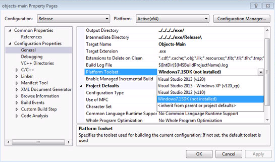

## 1.Introduction
This section is for users that wish to compile GCAM C++ source code into an executable. **Note most users can just use the Mac or Windows Release Packages provided in the GCAM release as most scenario modifications are done by changing XML input files.**  Users may need to re-compile the C++ source code for reasons such as:

* For use on general POSIX systems or a version of Mac or Windows for which the released binary was not compatible.
* To add new features or otherwise customize the model.

GCAM provides a generic [Makefile](#41-building-with-makefile) as well as [Xcode](#42-building-with-xcode) and [Visual Studio](#43-building-with-visual-studio) project files.  **Note** as of GCAM 4.4 compiling GCAM requires a C++ compiler with support for the C++ 14 language standard.  In addition, it relies on the following third party libraries.  Mac and Windows users should be able to use the libraries provided, otherwise see the section on [building third party libraries](#2-building-third-party-libraries).

* [Boost C++ Libraries](http://www.boost.org), details [here](#21-boost)
* [Rapid XML](http://rapidxml.sourceforge.net/index.htm), although typically installed via Boost.  More details [here](#22-rapid-xml)
* [Java](http://www.oracle.com/technetwork/java/index.html), required to write XML DB results.  See [below](#23-java) for more details.
* [Eigen](https://eigen.tuxfamily.org), provides linear algebra routines for solution.  See [below](#24-eigen) for more details.
* [Intel TBB](https://software.intel.com/content/www/us/en/develop/tools/oneapi/components/onetbb.html), provides algorithms and utilities for parallel processing.  See [below](#25-intel-tbb) for more details.

In addition users will have to download the [Hector submodule](#3-compiling-hector).

## 2. Building Third Party Libraries
This section details where to get and how to build the additional software required to re-compile and run GCAM.  In addition some notes beyond those provided by the source as it pertains to GCAM.  All of these required software are open source and/or available free of charge. **Note:** Mac and Windows binary packages (with the exception of Boost due to its large size) will already include these libraries and users only need to follow these instructions if they have a specific need to rebuild them.

Most of these libraries can also be installed through package managers:

|        | Homebrew (MacOS)                | Aptitude (Debian/Ubuntu)                                     |
|        | `brew install <package>`        | `sudo apt install <package>`                                 |
|--------|---------------------------------|--------------------------------------------------------------|
| Boost  | `boost`                         | `libboost-dev` `libboost-system-dev libboost-filesystem-dev` |
| Java   | (Cask) `brew cask install java` | `default-jre` `default-jdk`                                  |
| TBB    | `tbb`                           | `libtbb-dev`                                                 |


### 2.1 Boost
Boost includes many general purpose utilities for the C++ language and helps GCAM compile correctly across most platforms.  The library can be downloaded from [Boost](http://www.boost.org/users/download).  The version released with GCAM was 1.62 however any recent version should work.  GCAM now requires the header files and to build the `system` and `filesystem` libraries.  The Xcode and Visual Studio project files will expect boost to be located in `<GCAM Workspace>/libs` and where the folder unziped after downloading `boost_1_62_0` is either renamed or symlinked to `boost-lib`.  When building using the Makefile they can be located anywhere and are referenced by setting [an environment variable](#41-building-with-makefile).

#### 2.1.1 Building Boost Windows Notes
Users can look at [Boost documentation](http://www.boost.org/doc/libs/1_62_0/more/getting_started/windows.html#prepare-to-use-a-boost-library-binary) for building the needed libraries.  On Windows boost users will need to use the `Developer Command Prompt for VS20NN` (and they may need to run as Administrator) to ensure the C++ compiler can be found to build boost.  In addition they will need to ensure the libraries are built as 64-bit:

```
cd <GCAM Workspace>/libs/boost-lib
bootstrap.bat 
b2 --with-system --with-filesystem address-model=64 stage
```

#### 2.1.2 Building Boost Mac Notes
Users can look at [Boost documentation](http://www.boost.org/doc/libs/1_62_0/more/getting_started/unix-variants.html#prepare-to-use-a-boost-library-binary) for building the needed libraries.  Note for users who want to use [Xcode](#42-building-with-xcode) to build, the default project file setting is to use `libc++` instead of `libstdc++` so you should build boost accordingly. 

It is generally simplest to build using the command line by using the following commands:

```
cd <GCAM Workspace>/libs/boost-lib
./bootstrap.sh --with-libraries=system,filesystem
./b2 cxxflags="-stdlib=libc++" linkflags="-stdlib=libc++" stage
```

Note on the Mac the prefix seems to get ignored.  So users will want to change to relative path install names instead by using the following commands:

```
cd <GCAM Workspace>/libs/boost-lib/stage/lib
install_name_tool -id @rpath/libboost_system.dylib libboost_system.dylib
install_name_tool -id @rpath/libboost_filesystem.dylib libboost_filesystem.dylib
install_name_tool -change libboost_system.dylib @rpath/libboost_system.dylib libboost_filesystem.dylib
```

#### 2.1.3 Building Boost POSIX Notes
Users can look at [Boost documentation](http://www.boost.org/doc/libs/1_62_0/more/getting_started/unix-variants.html#prepare-to-use-a-boost-library-binary) for building the needed libraries.  Generally it will be something like:

```
cd <GCAM Workspace>/libs/boost-lib
./bootstrap.sh --with-libraries=system,filesystem --prefix=<GCAM Workspace>/libs/boost-lib/stage/lib
./b2 stage
```

### 2.2 Rapid XML
We use the Rapid XML parser for reading in XML, the format in which all GCAM inputs and configurations are specified in.  The library can be downloaded from [here](https://sourceforge.net/project/platformdownload.php?group_id=189621&sel_platform=1227).  However, we generally use the copy which is included as part of [Boost](http://boost.org/).

If for whatever reason you would prefer to use the standalone version you can set the preprocessor macro `USE_STANDALONE_RAPIDXML=1` and ensure the header files for that stand alone copy can be found in the include search paths of your compiler.

### 2.3 Java
Java is required by GCAM in order to store results in a [BaseX](http://basex.org) XML database, which itself is written in Java.  GCAM will use the Java Native Interface to interact with the database.  Since BaseX is written in Java it is inherently cross platform thus building it is not discussed here.  GCAM uses version 9.5.0 of the BaseX library, which is only supports Java 1.7+.  GCAM, therefore requires Java version 1.7 or newer.  The [official Oracle](http://www.oracle.com/technetwork/java/index.html) version or the [open source](http://openjdk.java.net) version should work **however** Oracle recently changed their licensing terms and it may not be free.  We therefore recommend the open source version.  Some additional notes:

#### 2.3.1 Disable Java
GCAM can be configured to compile without Java support, doing so implies GCAM results are not written to the BaseX database.  To disable Java edit `<GCAM Workspace>/cvs/objects/util/base/include/definitions.h` and set `__HAVE_JAVA__` to `0`:

```cpp
//! A flag which turns on or off the compilation of the XML database code.
#ifndef __HAVE_JAVA__
#define __HAVE_JAVA__ 0
#endif
```

Note that even if you turn off Java support you can still have GCAM generate the XML document that _would_ have been inserted into the database by editing `<GCAM Workspace>/cvs/objects/reporting/source/xml_db_outputter.cpp` and set `DEBUG_XML_DB` to `1`:

```cpp
// Whether to write a text file with the contents that are to be inserted
// into the XML database.
#define DEBUG_XML_DB 1
```

Which can subsequently be loaded into an XML database by using the [Model Interface](user-guide.html#modelinterface) by opening a database, choosing `File -> Manage DB`, then Click `Add`, finally select the `debug_db.xml` document to add to the database.  Note a _new_ database can be created by simply selecting an empty folder to open as a database (you will see a warning message about potentially deleting files **and you should pay attention to it**).

#### 2.3.2 Java On Windows
On Windows users can get by with just installing the Standard Runtime Environment (JRE) for running GCAM however when building the Java Development Kit (JDK) is recommended.  Note the openJDK only provides a zip archive and does not come with a windows installer, which isn't strictly necessary for it to work with GCAM however users may find the version distributed by [Redhat](https://developers.redhat.com/products/openjdk/download) easier because it does provide a Windows installer.  GCAM will expect the following header and lib files within `<GCAM Workspace>/libs`:

```
libs/java/include/jni.h
libs/java/include/win32/jni_md.h
libs/java/lib/jvm.lib
```

Which can be placed there by copying or symlinking:

```
C:\Program Files\Java\jdk1.8.0_102\include
C:\Program Files\Java\jdk1.8.0_102\lib
```

In addition the PATH variable may need to be updated so that GCAM can find the `jvm.dll`.  Note that this is the purpose of the `<GCAM Workspace>/exe/run-gcam.bat` wrapper.  Users can take a look at this file to understand how GCAM detects the JAVA_HOME and updates the PATH accordingly.

#### 2.3.3 Java on Mac
Note since GCAM now requires Java 1.7+ the old Apple supplied Java installation is no longer supported.  All versions of OS X can still use a more recent version of Java from Oracle/openJDK instead (**note** users must install the JDK, not the JRE).  Again we now recommend users install the openJDK version.  Note, openJDK only provides a zip archive, to install on the Mac a user may simply run in the Terminal:

```
tar -zxf openjdk-12.0.1_osx-x64_bin.tar.gz
sudo mv jdk-12.0.1.jdk /Library/Java/JavaVirtualMachines/
```

Even if users on OS X 10.10+ install the Oracle/openJDK version of Java they may still be prompted to install the old Apple JDK when running GCAM or the Model Interface.  Note the purpose of the `<GCAM Workspace>/exe/run-gcam.command` wrapper is partially to detect and work around some of these issues.  For users that are being asked to install the old Apple JDK even if the newer version is installed they can try the following edit to the Java JDK Info.plist file in Terminal to resolve the issue:

```
JAVA_HOME=$(/usr/libexec/java_home)
open $JAVA_HOME/../Info.plist
```

And add the following `JVMCapabilities`:

```
<dict>
    <key>JVMCapabilities</key>
    <array>
        <string>CommandLine</string>
        <string>JNI</string>
        <string>BundledApp</string>
    </array>
```

Users who want to use the Xcode build environment will need to set up in the `<GCAM Workspace>/libs` the `include` and `lib` directories.  Users will need to create the following symlinks:

```
cd <GCAM Workspace>/libs/java
JAVA_HOME=$(/usr/libexec/java_home)
ln -s ${JAVA_HOME}/include include
# Note the following works for Java 1.7/8
ln -s ${JAVA_HOME}/jre/lib/server lib
# The following is required for Java 9/10
# ln -s ${JAVA_HOME}/lib/server lib
```

#### 2.3.4 Java On POSIX
Please use the appropriate methods on your platform for installing Java.  Please see the [Compiling with Makefile](#41-building-with-makefile) for how to set environment variables so that your Java installation is found by GCAM.

#### 2.3.5 Third party Jar files used by the Model Interface
Users should copy into `<GCAM Workspace>/libs/jars` a copy of all of the third party libraries used by GCAM / the ModelInterface including the BaseX library.  You may obtain these from the Mac or Windows Release Package or from the [ModelInterface Releases on Github](https://github.com/JGCRI/modelinterface/releases).

#### 2.3.6 BaseX
BaseX is an XML database used for writing out comprehensive GCAM model output. Most users will be set-up for using BaseX by copying libraries
and model interface files from a distribution version of GCAM as discussed above. If for some reason you are downloading BaseX directly from the [BaseX web site](https://basex.org/download/)
note that the BaseX.jar library must be renamed exactly as `BaseX-9.5.0.jar`. 

### 2.4 Eigen
Eigen is used by GCAM to provide linear algebra algorithms, utilities, and data structures which are used during the solution process.  Eigen is a modern C++ template library which is header only.  In other words, users do not need to compile and install Eigen.  Instead they just need to download the `3.4` release "source code" from [the Eigen Git repo](https://gitlab.com/libeigen/eigen/-/archive/3.4.0/eigen-3.4.0.tar.gz) and copy it into their `libs/`, unzip, and rename / symlink the folder to be called just "eigen" (no version number).

### 2.5 Intel TBB
The Intel / OneAPI Thread Building Blocks (TBB) library is a collection of utilities and algorithms to facilitate parallel processing.  We rely on TBB to utilize multiple CPU/cores to speed up GCAM runs.  Users can download pre-built binaries for Windows, Mac, and select Linux distributions (and it can often be found in package managers such as those noted above).  The prebuilt binaries can be downloaded from [the Intel TBB Github repo](https://github.com/oneapi-src/oneTBB/releases).  You can unzip it into your `libs` directory and rename/symlink to just `tbb` (no version numbers). Note users can easily disable GCAM Parallel by editing `utils/base/include/definitions.h` and changing `GCAM_PARALLEL_ENABLED` from `1` to `0` or alternatively updating their build platform:
* Makefile: defining the environment variable `export USE_GCAM_PARALLEL=0`
* Xcode edit Build Settings -> Preprocessor Macros -> add `GCAM_PARALLEL_ENABLED=0`
* Visual edit Project -> objects-main Properties -> C/C++ -> Preprocessor -> Preprocessor Definitions -> add `GCAM_PARALLEL_ENABLED=0`


## 3 Compiling Hector
[Hector](hector.html) is the simple climate developed at JGCRI.  It is available from the hector project's [Github repository](https://github.com/JGCRI/hector).  

The GCAM Make / project files are expecting the hector source to be in `<GCAM Workspace>/cvs/objects/climate/source/hector`.  If you cloned the GCAM Git repository onto your local system, you can place hector into the appropriate location within the GCAM workspace by initializing it's submodule:

```
cd <GCAM Workspace>
git submodule init cvs/objects/climate/source/hector
git submodule update cvs/objects/climate/source/hector
```

We have also added a Make target to do that for you:

```
cd <GCAM Workspace>
make install_hector
```

If you have simply downloaded the standalone GCAM release `Source code` then you will have to go to Hector page on Git hub and download the branch [gcam-integration](https://github.com/JGCRI/hector/archive/gcam-integration.zip).  You can then unpack and move into place hector:

```
cd <GCAM Workspace>/cvs/objects/climate/source
unzip gcam-integration.zip
mv hector-gcam-integration hector
```

## 4 Compiling GCAM Source Code
Once users have gotten the additional third party libraries and hector installed they can proceed to compile the GCAM source code.  GCAM strives to use standard C++ capabilities where possible and use Boost to work around deficiencies otherwise. GCAM has been successfully compiled with GCC, Visual Studio, Clang, Intel, and Portland. That being said we only actively test GCC, Visual Studio, and Clang. In addition we provide a [Unix Makefile](#41-building-with-makefile), [Xcode project file](#42-building-with-xcode), and a [Visual Studo project file](#43-building-with-visual-studio) for compiling.

### 4.1 Building with Makefile
Users on POSIX systems can use the generic Makefiles to build GCAM on their system.  In addition Mac users who do not wish to install/use Xcode can also use these (they will still have to install the Apple Command line tools at a minimum).  Windows users have also had success using the Makefiles under cygwin however some modification was necessary and is beyond the scope of this document.

The core of the Makefile configuration is located under `<GCAM Workspace>/cvs/objects/build/linux/configure.gcam` however typically users simply set the following environment variables (with values set appropriately for their system):

```
export CXX=g++
export BOOST_INCLUDE=${HOME}/libs/boost-lib
export BOOST_LIB=${HOME}/libs/boost-lib/stage/lib
export JARS_LIB=${HOME}/libs/jars/*
export JAVA_INCLUDE=${JAVA_HOME}/include
export JAVA_LIB=${JAVA_HOME}/jre/lib/server
export EIGEN_INCLUDE=${HOME}/libs/eigen
export TBB_INCLUDE=${HOME}/libs/tbb/include
export TBB_LIB=${HOME}/libs/tbb/lib
```

(Note that unlike the other variables, `JARS_LIB` points to all of the jar _files_, **not** the jar _directory_, which is why the `*` wildcard is necessary. `JARS_LIB` may also be set to point to multiple different files by concatenating the paths, e.g. `export JARS_LIB=/path/to/BaseX-9.5.0.jar:/path/to/joost-0.9.1.jar:${HOME}/libs/jars/*`).

With these environment variables set a user can simple run:

```
cd <GCAM Workspace>/cvs/objects/build/linux
make gcam -j 8
```

Note the `-j 8` is simply to compile multiple sources files at a time (set as appropriate for your system configuration) and is only necessary to speed up the processes.  Once complete an executable will be copied to `<GCAM Workspace>/exe` and can be run from that directory with `gcam.exe -C config_file.xml`.

#### 4.1.1 Recommended configuration using Ubuntu 16.04
Assuming the libraries were installed via the `apt` package manager using a command like the following:

```
sudo apt install libboost-dev libboost-system-dev libboost-filesystem-dev default-jre default-jdk
```

...the following variables can be used:

```
USRLIB=/usr/lib/x86_64-linux-gnu

BOOST_LIB=${USRLIB}
BOOST_INCLUDE=/usr/include/boost

# For Hector, which uses different definitions
BOOSTLIB=${BOOST_LIB}
BOOSTROOT=${BOOST_INCLUDE}

JAVA_INCLUDE=/usr/lib/jvm/default-java/include
JAVA_LIB=/usr/lib/jvm/default-java/jre/lib/amd64/server
```

### 4.2 Building with Xcode
Mac users who would like to use the Xcode integrated development environment must have it installed (available from the Apple App Store), however a recent version with C++ 14 support is required.  Xcode version 8.1+ have been known to work.  Users can find the project file under `<GCAM Workspace>/cvs/objects/build/xcode3/objects.xcodeproj`. Once open you should change the `Scheme` to build the `Release` target.  You can find the scheme settings here:


Then under the `Info` tab change the build configuration to `Release`:


Finally select menu option `Product -> Build` to build GCAM.  Once complete an executable will be copied to `<GCAM Workspace>/exe` and you can still use `run-gcam.command` to run it.  Note that to run GCAM from within Xcode, you must set the working directory to the `exe` directory within your workspace. This is done within the `Options` section of the current scheme.

### 4.3 Building with Visual Studio
Users will need to have Microsoft Visual Studio C++ compiler installed (usually called for Windows Desktop).  Note that since GCAM 4.4 you will need a version which supports the C++ 14 standard.  Visual Studio 2015 is known to work.  Note Microsoft does provide a free option called ["Express"](https://visualstudio.microsoft.com/vs/express/).  Users can find the project file under `<GCAM Workspace>/cvs/objects/build/vc10/objects.vcxproj`.  Once open you should change the `Solution Configurations` and `Solution Platform` to `Release` and `x64`:


Also you will likely have to change the `Platform Toolset` under menu `Project -> objects-main Properties..` to the latest toolset installed with your Visual Studio.  Note that to run GCAM from within Visual Studio, you must also set the working directory to the `exe` directory within your workspace and update the [PATH environment variable to find jvm.dll](#232-java-on-windows). This is done within the same project properties dialog under the `Debugging` section and properties `Working Directory` and `Environment`.



Finally select menu option `Build -> Build Solution` to build GCAM.  Once complete an executable will be copied to `<GCAM Workspace>/exe` and you can still use `run-gcam.bat` to run it.

## 5 Recompiling Java Components
The Java components of GCAM `XMLDBDriver.jar` and `ModelInterface.jar` are included with the GCAM source code (in the Git repository or release package) and are inherently cross platform.  Users will not typically need to recompile these unless they need to apply bug fixes or feature updates.  In such a case simple Makefiles have been provided.  Note the [Java compiler](#23-java) is required.  In both cases users will need the `<GCAM Workspace>/libs/jars` which are included in both the Mac and Windows Release Package or from the [ModelInterface Releases on Github](https://github.com/JGCRI/modelinterface/releases).

### 5.1 Recompiling ModelInterface.jar
Users will need to set up the classpath and run the following.  Note that the ModelInterface is developed in it's [own Git repository](https://github.com/JGCRI/modelinterface) but GCAM contains a submodule reference pointing specifically to the version known to work with your version of GCAM.

```
export CLASSPATH=<GCAM Workspace>/libs/jars/\*
cd <GCAM Workspace>/output/modelInterface/
git submodule update --init modelinterface
cd modelinterface
make ModelInterface.jar
cp ModelInterface.jar ../
```

### 5.2 Recompiling XMLDBDriver.jar
Users will need to set up the classpath and run the following which will also copy it into the `exe` directory where GCAM will be expecting it.

```
export CLASSPATH=<GCAM Workspace>/libs/jars/*:<GCAM Workspace>/output/modelInterface/ModelInterface.jar
cd <GCAM Workspace>/cvs/objects/java/source
make clean
make install
```

### 6 Troubleshooting
Below we list some issues that you may encounter along with potential solutions.

* Build fails on a unix/MacOS system with an error:
   `ld: library not found for -lboost_system`
	
	You may have not complied the necessary boost libraries. See section above on compiling boost.

