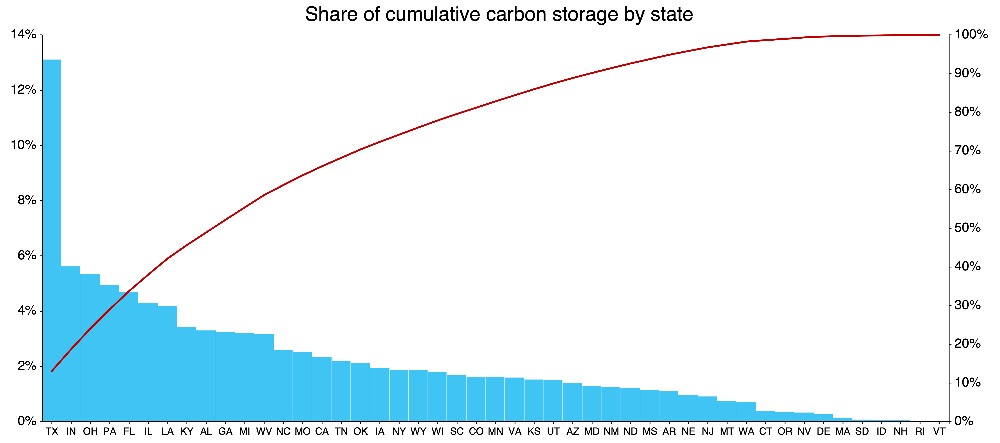

The Global Change Analysis Model (GCAM) and GCAM-USA
------------------------------------------------------

The GCAM model was expanded to include greater spatial detail in the USA region, referred to as GCAM-USA. In GCAM-USA the 50 U.S. states plus the District of Columbia (hereafter, the 51 states) are included as explicit regions that operate within the global GCAM model. Energy transformation (electricity generation and refined liquids production) and end-use demands (buildings, transportation, and industry) are modeled at the individual state level. Inter-state trade of all energy goods is considered, with state-specific consumer price mark-ups assigned for coal, natural gas, and refined liquids assigned based on price data from [EIA 2017b](gcam-usa.html#eia2017b).

Note that several aspects of the energy system are still modeled at the aggregate U.S. level. Most notably, this applies to primary production of fossil resources including oil, gas, and coal. The supply of biomass energy feedstocks, which include residues and dedicated energy crops, is modeled at the level of 22 water basins in the United States ([Calvin et al. 2019](gcam-usa.html#calvin2019), [Calvin et al. 2014](gcam-usa.html#calvin2014), [Wise et al. 2014](gcam-usa.html#wise2014)). As with the global model, biomass feedstocks are distinguished between those produced and consumed domestically and those traded in a global market.

Story-line for the GCAM-USA reference scenario 
==============================================

There are many ways in which the U.S. energy system might evolve over the coming decade, and any scenario will be a reflection of the storyline that supports it. The Reference scenario for the energy system modeled in GCAM-USA is intended to be a scenario with a reference set of assumptions to compare scenarios constructed with alternative assumptions. Broadly, our reference scenario is constructed with an underlying storyline that historical trends continue in the near term due to inertia in the system and continuation of current policies; however, in the long term, outcomes are largely driven by economic forces. This section describes the embedded assumptions in the storyline for our reference scenario for five key elements of the scenario: i.) Socioeconomics and energy demands, ii.) Electricity demand, iii.) Electricity supply,  iv.) Inter-state electricity trade, and v.) Refining. Further details about our assumptions for remaining sectors are presented in the following sections of this documentation. Alternative reference scenarios can be constructed by adjusting assumptions in the model. 

Socioeconomics and energy demands: Our Reference scenario assumes a growing U.S. economy and growing but gradually peaking population through the end of the century and, consequently, growing service demands in all end-use sectors. In addition, our scenario assumes a continuation of current energy efficiency policies (e.g. building efficiency standards). However, our scenario assumes increasing final energy demands due to growing service demands with no expansion or strengthening of efficiency policies. 

Electricity demand: Our scenario assumes growth in electricity demand over the coming century including a modest growth in electrification over the next decade due to increased electrification in industrial, buildings and transportation sectors. This departs from recently observed flat electricity demands.  Several causes have been put forward for flat electricity demand over recent years, including a reduction in industrial electricity demand due to structural changes, increasingly stringent and pervasive demand side policies (e.g. building efficiency and fuel economy standards), and simply economic forces driving the use of increasingly mainstream technologies that reduce energy demand. Whether this trend continues in the future will depend on continued assertiveness in applying and tightening of these policies. We assume no such policy expansion, nor increase in policy stringency, but rather allow economic forces to determine future outcomes to the extent possible. A scenario based on the assumption of continued policy expansion and increasing stringency could result in flatter or even declining electricity demands.

Electricity supply: Our reference scenario assumes increasing shares of natural gas and renewables to meet the growing demand for electricity. Our scenario includes state-specific assumptions about coal and nuclear retirements and state-specific assumptions about future hydro generation (that are exogenously specified) based on recent historical trends and best available information. It also includes a representation of the Clean Air Act Section 111 (b) New Source Performance Standards, NSPS [EPA 2015](gcam-usa.html#epa2015). The NSPS limits CO2 emissions from new steam-generating electricity generation units to 1400 lb CO2/MWh, and from new base load natural gas fired units to 1,000 or 1,030 lb CO2/MWh. We assume that coal-fired power plants without CCS do not meet these requirements and natural gas combined-cycle plants without CCS do. In addition, after the drop in natural gas prices in 2009 and low renewable technology costs, new investments in many states, including those that were traditionally coal-heavy, have been dominated by gas and renewables [EIA 2018a](gcam-usa.html#eia2018a). To reflect these recent developments in our reference scenario, we assume no new deployment of coal-fired power plants without CCS throughout the United States. In addition, our reference scenario assumes rather limited deployment of nuclear technologies, to reflect common understanding that the deployment of nuclear technologies is constrained by economic, institutional, and social factors including concerns regarding nuclear waste disposal, safety, and security. However, over the long term, we assume that nuclear technologies do get deployed in many states. Due to constraints on the deployment of coal and nuclear (and since generation from hydro is an exogenous assumption), new investments in our reference scenario are dominated by natural gas and renewables. Our reference scenario assumes that wind and solar technologies compete against gas technologies for share among new investments purely on the basis of relative costs by 2030. Likewise, biomass technologies compete for share purely on the basis of relative costs by 2100. Our assumptions about electricity generation fuel mixes are broadly consistent with other commonly available reference scenarios [EIA 2018b](gcam-usa.html#eia2018b). 

Inter-state electricity trade: Our reference scenario assumes that groups of states (which are combined into 15 "grid regions" to reflect electricity market and planning areas, and constructed consistent with the North American Electric Reliability Corporation regions) trade electricity freely between each other. This presumes that the necessary infrastructure already exists or would be built in the future.  Further, we assume that a grid region does not change between being a net importer and exporter over time. However, the magnitude of inter-regional trade across grid regions can change from historical levels as relative regional electricity prices change. For example, an importing grid region that sees a relative price increase due to demand growth, cost increase, or policy changes can import more from other regions. However, the relative ease or elasticity of expanding these imports in a region tightens as the share of imports increases relative to historical shares. In other words, an increasing differential in regional prices is required to expand trade, reflecting an increasing marginal cost of building and maintaining expanded trade.

Refining: Our reference scenario assumes expansion of relatively mature crude oil refining technologies and also relatively immature and nascent technologies such as biomass to liquids (BTL), coal to liquids (CTL), and gas to liquids (GTL) to meet growing demands for liquid fuels. Since oil refining is a mature technology with established supporting infrastructure, including facilities to bring in crude oil and institutional infrastructure such as licensing, our reference scenario assumes that any expansion takes place in the states that currently engage in oil refining and that the relative competitiveness of those states remains constant over time. Even though biomass to liquids (BTL) technologies are not as mature as those of oil refining, the deployment of BTL refineries has markededly increased in the recent past due to renewable fuel standards and the ease of transporting biomass resources. As such, BTL production is already distributed across the country in a way that captures the distribution of feedstocks for biomass refining. In our reference scenario, we assume that the current distribution of BTL production will remain largely static in the coming years, which in turn largely relies on the assumption that biomass production will occur in the same locations as today. For coal to liquids (CTL) and gas to liquids (GTL) technologies, our reference scenario assumes that states that produce more coal and gas resources are more likely to deploy CTL and GTL refineries. By extension, states without any coal and gas production are not expected to deploy CTL and GTL refineries. Hence, we assume that CTL and GTL refineries will be located close to the production of coal and gas resources. These assumptions are understandably conservative and ignore the possibility that new crude oil, coal, and gas resources might be discovered in the future, or that new types of bioenergy feedstocks could shift the geographic distribution of biofuel production. In addition, our assumptions also ignore the possibility that resources can be shipped from states with those resources to states without the resources and refineries to produce liquid fuels can be deployed in the latter states. For example, coal and gas are currently transported long distances for power production. Nevertheless, developing the required infrastructure to transport resources (e.g. gas pipelines) is an expensive and often protracted process, and hence our reference scenario assumes that only states with substantial resources are expected to refine coal and gas into liquid fuels. 

Water demand: Our reference scenario entails modest declines in water withdrawals through mid-century, with relatively flat water demands thereafter. The decline in demand is driven by a reduction in power sector cooling water, which is partially offset by increased withdrawals from the agriculture, livestock, manufacturing, and municipal sectors. These dynamics are in turn driven by assumptions for each individual water demand sector.
 
Irrigation, livestock, and primary energy (mining) water demands remain calculated at the USA regional level and are consistent with the global GCAM. For each sector, per-unit water requirements are held constant through the end of the century. Water demands for these sectors are downscaled to the state-level and then mapped to the basin-level based on aggregated grid-level demand data from [Huang et al. 2018](gcam-usa.html#huang2018) (see Water section of this page for more detailed information on the downscaling methodology). State-basin shares are held constant at their 2010 values for all future periods, implying that the historical distribution of these water demands remains constant over time.

Municipal water demands follow a similar structure to global GCAM, but are modeled at the state level and driven by state level socioeconomics. All states' withdrawal-to-consumption ratio improves at a constant technological change rate, consistent with the global GCAM. Manufacturing water demands are calculated from state level U.S. Energy Information Administration (EIA) data for industrial energy consumption for historical years. This is then matched with USGS water demand data to obtain state-specific water demand coefficients. These coefficients are held constant through the end of the century.

Electricity sector water demands evolve in a similar manner as global GCAM. Power plant cooling water demands respond to the growth in electricity demand and change in electricity mix discussed above. Additionally, we make four key assumptions about the future evolution of power plant cooling systems:
* Freshwater once-through cooling systems are not built in future model periods 
* For fuel type + power plant combinations that exist in historical periods, historical cooling shares inform the future competition between cooling systems
* If a fuel type (e.g. nuclear) shifts from one power plant type to another (e.g. nuclear gen II to nuclear gen III), future cooling system shares for the new plant type are informed by historical cooling system shares for the historical plant type
* If no historical information is available for a power plant type, all non-once-through cooling systems compete for market shares based on price alone
Overall, despite growing electricity demand, the assumption of no new freshwater once-through cooling systems, the shift towards less water-intensive generation technologies (e.g. natural gas, renewables), and the reduced reliance on more water-intensive technologies (e.g. coal, nuclear) result in diminishing power sector water demands in the GCAM-USA Reference scenario.

Water supply: Our reference scenario adopts the renewable and non-renewable water supplies that are calculated and implemented for all water basins in the USA region in the global GCAM. 

Interpretation of GCAM-USA results
==================================

The state-level results based on GCAM-USA need cautious interpretation. It is important to note that GCAM-USA is built within the GCAM framework, and thus decisions in GCAM-USA are made in the same way as the rest of the model. Since GCAM was originally developed for aggregate national to global scale analyses, applying the same decision-making frameworks at finer spatial resolutions could produce results that require careful consideration.

For example, the model produces monotonic results for state-level projections of energy demand in the end-use sectors. This is because service demands in these sectors are based on (i) either empirically grounded equations that define service demands in the sectors as continuous functions of population and economic growth (for the buildings and transportation sectors) or (ii) simple elasticities (for the industrial sector). The logit-share equation is then used to allocate various fuels to meet the service demands. 

In contrast, the decision-making frameworks employed in the model could result in non-monotonic state-level results for the electricity and refining sectors. In these sectors, smooth functions are used to retire existing capacity and the logit-share equation is then used to share out investments across technologies in terms of physical quantities (EJ) of energy produced (rather than capacity installed), resulting in generally smooth allocations. In reality, decisions at the state-level are discrete and often result in lumpy retirements and investments (e.g. a full coal facility would retire in reality; however, our smooth retirement functions could imply fractional retirements. Likewise, investments would occur in full power plants, while our the logit-share equation could imply investment in a fraction of a power plant). In addition, GCAM does not account for on-the-ground factors that affect technology deployment (e.g. land use restrictions and electricity transmission infrastructure) which further affect the ability of the model to make discrete decisions about investments in new capacity and the relative contribution of trade in meeting domestic demands. For instance, our modeling of inter-state trade assumes that states within a grid region can trade freely with each other and that the necessary infrastructure to facilitate such trade either exists already or can be built easily. This could result in more rapid shifts in electricity trade between states compared to what has been observed historically. Nevertheless, our framework produces monotonic results for these sectors at relatively aggregate spatial resolutions (e.g. grid regions or national level) for which the model offers a scientific, detailed, and bottom-up accounting framework.

Socio-economics
===============

State-level population and economic growth assumptions are based on historical values through 2018. Beyond 2018, we use population assumptions based on downscaled projections from the Shared Socioeconomic Pathways (SSP) database ([Jiang et al. 2018](gcam-usa.html#jiang2018); [Jones and O'Neill 2016](gcam-usa.html#jones2016)). Specifically, we use the downscaled SSP2 data. Future economic growth assumptions are developed by first harmonizing per capita GDP growth rates with assumptions made by the Energy Information Administration's National Energy Modeling System model in the Annual Energy Outlook 2019.

The justification to switch to the SSP2 dataset for our future population assumptions is two-fold. First, the future projections for all states look meaningful in the sense that they are monotonically increasing for most of the century; in some states, the trajectories peak and begin to decline in the second half of the century. Second, although the state-level projections are built up from downscaled SSP data, they are calibrated to historical (2015) state-level data. An important caveat of using this dataset is that we do not have internally consistent GDP projections or projections and consistent storylines for rest of the model (e.g. state-level income elasticities or technology). Nevertheless, these assumptions represent "middle-of-the-road" assumptions that are qualitatively consistent with assumptions made in the rest of the model.   

We utilize state-level population assumptions through 2018 to reflect historical population data from the U.S. Census Bureau. We then use state-level projections of population based on downscaled SSP2 data ([Jiang et al. 2018](gcam-usa.html#jiang2018); [Jones and O'Neill 2016](gcam-usa.html#jones2016)) to construct future population pathways. These projections are built up from downscaled SSP2 data (downscaled to 1/8 grid cells). The data includes population projections at the state-level (except D.C.) and run from 2010 to 2100 in 10 year time steps.  We use a simple approach to transition from historical trends to future projections (the latter being based on [Jiang et al. 2018](gcam-usa.html#jiang2018)). For all states, we match actual growth rates in population from 2010 to 2018. We then assume annual growth rates that transition linearly from historical growth rates to near-term growth rates through 2030. Beyond 2030, we apply growth rates according to the SSP2 data-set. 

For future labor productivity growth assumptions, we utilize per-capita GDP growth assumptions by US Census Division from AEO 2019 through 2050. As with population growth rates, we assume that labor productivity growth rates transition linearly from historical rates to near-term census division growth rates in 2030. From 2030 to 2050, we apply growth rates per AEO-2019, assuming uniform growth rates for all states within a census-region. Beyond 2050, we assume linearly interpolated growth rates from state-level 2050 values to the USA-region value in 2100, so that all states converge on a common labor productivity growth rate in 2100.  This acknowledges the fact that projecting state-level differences in labor productivity growth becomes more difficult/ arbitrary the further into the future these projections stretch.

Finally, the USA-region's population and labor productivity assumptions were updated to match the sum-of-states population and GDP when running GCAM-USA.  The result is that the USA region's population and GDP is different from assumptions in the core (32 region version), but is consistent with the sum-of-states population and GDP when GCAM-USA is run.

Developing a historical energy balance for model calibration
============================================================

The first step to modeling at the 51 state level was to create energy balances--that is, production and consumption of different forms of energy by each modeled sector, fuel, and state. These data were developed from 1971 to the final historical year of 2015, and applied in the model base years of 1975, 1990, 2005, 2010, and 2015. In the data processing of the state-level energy data, the aggregated national GCAM-USA energy balances (i.e., all states added together) must still be equal to the corresponding flows in the USA region of the global GCAM data set, which are derived from International Energy Agency (IEA) Energy Balances. With this in mind, we use proportional allocations to disaggregate the US-level quantity flows to the states, utilizing state level data sets from the US Energy Information Agency (EIA). The EIA SEDS (State Energy Data System) was used as the primary data set for this purpose ([EIA 2017a](gcam-usa.html#eia2017a)). The main steps of the data processing methods are described in the subsequent sections.

End-use sectors
===============

We begin by describing the process for developing the energy balances for final energy demands including the buildings, transportation, and industry sectors. Compared with energy transformation sectors, these are relatively simple because (as modeled) their outputs are considered final demands, not commodities traded across states (as opposed to energy transformation sectors whose outputs and inputs must be considered).

Additional processing to differentiate energy for specific buildings services required additional data sets and assumptions as described in [Zhou et al. 2013](gcam-usa.html#zhou2013). Each of up to 10 modeled energy services (e.g., space heating, space cooling, water heating, etc.) can be supplied by one or more technologies. Heating and cooling service demand depends on building envelope thermal efficiency, internal heat gains, and climate. Technology and building envelope efficiencies are assumed to increase over the century as described in [Zhou et al. 2014](gcam-usa.html#zhou2014).

As in the remainder of GCAM, the transportation sector in GCAM-USA is disaggregated to three final demands: passenger, domestic freight, and international shipping. The demand for each of these transportation services (indicated in passenger-km or tonne-km) depends on the base-year service demand levels, and the future growth in GDP and population by state. Each of the freight and passenger vehicle classes represent on-road vehicle options such as cars, trucks, and motorcycles, as well as off-road options such as trains, airplanes, and/or ships. For road modes, specific vehicle options include various size classes and drive train technologies differentiated by fuel type and/or efficiency levels, such as liquid fuels, hybrid drive trains, and battery electric propulsion. These assumptions are consistent with the transportation sector in the global GCAM model: [Energy System](energy.html#Transportation). The following mapping from the EIA SEDS is used in order to assign nation-level energy consumption and service demand levels by mode and fuel to the individual states.

**Table: EIA SEDS fuel and sector used to disaggregate nation-level energy consumption by mode and fuel to the states.**

| **Mode**           | **GCAM fuel**   | **EIA fuel used for disaggregation**              |
|:--------------------|:-----------------|:---------------------------------------------------|
| Air Domestic | refined liquids | Jet fuel in transportation |
| Air International | refined liquids | Jet fuel in transportation |
| Bus | gas | Natural gas in transportation |
| Bus | refined liquids | Distillate fuel oil in transportation |
| HSR | electricity | Electricity in transportation |
| LDV_2W | electricity | Electricity in transportation |
| LDV_2W | refined liquids | Motor gasoline in transportation |
| LDV_4W | electricity | Electricity in transportation |
| LDV_4W | gas | Motor gasoline in transportation |
| LDV_4W | hydrogen | Motor gasoline in transportation |
| LDV_4W | refined liquids | Motor gasoline in transportation |
| Rail | coal | Distillate fuel oil in transportation |
| Rail | electricity | Electricity in transportation |
| Rail | refined liquids | Distillate fuel oil in transportation |
| Ship Domestic | refined liquids | Residual fuel oil in transportation |
| Ship International | refined liquids | Residual fuel oil in transportation |
| Truck | refined liquids | Distillate fuel oil in transportation |
| Truck | gas | Distillate fuel oil in transportation |

Industrial energy allocations require more complicated processing steps, due to the refinery sector's energy use being included in the industry sector of SEDS, as well as the need to assign nation-level electricity co-generation at industrial facilities. The national estimates of cogeneration by fuel are from the IEA's Autoproducer CHP Plants, defined as facilities whose power production is primarily in support of activities that are on-site. No state-and fuel-level inventory of co-generation was available, so fuel consumption by the whole industrial sector is used to derive the state-wise proportional allocations of both the fuel inputs and electricity outputs to/from cogeneration.

As in the remainder of the model, cement and N fertilizer are modeled specifically by state, with the state-wise allocation of energy consumption and physical outputs based on the value of shipments of the corresponding NAICS code. Specifically, cement is disaggregated by the value of shipments from *3273: Cement and concrete product manufacturing*. Fertilizer is disaggregated by *3253: Pesticide, fertilizer, and other agricultural chemical mfg*. States with zero output from these industries in the historical years are assumed to remain that way in future years as well.

Electricity generation
======================

The electricity generation sector in GCAM-USA differs from the rest of GCAM in including representation of sub-annual load profiles, U.S. specific power sector technology cost assumptions, state-specific coal retirements, and state-specific nuclear retirements.

GCAM-USA includes the capability to model supply side dynamics related to the seasonal and diurnal variation of electricity demand by incorporating load duration curves (LDCs).  An LDC is obtained by ordering hourly load data in descending order of magnitude (rather than chronologically).  LDCs are useful constructs employed in energy systems models to incorporate intra-annual dynamics related to the time-varying character of the load. We represent LDCs at the level of the fifteen grid regions with each grid region having its own LDC. Each LDC is divided into four segments (baseload, intermediate, sub-peak, and peak load). The shape of the LDC in each grid region is determined by the share of loads and hours in each segment, which are given as inputs into the model; we assume that the shape of the LDC is uniform across grid regions and does not change with time. With this representation, we are able to capture two key dynamics observed in real-world power systems. First, some power plants are operated throughout the year while some others are operated only during peak hours because of economic trade-offs or resource availability. For example, coal and nuclear plants have high capital costs but low fuel costs whereas gas turbine plants have low capital costs but high fuel costs; hence gas turbine plants are usually operated only during peak hours while coal plants are typically operated throughout the year. In contrast, solar PV and CSP can generate only when the sun shines, which typically corresponds to the times of peak load, whereas there is typically more wind during the night when the load is lower, which could create incentives to store electricity. Thus, baseload power plants that are operated throughout the year not only serve the load during off-peak hours but also during peak hours. Second, during off-peak hours, electricity generation can be stored (for example, due to strong winds in during night times) and then sold back to the grid during peak hours. Grid-region specific assumptions about the shape of the LDC and dynamically changing shapes in response to stressors such as temperature changes are work in progress.

Next we describe creating the 51 state energy balance for the electric sector, starting with electricity generation. The EIA SEDS database represents hydrocarbon-fueled electricity only by fuel inputs to the electricity sector (EI in the SEDS database), with all other technologies represented only in terms of electricity output (EG). State-level thermal-electric efficiency is therefore not determinable from the data. As such, we apply the national average electric generation efficiency by fuel (calculated from the IEA energy balance data) to all states. Calibration of the state-level generation sectors corresponding to the load segments is a challenge because hourly data on generation by fuel does not exist (to the best of our knowledge). Hence, we first allocate generation by fuel to the generation segments by employing a heuristic approach based on the notion that total demand for electricity in each horizontal segment should equal the supply from each segment. Further, we calculate the share of each fuel in the generation segments at the grid region level and assume the same shares for all states within a grid region.

At this stage we have estimated total electricity generation from central production as well as CHP by state. Together these constitute the input to the GCAM "electricity net ownuse" sector, equal to total net generation, including electricity consumed on-site. The next step is to subtract each state's own use of electricity. Own use of electricity is disaggregated to states on the basis of the "Direct Use" by states in the EIA State Electricity Profiles for 2018 [EIA 2018c](gcam-usa.html#eia2018c). As with all other sectors, the GCAM USA region's total for electricity ownuse is disaggregated to states according to each state's share in the table cited above. By subtracting own use, we then have the output of the electricity\_net\_ownuse sector in each state, which is the net input into the electricity transmission and distribution grid.

Finally, we estimate electricity losses with in each state. EIA SEDS presents estimates of energy losses in transmission and distribution. The method for calculating the coefficient for electricity is to first add up all of the demands of electricity by all sectors: refining, electricity, buildings, industry, and transportation. Then the electricity T&D energy losses are added in, with the total of all the state estimates scaled to match the IEA's whole-US estimates of electricity distribution losses.

Technology cost and efficiency assumptions in GCAM-USA are the same as the global version of GCAM except for capital cost assumptions of coal, natural gas, nuclear, wind, PV, and CSP technologies. The assumptions for these technologies are reflective of up-to-date knowledge on cost trajectories. These assumptions are based on the Base Case scenario presented in the Energy CO2 Emissions Impacts of Clean Energy Technology Innovation and Policy report [DOE 2017](gcam-usa.html#doe2017) and are included in our reference scenario. In addition to updating capital costs, we also include the investment tax credit (ITC) and production tax credit (PTC) for certain generation technologies (see [Iyer et al. 2017](gcam-usa.html#iyer2017)). 

GCAM-USA includes state-specific assumptions for power sector coal retirements. We incorporate state-specific coal retirements by explicitly tracking coal vintages in 5-year vintage bins by state. Our coal retirement assumptions are developed on the basis of generator (or unit) level data from EIA's Form 860 and Form 923. We use retirement year information in the above data-sets along with exogenous assumptions about the lifetimes of units without retirement information to calculate capacity-weighted lifetimes by vintage bin and state. For units without retirement year information, we assume a maximum lifetime of 80 years from the year of operation. 

GCAM-USA includes state-specific retirement assumptions for existing nuclear power plants. We use data on plant-level generation and retirement obtained from various sources including planned retirement dates from the Nuclear Regulatory Commission (NRC). The plant-level data are aggregated to the state-level to develop state-level retirement functions.

Electricity Trade
=================

For electricity trade between states we group states roughly into the 15 "grid regions" consistent with the North American Electric Reliability Corporation regions. Whereby states within the same sub-region can trade freely within that sub-region, as previously described. Trade between grid regions is driven by economic competition and is calculated as gross trade volumes utilizing two specific datasets to determine, first, overall net trade ([EIA 2018c](gcam-usa.html#eia2018c)), and the trade between Power Control Areas (PCAs) [Chini et al. 2018](gcam-usa.html#chini2018) which are used to disaggregate net trade to gross imports and exports for each grid region.

Modeled electricity markets based on NEMS.

Refining sector
===============

In GCAM-USA, every state has separate sectors for oil refining, biomass to liquids (BTL), gas to liquids (GTL), and coal to liquids (CTL) that create logit-competition across specific technologies. The refining sector in the USA region then creates a logit-competition across states.

In the EIA's state-level data, refinery energy use is tracked under the industrial sector, with nothing to distinguish it from the remainder of the sector except that it is the only part of the industrial sector that consumes raw crude oil, which is a fuel commodity in SEDS. The amount of crude oil consumed by the industrial sector in the EIA database is therefore used as the basis for disaggregation of the national estimates for inputs and outputs of crude oil refining. We assume the same refinery input-output coefficients in all states (i.e., the same amounts of gas, electricity, and crude oil consumed per unit of refined liquids produced); therefore, given the amount of crude oil consumed as energy by the industrial sector (i.e., petroleum refineries) in each state, we can calculate the amount of electricity and gas consumed, and the amount of refined liquid products produced. The calculated amounts of gas and electricity that are inputs to refineries in each state are then deducted from the balance of the industrial sector's energy consumption.

For biomass liquids, the energy output (biofuel production) for the whole USA is disaggregated among states according to each state's share of production, using [EIA 2014](gcam-usa.html#eia2014) for biodiesel, and the SEDS inventory for ethanol production, which is estimated to scale with reported "biofuels energy losses and co-products." Note that the biofuel feedstocks (corn kernels, soybean oil) are considered as agricultural commodities (i.e., not as energy commodities), and as such are not modeled at the state level in GCAM-USA. The only EIA fuels considered as biomass are wood and waste, neither of which is modeled as feedstocks for liquid biofuels in the historical calibration years. However, the biofuel production processes are modeled as consumers of natural gas and electricity; these quantities are calculated from the state-level production volumes using exogenous input-output coefficients, and deducted from the balance of the industrial sector. 

Liquid fuels used as industrial feedstocks for the whole nation are then disaggregated to states on the basis of the sum of asphalt and petrochemical feedstocks consumption in each state. Natural gas used as feedstocks (i.e., used for non-energy purposes) is not explicitly accounted in the EIA SEDS database. This is not surprising as (a) unlike liquid fuels, there is nothing different about the natural gas used as feedstocks from that used for energy, and (b) the characterization of gas as "feedstock" as opposed to "energy" is a difficult one which is only done post-hoc based on product yields, and only in some energy inventories. Moreover, in many cases (e.g. ammonia production, hydrogen production), even the "feedstock" uses of natural gas entail 100% release of fuel carbon as CO2. In any case, the IEA-based national estimate of natural gas feedstocks is disaggregated to states on the basis of each state's share of the whole nation's use of (liquid fuel) petrochemical feedstocks, which are used as a proxy for the size of the chemicals industry in each state. This amount of gas is then deducted from the SEDS estimate of industrial energy use of gas in each state. Note also that most of the natural gas "feedstocks" in the US (estimated in the IEA Energy Balances) are for ammonia production; see [IEA 2009](gcam-usa.html#iea2009) for a description of the accounting methods. Because ammonia production is explicitly modeled, this national estimate of natural gas feedstocks in GCAM is considerably lower than the number in the IEA Energy Balances.

Renewable Energy
================

Renewable energy resources are modeled at the state level.  Renewable technologies include a separation between state-specific resource cost curves, which represent marginal costs that increase with deployment, plus technology capital costs that are the same in all states, but whose costs are levelized in the model with state-specific capacity factors. The escalation of the supply curve reflects reducing capacity factors as the most optimal locations are used first. Wind, utility-scale PV and CSP curves are developed from [Eurek et al. 2016](gcam-usa.html#eurek2016). Geothermal resources are from [Lopez et al. 2012](gcam-usa.html#lopez2012) and are currently held fixed  in the future with user ability to switch to endogenous geothermal future growth. Supply curves for residential rooftop PV are obtained from [Denholm and Margolis 2008](gcam-usa.html#denholm2008).  As in rest of GCAM, we model hydropower generation as an exogenous output. Our exogenous output assumptions are developed to i.) match state-level hydro outputs in 2015 to actual generation in 2015 and ii.) align long-term hydro generation with AEO-2020 projections. Specifically, we obtain 2020 state-level fixed outputs by applying growth rates to 2015 fixed outputs based on historical data from EIA. We then use national level hydropower generation projections from AEO-2020 [EIA 2020](gcam-usa.html#eia2020) and apply national growth-rates to all states for model years beyond 2020. Beyond 2050, we assume constant outputs through 2100.

Carbon-Dioxide Capture and Geologic Storage
===========================================

The depiction of the grid-region-specific graded CO2 transport storage cost curves reflect adjusted per-ton project costs for CO2 transport and geologic storage as based on the methodology developed by [Dahowski et al. 2011](gcam-usa.html#dahowski2011); [Dahowski et al. 2005](gcam-usa.html#dahowski2005); [Dahowski et al. 2010](gcam-usa.html#dahowski2010)). The costs shown in the figure include site characterization, capital and operations and maintenance costs associated with CO2 injection into suitable deep geologic reservoirs, and costs for required measurement, monitoring and verification technologies as well as other costs associated with regulatory compliance. These values do not include the cost of CO2 capture and compression to pipeline pressures, which are accounted for at the level of the technologies of emissions-producing activities that are equipped to perform CO2 capture. CO2 storage is aggregated to the same sub-regional markets as electricity to allow for some cross state border trade in CO2.

The region-specific CO2 transport and storage cost curves for the U.S. were developed using a cost-optimized source-sink matching algorithm designed to model globally optimal CCS deployment (again, less the cost of CO2 capture and compression) across the modeled domain. Each point on the resulting cost curves represents a single source-sink pair with a single average per-ton cost over the first 20-year time step of the analysis (see [Dahowski et al. 2005](gcam-usa.html#dahowski2005); [Dahowski et al. 2010](gcam-usa.html#dahowski2010) for the rationale for this 20-year time step and its significance for these CO2 transport and storage cost curves). Source-sink pairs were derived using both spatial and economic criteria based on a set of 2017 large anthropogenic CO2 point sources and 326 individual geologic storage reservoirs within the US ([Dahowski et al. 2011](gcam-usa.html#dahowski2011)). As shown in this earlier published research, the *average* per ton cost of CO2 transport and storage would increase in the future as the capacity of low cost, value-added geologic CO2 storage reservoirs are preferentially consumed ahead of non-value added geologic storage reservoirs. The cost-curves are implemented within GCAM-USA as exhaustible resources, so once low-cost storage sites are used, higher cost sites must be used.

In keeping with the US electricity-specific CCS modeling presented in [Wise et al. 2007](gcam-usa.html#wise2007), the CO2 transport and storage cost curves represented in this analysis have been adjusted to account for the fact that the cost of CO2 capture can vary by an order of magnitude for the different CO2 sources modeled to generate the raw region specific CO2 transport and storage cost (i.e., a natural gas processing plant generates a virtually pure stream of CO2 that can be captured - already dehydrated and compressed - for a cost of less than $10/tonCO2, while an older and relatively small pulverized coal plant could see capture costs well above $50/tonCO2) and which kinds of CO2 point sources get to access what kinds of geologic storage reservoirs is influenced strongly by the capture costs. Therefore, without the sort of adjustments performed, the raw region-specific CO2 transport and storage curves would present an unrealistically low representation of the net cost of CO2 transport and storage likely to be experienced by large stationary CO2 point sources like coal, natural gas, and biomass fired power plants and refineries, which are the anthropogenic CO2 sources that are modeled specifically in GCAM-USA.

Carbon storage potential by electricity market.

Direct Air Capture
===========================================

In GCAM-USA, the [same technological assumptions] (demand_energy.html#Direct-Air-Capture-for-Carbon-Dioxide-Removal) used for the 32 core regions have been applied to US states. The assumptions for the energy and financial inputs for DAC follow those from the global DAC technologies in the same SSP scenario ([Fuhrman et. al. 2021](https://iopscience.iop.org/article/10.1088/1748-9326/ac2db0)) (so users should use the same SSP files for global and GCAM-USA DAC add-ons).  These assumptions are applied to the 50 states and Washington, D.C. in GCAM-USA. The existing assumptions for energy and geologic carbon storage supply in each state and grid region further determine the relative attractiveness of a given state for DACCS deployment within GCAM (see figure below). 

 

Share of cumulative carbon storage potential by state. State-level DAC potential is positively correlated with the carbon storage potential. Carbon storage assumptions can be found in GCAM data system (gcam-usa/Dooley CCS USA.csv)

Water
===========================================

Water supplies and demands are modeled in GCAM-USA. Water market behavior that constrains the demand for water based on the available supply and price of water is implemented in GCAM-USA similar to the core GCAM model. Water supplies in GCAM-USA utilize the existing water supply structure from the core GCAM model, which is modeled at the 235 global basin scale. For the USA, water is supplied from 23 distinct water basins. Some of these basins are shared with neighboring regions, Canada, Mexico and the Caribbean. As in the core GCAM, three distinct sources of water are represented:  renewable surface runoff (including renewable groundwater), nonrenewable or fossil groundwater, and desalination.

Water demands in GCAM-USA are represented at the state-level for the electricity generation, manufacturing, and municipal sectors. For the primary energy/mining, livestock, and agriculture sectors - activities which are not repressented at the state-level in GCAM-USA - water demands are inherited from the national level or agriculture land units and then mapped to state-level shares.

## National Water Demand Drivers
For primary energy/mining, livestock, and agriculture (irrigation), which remain modeled at the aggregate USA level, water demands are disaggregated and downscaled (mapped) in two parts. First, the USA region (national) water demands are downscaled to state-level water demand, and second, these state-level water demands are mapped to the basin-level (where supplies and demands are balanced). National to state downscaling employ USGS historical water withdrawals in order to calibrate historical state level demands.

State-to-basin intersections in GCAM-USA allow for alternative sharing of water demands, from multiple states to a single basin and/or multiple basins to a single state. This secondary downscaling (mapping) process is completed for each sector in GCAM-USA using 0.5 x 0.5-degree gridded water demands from [Huang et al. 2018](gcam-usa.html#huang2018) to calculate the 5-year running mean of demands (weighted averages) at the state-basin intersection. State-basin shares are calculated from USA regional demands by finding the percentage of demands within basin i that correspond to state j from the historical [Huang et al. 2018](gcam-usa.html#huang2018) data. Thus, demands remain calculated at the USA region level and are shared to the state-basin level based on historical shares.

State-basin shares are held constant for future periods at their 2010 values, implying that historical bias or weighting remain constant. Although national water demands for primary energy/mining, livestock and agriculture have been merely downscaled to the state-level, the historical calibration of state-level water demands provides more detailed accounting of water demands. Additions and/or subtractions to alternative water supply costs at the state-level could differentiate water demands from the national demand representation (core GCAM).

## State Water Demand Drivers
Water demands from municipal, manufacturing, and electricity generation are modeled at the state level in GCAM-USA. USGS historical water withdrawal data is used to calibrate municipal and manufacturing sector water demands directly, while endogenous competition between cooling technologies exists in the electric power sector. For these sectors, state-level water demands only need to be mapped from state-to-basin level. The process is similar to the USA region downscaling, where the competition between basins in a state is pre-determined by the historical share of water demands as calculated by [Huang et al. 2018](gcam-usa.html#huang2018). There is also competition within coastal state-basin combinations for water from that particular basin or from desalination. This competition follows the structure of global GCAM. 

### Municipal
Future municipal water demands in GCAM-USA are driven by state-level population and GDP growth (see Socio-economics section for more information on how state-level socioeconomic drivers are developed for GCAM-USA).

### Manufacturing
Future manufacturing water demands in GCAM-USA are driven by growth in industrial activity at the state level, with state-specific water intensities calculated from USGS historical data.

### Electricity Generation
Electricity water demands in GCAM-USA utilize the recently introduced subsector nesting capability (node/leaf structure) that allows for more than two levels of nesting (subsector/technology). This allows all relevant costs (capital costs for both the power plant and cooling system, operations & maintenance costs) and inputs (fuel, water) to be applied to a single technology and avoids the need for a pass-through sector which is implemented in the global version of GCAM. Future water demands are determined endogenously; cooling system choice is influenced by the cost of providing cooling water (from surface runoff and groundwater recharge, nonrenewable groundwater, and desalinated water sources).

To calibrate cooling shares and water demands in the power sector, historical cooling system shares by fuel type and state are calculated from Union of Concerned Scientists (UCS) data on electricity generation by power plant, fuel, and cooling technology. Due to missing data, national averages of cooling technologies are often applied to states for various fuels and power plant types.  To avoid introducing the option of sea water cooling in non-coastal states, we calculate two different national averages of cooling technology shares: one for coastal states and one for non-coastal states. These national averages are then applied, as needed, to states with missing data. 

State-level technology share-weights, which influence the competition between cooling systems within a given generation technology (e.g. gas (CC) (once through) vs. gas (CC) (recirculating)) are assigned according to the following rules / assumptions:

* First, we assume that if the generation technology (e.g. gas CC) exists in the historical period for a given state, the cooling technology share weights are held constant in the future.
* Second, if a generation technology did not exist in the historical period for a given state but is expected to exist in the future (e.g. solar CSP), all available cooling technologies are assigned the same share weights.
* Third, if a fuel and generation technology combination did exist in the historical period, but switches to a new power plant type (i.e. Nuclear Gen II -> Nuclear Gen III), the cooling technologies shares for the old generation technology in that particular state are set as share weights for the new generation technology (e.g. Nuclear Gen 3 will have the same cooling tech share weights as Nuclear Gen 2).  
* Finally, consistent with the 32-region model, we assume that new fresh water once-through cooling systems are not allowed in the future.

This approach differs somewhat from the global GCAM, where future cooling shares are exogenously specified by region. Historically calibrated share-weights are not carried forward into the future in the global model. 

Non-CO2 GHGs
============
Note that at this time the specification of Non-CO2 greenhouse gases in GCAM-USA is incomplete.  This is an active area of development.  However for this reason the climate model will be disabled in GCAM-USA scenarios.

References
===============

<a name="calvin2014">[Calvin et al. 2014]</a> Calvin KV, MA Wise, GP Kyle, PL Patel, LE Clarke, and JA Edmonds. 2014. "Trade-offs of different land and bioenergy policies on the path to achieving climate targets." Climatic Change 123(3-4):691-704. doi:10.1007/s10584-013-0897-y

<a name="calvin2019">[Calvin et al. 2019]</a> Calvin, K., Patel, P., Clarke, L., Asrar, G., Bond-Lamberty, B., Cui, R. Y., Di Vittorio, A., Dorheim, K., Edmonds, J., Hartin, C., Hejazi, M., Horowitz, R., Iyer, G., Kyle, P., Kim, S., Link, R., McJeon, H., Smith, S. J., Snyder, A., Waldhoff, S., and Wise, M.: GCAM v5.1: representing the linkages between energy, water, land, climate, and economic systems, Geosci. Model Dev., 12, 677–698, <https://doi.org/10.5194/gmd-12-677-2019>, 2019.

<a name="chini2018">[Chini et al. 2018]</a> Chini, C. M., Djehdian, L. A., Lubega, W. N., & Stillwell, A. S. (2018). Virtual water transfers of the US electric grid. Nature Energy, 3(12), 1115-1123. <https://doi.org/10.1038/s41560-018-0266-1>, 2018

<a name="dahowski2005">[Dahowski et al. 2005]</a> Dahowski, R., Dooley, J., Davidson, C., Bachu, S., Gupta, N., 2005. Building the Cost Curves for CO2 Storage: North America. IEA Greenhouse Gas R&D Programme, Cheltenham, UK.

<a name="dahowski2011">[Dahowski et al. 2011]</a> Dahowski, R., Davidson, C., Dooley, J., 2011. Comparing large scale CCS deployment potential in the USA and China: A detailed analysis based on country-specific CO2 transport & storage cost curves. Energy Procedia 4, 2732-2739.

<a name="dahowski2010">[Dahowski et al. 2010]</a> Dahowski, R.T., Davidson, C.L., Li, X.C., Wei, N., 2012. A $70/tCO2 greenhouse gas mitigation backstop for China's industrial and electric power sectors: Insights from a comprehensive CCS cost curve. International Journal of Greenhouse Gas Control 11, 73-85.

<a name="denholm2008">[Denholm and Margolis 2008]</a> Denholm, P. and R. Margolis. 2008. Supply Curves for Rooftop Solar PV-Generated Electricity for the United States. National Renewable Energy Laboratory, Technical Report NREL / TP-6A0-44073, November 2008.

<a name="eurek2016">[Eurek et al. 2016]</a> Eurek, K, W Cole, D Bielen, N Blair, S Cohen, B Frew, J Ho, V Krishnan, T Mai, B Sigrin, D Steinberg. 2016. Regional Energy Deployment System (ReEDS) Model Documentation: Version 2016. <https://www.nrel.gov/docs/fy17osti/67067.pdf>

<a name="fuhrman2021">[Fuhrman et al. 2021]</a> Fuhrman J, Clarens A F, Calvin K, Doney S C, Edmonds J A, O'Rourke P, Patel P, Pradhan S, Shobe W M and McJeon H 2021. The role of direct air capture and negative emissions technologies in the shared socioeconomic pathways towards +1.5 °C and +2 °C futures Environ. Res. Lett. 16 114012 [Link](https://iopscience.iop.org/article/10.1088/1748-9326/ac2db0)

<a name="huang2018">[Huang et al. 2018]</a> Huang, Z., Hejazi, M., Li, X., Tang, Q., Leng, G., Liu, Y., Döll, P., Eisner, S., Gerten, D., Hanasaki, N. and Wada, Y., 2018. Reconstruction of global gridded monthly sectoral water withdrawals for 1971-2010 and analysis of their spatiotemporal patterns. Hydrology and Earth System Sciences Discussions, 22, pp.2117-2133.

<a name="iyer2017">[Iyer et al. 2017]</a> Iyer GC, LE Clarke, JA Edmonds, GP Kyle, CM Ledna, HC McJeon, and MA Wise. 2017. "GCAM-USA Analysis of U.S. Electric Power Sector Transitions." Pacific Northwest National Laboratory.

<a name="jiang2018">[Jiang et al. 2018]</a> Jiang L., H Zoraghein, B O'Neill. 2018. "Population projections for US states under the Shared Socioeconomic Pathways based on global gridded population projections." NCAR Technical Note NCAR/TN-542+STR, 49 pp, doi:10.5065/D6930RXZ.

<a name="jones2016">[Jones and O'Neill 2016]</a> Jones B., BC O'Neill. 2016. "Spatially explicit global population scenarios consistent with the Shared Socioeconomic Pathways." Environmental Research Letters 11. 084003.

<a name="iea2009">[IEA 2009]</a> International Energy Agency (IEA). 2009. Chemical and Petrochemical Sector - Potential of best practice technology and other measures for improving energy efficiency. <https://www.iea.org/publications/freepublications/publication/chemical_petrochemical_sector.pdf>

<a name="lopez2012">[Lopez et al. 2012]</a> Lopez A, B Roberts, D Heimiller (2012). U.S. Renewable Energy Technical Potentials: A GIS-Based Analysis. National Renewable Energy Laboratory, Technical Report NREL/TP-6A20-51946, July 2012

<a name="doe2017">[EIA 2014]</a> U.S. Department of Energy (DOE). 2017. Energy CO2 Emissions Impacts of Clean Energy Technology Innovation and Policy. <https://www.energy.gov/sites/prod/files/2017/01/f34/Energy%20CO2%20Emissions%20Impacts%20of%20Clean%20Energy%20Technology%20Innovation%20and%20Policy.pdf>

<a name="eia2014">[EIA 2014]</a> U.S. Energy Information Agency (EIA). 2014. Table 4. Biodiesel producers and production capacity by state in March 2014. <http://www.eia.gov/biofuels/biodiesel/production/table4.pdf>

<a name="eia2017a">[EIA 2017a]</a> U.S. Energy Information Agency (EIA 2017a) State Energy Data System.  All consumption estimates in Btu, 1960-2017. <https://www.eia.gov/state/seds/sep_use/total/csv/use_all_btu.csv>.

<a name="eia2017b">[EIA 2017b]</a> U.S. Energy Information Agency (EIA 2017b) Table E1. Primary Energy, Electricity, and Total Energy Price Estimates, 2017. <https://www.eia.gov/state/seds/data.php?incfile=/state/seds/sep_sum/html/sum_pr_tot.html&sid=US>

<a name="eia2018a">[EIA 2018a]</a> U.S. Energy Information Agency (EIA 2018a) Electricity Data Browser. <https://www.eia.gov/electricity/data/browser/> (2018).

<a name="eia2018b">[EIA 2018b]</a> U.S. Energy Information Agency (EIA 2018b) Annual Energy Outlook 2018 with projections to 2050. <https://www.eia.gov/outlooks/archive/aeo18/> (2018).

<a name="eia2018c">[EIA 2018c]</a> U.S. Energy Information Agency (EIA 2018c) State Electricity Profiles 2018 (<https://www.eia.gov/electricity/state/>).

<a name="eia2019">[EIA 2019]</a> U.S. Energy Information Agency (EIA 2019) Annual Energy Outlook 2019 with projections to 2050. <https://www.eia.gov/outlooks/archive/aeo19/> (2019).

<a name="eia2020">[EIA 2020]</a> U.S. Energy Information Agency (EIA 2020) Annual Energy Outlook 2020 with projections to 2050. <https://www.eia.gov/outlooks/aeo/> (2020).

<a name="epa2015">[EPA 2015]</a> U.S. Environmental Protection Agency. 2015. Standards of Performance for Greenhouse Gas Emissions from New, Modified, and Reconstructed Stationary Sources: Electric Utility Generating Units, 80 Federal Register 205 (23 October 2015) (40 CFR parts 60, 70, 71, and 98): 64513, 64546-64547, https://www.gpo.gov/fdsys/pkg/FR-2015-10-23/pdf/2015-22837.pdf (Accessed 16 December 2016).  

<a name="wise2007">[Wise et al. 2007]</a> Wise, M., Dooley, J., Dahowski, R., Davidson, C., 2007. Modeling the impacts of climate policy on the deployment of carbon dioxide capture and geologic storage across electric power regions in the United States. International Journal of Greenhouse Gas Control 1, 261-270.

<a name="wise2014">[Wise et al. 2014]</a> Wise MA, JJ Dooley, P Luckow, KV Calvin, and GP Kyle. 2014. "[Agriculture, Land Use, Energy and Carbon Emission Impacts of Global Biofuel Mandates to Mid-Century](http://dx.doi.org/10.1016/j.apenergy.2013.08.042)." Applied Energy 114:763-773. doi:10.1016/j.apenergy.2013.08.042

<a name="zhou2013">[Zhou et al. 2013]</a> Zhou Y, J Eom, and LE Clarke. 2013. "The effect of climate change, population distribution, and climate mitigation on building energy use in the U.S. and China." Climatic Change 119(3-4):979-992. doi:10.1007/s10584-013-0772-x

<a name="zhou2014">[Zhou et al. 2014]</a> Zhou Y, LE Clarke, J Eom, GP Kyle, PL Patel, SH Kim, JA Dirks, EA Jensen, Y Liu, JS Rice, LC Schmidt, and TE Seiple. 2014. "Modeling the effect of climate change on U.S. state-level buildings energy demands in an integrated assessment framework." Applied Energy 113:1077-1088. doi:10.1016/j.apenergy.2013.08.034

