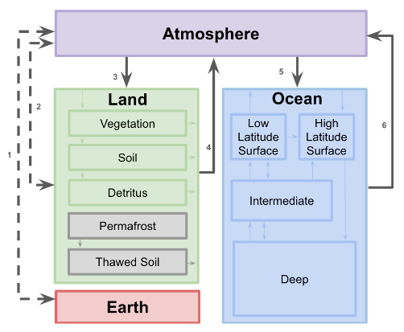

This section describes the new climate module - Hector - that is available for use in GCAM. MAGICC5.3 (Wiglley, 2008) has traditionally been the only climate module available in GCAM.  In GCAM's recent release, there is now the option to run Hector (Hartin et al., 2015).  Both Hector and MAGICC are reduced-form climate carbon-cycle models. 

Hector, an open-source, object-oriented, reduced-form global climate carbon-cycle model, is written in C++. This model runs essentially instantaneously while still representing the most critical global-scale earth system processes. Hector has a three-part main carbon cycle: a one-pool atmosphere, land, and ocean. The model’s terrestrial carbon cycle includes primary production and respiration fluxes, accommodating arbitrary geographic divisions into, e.g., ecological biomes or political units. Hector actively solves the inorganic carbon system in the surface ocean, directly calculating air– sea fluxes of carbon and ocean pH. Hector reproduces the global historical trends of atmospheric [CO<sub>2</sub>], radiative forcing, and surface temperatures. The model simulates all four Representative Concentration Pathways (RCPs) with equivalent rates of change of key variables over time compared to current observations, MAGICC, and models from CMIP5 (Hartin et al., 2015). Hector’s flexibility, open-source nature, and modular design facilitates a broad range of research in various areas. 

<br/>
Figure 1: Representation of Hector’s carbon cycle, land, atmosphere, and ocean. The atmosphere consists of one well-mixed box. The ocean consists of four boxes, with advection and water mass exchange simulating thermohaline circulation. At steady state, the high-latitude surface ocean takes up carbon from the atmosphere, while the low-latitude surface ocean off-gases carbon to the atmosphere. The land consists of a user-defined number of biomes or regions for vegetation, detritus and soil. At steady state the vegetation takes up carbon from the atmosphere while the detritus and soil release carbon back into the atmosphere. The earth pool is continually debited with each time step to act as a mass balance check on the carbon system. 
{: .fig}

## GCAM-Hector interactions
Currently the GCAM sectors interact with Hector via their emissions.  At every time step, emissions from GCAM are passed to Hector. Hector converts these emissions to concentrations when necessary, and calculates the associated radiative forcing, as well as the response of the climate system (e.g., temperature, carbon-fluxes, etc.)  

Table 1: Emissions and sources from each sector passed to Hector.  
{: .fig}

| Emission| Sector  | Notes |
| ------- |:-------:| :------: |
| CO<sub>2</sub>     | AgLU, Energy  | |
| CH<sub>4</sub>     | AgLU    | |
| N<sub>2</sub>O 	  | AgLU    | |
| NH<sub>4</sub>     | AgLU    | not included in Hector |
| SO<sub>2</sub>    | AgLU    | |
| CO 	  | AgLU    |         |
| BC      | AgLU, Energy    | |
| OC      | AgLU, Energy    ||
| NO<sub>x</sub> 	  | AgLU    | |


## Hector Outputs
At every time step Hector calculates and outputs key climate variables.  

<dl>
<dt>Atmosphere</dt>
<dd><ul>
	<li>Global mean temperature change</li> 
	<li>Radiative forcing of all emissions</li>
	<li>Atmospheric CO<sub>2</sub> concentrations.</li>
	</ul>
</dd>

<dt>Land</dt>
<dd><ul>
	<li>Air-land carbon fluxes</li>
	<li>NPP - net primary production</li>
	<li>RH - heterotrophic respiration</li>
	<li>Carbon pools (vegetation, detritus, soil)</li>
	</ul>
</dd>

<dt>Ocean</dt>
<dd><ul>
	<li>Air-sea carbon fluxes</li>
	<li>Carbon pools (high and low latitude surface, intermediate and deep)</li>
	<li>Carbonate system (DIC, pCO<sub>2 </sub>,
	CO<sub>3</sub><sup>2-</sup>, pH, aragonite and calcite
	saturations)</li>
	<li>surface ocean temperature</li>
	<li>oceanic heat flux</li>
	</ul>
</dd>
</dl>

## Getting and Installing Hector for Use with GCAM
This section describes step by step instructions for various platforms to build and link GCAM with Hector.  Users can set Hector as the climate model in GCAM instead of MAGICC.

Frst download Hctor from (Note that at the time of this writing only v1.1.2 has been tested): https://github.com/JGCRI/hector/releases

### Step-by-step guide

#### Building GCAM-Hector on XCode

1. Move or symlink the Hector workspace under the GCAM workspace under
   `cvs/objects/climate/source/hector`. Note that the name of the
   workspace that GCAM will be looking for will be “hector”.  If you
   wish to retain version numbering etc we recommend creating a
   symlink: 

```
	cd  cvs/objects/climate/source
	ln –s /path/to/your/hector-v1.1.2 hector
```	

2. Verify that both GCAM and hector successfully build independently.  If not you should consult the build instructions for each. [BuildHector](https://github.com/JGCRI/hector/wiki/BuildHector)

3. Open the GCAM project in Xcode.

4. Locate the “objects” project properties from the Project
   Navigator. Go to the Build Settings and find the Preprocessor
   Macros and add to whichever build configuration you need:  `USE_HECTOR=1`

5. Go to the Build Settings and find the Other Linker Flags and add to
   whichever build configuration you need: `-lgsl -lgslcblas -lm` 

6. Go to the Build Settings and find the Library Search Paths and add
   to whichever build configuration you need: `<path to gsl
   install>/lib` 

7. Go to the Build Settings and find the User Header Search Paths and
	add to it the following entry: `../../climate/source/hector/headers`

8. Go to the Build Settings and find the C++ Language Dialect and ensure that it is set to the following value from the drop down menu: `Compiler Default`

9. Go to the Build Settings and find the C++ Standard Library and ensure that it is set to the following value from the drop down menu: `libstdc++ `

10. Next add the Hector project to GCAM by right clicking on the
    “objects” project properties in the Project Navigator and select
    `Add to “objects”…`. Select the Hector project file which is
    located in
    `cvs/objects/climate/source/hector/project_files/Xcode/hector.xcodeproj` 

11. Under the “objects” project properties from the Project Navigator go to the Build Phases.
	Open the Target Dependencies and click the +.  In the dialog find “hector-lib” from under the “Hector” project.
	Open the Link Binary With Libraries and click the +.  In the dialog find “libhector-lib.a” from under the “Workspace” category.

12. Ensure that objects is your current build target and Xcode will now re-build Hector and GCAM as necessary and link them together.  The GCAM is still run the same as always and will control calling Hector (if configured via add-on files to use Hector instead of MAGICC).

#### Building GCAM-Hector on Visual Studio
1.  Move or symlink the Hector workspace under the GCAM workspace under `cvs/objects/climate/source/hector` Note that the name of the workspace that GCAM will be looking for will be “Hector”.  If you wish to retain version numbering etc we recommend creating a symlink:

```
	cd  cvs/objects/climate/source  
	mklink /D  hector c:/path/to/your/hector-v1.1.2
```

2. Verify that both GCAM and Hector successfully build independently.  If not you should consult the build instructions for each. [BuildHector](https://github.com/JGCRI/hector/wiki/BuildHector)

3. Open the GCAM project in Visual Studio.

4. Locate the “objects-main” project properties from the Solution
   Explorer. Go to the Configuration Properties –- C/C++ --
   Preprocessor and find the Preprocessor Definitions and add to
   whichever build configuration you need: `USE_HECTOR` 

5. Go to the Configuration Properties –- C/C++ -- General and find the Additional Include Directories and add to it the following entry: `..\..\climate\source\hector\headers`

6. Go to the Configuration Properties –- Linker -- General and find the Additional Library Directories and add to whichever build configuration you need: `<path to gsl install>/Release`

7. Go to the Configuration Properties –- Linker -- Input and find the Additional Dependencies and add to whichever build configuration you need: `gsl.lib`

8. Next add the Hector project to GCAM by right clicking on the
   “Solution” project properties in the Solution Explorer and select
   `Add -> Existing project…`. Select the Hector project file which is
   located in
   `cvs/objects/climate/source/hector/project_files/VS/hector-lib.vcxproj` 

9. Right click on “objects-main” from the Solution Explorer and select
   References. In the dialog click the button Add New References…  In
   the dialog check the “hector-lib” and click ok and ok again. 

10. Now you can build solution and GCAM and Hector will be re-built as necessary and link them together.  The GCAM is still run the same as always and will control calling Hector (if configured via add-on files to use Hector instead of MAGICC).

## References
1. Hartin, C. A., Patel, P., Schwarber, A., Link, R. P., and
   Bond-Lamberty, B. P.: A simple object-oriented and open-source
   model for scientific and policy analyses of the global climate
   system – Hector v1.0, Geosci. Model Dev., 8, 939-955,
   doi:10.5194/gmd-8-939-2015, 2015. [link](http://www.geosci-model-dev.net/8/939/2015/)  
2. Hartin, C. A., Bond-Lamberty, B., Patel, P., and Mundra, A.: Ocean
   acidification over the next three centuries using a simple global
   climate carbon-cycle model: projections and sensitivities,
   Biogeosciences, 13, 4329-4342,
   doi:10.5194/bg-13-4329-2016, 2016. [link](http://www.biogeosciences.net/13/4329/2016/bg-13-4329-2016.html)  
3. Wigley, T. M. (2008), MAGICC/SENGEN 5.3: User manual (version 2),
   edited, p. 80, NCAR, Boulder CO.  
4. [Hector wiki](https://github.com/JGCRI/hector/wiki)

