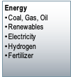
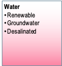
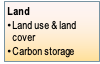

This documentation describes GCAM v6.0 ()

**GCAM diagram. Click on each box for a more detailed description of that element.**
<table>
<tr>
<td rowspan="4"> <b>Inputs</b>            </td>
<td>  </td>
<td> <b>Supply</b>        </td>
<td> </td>
<td rowspan="4"> <b>Outputs</b>                </td>
</tr>
<tr>
<td>   </td>
<td style="text-align: center; vertical-align: middle;" rowspan="2">  </td>
<td rowspan="2">   </td>
</tr>
<tr>
<td>   </td>
</tr>
<tr>
<td>  </td>
<td>  <b>Demand</b>         </td>
<td>   </td>
</tr>
</table>

 
A general overview of GCAM is also provided [here](overview.html).

### Earth System
[Hector](hector.html)

### Alternative regional configurations of GCAM

[GCAM-USA](gcam-usa.html)

### Running and modifying GCAM

Material on how to get started and use GCAM can be found on the following pages.

* [How to Get Started Running GCAM](user-guide.html)
* [How to Set Up and Build ](gcam-build.html)
* [GCAM Fusion Usage Guide](fusion.html)
* [GCAM Developer's Guide](dev-guide.html)
* [Modifying GCAM scenarios through policies](policies.html)
* [Examples](policies_examples.html)
	
GCAM is under continuing development. Information on how this version of GCAM differs from previous versions, along documentation for previous versions can be found on the following pages.

* [Updates from the Previous Release](updates.html)
* [GCAM-3](v3.2/toc.html)
* [GCAM-4.2](v4.2/toc.html)
* [GCAM-4.3](v4.3/toc.html)
* [GCAM-4.4](v4.4/toc.html)
* [GCAM-5.1](v5.1/toc.html)
* [GCAM-5.2](v5.2/toc.html)
* [GCAM-5.3](v5.3/toc.html)
* [GCAM-5.4](v5.4/toc.html)

