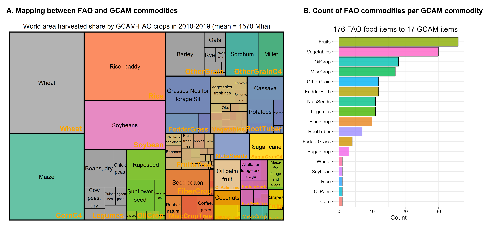
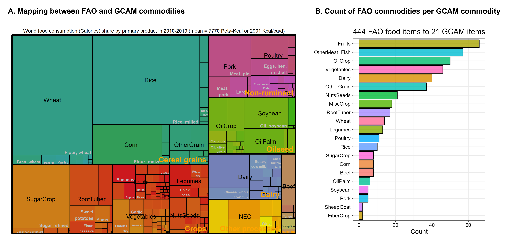
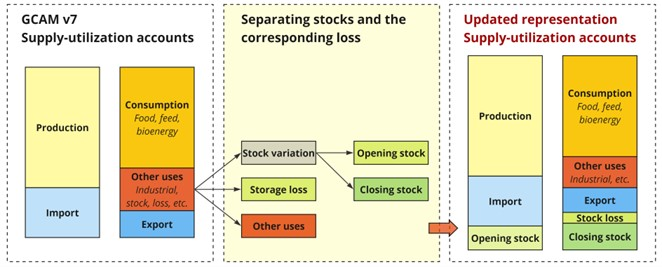

GCAM's supply inputs include information on production, prices, technology cost and performance, and other emissions in the historical period in order to calibrate model parameters. In addition, GCAM's supply modeling requires information on future technology cost and performance and emissions factors for future periods. GCAM requires that supply data is globally consistent with [demand data](inputs_demand.html) for each of its historical model periods as it solves for market equilibrium in these years as it does for future years. These inputs are required for each [region](common_assumptions.html#regional-resolution) and [historical year](common_assumptions.html#historical-years).

# Table of Contents

- [Energy](#energy)
- [Water](#water)
- [Food, Feed, and Forestry](#food-feed-and-forestry)

## External Inputs

### Energy

#### Description

**Table 1: External inputs used for supply of energy[1](#table_footnote1)**

| Name | Description | Type | Source | Resolution | Unit |
| :--- | :--- | :--- | :--- | :--- | :--- |
| Historical supply of energy | Supply of energy in the historical period; used for initialization/calibration of GCAM | External data | [IEA](#iea2023) | Specified by fuel, transformation sector, country, and year |  ktoe and GWh |
| CO2 capture rates | Fraction of CO2 captured in CCS technologies. | Assumption |  | Specified by technology and year | unitless |
| Retirement rules | For vintaged technologies, GCAM requires the user to specify the lifetime, and the parameters required for phased and profit-based shutdown. | Assumption |  | Specified by technology and year | Years (for lifetime), unitless for others |
| Logit exponents | GCAM requires the user to specify the logit exponents that determine the substitutability between technologies. | Assumption |  | Specified by sector and subsector | N/A |
| Share weight interpolation rules | These rules dictate how share weights (GCAM's calibration parameter) are specified in future years. | Assumption |  | Specified by subsector and technology | N/A |
| Cost of conversion technologies | Cost of production for conversion technologies | External data | Various | Specified by technology and year |  1975$/GJ |
| Capital cost | Overnight capital cost of electricity generation technologies | External data | Annual Technology Baseline (ATB) 2019 | Specified by technology and year |  1975$/kW |
| Fixed O&M costs | Fixed operating and maintenance (O&M) costs for electricity generation technologies | External data | Annual Technology Baseline (ATB) 2019 | Specified by technology and year |  1975$/kW/yr |
| Variable O&M costs | Variable operating and maintenance (O&M) costs for electricity generation technologies | External data | Annual Technology Baseline (ATB) 2019 | Specified by technology and year |  1975$/MWh |
| Capacity factor | Ratio of generation to capacity for electricity generation technologies | Assumption |  | Specified by technology and year |  Unitless |
| Capital tracking and investment parameters | Parameters used to derive sectoral capital and investment demand for energy supply and energy service technologies | Assumption | Various GCAM technology input files | Specified by sector, technology, and year | `capital.ratio`, `interest.rate`, `payback.years`, `invest.unit.conversion`, `tracking.market`, and `depreciation.rate` |
| Default efficiencies | Default amount of output produced per unit of input; can be overwritten by region-specific information derived from historical data | Assumption | | Specified by technology and year | GJ per GJ |
| Default input-output coefficients | Default amount of input required per unit of output produced; can be overwritten by region-specific information derived from historical data | Assumption | | Specified by technology and year |  GJ per GJ |
| Resource supply curves | Mapping between cost and resource extraction. Resource extraction is cumulative for deplatable resources and annual for renewable resources | External data | Various | Specified by resource and year |  EJ for extraction, 1975$/GJ for cost |
| Historical non-CO2 emissions | Historical emissions of non-CO2 | External data | [CEDS](https://github.com/JGCRI/CEDS) `v_2021_04_21` | Specified by country, technology, gas, and year | Various |
| CO2 emissions coefficients | Default carbon content of fuels | External data | [CDIAC](#cdiac2017) and [IEA](#iea2023)  | Specified by fuel | kgC / GJ |
| Historical CO2 emissions | Historical emissions of CO2 | External data | [CDIAC](#cdiac2017) | Specified by nation and year | ktC per year |

<a name="table_footnote1">1</a>: Note that this table differs from the one provided on the <a href="supply_energy.html#inputs-to-the-module">Energy Supply Modeling Page</a> in that it only lists external inputs to the supply module (either data sources or assumptions). Additionally, the units listed are the units of the raw inputs, rather than the units the GCAM requires.     

 

Note that for the Shared Socioeconomic Pathways (SSPs), different inputs are used for some variables. See [SSPs](ssp.html) for more information.

#### Data

Throughout GCAM, the number in the name of assumption file indicates to which sector the file applies. Files with `A10` through `A20` in the name are assumptions for resources. Files with `A21` and `A22` in the name are assumptions for refining and gas processing. Files with `A23` in the name are assumptions for electricity, `A24` is for heat, and `A25` is for hydrogen. Files with `A26` in the name are assumptions for transmission and distribution. Files with `A61` in the name are assumptions about carbon storage.

##### Historical supply of energy

GCAM uses IEA energy balances as a source for historical energy supply and demand. IEA data are proprietary and thus are not provided in the GCAM data repository. Instead, we provide all of the `R` code used to process the IEA data so that the user can replicate the processing _if_ they purchase the IEA data. In addition, we provide aggregated data after it has undergone processing so that GCAM input files can be created and used by the user community. 

##### CO2 capture rates

CO2 capture rates for refining are specified in [A22.globaltech_co2capture.csv](https://github.com/JGCRI/gcam-core/blob/master/input/gcamdata/inst/extdata/energy/A22.globaltech_co2capture.csv). Capture rates for electricity generation are specified in [A23.globaltech_co2capture.csv](https://github.com/JGCRI/gcam-core/blob/master/input/gcamdata/inst/extdata/energy/A23.globaltech_co2capture.csv); capture rates for hydrogen production are specified in [A25.globaltech_co2capture.csv](https://github.com/JGCRI/gcam-core/blob/master/input/gcamdata/inst/extdata/energy/A25.globaltech_co2capture.csv).

##### Retirement rules

Retirement rules are specified in [A22.globaltech_retirement.csv](https://github.com/JGCRI/gcam-core/blob/master/input/gcamdata/inst/extdata/energy/A22.globaltech_retirement.csv), [A23.globaltech_retirement.csv](https://github.com/JGCRI/gcam-core/blob/master/input/gcamdata/inst/extdata/energy/A23.globaltech_retirement.csv), [A25.globaltech_retirement.csv](https://github.com/JGCRI/gcam-core/blob/master/input/gcamdata/inst/extdata/energy/A25.globaltech_retirement.csv), and  [A10.ResSubresourceProdLifetime.csv](https://github.com/JGCRI/gcam-core/blob/master/input/gcamdata/inst/extdata/energy/A10.ResSubresourceProdLifetime.csv).

##### Logit exponents

Logit exponents are specified in [A21.sector.csv](https://github.com/JGCRI/gcam-core/blob/master/input/gcamdata/inst/extdata/energy/A21.sector.csv), [A21.subsector_logit.csv](https://github.com/JGCRI/gcam-core/blob/master/input/gcamdata/inst/extdata/energy/A21.subsector_logit.csv), 
[A22.sector.csv](https://github.com/JGCRI/gcam-core/blob/master/input/gcamdata/inst/extdata/energy/A22.sector.csv), [A22.subsector_logit.csv](https://github.com/JGCRI/gcam-core/blob/master/input/gcamdata/inst/extdata/energy/A22.subsector_logit.csv), 
[A23.sector.csv](https://github.com/JGCRI/gcam-core/blob/master/input/gcamdata/inst/extdata/energy/A23.sector.csv), 
[A23.subsector_logit.csv](https://github.com/JGCRI/gcam-core/blob/master/input/gcamdata/inst/extdata/energy/A23.subsector_logit.csv), [A24.sector.csv](https://github.com/JGCRI/gcam-core/blob/master/input/gcamdata/inst/extdata/energy/A24.sector.csv),  [A24.subsector_logit.csv](https://github.com/JGCRI/gcam-core/blob/master/input/gcamdata/inst/extdata/energy/A24.subsector_logit.csv), 
[A25.sector.csv](https://github.com/JGCRI/gcam-core/blob/master/input/gcamdata/inst/extdata/energy/A25.sector.csv),  [A25.subsector_logit.csv](https://github.com/JGCRI/gcam-core/blob/master/input/gcamdata/inst/extdata/energy/A25.subsector_logit.csv), [A26.sector.csv](https://github.com/JGCRI/gcam-core/blob/master/input/gcamdata/inst/extdata/energy/A26.sector.csv),   [A26.subsector_logit.csv](https://github.com/JGCRI/gcam-core/blob/master/input/gcamdata/inst/extdata/energy/A26.subsector_logit.csv),  [A61.subsector_logit.csv](https://github.com/JGCRI/gcam-core/blob/master/input/gcamdata/inst/extdata/energy/A61.subsector_logit.csv),  [A_ff_RegionalSector.csv](https://github.com/JGCRI/gcam-core/blob/master/input/gcamdata/inst/extdata/energy/A_ff_RegionalSector.csv), and [A_ff_RegionalSubsector.csv](https://github.com/JGCRI/gcam-core/blob/master/input/gcamdata/inst/extdata/energy/A_ff_RegionalSubsector.csv), and [A_ff_TradedSector.csv](https://github.com/JGCRI/gcam-core/blob/master/input/gcamdata/inst/extdata/energy/A_ff_TradedSector.csv). 

#### Share weight interpolation rules

Share weight interpolation rules are specified in [A21.subsector_shrwt.csv](https://github.com/JGCRI/gcam-core/blob/master/input/gcamdata/inst/extdata/energy/A21.subsector_shrwt.csv), [A21.subsector_interp.csv](https://github.com/JGCRI/gcam-core/blob/master/input/gcamdata/inst/extdata/energy/A21.subsector_interp.csv), 
[A21.tradedtech_shrwt.csv](https://github.com/JGCRI/gcam-core/blob/master/input/gcamdata/inst/extdata/energy/A21.tradedtech_shrwt.csv),
[A21.globaltech_shrwt.csv](https://github.com/JGCRI/gcam-core/blob/master/input/gcamdata/inst/extdata/energy/A21.globaltech_shrwt.csv), and
[A21.globaltech_interp.csv](https://github.com/JGCRI/gcam-core/blob/master/input/gcamdata/inst/extdata/energy/A21.globaltech_interp.csv). Similar files are defined for other sectors. For each sector, the file that ends `_interp` specifies the rule (e.g., fixed, linear) and the file that ends `_shrwt` indicates the value to interpolate to (if needed). Files that include `subsector` in the name define share weights at the subsector level, while `globaltech`, `tradedtech`, and `globaltranTech` indicate share weight information at the technology level.

##### Costs 

Costs of conversion technologies are specified in  [A21.globaltech_cost.csv](https://github.com/JGCRI/gcam-core/tree/master/input/gcamdata/inst/extdata/energy/A21.globaltech_cost.csv),  [A22.globaltech_cost.csv](https://github.com/JGCRI/gcam-core/tree/master/input/gcamdata/inst/extdata/energy/A22.globaltech_cost.csv),  [A24.globaltech_cost.csv](https://github.com/JGCRI/gcam-core/tree/master/input/gcamdata/inst/extdata/energy/A24.globaltech_cost.csv),  [A25.globaltech_cost.csv](https://github.com/JGCRI/gcam-core/tree/master/input/gcamdata/inst/extdata/energy/A25.globaltech_cost.csv),  
[A26.globaltech_cost.csv](https://github.com/JGCRI/gcam-core/tree/master/input/gcamdata/inst/extdata/energy/A26.globaltech_cost.csv), [A21.globalrsrctech_cost.csv](https://github.com/JGCRI/gcam-core/tree/master/input/gcamdata/inst/extdata/energy/A21.globalrsrctech_cost.csv), and [A61.globaltech_cost.csv](https://github.com/JGCRI/gcam-core/tree/master/input/gcamdata/inst/extdata/energy/A61.globaltech_cost.csv).

For electricity generation technologies, costs inputs are specified in [capital cost](https://github.com/JGCRI/gcam-core/blob/master/input/gcamdata/inst/extdata/energy/NREL_ATB_capital.csv), [fixed operating & maintenance costs](https://github.com/JGCRI/gcam-core/blob/master/input/gcamdata/inst/extdata/energy/NREL_ATB_OMfixed.csv), and [variable operating & maintenance cost](https://github.com/JGCRI/gcam-core/blob/master/input/gcamdata/inst/extdata/energy/NREL_ATB_OMvar.csv).

##### Capital tracking and investment parameters

In addition to levelized technology costs, GCAM tracks capital and investment information for energy supply and energy service technologies. These inputs are used to derive sectoral investment demand and to connect energy technologies to the macroeconomic savings-investment system. The relevant parameters include `capital.ratio`, `interest.rate`, `payback.years`, `invest.unit.conversion`, `tracking.market`, and `depreciation.rate`. These parameters are processed across multiple energy, industry, building, transport, and water-sector modules and support the calculation of investment demand in GCAM-Macro.

##### Default efficiencies
Efficiencies are specified in [A23.globaltech_eff.csv](https://github.com/JGCRI/gcam-core/blob/master/input/gcamdata/inst/extdata/energy/A23.globaltech_eff.csv), [A25.globaltech_eff.csv](https://github.com/JGCRI/gcam-core/blob/master/input/gcamdata/inst/extdata/energy/A25.globaltech_eff.csv), and [A26.globaltech_eff.csv](https://github.com/JGCRI/gcam-core/blob/master/input/gcamdata/inst/extdata/energy/A26.globaltech_eff.csv).

##### Default input-output coefficients

Coefficients are specified in [A21.globaltech_coef.csv](https://github.com/JGCRI/gcam-core/blob/master/input/gcamdata/inst/extdata/energy/A21.globaltech_coef.csv), [A22.globaltech_coef.csv](https://github.com/JGCRI/gcam-core/blob/master/input/gcamdata/inst/extdata/energy/A22.globaltech_coef.csv), 
[A24.globaltech_coef.csv](https://github.com/JGCRI/gcam-core/blob/master/input/gcamdata/inst/extdata/energy/A24.globaltech_coef.csv),
[A25.globaltech_coef.csv](https://github.com/JGCRI/gcam-core/blob/master/input/gcamdata/inst/extdata/energy/A25.globaltech_coef.csv),
[A21.globalrsrctech_coef.csv](https://github.com/JGCRI/gcam-core/blob/master/input/gcamdata/inst/extdata/energy/A21.globalrsrctech_coef.csv), and
[A61.globaltech_coef.csv](https://github.com/JGCRI/gcam-core/blob/master/input/gcamdata/inst/extdata/energy/A61.globaltech_coef.csv).

##### Resource supply curves

Resource supply curves are specified for [fossil fuels](https://github.com/JGCRI/gcam-core/blob/master/input/gcamdata/inst/extdata/energy/A11.fos_curves.csv), [uranium](https://github.com/JGCRI/gcam-core/blob/master/input/gcamdata/inst/extdata/energy/A12.U_curves.csv), [rooftop PV](https://github.com/JGCRI/gcam-core/blob/master/input/gcamdata/inst/extdata/energy/A15.roofPV_curves.csv),
[EGS](https://github.com/JGCRI/gcam-core/blob/master/input/gcamdata/inst/extdata/energy/A16.EGS_curves.csv), [geothermal](https://github.com/JGCRI/gcam-core/blob/master/input/gcamdata/inst/extdata/energy/A16.geo_curves.csv),
[municipal solid waste](https://github.com/JGCRI/gcam-core/blob/master/input/gcamdata/inst/extdata/energy/A13.MSW_curves.csv) ,
[traditional biomass](https://github.com/JGCRI/gcam-core/blob/master/input/gcamdata/inst/extdata/energy/A17.tradbio_curves.csv), 
[onshore wind](https://github.com/JGCRI/gcam-core/blob/master/input/gcamdata/inst/extdata/energy/NREL_onshore_energy.csv) and [offshore wind](https://github.com/JGCRI/gcam-core/blob/master/input/gcamdata/inst/extdata/energy/NREL_offshore_energy.csv).

##### Emissions 

Default carbon contents of fuels are specified in [A_PrimaryFuelCCoef.csv](https://github.com/JGCRI/gcam-core/blob/master/input/gcamdata/inst/extdata/emissions/A_PrimaryFuelCCoef.csv). Historical CO2 emissions are provided in [CDIAC_CO2_by_nation.csv](https://github.com/JGCRI/gcam-core/blob/master/input/gcamdata/inst/extdata/emissions/CDIAC_CO2_by_nation.csv).

Historical non-CO2 emissions information is provided in the GCAM release as "pre-built" data aggregated to GCAM regions, technologies, and fuels. Users that want to build using CEDS raw data, for example to build for different regional aggregations, will need to generate CEDS data using the open-source [CEDS system](https://github.com/JGCRI/CEDS) and place the resulting emissions data by country, fuel, and sector within the [CEDS folder](https://github.com/JGCRI/gcam-core/blob/master/input/gcamdata/inst/extdata/emissions/CEDS).

### Water

#### Description

**Table 2: External inputs used for supply of water [2](#table_footnote2)**

| Name | Description | Type | Source | Resolution | Unit |
| :--- | :--- | :--- | :--- | :--- | :--- |
| Surface water supply curves (cost and availability) | Xanthos derived total maximum runoff values, combined with accessible water calculation to determine water available at very low price and the level of accessible water for cost-curve inflection | Exogenous Data | Xanthos output | Water basin and year | $$km^3$$ available per USD |
| Groundwater supply curves (cost and availability) | Amount of groundwater available in each basin at increasingly high graded levels | [Niazi et al., 2025](#niazi2025); [Turner et al., 2019a](#turner2019a) | Water basin and year | $$km^3$$ available per USD |
| Desalination cost | Cost of desalinated water within a basin which is available at high cost and available once the price of water within a basin surpasses a certain threshold | Exogenous Data | Global Constant | USD per $$km^3$$ |

<a name="table_footnote2">2</a>: Note that this table differs from the one provided on the <a href="supply_water.html#inputs-to-the-module">Water Supply Modeling Page</a> in that it only lists external inputs to the supply module (either data sources or assumptions). Additionally, the units listed are the units of the raw inputs, rather than the units the GCAM requires.     

 

Note that for the Shared Socioeconomic Pathways (SSPs), different inputs are used for some variables. See [SSPs](ssp.html) for more information.

#### Data

#### Surface water supply curves
Surface water supply curves are based on runoff estimates from Xanthos, a detailed global hydrology model ([Liu et al. 2018](#liu2018); [Vernon et al. 2019](#vernon2019)). Xanthos accounts for surface and subsurface processes to compute runoff at 0.5° grid resolution. Global climate datasets are utilized in conjunction with Xanthos to determine historical annual average runoff aggregated for each basin ([Liu et al. 2018](#liu2018); [Turner et al., 2019a](#turner2019a); [Vernon et al. 2019](#vernon2019)). Of the total basin runoff, water available or accessible for human use takes into consideration requirements for ecosystem services, inaccessibility due to rapid flow and remote locations, and capacity of reservoir storage. Accessible fractions of total runoff vary across basins. Renewable water volumes up to the accessible fraction is available at nominal or low cost. Additional renewable water beyond the accessible fraction is available at a sharply higher cost to ensure availability of water for ecosystem services and to reflect capital investments necessary for reservoir expansion.
Basin level runoff is specified in [xanthos_basin_runoff.csv](https://github.com/JGCRI/gcam-core/blob/master/input/gcamdata/inst/extdata/water/xanthos_basin_runoff.csv). 
Accessible fraction is specified in [xanthos_accessible_water.csv](https://github.com/JGCRI/gcam-core/blob/master/input/gcamdata/inst/extdata/water/xanthos_accessible_water.csv).
For additional accessible calculations, basin historical basin level demands are specified in [basin_water_demand_1990_2015.csv](https://github.com/JGCRI/gcam-core/blob/master/input/gcamdata/inst/extdata/water/basin_water_demand_1990_2010.csv) and groundwater availability is specified in [groundwater_trend_watergap.csv](https://github.com/JGCRI/gcam-core/blob/master/input/gcamdata/inst/extdata/water/groundwater_trend_watergap.csv).

#### Groundwater supply curves
Non-renewable groundwater supply curves are modeled as a graded depletable resource with a fixed amount of total groundwater availability. Basin level estimates of environmentally exploitable groundwater are aggregated from grid-scale data ([Niazi et al., 2025](#niazi2025)). Groundwater supply curves represent the relationship between exploitable groundwater and cost of extraction [Niazi et al., 2024](#niazi2024);. As the available water within the initial grades is exhausted, the price for additional groundwater resources increases as a function of depth and geological complexity. Energy inputs and costs required for pumping are included for a rigorous estimate of the relationship between groundwater volume and extraction cost ([Turner et al., 2019a](#turner2019a); [Kim et al. 2016](#kim2016)).
Graded groundwater availability is specified in [groundwater_constrained.csv](https://github.com/JGCRI/gcam-core/blob/master/input/gcamdata/inst/extdata/water/groundwater_constrained.csv) with groundwater extraction trends found in [groundwater_trend_watergap.csv](https://github.com/JGCRI/gcam-core/blob/master/input/gcamdata/inst/extdata/water/groundwater_trend_watergap.csv) and [groundwater_trend_gleeson.csv](https://github.com/JGCRI/gcam-core/blob/master/input/gcamdata/inst/extdata/water/groundwater_trend_gleeson.csv).

#### Desalination costs
The costs of desalinated water reflects electrical energy input and capital and operational costs. Due to the high cost of desalination, desalinated water is only utilized when renewable and non-renewable water supplies are scarce and the cost of freshwater is high. Desalinated water representation is nested within the water distribution sectors where it competes with basin water supply from renewable and nonrenewable sources.

### Food, Feed, and Forestry

#### Description

**Table 3: External inputs used for supply of food, feed, and forestry [3](#table_footnote3)**

| Name | Description | Type | Source | Resolution | Unit |
| :--- | :--- | :--- | :--- | :--- | :--- |
| Historical country-level production of crops | Production of agricultural commodities by country in the historical period; used for initialization/calibration of GCAM | External data | FAO, `gcamdata-faostat` | Specified by crop, country, and year | tons |
| Historical country-level harvested area for crops | Harvested area for agricultural commodities by country in the historical period; used for initialization/calibration of GCAM | External data | FAO, `gcamdata-faostat` | Specified by crop, use, country, and year | ha |
| Historical sub-national production of crops | Production of agricultural commodities by water basin in a single year; used for initialization/calibration of GCAM | External data | <a href="https://github.com/JGCRI/moirai">moirai</a> | Specified by crop, country and basin | tons |
| Historical sub-national harvested area of crops | Harvested area of agricultural commodities by water basin in a single year; used for initialization/calibration of GCAM | External data | <a href="https://github.com/JGCRI/moirai">moirai</a> | Specified by crop, country and basin | ha |
| Historical production of livestock | Production of livestock commodities in the historical period; used for initialization/calibration of GCAM | External data | FAO, `gcamdata-faostat` | Specified by crop, use, country, and year | tons |
| Livestock feed coefficients | Livestock feed input, animal output, and meat output by systems | External data | IMAGE | Specified by commodity, feed system, IMAGE region and year | various |
| Historical cost of production | Historical cost of crop production in the USA | External data | USDA and GTAP cost shares | Specified by crop, type of cost, and year | various (e.g., $ per planted acre, $ per bushel) |
| Historical prices | Historical prices of agriculture and livestock commodities; used for initialization/calibration of GCAM | External data | FAO, `gcamdata-faostat` | Specified by country, commodity, and year |  |
| Agricultural capital stock | Historical capital stock used to construct agricultural capital inputs and investment tracking | External data | FAO, `gcamdata-faostat` | Country, agricultural sector, and year | Monetary value |
| Agricultural labor and capital inputs | Labor and capital data used to derive agricultural employment shares, capital stocks, wage rates, capital rental prices, and value-added components | External data | USDA, ILO, FAO, and GTAP-based sources | Country / region, sector, and year | Various |
| Agricultural labor and capital coefficients | Technology-level labor and capital coefficients for crop, livestock, and forestry production | Derived input | `gcamdata` processing | GCAM region, commodity, technology, management, and year | Input-output coefficients |
| Agricultural factor productivity | Productivity assumptions for land, labor, capital, water, fertilizer, livestock, and forestry inputs | Assumption / derived input | FAO-based land productivity assumptions and GCAM scenario inputs | GCAM region, commodity, input, and year | Productivity index |
| Agricultural capital tracking | Parameters and XML inputs used to derive agricultural investment demand | Derived input / assumption | `gcamdata` processing | GCAM region, sector, and year | Monetary value and capital-input coefficients |
| Agriculture productivity growth | Projected yields through 2050 for agricultural commodities | External data | FAO | Specified by country, commodity, and year |  |
| Logit exponents | Share parameters dictating substitution between different feed options for livestock | Assumption |  | Specified by type of livestock | unitless |
| Historical non-CO2 emissions | Historical emissions of non-CO2 | External data | [CEDS](https://github.com/JGCRI/CEDS) `v2024_07_08` | Specified by country, technology, gas, and year | Various |

<a name="table_footnote3">3</a>: Note that this table differs from the one provided on the <a href="supply_land.html#inputs-to-the-module">Land Supply Modeling Page</a> in that it only lists external inputs to the supply module (either data sources or assumptions). Additionally, the units listed are the units of the raw inputs, rather than the units the GCAM requires.     

 

Note that for the Shared Socioeconomic Pathways (SSPs), different inputs are used for some variables. See [SSPs](ssp.html) for more information.

#### Data

##### Historical production and harvested area

For both production and harvested area of crops, GCAM blends country level time series provided by the FAO with subnational information provided by [moirai](https://github.com/JGCRI/moirai) in a single year to determine historical production and harvested area for each [GCAM land region](common_assumptions.html#regional-resolution). FAO data is specified in [GCAMFAOSTAT_NonFodderProdArea.csv.gz](https://github.com/JGCRI/gcam-core/blob/master/input/gcamdata/inst/extdata/aglu/FAO/GCAMFAOSTAT_NonFodderProdArea.csv.gz) and [GCAMFAOSTAT_FodderProdArea.csv.gz](https://github.com/JGCRI/gcam-core/blob/master/input/gcamdata/inst/extdata/aglu/FAO/GCAMFAOSTAT_FodderProdArea.csv.gz). Moirai data is specified in [LDS_ag_prod_t.csv](https://github.com/JGCRI/gcam-core/blob/master/input/gcamdata/inst/extdata/aglu/LDS/LDS_ag_prod_t.csv) and [LDS_ag_HA_ha.csv](https://github.com/JGCRI/gcam-core/blob/master/input/gcamdata/inst/extdata/aglu/LDS/LDS_ag_HA_ha.csv). Livestock production is specified along with the supply utilization accounts in [GCAMFAOSTAT_SUA.csv.gz](https://github.com/JGCRI/gcam-core/blob/master/input/gcamdata/inst/extdata/aglu/FAO/GCAMFAOSTAT_SUA.csv.gz).

##### Livestock feed information

GCAM bases its historical livestock feed representation on the IMAGE model. GCAM utilizes information from IMAGE v3.1 on the [animal feed by system](https://github.com/JGCRI/gcam-core/blob/master/input/gcamdata/inst/extdata/aglu/IMAGE/IMAGE_an_feed_bySystem.csv), [animal head by system](https://github.com/JGCRI/gcam-core/blob/master/input/gcamdata/inst/extdata/aglu/IMAGE/IMAGE_an_head_bySystem.csv), and [animal meat production](https://github.com/JGCRI/gcam-core/blob/master/input/gcamdata/inst/extdata/aglu/IMAGE/IMAGE_an_meat.csv).

##### Ag productivity growth

GCAM captures yield changes from endogenous changes in fertilizer and irrigation management, while other non-climate drivers of agricultural productivity are specified exogenously. In recent GCAM versions, agricultural productivity processing has been restructured to support factor-specific productivity assumptions. Land productivity remains the main exogenous driver of crop yield improvements, however we also include factor-augmenting productivity inputs for non-land factors, including labor, capital, and other inputs. These inputs are processed through agricultural productivity modules such as [zaglu_L2083.ag_factor_productivity_scen.R](https://github.com/JGCRI/gcam-core/blob/master/input/gcamdata/R/zaglu_L2083.ag_factor_productivity_scen.R), [zaglu_xml_ag_land_prodchange_Scen.R](https://github.com/JGCRI/gcam-core/blob/master/input/gcamdata/R/zaglu_xml_ag_land_prodchange_Scen.R), and [zaglu_xml_ag_nonland_input_Scen.R](https://github.com/JGCRI/gcam-core/blob/master/input/gcamdata/R/zaglu_xml_ag_nonland_input_Scen.R).

##### Prices

GCAM uses producer prices to initialize the model (future prices are endogenous). Those prices are provided in [GCAMFAOSTAT_ProdPrice.csv.gz](https://github.com/JGCRI/gcam-core/blob/master/input/gcamdata/inst/extdata/aglu/FAO/GCAMFAOSTAT_ProdPrice.csv.gz).

##### Agricultural labor, capital, and capital tracking

GCAM explicitly represents labor and capital inputs in primary agricultural sectors. Agricultural labor and capital data are compiled from multiple sources, including FAO, USDA, ILO, and GTAP-based data, and are harmonized in `gcamdata` to derive regional and sectoral labor and capital inputs. FAO-based agricultural capital stock data are provided in [GCAMFAOSTAT_CapitalStock.csv](https://github.com/JGCRI/gcam-core/blob/master/input/gcamdata/inst/extdata/aglu/FAO/GCAMFAOSTAT_CapitalStock.csv), and USDA international agricultural productivity data are provided in [USDA_InternationAgProductivity_LaborCapital.csv](https://github.com/JGCRI/gcam-core/blob/master/input/gcamdata/inst/extdata/aglu/USDA/USDA_InternationAgProductivity_LaborCapital.csv).

These inputs are processed in [zaglu_L103.ag_labor_capital.R](https://github.com/JGCRI/gcam-core/blob/master/input/gcamdata/R/zaglu_L103.ag_labor_capital.R) and downscaled to agricultural technologies in [zaglu_L2082.ag_an_for_laborcapital.R](https://github.com/JGCRI/gcam-core/blob/master/input/gcamdata/R/zaglu_L2082.ag_an_for_laborcapital.R). The resulting labor and capital coefficients are written to agricultural input XMLs, including `ag_input_laborcapital_IRR_MGMT.xml`, and agricultural investment information is linked through `ag_capital_tracking.xml`.

This update separates labor and capital from the residual “other cost” category where possible. It also supports differentiation between more labor-intensive and more capital-intensive agricultural technologies, allowing changes in wages and capital rental prices to affect technology profitability and production choices in GCAM-Macro.

##### Cost of production

The costs associated with land, labor, capital, irrigation, and fertilizer are endogenously determined in GCAM (see [Land Supply](supply_land.html)). Other costs of production are exogenously specified and the data used for those costs in the USA were from [USDA_cost_data.csv](https://github.com/JGCRI/gcam-core/blob/master/input/gcamdata/inst/extdata/aglu/USDA/USDA_cost_data.csv). Additional assumptions based on GTAP cost shares were used to derive other cost for all regions and sectors.

##### Emissions 

Historical non-CO2 emissions information is provided in the GCAM release as "pre-built" data aggregated to GCAM regions, technologies, and fuels. Users that want to build using CEDS raw data, for example to build for different regional aggregations, will need to generate CEDS data using the open-source [CEDS system](https://github.com/JGCRI/CEDS) and place the resulting emissions data by country, fuel, and sector within the [CEDS folder](https://github.com/JGCRI/gcam-core/blob/master/input/gcamdata/inst/extdata/emissions/CEDS).

#### gcamfaostat

There has been a significant data method update for the GCAM AgLU (Agriculture and Land Use) sectors in GCAM v7, which is described in detail in [CMP #360](cmp/360-AgLU_data_and_methods.pdf). An additional package (`gcamfaostat`; [Zhao et al. 2024](https://joss.theoj.org/papers/10.21105/joss.06388)) is developed to facilitate the processing of data from FAOSTAT in a transparent, traceable, and consistent manner. This update encompasses the following key advancements:

1. Functions have been developed to automate the updating of AgLU data, primarily sourced from FAOSTAT. This automation facilitates future updates to advance the model's final historical period and allows for other data adjustments to be easily incorporated. Note that most of the data in the `aglu/FAO` folder are now generated by gcamdata-faostat.
2. The new update incorporates the compilation of FAO FBS (food balance sheet) and SUA (supply-utilization accounting) data. This integration enables the tracing of flows from land-based primary production to end uses, both in terms of food and non-food purposes. It provides a comprehensive understanding of the agricultural supply and demand.
3. New methods have been developed to generate "primary equivalent," which serves as a bridge between primary agricultural supply and final consumption. This calculation helps to bridge the gap between the production of agricultural commodities and their ultimate utilization in various forms.

The aggregation of agricultural data from FAO countries and commodities to GCAM regions and commodities are included in gcamdata. The commodity mapping is provided in [Mapping_SUA_PrimaryEquivalent.csv](https://github.com/JGCRI/gcam-core/blob/master/input/gcamdata/inst/extdata/aglu/FAO/Mapping_SUA_PrimaryEquivalent.csv) and shown in the following Figures for crop harvested area and food availability. 

 
Mapping between FAO and GCAM primary (land-based) commodities (A) and count of FAO commodities per GCAM commodity (B)
{: .fig}

 
Mapping between FAO and GCAM food commodities (A) and count of FAO commodities per GCAM commodity (B)
{: .fig}

In GCAM `v7.1`, leveraging the newly compiled SUA data, we separated opening stock, closing stock, and the corresponding storage loss.

 
Schematic of the restructuring of the supply-utilization accounts in GCAM to separate agricultural storage and the corresponding loss
{: .fig}

## References

<a name="cdiac2017">[CDIAC 2017]</a> Boden, T., and Andres, B. 2017, *National CO2 Emissions from Fossil-Fuel Burning, Cement Manufacture, and Gas Flaring: 1751-2014*, Carbon Dioxide Information Analysis Center, Oak Ridge National Laboratory. [Link](http://cdiac.ess-dive.lbl.gov/ftp/ndp030/nation.1751_2014.ems)

<a name="iea2023">[IEA 2023]</a> International Energy Agency, 2023, *Energy Balances of OECD Countries 1960-2022 and Energy Balances of Non-OECD Countries 1971-2022*, International Energy Agency, Paris, France. 

<a name="kim2016">[Kim et al. 2016]</a> Kim SK, Hejazi M, et al. (2016). *Balancing global water availability and use at basin scale in an integrated assessment model*. Climatic Change 136:217-231. [Link](http://link.springer.com/article/10.1007/s10584-016-1604-6/fulltext.html)

<a name="kyle2021">[Kyle et al. 2021]</a> Kyle, P., Hejazi, M., Kim, S., Patel, P., Graham, N., & Liu, Y. (2021). Assessing the future of global energy-for-water. Environmental Research Letters, 16(2), 024031.

<a name="liu2018">[Liu et al. 2018]</a> Liu Y., M. Hejazi, H. Li, X. Zhang, G. Leng (2018). *A  hydrological emulator for global applications - HE v1.0.0*. Geoscientific Model Development. [Link](https://www.geosci-model-dev.net/11/1077/2018/gmd-11-1077-2018.pdf)

<a name="niazi2024">[Niazi et al. 2024]</a> Niazi, H., Wild, T. B., Turner, S. W. D., Graham, N. T., Hejazi, M., Msangi, S., Kim, S., Lamontagne, J. R., & Zhao, M. 2024. Global peak water limit of future groundwater withdrawals. Nature Sustainability, 7(4), pp. 413–422. [Link](https://doi.org/10.1038/s41893-024-01306-w)

<a name="niazi2025">[Niazi et al. 2025]</a> Niazi, H., Ferencz, S. B., Graham, N. T., Yoon, J., Wild, T. B., Hejazi, M., Watson, D. J., and Vernon, C. R. 2025. Long-term hydro-economic analysis tool for evaluating global groundwater cost and supply: Superwell v1.1. Geoscientific Model Development, 18(5), pp. 1737-1767. [Link](https://doi.org/10.5194/gmd-18-1737-2025)

<a name="turner2019a">[Turner et al. 2019a]</a> Turner S.W.D., M. Hejazi, C. Yonkofski, S. Kim, P. Kyle (2019a). *Influence of groundwater extraction costs and resource depletion limits on simulated global nonrenewable water withdrawals over the 21st century*. Earth's Future (2019), 10.1029/2018EF001105  [Link](https://doi.org/10.1029/2018EF001105)

<a name="vernon2019">[Vernon 2019]</a> Vernon, C., M. Hejazi, S. Turner, Y. Liu, C. Braun, X. Li, and R. Link. *A Global Hydrologic Framework to Accelerate Scientific Discovery*. Journal of Open Research Software (2019). [Link](https://openresearchsoftware.metajnl.com/articles/10.5334/jors.245/)

<a name="Zhao2024">[Zhao 2024]</a> Zhao, Xin, Maksym Chepeliev, Pralit Patel, Marshall Wise, Katherine Calvin, Kanishka Narayan, and Chris Vernon. "gcamfaostat: An R package to prepare, process, and synthesize FAOSTAT data for global agroeconomic and multisector dynamic modeling." Journal of Open Source Software 9, no. 96 (2024): 6388.
