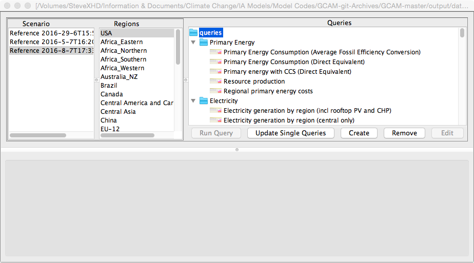

## 1.Introduction
This document provides information on running and using a pre-existing GCAM model set-up including a model executable. For instructions on compiling GCAM see [GCAM Compile Instructions](gcam-build.html).

This user's guide is divided into two parts. First a [GCAM "quickstart"](#GCAM_Quickstart) guide with basic instructions on running GCAM and viewing results, followed by a more detailed [GCAM User's Guide](#GCAM_Users_Guide).

## 2. <a name="GCAM_Quickstart">GCAM Quickstart</a>

This section provides a brief introduction on how to use the GCAM Model and view model data using the GCAM model interface. The instructions in this Quickstart guide should work with a GCAM distribution release that has been downloaded and uncompressed to your local machine.

### 2.1. Running a reference case scenario

GCAM requires a valid `configuration.xml` file be present in the exe directory of the GCAM workspace. You can run a reference scenario by copying the `configuration_ref.xml` that is provided in the distribution and renaming it to `configuration.xml`. Note that a `log_conf.xml` file is also necessary, but this should already be present in the exe directory. The configuration file is descried in more detail in the User's Guide, and should not need to be modified in order to run a reference case scenario. The User's Guide describes how to create additional scenarios.

In order to run GCAM double click on the executable or run the executable from the command line.  You should see log messages scroll up the screen as GCAM reads in xml files and begins solving each model period. Log information for each run can be found in `exe/logs/main_log.txt`.

**Check on the above for current model releases**

After a successful model run the log file will end with the following text (depending on your set-up and platform, you might also see this on your screen):

**Replace text below with more recent log output text and time**

```
Starting output to XML Database.
Data Readin, Model Run & Write Time: 1273.42 seconds. 
Model run completed.
Model exiting successfully.
```

Note that you may see the following error. 

This can safely be ignored. As long as you do not see additional error messages or warnings, you should now be able to view model output.

### 2.2 Viewing Model Results

Comprehensive model output from each scenario is stored in an XML database. (Note that the current BaseX database is not comparable with versions of GCAM and the GCAM model interface that use the .dbxml format.)

To view model output open the ModelInterface application. This multi-platform application is written in java and requires that java be installed on your machine. 

Select `Open` from the Model Interface File menu and then select `DB Open` from the sub-menu. The default setting is that the XML database is located in the `Output` subdirectory and is called `database_basexdb`. Select `database_basexdb` and you should see the following on your screen:

 <br/>
Figure UG-1:  Screenshot of GCAM ModelInterface after an XML database has been opened, but before any queries have been run.
{: .fig}

To view data select one or more scenarios, one or more regions, and one or more queries. The "Run Query" button will become available once one of each of these elements has been selected. Press this button and model output will appear as shown below:

 <br/>
Figure UG-2:  Screenshot of GCAM ModelInterface after a query has been run.
{: .fig}

A tabular data display will appear on the left and a simple graphical output will appear on the right. If multiple queries were selected, these will open in different tabs. 

*Sorting*: You can sort results in the Model Interface tables by clicking on the table heading. You can add secondary sorting by holding ctrl while click another column heading.

*Copying Data*: You can copy the table to Excel by selecting copy from the file menu and pasting it to a worksheet. Column labels will not copy. An output table can also be directly dragged to an Excel worksheet by clicking on the output tab and dragging to an open Excel worksheet. Graphs will not be copied, only data.

## 3. <a name="GCAM_Users_Guide">GCAM User's Guide</a>

This user's guide contains the following sections:

* [Configuration File](#Configuration_File)
* More to come...

### 3.1 <a name="Configuration_File"> Configuration File </a>

The configuration file directs the GCAM executable as to what files to read in and allows the user to set various runtime and output options. A configuration file must always be present for GCAM run. The configuration file is divided into following sections:

Config Section | Description
------------ | -------------
Files| Points GCAM to various core input and output file locations. The most common item in this block that might need to be changed is the `xmldb-location`. Changing this item allows the user to change the name and location of the output xml database.
ScenarioComponents | This is where GCAM reads in the data that define a scenario. Each entry has a name and a path that must point to a valid GCAM xml input file. Note that the name attribute of each ScenarioComponent is for readability only, these are not used by GCAM.
Strings | The primary component in this section that should be modified is the `scenarioName`, which should be a short descriptive name for the scenario.  
Bools | These boolean variables alter how GCAM runs and allow some alternative modes for GCAM operation.
Ints | These integer variables set various GCAM run and output options. 

#### 3.1.1 Scenario Components

The `configuration_ref.xml` file distributed with GCAM contains the list of input files that define the reference scenario for that GCAM release. Do not modify any of the original scenario component files. If you wish to make a change, make a copy of the file and modify the copy.

A common method of modifying a scenario is to add on additional components at the end of the list of scenario component files. Scenario components are read in order, and later data supersedes earlier data. A *climate policy*, for example, can be defined by adding a climate policy component. Examples of climate policy components can be found in the `input/policy` folder of the GCAM distribution.

For running multiple scenarios, Batch Mode (see below) is often more convenient.

#### 3.1.2 <a name="GCAM_Batch_mode"> GCAM Batch Mode </a>

If running multiple scenarios, GCAM can also be run in Batch mode, in which a batch input file contains user-specified sets of add-on components that can be used to define multiple scenarios, which will then will all be run. In order to run in batch mode the `BatchMode` bool(ean) setting in the configuration file must be set to 1, and a batch input file must be specified as `BatchFileName` under `<Files>`.

The Batch file has the following format:


    <BatchRunner>
    	<ComponentSet name="Policy scenarios">
    		<FileSet name="_set1">
    		</FileSet>
    		<FileSet name="_tax">
    			<Value name="ctax">../input/policy/carbon_tax.xml</Value>
    		</FileSet>
    	</ComponentSet>
    </BatchRunner>
   
The XML files within each FileSet block will be read in after the ScenarioComponents in the configuration file and then run. The scenario name of the run will be the name of each FileSet appended to the scenarioName in the configuration file.

If there are multiple ComponentSet blocks, then all permutations of FileSets within each ComponentSet will be run.

Note that there is also a batch functionality within the ModelInterface, which has a different format.

#### 3.1.3 `<Files>` Input Options

The following table summarizes the options available under the `<Files>` section of the configuration file. Note that for output files the `write-output` attribute is used to enable/disable output. The `append-scenario-name` attribute can be used to instruct GCAM to append the scenario name to the specified filename. See  `configuration_ref.xml` for examples.

File Tag | Description
------------ | -------------
xmlInputFileName | First XML file read in. In recent versions of GCAM this is used to readin the modeltime object, which sets the time intervals for GCAM. The modeltime object can only be read in once.
BatchFileName | Name of the [batch file input](#GCAM_Batch_mode). This will only be used if the `BatchMode` boolean is set to 1. 
policy-target-file | Policy target file (section to come). 
GHGInputFileName | Default input for GHG emissions time series. 
xmldb-location | Location and name of xml output database
xmlOutputFileName | Output xml filename. This xml file contains a complete input dataset that will replicate this scenario. Note that these files can be very large.
xmlDebugFileName | Name of debug output file. For the specified `debug-region` (see below), a set of internal state variables will be output at the end of each model period.
climatFileName | Name of the output file for GHG and pollutant emissions. This should not be changed under normal operation.
outFileName | csv formatted output 
costCurvesOutputFileName | Output for cost curves if `createCostCurve` is set to 1. 
batchCSVOutputFile | csv output of selected variables. This is useful during large batch runs where creating an xml database would result in excessively large files.
supplyDemandOutputFileName | Diagnostic output file with supply-demand curves 
dependencyGraphName | Output for sector dependency structure
landAllocatorGraphName | Output for land allocator structure 
ObjectSGMFileName | Legacy item - no longer used 
ObjectSGMGenFileName | Legacy item - no longer used 
dbFileName | Legacy item - no longer used 

#### 3.1.4 `<Strings>` Input Options

The following table summarizes the options available under the `<Strings>` section of the configuration file. These options should be strings, specified without quotes.

File Tag | Description
------------ | -------------
scenarioName | Name of the scenario. This name will be embedded in output xml data. For batch file operation this name is the prefix to the final file name.
debug-region | String that specifies which region is used for debuging output (see xmlDebugFileName), which provides a dump, by model period, of GCAM internal state variables which can be useful for debugging and understanding results.
MAGICC-input-dir | Input directory for necessary MAGICC input files. This normally should not be changed.
MAGICC-output-dir | Directory for MAGICC model output files.

#### 3.1.5 `<Bools>` Input Options

The following table summarizes the options available under the `<Bools>` section of the configuration file. These values should be specified as either 1 or 0.

File Tag | Description
------------ | -------------
CalibrationActive | Activates model calibration. Under normal operation this should be turned on.
BatchMode | Activages [GCAM batch mode](#GCAM_Batch_mode) operation. A valid `BatchFileName` must also be specified.
find-path | Turn on path finding capability (section not yet completed) 
createCostCurve | Turns on calculation of a CO2 cost curve. The model will be run multiple times to generate a CO2 cost curve, which will be integrated to estimate total policy costs. 
debugChecking | Turns on some internal consistency checks (not recently tested) 
simulActive | Activate simultunaety breaking (e.g. cycle breaking). This should be left on. 
PrintValuesOnGraphs | dot graph outputs will also contain prices. Not currently supported. 
ShowNullPaths | 
PrintPrices | 

#### 3.1.6 `<Ints>` Input Options

The following table summarizes the options available under the `<Ints>` section of the configuration file. These values should be specified as integers.

File Tag | Description
------------ | -------------
numMarketsToFindSD | Output diagnostic supply-demand curves for this many markets (**Worst, largest, ???**)
numPointsForSD | Number of poitns in diagnostic supply-demand curves.
numPointsForCO2CostCurve | Number of points to use in CO2 cost curve calcuation (if `createCostCurve` is turned on).
carbon-output-start-year | Starting year for carbon-cycle output in the XML database
climateOutputInterval | Output interval for climate data (concentrations, forcing, temperature, etc.) in the XML database
parallel-grain-size |
stop-period | ??? Set to -1 for no stop period.

### 3.2 <a name="ModelInterface_UG"> ModelInterface </a>

Section to be added
