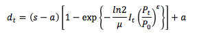
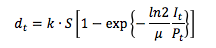
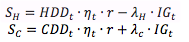
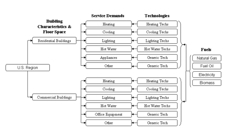

&lt;small&gt;[*This page is valid for GCAM 3.0 r4438. Click here for info on how to view a previous version.*](GCAM_Revision_History "wikilink")&lt;/small&gt;

The buildings final demand in each region is represented by two type: commercial and residential, each with three services: heating, cooling, and other. The service-based model for represents the change in building energy consumption as the expansion of building floorspace and of various energy services delivered to the floorspace. We have established the capability to relate changing climate to heating and cooling energy consumption in the sector.

Representing the Expansion of Building Floorspace
-------------------------------------------------

We employ a satiating function to describe the expansion of building floorspace. The idea is that per capita floorspace increases with per capita income but decreases with the energy service costs required to serve the floorspace. Yet, a continued increase in per capita income does not necessarily present a continued increase in per capita floorspace because there may be an inherent limit to its expansion. The expansion may be limited, for example, by climate conditions, population density, and other cultural idiosyncratic factors. Per capita demand for building floorspace in the satiation demand framework is given as follows:

where s is the level of satiation, mu is satiation impedance representing regional preference for building floorspace, epsilon is the price effect exponent (set to be negative), a is the calibration parameter (or subsistence level of floorspace, generally set to zero), P\_o is base-year energy cost required to serve the floorspace, P\_t is energy cost at time t, and I\_t is per capita GDP at time t. Note that the preference parameter mu is equivalent to the level of income that achieves half the satiation level of floorspace without any cost changes; and mu can be either exogenously provided or calibrated against base-year service demand, income, and the level of satiation—in the model, mu is calibrated internally, and s, a, and epsilon are provided as inputs.

Representing the Demands for Energy Services
--------------------------------------------

A reduced form of the satiating function used to describe floorspace was employed to drive energy services. The equation is given as follows:

where S is the level of demand satiation, mu is satiation impedance representing regional preference for the service under consideration, P\_t is service cost at time t, I\_t is per capita GDP at time t, and k is a calibration parameter. Satiation impedance helps define the degree of service penetration given a particular affordability of the service, or I\_t/P\_t. Given the affordability, the higher the level of satiation impedance for an energy service, the lower the level of delivered energy service. The satiation demand function gives not only the behavior of demand satiation, it also has a great advantage over a constant elasticity formulation in that it has built-in attenuation of income and price elasticities with the level of income. The level of demand satiation, S, requires a particular attention. For space heating and cooling services, the satiation levels are influenced by heating and cooling degree days, building characteristics, and the effect of internal gains, as represented by service per unit of floorspace. The satiation levels of heating and cooling services are given by:

where HDD and CDD are heating and cooling degree days \[day oC\] representing the annual requirement of space heating and cooling to achieve the specific, comfort-driven indoor temperature point (18oC); nu is shell conductance (or U-value) \[GJ/m2 day oC\] indicating the extent to which indoor temperature is susceptible to outdoor weather; and r is building floor-to-surface area ratio representing the size of building shell exposed to outdoor temperature. IG is the amount of building internal gains \[GJ/m2\], calculated endogenously in the model based on the demand for other building services such as lighting, and lambda H and lambda C are internal-gain scalars accounting for the potential mismatch of the time when space conditioning is required and the time when the internal gains are produced. For other services (e.g., cooking, water heating, lighting, and equipment), although the satiation levels may be to some extent responsive to heating degree days, they are largely dependent upon how many people might occupy the building. For simplicity, we assume that the satiation levels of other services do not change over time.

Heating and Cooling Degree Days
-------------------------------

The model by default runs without changing heating and cooling degree days over time. However, the model also allow for changing heating and cooling degree days, so that climate impact on building energy consumption may be evaluated. We provide an add-on for heating and cooling degree days that are consistent with SRES A2 scenario under the assumption of constant population distribution. We chose CCSM3 (Community Climate System Model Version 3) because, as indicated by Zhou et al. (2011), heating and cooling degree days based on CCSM3 generally situate in the middle of the three climate models they used. For base-year population distribution, gridded population database from IIASA database was employed. The methodology of estimating population-weighted heating and cooling degree days is detailed in Zhou et al. (2011). We found that heating degree days decrease and cooling degree days increase over the century although the rate of the change varies substantially between regions

Detailed U.S. Buildings Sector&lt;br&gt;
----------------------------------------

The U.S. buildings sector module, shown schematically in Figure 1 and detailed in Kyle et al. (2010), consists of a residential and commercial sector, each represented in terms of floorspace. These sectors demand a range of building services, such as heating and lighting. The demand for these services is driven by growth in floorspace, along with an exogenous demand expansion parameter used for services whose growth rate is expected to outpace that of floorspace, such as commercial office equipment. Growth in income (GDP) only affects the demand for the building services through its effect on floorspace. While the per-capita demand for floorspace does increase with per-capita income, this demand growth is assumed to attenuate over time in the residential sector due to effects of demand satiation. Heating and cooling demands are influenced as in the global buildings model. This allows for assessment of the effects on heating and cooling demand from improvements in building shell thermal characteristics, more efficient lighting, or increased computer use, for example.&lt;br&gt;

&lt;br&gt;

###### Figure 1. Schematic Representation of the U.S. Buildings Sector&lt;br&gt;

All technology efficiencies in reference and advanced technology scenarios are shown in Table 18, and non-energy costs are shown in Table 19. Base year energy consumption by technology is from the 2007 Annual Energy Outlook (EIA 2007), with lighting energy disaggregated to technologies according to NCI (2002). Near-term improvement rates are informed by EIA (2007) for heating, cooling, and water heating technologies. Improvement in office and other equipment is based on TIAX (2006). Solid-state lighting efficiencies in reference and advanced scenarios are based on NCI (2006). Long-term improvement rates were generally assumed to follow one of five technology advancement trajectories, based on the maturity of the technologies, and limited by physical constraints where applicable. Cost assumptions in GCAM are expressed in costs per unit of service delivered, and are developed based on assumptions of capital costs, O&amp;M costs, and capacity factors from NCI (2004) and Rosenquist et al. (2006). The reference scenario generally assumes modest long-term cost decreases, and in the advanced scenario, the costs of selected high-efficiency technologies are reduced substantially.&lt;br&gt;

&lt;br&gt;

GCAM carries along both reference and advanced technology representations to reflect uncertainty in potential future technology developments. The advanced technology suite is generally defined by higher improvement rates in selected technologies that are currently receiving research attention. For instance, the advanced technology suite has high-efficiency heat pump water heaters, but not high-efficiency oil water heaters. Note that GCAM does not explicitly model zero-energy buildings. The buildings sector may consume electricity produced by rooftop PV, but this electricity competes with grid-produced electricity on the basis of the relative economics. Note also that this analysis does not explicitly analyze solar water heaters, but heat pump water heaters modeled have comparable whole-system efficiencies, given that the solar component only reduces annual energy requirements by 40 to 80 percent (NREL 1999). Energy-free technologies such as day-lighting are also not explicitly modeled.

&lt;br&gt;Because of long building lifetimes and the age of the existing stock, as well as recent improvements in construction practices and likely further improvements in the future, residential shell efficiency is parameterized with a detailed stock model of all structures in the United States. The attributes of the existing stock are informed by the 2001 Residential Energy Consumption Survey (EIA 2001), and future improvement relative to the construction practices in 2005 for reference and advanced scenarios is informed by the BEopt program (NREL 2005). In summary, the shell efficiency of new construction improves from 2005 to 2095 by about 0.45 percent per year in the reference scenario, and by about 0.7 percent per year in the advanced scenario. The trajectory of shell efficiencies is set exogenously and does not vary by scenario; future scenarios may incorporate representations of building stocks that vary among scenarios and respond to energy prices.&lt;br&gt;&lt;br&gt;
