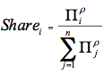
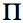

&lt;small&gt;[*This page is valid for GCAM 3.0 r3371. Click here for info on how to view a previous version.*](GCAM_Revision_History "wikilink")&lt;/small&gt;

Economic [land use](Agriculture,_Land-Use,_and_Bioenergy "wikilink") decisions in GCAM are based on a logit model of sharing based on relative inherent profitability of using land for competing purposes. The interpretation of this sharing system is that there is a distribution of profit behind each competing land use within a region, rather than a single point value. Each competing land use option has a potential average profit over its entire distribution. The share of land allocated to any given use is based on the probability that that use has a highest profit among the competing uses. The relative potential average profits are used in the logit formulation, where an option with a higher average profit will get a higher share than one with a lower average profit. However, at the margin, the profits of competing options are equal. In essence, the sharing can therefore be considered optimal, but the assumption of a distribution of profits makes it very different from a constrained linear optimization approach.

Example Competition
-------------------

Figure 1 below shows a competition between two options with distributions of profits. In this example, option 2 will get a higher share than 1 due to its higher potential average profit. Sharing will be done between option 1 and option 2 in order to allocate all land to one of the two options so that the marginal profit rates of option 1 and option 2 are equal to each other. At this point, there are no potential gains from changing the shares. Also from Figure 1, this point at which marginal profits are equal must also be equal to the marginal value or price of land. Only those instances of option 1 and option 2 which have profit rates higher than or equal to the land price at the margin will be implemented.

&lt;br&gt;

###### Figure 1: Example competition between two options with distributions of potential profit

Also note that, since land value, price, or rent is equivalent to the profit that would be earned from using this land, there is not one price for land in each region. Instead, the distribution in profit rates per unit of land in Figure 1 is equivalent to a distribution of land prices over that region. There is a land price at the margin which is equal at the marginal point for each competing option, but the rest of the distribution of land prices that are realized will be higher than this margin. In other words, land at the margin will have a lower price than the better quality land.

&lt;br&gt;

Land Competition Compared to Energy System Competition
------------------------------------------------------

This logit competition appears similar to our modeling of relative-cost based sharing of technologies in the [GCAM energy system](The_Energy_System "wikilink"), but it differs in two very important ways. First, here it is based on profit, so exponents are positive, and second, the average profit equations developed by John Clarke and Jae Edmonds &lt;ref&gt;Clarke, J. F. and J. Edmonds (1993). "Modeling Energy Technologies in a Competitive Market." Energy Economics 15(2): 123-129.&lt;/ref&gt;&nbsp;are used rather than a straight weighted average of profits. With the Clarke/Edmonds approach, we avoid the situation where the weighted average profit is not monotonic in the individual profits. For example, if a simple weighted average is used to compute profit, then if the profit of the least profitable technology is increased, while all other profits are kept constant, the weighted average profit can decrease. This phenomenon is because the share of the least profitable technology will increase as its profit increases, dragging the average profit downward.

&lt;br&gt;

The Clarke and Edmonds average profit formula is a literal interpretation within the logit modeling that all investments are made up to the point at which marginal profits are equal to the price. As a result, investments are skewed to the more profitable side of the distributions. Thus, the average profit across competing options will be higher than the average profit of any of the individual options.

&lt;br&gt;

One concern with the logit approach used in AgLU is that adding more options to the competition will increase the resulting average profit. In essence, each technology gives you another roll of the dice to get a higher profit. This potential problem is mitigated through our calibration routine, which will be explained in more detail in a later section. Some care, however, does have to be given when we add new competing options that are not part of the calibration data set.

&lt;br&gt;

Land Nesting Equations
----------------------

In GCAM, competing uses of land are nested within land nodes. Within each land node, it is generally assumed to be easier to substitute products, so logit exponents are higher to indicate tighter competition. Examples include switching food crops from one to another and converting forests from unmanaged categories to logging forests. Substitution across land nodes is also allowed but is assumed to be more difficult than within land nodes. We implement this philosophy by setting lower logit exponents via input data. For example, the expansion of cropland into pasture is more difficult than expansion of wheat land into corn land.

&lt;br&gt;

The logit sharing equation for land uses across an assumed level of competition, whether leaves in a node or among nodes in a nest, is shown here. &nbsp; &nbsp;&nbsp;

where &nbsp;is the profit rate of option i and p is the logit exponent.

&lt;br&gt;

The average profit rate for a node resulting from the share competition in each nest is given by 

&lt;br&gt; These formulas apply at each level of competition in a nest, up to the top node.&nbsp;Note again the difference in interpretation between the average profit rates used in the logit equation from marginal profits. These average profit rates, as will be clarified in the discussion of calibration, are the potential average profit rates across the entire distribution of profit rates per penetration rates for each option. These average profits are unrealized but instead inferred from the calibration and the base year shares. Although relative average profit rates are used in the logit sharing equations, the theory behind the math is that land shares are determined so the land is allocated across uses up until the point at which the marginal profit rates are equal to each other. Therefore, the land values at the margin are also equal. As a result, all land uses within a nesting structure have equal value at the margin and further substitution will not increase total profits. If one option has a higher potential average profit rate than a second, it is assumed that option has a greater proportion of its distribution of profit rates that will exceed the marginal profit rate than the second option. Therefore, this option will receive a higher share, but unlike a simple optimization model it will not get all of the land in the node.

References
----------

&lt;references /&gt;
