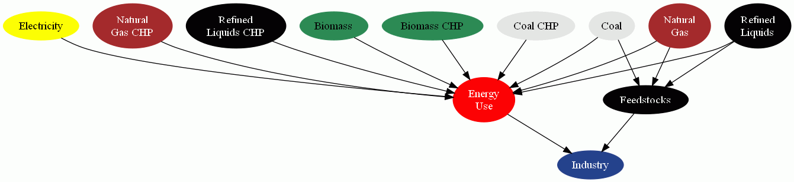
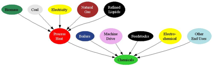
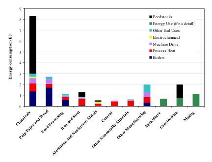

&lt;small&gt;[*This page is valid for GCAM 3.0 r3371. Click here for info on how to view a previous version.*](GCAM_Revision_History "wikilink")&lt;/small&gt;

The industrial sector in GCAM&nbsp;includes the following:&nbsp;manufacturing industries, energy use by the agriculture, construction, and mining industries (including energy used in primary energy production), as well as any energy consumed for energy transformation other than electricity generation and fuel refining (e.g. charcoal plants, coke ovens). Fossil fuels used as feedstocks (i.e., not combusted) are tracked separately from energy use.&lt;br&gt;

Aggregate Industrial Sectors&lt;br&gt;
--------------------------------------

In all non-US regions, the industrial sector is represented as a consumer of generic energy services and feedstocks, as shown in Figure 1. Within energy use there is cost-based competition between fuels, but with a low elasticity of substitution, as the specific uses of the energy are not specified. Cogeneration of electricity is tracked, and represented as a separate technology option for each fuel consumed by the industrial sector (other than electricity). Cogeneration technology options are characterized by higher capital costs, but are credited with the revenue from electricity sold; as such the deployment of cogeneration in any scenario will depend on future fuel and electricity prices. Output of aggregate industrial sectors is represented in generic terms.

##### Figure 1. Schematic of aggregate industrial sectors, used in non-US regions. Cost-based competition occurs in producing the Energy Use and Feedstocks services, but no competition occurs between these services.&lt;br&gt;

The cement industry is represented separately from the rest of the industrial sector in all regions, with a more detailed representation that explicitly indicates output units, considers several end uses of energy, and tracks limestone inputs for purposes of accounting process emissions of CO2. Cement industry energy intensity and output are based on IEA (2007)&lt;ref&gt;IEA, 2007. Tracking Industrial Energy Efficiency and CO2 Emissions. International Energy Agency, Paris, France.http://www.iea.org/textbase/nppdf/free/2007/tracking\_emissions.pdf&lt;/ref&gt;, limestone feed requirements are from Worrell et al. (2001)&lt;ref&gt;Worrell, E., L. Price, N. Martin, C. Hendricks, and L. Ozawa Meida. 2001. Carbon Dioxide Emissions from the Global Cement Industry. Ann. Rev. Energy Environ. 26: 303-329.&lt;/ref&gt;, and process-related emissions are from Marland et al. (2008)&lt;ref&gt;Marland, G., T.A. Boden, and R.J. Andres. 2008. Global, Regional, and National Fossil Fuel CO2 Emissions. In Trends: A Compendium of Data on Global Change. Carbon Dioxide Information Analysis Center, Oak Ridge National Laboratory. <http://cdiac.ornl.gov/trends/emis/overview.html%3C/ref%3E>. The characterization of the cement industry by GCAM region is shown in Table 1.

##### Table 1. Cement production in 2005, and inputs to cement production technology by GCAM region

|                     |                |          |                 |               |
|---------------------|----------------|----------|-----------------|---------------|
| **Region**          | **Production** | **Heat** | **Electricity** | **Limestone** |
|                     | Mt/yr          | GJ/t     | GJ/t            | t/t           |
| USA                 | 100.8          | 3.95     | 0.51            | 1.50          |
| Canada              | 13.4           | 3.29     | 0.51            | 1.50          |
| Western Europe      | 250.7          | 2.53     | 0.36            | 1.37          |
| Japan               | 67.8           | 2.46     | 0.36            | 1.36          |
| Australia\_NZ       | 9.3            | 3.16     | 0.41            | 1.43          |
| Former Soviet Union | 71.9           | 4.20     | 0.41            | 1.36          |
| China               | 1002           | 3.00     | 0.42            | 1.41          |
| Middle East         | 92.4           | 3.70     | 0.41            | 1.55          |
| Africa              | 88.7           | 3.67     | 0.41            | 1.48          |
| Latin America       | 121.8          | 2.53     | 0.41            | 1.44          |
| Southeast Asia      | 144.3          | 3.97     | 0.41            | 1.54          |
| Eastern Europe      | 40.6           | 3.71     | 0.41            | 1.45          |
| Korea               | 54.6           | 3.32     | 0.37            | 1.63          |
| India               | 129.2          | 2.68     | 0.32            | 1.51          |
|                     |

In the advanced scenario, aggregate industrial sectors in non-US regions are assumed to improve towards the best available practice in each industry, based on mapping the IEA's (2007) projected reductions to GCAM&nbsp;regions and sectors. Specifically, boilers and motors are assumed to improve by 10% and 20% between 2005 and 2035, respectively. This is translated to improvements in total industrial energy use assuming that boilers account for 35% to 40% of all hydrocarbon energy consumption by all industrial sectors (the higher rate is used in regions with steam-intensive industries; see Table 9.6 in IEA 2007), and that motor systems account for 60% of the total industrial electricity consumption in all regions. Within any region, improvements in intensity of individual industries are applied to the aggregate industrial sector according the relative energy shares in 2005 (IEA 2010a&lt;ref&gt;IEA, 2010. Energy Balances of OECD Countries, 1960-2008. International Energy Agency, Paris, France.&lt;/ref&gt; and IEA 2010b&lt;ref&gt;IEA, 2010. Energy Balances of non-OECD Countries, 1971-2008. International Energy Agency, Paris, France.&lt;/ref&gt;). Regions are assumed to converge towards best available practices starting in the near term, and continuing to improve at a modest rate through 2095. In general, this results in the most aggressive future technological improvement rates in the US and Canada, and the least in Africa and Southeast Asia. This is because the stock of energy-intensive manufacturing facilities in the US and Canada tends to be older, as more recently, investments in energy-intensive manufacturing facilities have taken place in developing countries.

Detailed U.S. Industrial Sector&lt;br&gt;
-----------------------------------------

&lt;span&gt;In the US region, the industrial sector is disaggregated into eight manufacturing industry groups (including cement) and three non-manufacturing groups. Each manufacturing industry group consumes energy to produce a range of intermediate industrial services, such as steam and machine drive (see Figure 2). These services are required by the industries in exogenous ratios; energy consumption by each industry and intermediate service is based on the 2002 Manufacturing Energy Consumption Survey (MECS)&lt;ref&gt;EIA, 2002. Manufacturing Energy Consumption Survey. Energy Information Administration, Washington, DC. <http://www.eia.gov/emeu/mecs/%3C/ref%3E>. Figure 3 shows the eleven GCAM industries and their energy requirements, by service, in 2005. Energy consumption by non-manufacturing groups—agriculture, construction, and mining—is based on EIA (2008)&lt;ref&gt;EIA, 2008. Annual Energy Outlook with Projections to 2030. Energy Information Administration, Washington, DC, Report DOE/EIA-0383(2008). <http://www.eia.doe.gov/oiaf/archive/aeo08/index.html%3C/ref%3E>. All energy consumption estimates are scaled to match 1990 and 2005 IEA (2010a) estimates of fuel consumption by the industrial sector, the agricultural sector, and feedstock use. Process CO2 emissions from limestone in the primary metals and nonmetallic minerals industries are accounted for based on EIA (2006)&lt;ref&gt;EIA, 2006. Emissions of Greenhouse Gases in the United States in 2005. Energy Information Administration, Washington, DC, DOE/EIA-0573(2005).&lt;/ref&gt;.&lt;/span&gt;

&lt;br&gt;

&lt;br&gt;

##### Figure 2. Schematic of a representative US industry in GCAM. Technologies compete to provide intermediate industrial services, which are required in exogenous amounts to produce output. Technological change can take place at both levels.&lt;br&gt;

&lt;br&gt;

##### Figure 3. Industrial energy consumption by GCAM industrial group and intermediate service. Source: 2002 Manufacturing Energy Consumption (EIA 2002).&lt;br&gt;

&lt;span&gt;While most industrial energy use can be mapped to several cross-cutting end use services, there is heterogeneity between industries in the fuel mixes used to provide these services. For instance, boilers in the pulp, paper and wood industry are mostly fueled by biomass. In several cases, services are modeled as being specific to a given industry, and base year fuel preferences are assumed to apply in the future. Cogeneration is explicitly modeled as a technology option for producing steam and process heat, competing with steam- or heat-only systems. While more capital-intensive, cogeneration technologies generally use less primary energy than separate heat and power systems (Kaarsberg and Roop 1998)&lt;ref&gt;Kaarsberg, T and J Roop, 1998. Combined Heat and Power: How Much Carbon and Energy Can It Save for Manufacturers? IECEC-98-I209 33rd Intersociety Engineering Conference on Energy Conversion.&lt;/ref&gt;. In GCAM, cogeneration technologies are compensated for electricity produced, according to the electricity prices in each period. Therefore, the economics of cogeneration are influenced by both input fuel prices and electricity prices. Note that neither CCS nor direct nuclear technology options for industrial facilities are included in the current representation.&lt;/span&gt;

&lt;span&gt; &lt;/span&gt;

The reference technology scenario assumes modest improvements in the equipment used to provide intermediate industrial services, and greater levels of improvement in the amounts of these services required to produce each unit of output. The advanced scenario assumes boiler and motor system efficiencies are improved by 10% and 20% between 2005 and 2035, respectively (IEA 2007, McKane et al. 2005&lt;ref&gt;McKane, A., W. Perry, L. Aixian, L. Tienan, R. Williams (2005). Creating a Standards Framework for Sustainable Industrial Energy Efficiency. Lawrence Berkeley National Laboratory, U.S. Department of Energy, Berkeley, CA. Technical Report LBNL-58501.&lt;/ref&gt;). The advanced scenario further assumes a range of industry-specific improvements that reduce the amounts of energy services required to produce a given level of output, based on Masanet et al. (2009)&lt;ref&gt;Masanet, E., M. Ting, E. Worrell, A. Sanstad, A. Novikova, R. Bharvirkar, M. Marsidi, A. North, and M. Rufo (2009). Estimation of Long-Term Energy-Efficiency Potentials for California Buildings and Industry. Sacramento, CA: California Energy Commission, PIER Energy-Related Environmental Research, CEC-500-06-005.&lt;/ref&gt; and IEA (2007). Examples of these improvements include optimizing steam distribution and application, switching to dry kilns in the cement industry, or increasing recycling rates in the paper industry. Table 2 shows the assumed process improvement rates in each of the US industries for the GCAM&nbsp;core reference and advanced scenarios between 2005 and 2035.&lt;br&gt;

##### Table 2. Assumed process improvement rates in US industrial production technologies, 2005 to 2035, for core reference and advanced scenarios.&lt;br&gt;

|                                 |                      |               |              |
|---------------------------------|----------------------|---------------|--------------|
| **Industry**                    | **Service**          | **Reference** | **Advanced** |
| Chemicals                       | Steam                | 10%           | 20%          |
|                                 | Process Heat         | 10%           | 11%          |
|                                 | All Other End Uses   | 10%           | 25%          |
| Pulp, Paper, and Wood           | Steam                | 10%           | 27%          |
|                                 | Process Heat         | 10%           | 16%          |
|                                 | Machine Drive        | 10%           | 17%          |
|                                 | All Other End Uses   | 10%           | 16%          |
| Iron and Steel                  | Process Heat         | 10%           | 11%          |
|                                 | All Other End Uses   | 10%           | 10%          |
| Aluminum and Non-Ferrous Metals | All End Uses         | 10%           | 13%          |
| Food Processing                 | Steam                | 10%           | 22%          |
|                                 | All Other End Uses   | 10%           | 10%          |
| Cement                          | Process Heat         | 7%            | 60%          |
|                                 | All Electricity Uses | 7%            | 59%          |
| Other Nonmetallic Minerals      | Steam                | 10%           | 14%          |
|                                 | All Other End Uses   | 10%           | 10%          |
| Other Manufacturing             | Steam                | 10%           | 13%          |
|                                 | All Other End Uses   | 10%           | 15%          |
|                                 |

References
----------

&lt;references /&gt;
