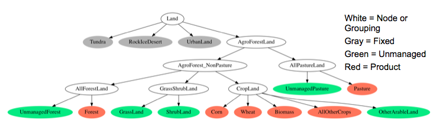

The strategy for nesting competing
[land uses](Agriculture,_Land-Use,_and_Bioenergy.html) and nesting
nests of competing land uses has involved some expert judgment, as
does the choice of logit exponents that govern substitution within
each of the level of the nesting structure. Note that calibration and
reproduction of historical results does not depend on the nesting
strategy or the logit exponents used. Instead, these assumptions
affect future period results as conditions or policies change from
history. 

Nesting strategies
------------------

Before discussing our nesting approach, it is useful to consider the
space of possible nesting strategies. One approach is that of a single
nest: the assumption that the land regions are small enough that all
competing options are equally substitutable. This assumption implies
that it is just as easy to switch from forest to wheat as it is to
switch from corn to wheat. However, this conversion would not happen
unless wheat was more profitable than forest or corn. With a high
enough logit exponent for this single nest, the land sharing
approaches an optimal “winner-take-all” result in that all land within
a region will be dedicated to the most profitable product in that
region. A single nest with a high exponent represents the extreme end
of unconstrained optimization in which there is no transition cost or
other hurdle for switching from one land type to another.

The other extreme is that of no substitution. This would be
accomplished with near zero or zero logit exponents, whether in a
single nest or multiple nests. This implies that either it is
physically impossible or the transition costs are too high to allow
switching from one land type to another. Currently, in GCAM, we use
zero logit exponents in a very limited number of situations, where we
do not want any substitution (e.g., we do not allow cropland to expand
into desert or tundra). However, in most situations, we employ
positive logit exponents and allow economics to dictate the land
allocation within a region.

As a point of reference, we have compared the logit approach used in
AgLU with the approach used in FASOM<a href="#ref1">[1]</a>,
an optimization model of agriculture and forest in the United
States. FASOM uses a mix of substitution strategies very different
from our approach. FASOM divides the U.S. into a number of small
regions. Within each of their regions, the model does not allow the
mix of crops grown to change. However, they do allow total cropland to
expand or contract in order to meet changing demand. They have also
imposed a rule mapping potential biomass crops to marginal cropland
outside their regular cropland category. This contrasts strongly with
our approach where we allow easier substitution among crops within
cropland but more difficult expansion or contraction of total
cropland. The reason for the difference lies in the linear
optimization approach. FASOM sets these cropland mix constraints as a
way of calibrating future model behavior to history. Otherwise, in the
first future period, the model would optimize and allocate land in a
pattern very different from history. Our calibration approach also
allows us to reflect history, but our logit sharing allows the future
model periods to change the mix of crops as conditions change. For a
reference case, the two approaches may give similar results. For a
scenario with rapid change, the approaches may provide very different
results.

Land nesting approach in GCAM
-----------------------------

Our current approach is to use a nesting strategy that allows the logit exponents to reflect differences in substitutability across land categories. Figure 1 shows the nesting diagram of land with an AEZ subregion. At the top is all land, which is divided into two main types of nodes: agro-forestry land and the remaining categories of land that are not suitable for agriculture. This second category could be divided further if useful. The next node layer contains two further nodes: all agro-forestry, non-pasture land and all pasture land. The pasture land node contains two competing uses (land leaves in the code): managed pasture (that which feeds marketed livestock) and unmanaged pasture.

###### Figure 1: Competition for land in GCAM

The agro-forestry (non-pasture) node contains three competing nodes:
shrub and grass lands, forest lands, and croplands. Shrublands and
grasslands are separated from the rest as they are both classified as
unmanaged land categories and we want to control their
substitutability between each other separately. Finally, the
forestland node competes with the total cropland node. Within
forestland, there are managed and unmanaged forest leaves, and we have
added a woody biomass option there in some regions and
scenarios. Under cropland are all food and other agriculture products
(e.g., corn, wheat, sugars, etc.), including biomass crops, along with
an unmanaged land category called other arable land. Note that several
crops are included explicitly in the CropLand node, and the grouping
of “AllOtherCrops” is simply a convenience for this figure.

With the specification above, we can make substitution across
categories more or less difficult by choosing lower or higher logit
parameters. We can also effectively combine nests by making the logit
exponents the same. For example, if we assign the same logit exponent
for each level, this is equivalent to putting all uses under one
nest. One implication of having equal exponents is that it would not
matter in which node we placed new crop options like biomass.

References
----------

<a name="ref1">[1]</a> Beach, R.H., & McCarl, B.A. (Jan
  2010). U.S. agricultural and forestry impacts of the Energy
  Independence and Security Act: FASOM results and model
  description. Final Report. Research Triangle Park, NC: RTI
  International. Prepared for the U.S. Environmental Protection Agency,
  Office of Transportation and Air Quality. RTI Project Number
  0210826.003. 
