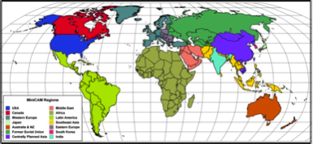
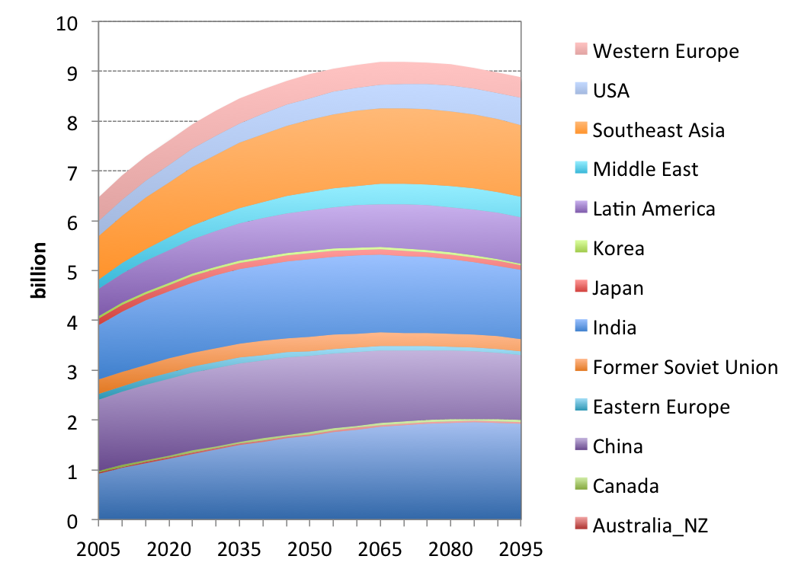
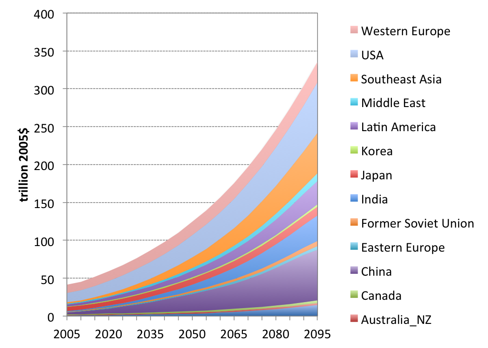

&lt;small&gt;[*This page is valid for GCAM 3.0 r3371. Click here for info on how to view a previous version.*](GCAM_Revision_History "wikilink")&lt;/small&gt;

GCAM is a multi‐regional dynamic-recursive model which couples a simple economic growth model with detailed energy system, agriculture system-land-use-terrestrial-carbon-cycle model and a simple atmosphere-ocean-climate model, MAGICC.

Geographic Coverage and Regions&lt;br&gt;
-----------------------------------------

GCAM is a global model. &nbsp;The economy and energy system are&nbsp;disaggregated into 14 geopolitical regions (**Table &lt;span style=""&gt;1&lt;/span&gt;** and **Figure &lt;span style=""&gt;1&lt;/span&gt;**):

|                |                     |                |
|----------------|---------------------|----------------|
| Africa         
                 
 Australia\_NZ   
                 
 Canada          
                 
 China           
                 
 Eastern Europe  | Former Soviet Union 
                                       
                  India                
                                       
                  Japan                
                                       
                  Korea                
                                       
                  Latin America        | Middle East    
                                                        
                                        Southeast Asia  
                                                        
                                        USA             
                                                        
                                        Western Europe  
                                                        
                                        &lt;br&gt;      |

###### Table 1: GCAM Regions

&lt;br&gt;

###### Figure 1:&nbsp;GCAM&nbsp;Region Definitions&lt;br&gt;

&lt;br&gt;

The agriculture and land-use system are divided into 151 subregions based on the GTAP-AEZs.&lt;ref name="Monfreda"&gt;Monfreda, Chad, Navin Ramankutty and Thomas Hertel (2007). "Global Agricultural Land Use Data for Climate Change Analysis" in Economic Analysis of Land Use in Global Climate Change Policy (eds: Tom Hertel, Steven Rose, Richard Tol).&lt;/ref&gt; &nbsp;These regions are discussed further in the [Agriculture, Land-Use, and Bioenergy](Agriculture,_Land-Use,_and_Bioenergy "wikilink") documentation.

Socioeconomics&lt;br&gt;
------------------------

GCAM computes the potential GDP of each region using exogenous assumptions about population, labor participation, and labor productivity growth. &nbsp;In some formulations of the model, GDP is adjusted to reflect the effect of changing energy prices on economic growth. &nbsp;However, the default assumption does not include this feedback. Population and GDP in the current baseline scenario are shown in Figures 2 and 3.&lt;br&gt;&lt;br&gt;

###### Figure 2:&nbsp;Population&lt;br&gt;

###### Figure 3:&nbsp;GDP&lt;br&gt;

Trade&lt;br&gt;
---------------

In principle international trade is possible for any commodity in the GCAM. As a practical matter, however, products such as electricity or CO&lt;sub&gt;2&lt;/sub&gt; storage services are assumed to be produced and consumed within a given region. Many products are traded globally, including fossil fuels (coal, gas, oil), bioenergy, and all agricultural products. &nbsp;We assume that these products are supplied to a global pool and any region can consume from this pool. &nbsp;&lt;br&gt;

Climate Policy Analysis
-----------------------

The GCAM can be run with any combination of climate and non-climate policies. Policies can take a variety of forms including taxes or subsidies applied to energy markets, activity permits, e.g. cap-and-trade emissions permits, and/or technology standards, e.g. CAFE or new source performance standards. Costs are computed as the integral of marginal abatement cost curve.&lt;br&gt;

References
----------

&lt;references /&gt;
