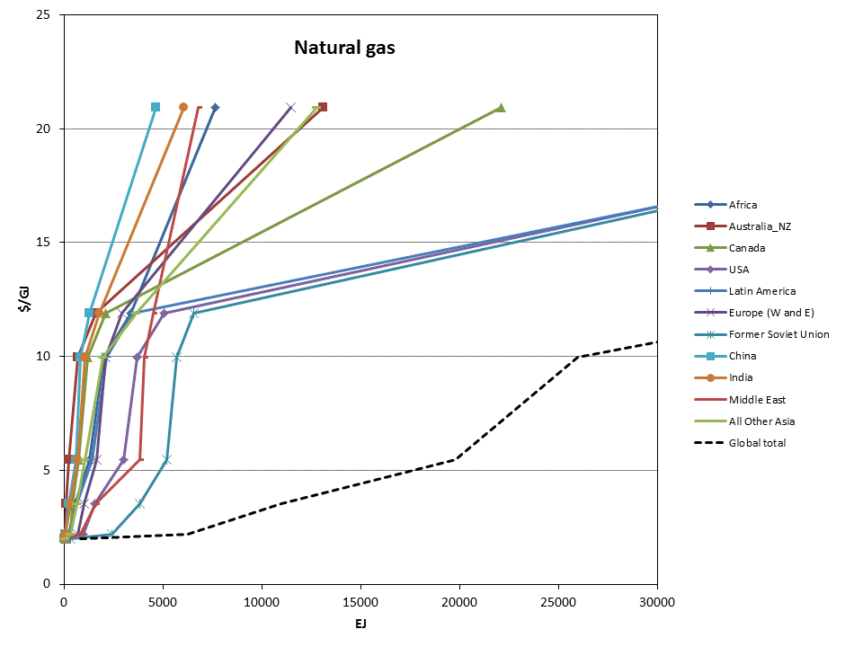
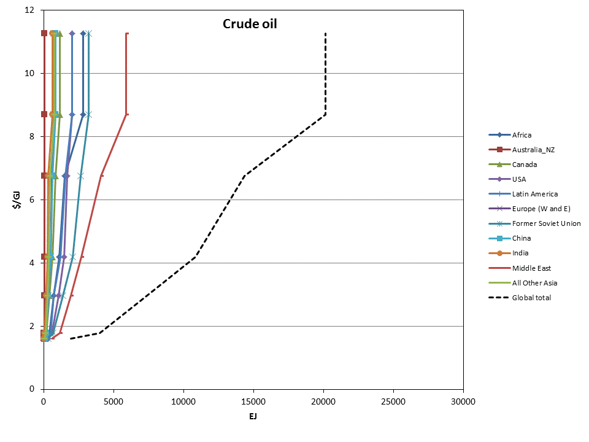
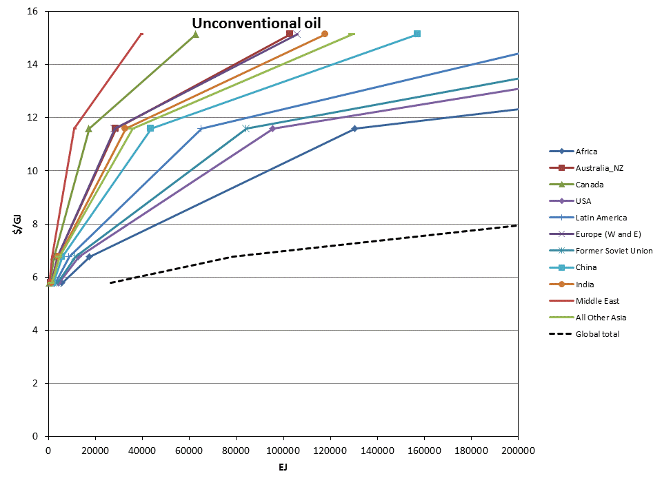
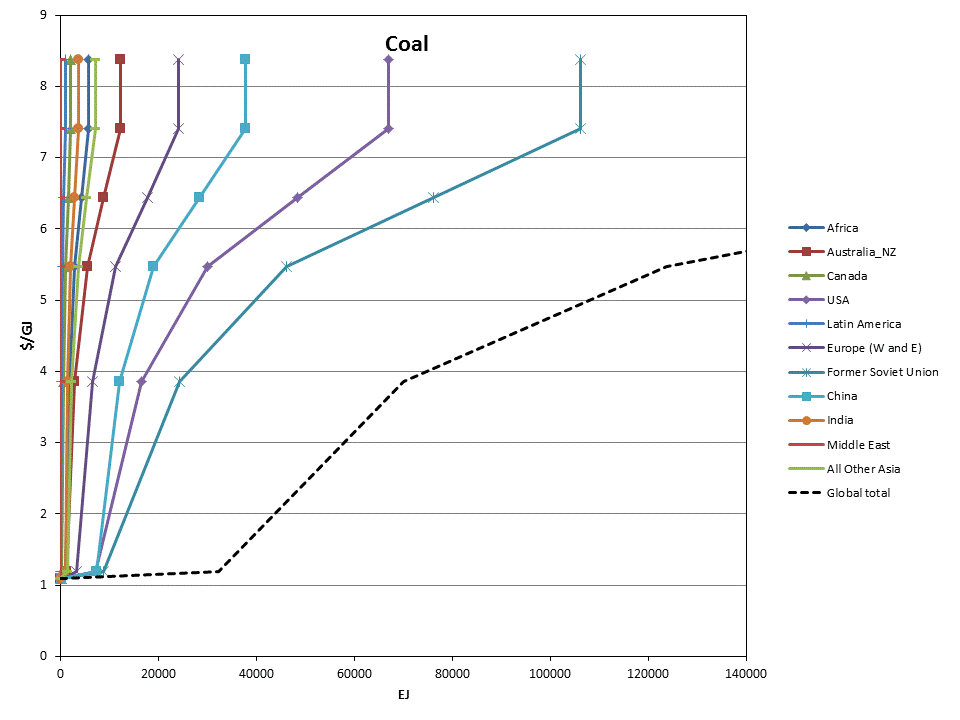
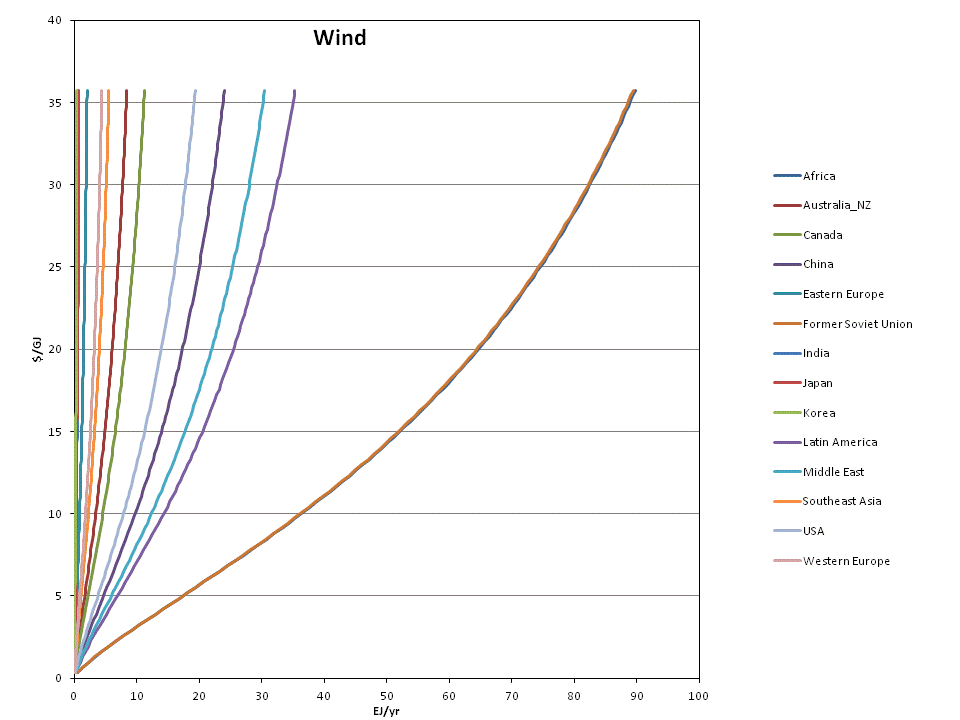
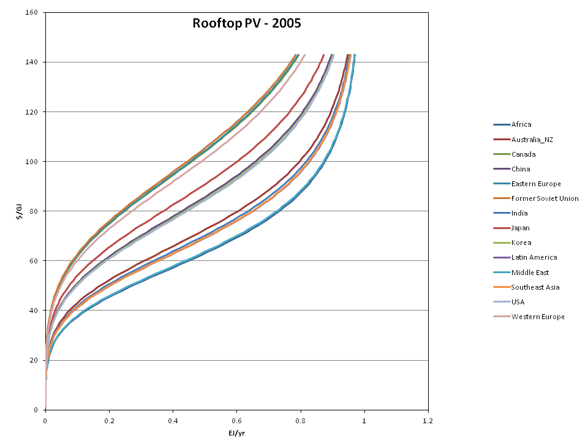
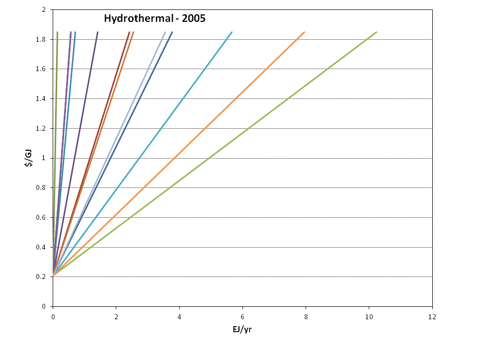
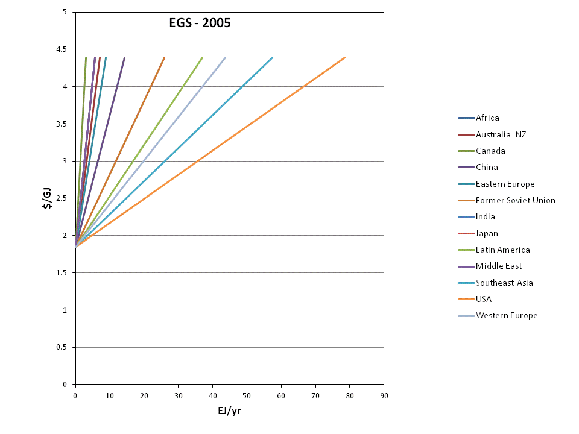
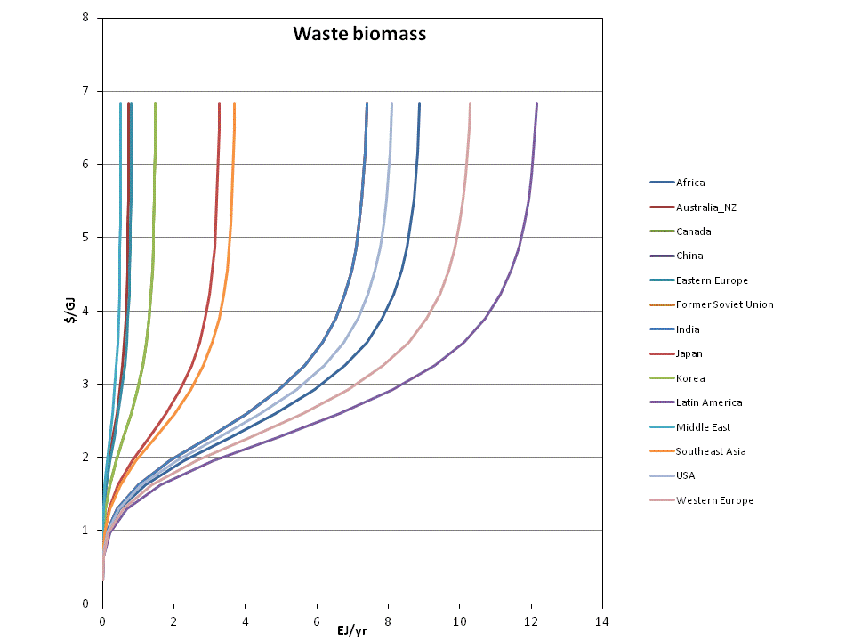

&lt;small&gt;[*This page is valid for GCAM 3.0 r3371. Click here for info on how to view a previous version.*](GCAM_Revision_History "wikilink")&lt;/small&gt;

GCAM&nbsp;distinguishes between two different types of resources:&nbsp;depletable and renewable. Depletable resources include fossil fuels and uranium; renewable resources include wind, geothermal energy, municipal and industrial waste (for waste-to-energy), and rooftop area for solar photovoltaic. All resources are characterized by upward-sloping supply curves:&nbsp;that is, the marginal cost of resource utilization increases with deployment.

Depletable Resources&lt;br&gt;
------------------------------

Depletable resource supply curves are input for each region as the amount of each resource available at a series of price points. Note that where all other energy quantities in GCAM represent annual flows (e.g. EJ per year), depletable resource supply curves are expressed in cumulative totals. Resource supply curves for natural gas, crude oil, unconventional oil, and coal are shown for each of the 14 GCAM regions in Figures 1-4 below. These curves are based on the hydrocarbon resource assessment of Rogner (1997).&lt;ref&gt;Rogner, H. 1997. An assessment of world hydrocarbon resources. Annual Reviews of Energy and the Environment 22: 217-262.&lt;/ref&gt; Unconventional oil consists of an aggregation of shale oil, bitumen, and heavy oil; note that for unconventional oil, the supply curves shown below do not include the cost of the energy used in extraction, and as such the actual supply curves in each region will have higher costs at all quantities.&lt;br&gt;&lt;br&gt; GCAM typically assumes global trade in all of the depletable resources, so for any region, the price of the primary fuel in a given period is equal to the price of the global supply curve, plus any region-specific costs associated with fuel transportation and delivery. These global resource supply curves, derived by adding up each region's available resource at each price point, are shown in the figures as dotted lines. Finally, these resource supply curves are shown for the 2005 model time period; all price points decrease at 0.75% per year in order to represent technological improvements that reduce the costs of resource extraction.

&lt;br&gt;

###### Figure 1. Natural gas resource supply curves

###### Figure 2. Crude oil resource supply curves

###### Figure 3. Unconventional oil resource supply curves

###### Figure 4. Coal resource supply curves

Renewable Resources
-------------------

Similar to depletable resources, renewable resources are represented as supply curves, but here the quantities reflect annual production rather than cumulative totals. Note that the meaning of renewable energy supplies may be somewhat different, as the resource is not necessarily a commodity with a market price. In general, resource supply curves are used with renewable energy technologies in order to represent all aspects of the costs of a renewable technology that can be expected to increase with deployment, except backup-related costs for the electricity system, which are explicitly modeled in GCAM. Therefore, the total costs of renewable technologies include a technology cost, a resource cost, and if the technology is intermittent, any backup-related costs. This section only shows the resource costs.&lt;br&gt;

### Wind

Wind supply curves in each region include all costs of producing electricity except for the capital costs and operations and maintenance costs of producing power at a Class 5-6 wind site (represented under the electric technology), and backup-related costs (endogenously calculated based on the intermittent technologies' share of total electric system capacity). As such, the supply curves account for transmission costs, siting costs, and higher costs owing to decreasing capacity factors at less windy sites. The supply curve for the USA is based on a detailed analysis documented in Kyle et al. (2007),&lt;ref&gt;Kyle, P., S.J. Smith, M.A. Wise, J.P. Lurz, and D. Barrie. 2007. Long-Term Modeling of Wind Energy in the United States. PNNL-16316, Pacific Northwest National Laboratory. <http://www.pnl.gov/main/publications/external/technical_reports/PNNL-16316.pdf%3C/ref%3E> with the shape adjusted to be consistent with Figure A-3 in NREL (2008).&lt;ref&gt;NREL, 2008. 20% Wind Energy by 2030: Increasing Wind Energy's Contribution to U.S. Electricity Supply. DOE/GO-102008-2567, National Renewable Energy Laboratory. <http://www.nrel.gov/docs/fy08osti/41869.pdf%3C/ref%3E> In all other regions, the wind supply curves have the same shape as the U.S. supply curves, but are adjusted in magnitude according to relative resource amounts in each region in IEA GHG (2000).&lt;ref&gt;IEA GHG, 2000. The Potential of Wind Energy to Reduce CO2 Emissions. Report PH3/24, International Energy Agency Greenhouse Gas R&amp;amp;amp;amp;D Program, Cheltenham, UK.&lt;/ref&gt; Supply curves by GCAM region are shown in Figure 5; the region order from greatest to least is as follows: Africa, Former Soviet Union, Latin America, Middle East, China, USA, Canada, Australia\_NZ, Southeast Asia, Western Europe, Eastern Europe, India, Japan, and Korea.

&lt;br&gt;

###### Figure 5. Wind resource supply curves, in EJ/yr of electricity output.

&lt;br&gt;

### Solar

The costs of producing central electricity from solar power are input at the level of the technology; costs vary by GCAM region, based on the population-weighted average insolation received, but there is no supply curve used because marginal costs are assumed to not increase with deployment. However, for rooftop PV, GCAM does use supply curves, based on Denholm and Margolis's (2008)&lt;ref&gt;Denholm, P., and R. Margolis. 2008. Supply Curves for Rooftop Solar PV-Generated Electricity for the United States. NREL/TP-6A0-44073, National Renewable Energy Laboratory. <http://www.nrel.gov/docs/fy09osti/44073.pdf%3C/ref%3E> supply curves for rooftop PV in the residential and commercial sectors in the USA. In other regions, the supply curves are assigned similar shape as the USA supply curve, with the available resource quantities adjusted by regional population, used as a proxy of available rooftop space, and by insolation. Rooftop PV supply curves are shown in Figure 6; note that as with wind, this supply curve only accounts for the portion of the costs that increase with deployment. Note also that the costs shown are for the 2005 model time period, and are typically assumed to decline substantially in future periods.&lt;br&gt;

&lt;br&gt;

###### Figure 6. Rooftop PV resource supply curves, in EJ/yr of electricity output.

&lt;br&gt;

### Geothermal

Geothermal modeling in GCAM&nbsp;is documented in Hannam et al. (2009).&lt;ref&gt;Hannam, P., P. Kyle, and S.J. Smith. 2009. Global Deployment of Geothermal Energy Using a New Characterization in GCAM 1.0. PNNL-19231, Pacific Northwest National Laboratory. <http://www.pnl.gov/main/publications/external/technical_reports/PNNL-19231.pdf%3C/ref%3E> Costs of geothermal electricity production are typically divided into four phases:&nbsp;identification, exploration, drilling, and production.&lt;ref&gt;Deloitte, 2008. Geothermal Risk Mitigation Strategies Report. Deloitte Development LLC.Prepared for Office of Energy Efficiency and Renewable Energy Geothermal Program,U.S. Department of Energy, Washington, D.C. <http://www1.eere.energy.gov/geothermal/pdfs/geothermal_risk_mitigation.pdf%3C/ref%3E> In GCAM, the first three of these are accounted in the resource costs, with only the production phase accounted in the technology. Resources in each region consist of the sum of the hydrothemal sub-resource and the EGS sub-resouce, in scenarios where EGS is allowed. Supply curves from each in the USA are based on Petty and Porro (2007),&lt;ref&gt;Petty, S., Porro, G., 2007. Updated U.S. Geothermal Supply Characterization. Conference Paper NREL/CP-640-41073, National Renewable Energy Laboratory, Golden, CO.&lt;/ref&gt; and are adjusted in non-US regions according to a dataset put together for the 2009 Geothermal Energy Association World Outlook (R. Bertani, pers. comm.). Supply curves for the hydrothermal and EGS resources in all regions are shown in Figure 7. Note that these supply curves are represented in terms of usable heat; the geothermal electric technologies in each region are assigned a conversion efficiency of 10%, so these curves are effectively 10 times the corresponding electricity output.&lt;br&gt;

&lt;br&gt;

 

###### Figure 7. Hydrothermal and EGS supply curves, in EJ/yr of heat production. Note that geothermal electric technologies are assigned a 10% conversion efficiency.

&lt;br&gt;

### Waste biomass&lt;br&gt;

The waste biomass supply curves in each region include several forms of waste that are not explicitly tracked elsewhere in the model. Forms of biomass elsewhere accounted include agricultural residue biomass, logging residues, and milling residues, as well as the purpose-grown bioenergy crops. The remainder consists mostly of municipal solid waste and combustible industrial waste. The supplies used in GCAM&nbsp;are documented in Gregg (2010).&lt;ref&gt;Gregg, J.S. 2010. National and regional generation of municipal residue biomass and the future potential for waste-to-energy implementation. Biomass and Bioenergy 34: 379-388.&lt;/ref&gt; Figure 8 shows the supply curves used in each region; supplies are generally based on the amount and composition of municipal waste produced in each GCAM&nbsp;region.&lt;br&gt;

&lt;br&gt;

###### Figure 8. Waste biomass supply curves, in EJ/yr of combustible energy.

&lt;br&gt;

&lt;br&gt;

References
----------

&lt;references /&gt;
