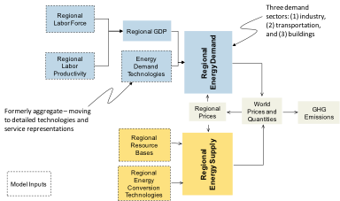

The Global Change Assessment Model (GCAM) is a global integrated assessment model with particular emphasis on the representation of human earth systems including interactions between the global economic, energy, agricultural, land use and technology systems. Previously known as MiniCAM&lt;ref name="Brenkert03"&gt;Brenkert A, S Smith, S Kim, and H Pitcher. 2003. Model Documentation for the MiniCAM. PNNL-14337, Pacific Northwest National Laboratory, Richland, Washington. Available at: <http://www.globalchange.umd.edu/models/MiniCAM.pdf%3C/ref%3E>, this model traces its origins to the Edmonds and Reilly model.&lt;ref name="ER1983a"&gt;Edmonds, J. and J. Reilly. 1983. "Global Energy Production and Use to the Year 2050," Energy, 8(6):419-32&lt;/ref&gt;&lt;ref name="ER83b"&gt;Edmonds, J. and J. Reilly. 1983. "Global Energy and CO2 to the Year 2050," The Energy Journal, 4(3):21-47.&lt;/ref&gt;&lt;ref name="ER83c"&gt;Edmonds, J. and J. Reilly. 1983. "A Long-Term, Global, Energy-Economic Model of Carbon Dioxide Release From Fossil Fuel Use," Energy Economics, 5(2):74-88.&lt;/ref&gt;&lt;ref name="ER85"&gt;Edmonds, J. and J. Reilly. 1985. Global Energy: Assessing the Future, Oxford University Press, New York. 1985.&lt;/ref&gt; Over time the model has developed and evolved through a series of advances documented in a variety of papers&lt;ref name="Brenkert03" /&gt;&lt;ref name="Wise09a"&gt;Wise, MA, KV Calvin, AM Thomson, LE Clarke, B Bond-Lamberty, RD Sands, SJ Smith, AC Janetos, JA Edmonds. 2009b. Implications of Limiting CO2 Concentrations for Land Use and Energy. Science. 324:1183-1186. May 29, 2009.&lt;/ref&gt;&lt;ref name="Wise09b"&gt;Wise, M., K. Calvin, A. Thomson, L. Clarke, R. Sands, S.J. Smith, A. Janetos, and J. Edmonds. 2009. The Implications of Limiting CO2 Concentrations for Agriculture, Land-use Change Emissions, and Bioenergy. Technical Report. \[PNNL-17943\].&lt;/ref&gt;&lt;ref name="Kim06"&gt;Kim, S.H., J.A. Edmonds, J. Lurz, S.J. Smith, and M. Wise (2006). “The ObjECTS Framework for Integrated Assessment: Hybrid Modeling of Transportation.” Energy Journal 27: 63-91.&lt;/ref&gt;&lt;ref name="Clarke07b"&gt;Clarke, L., J. Lurz, M. Wise, J. Edmonds, S. Kim, S. Smith, H. Pitcher. 2007. Model Documentation for the MiniCAM Climate Change Science Program Stabilization Scenarios: CCSP Product 2.1a. PNNL Technical Report. PNNL-16735.&lt;/ref&gt;&lt;ref name="Edmonds86"&gt;Edmonds, J.A., Reilly, J.M., Gardner, R.H., and Brenkert, A. 1986. Uncertainty in Future Global Energy Use and Fossil Fuel CO2 Emissions 1975 to 2075, TR036, DOE/NBB-0081 Dist. Category UC-11, National Technical Information Service, U.S. Department of Commerce, Springfield Virginia 22161.&lt;/ref&gt;. The GCAM physical atmosphere and climate are represented by the Model for the Assessment of Greenhouse-Gas Induced Climate Change (MAGICC)&lt;ref name="Wigley92"&gt;Wigley, T.M.L. and Raper, S.C.B. 1992. Implications for Climate And Sea-Level of Revised IPCC Emissions Scenarios Nature 357, 293–300.&lt;/ref&gt;&lt;ref name="Wigley02"&gt;Wigley, T.M.L. and Raper, S.C.B. 2002. Reasons for larger warming projections in the IPCC Third Assessment Report J. Climate 15, 2945–2952.&lt;/ref&gt;&lt;ref name="Raper96"&gt;Raper, S.C.B., Wigley T.M.L. and Warrick R.A. 1996. in Sea-Level Rise and Coastal Subsidence: Causes, Consequences and Strategies J.D. Milliman, B.U. Haq, Eds., Kluwer Academic Publishers, Dordrecht, The Netherlands, pp. 11–45.&lt;/ref&gt;.

PNNL is committed to making the Global Change Assessment Model (GCAM) a community tool – expanding its user community and gradually opening the development of the model to this community. The purpose of this wiki is to provide a resource for users across the globe learning to run GCAM. If you are interested in running GCAM, please see the [getting started page](Getting_Started_with_GCAM.html). The current version of the model is [GCAM 3.2](GCAM_Revision_History "wikilink").

General Structure
-----------------

GCAM is global in scope and disaggregated into 14 geopolitical
regions, explicitly linked through international trade in energy
commodities, agricultural and forest products, and other goods such as
emissions permits. It is a dynamic-recursive market equilibrium
model. Figure 1 provides an overview of the general structure of the
energy system of the GCAM. The scale of human activities is determined
by the interaction between labor force, determined by work-aged
population, labor participation and unemployment rate assumptions and
the price of energy services. Figure 2 provides an overview of
agriculture and land use in the GCAM and its linkage to the GCAM
energy system. An important feature of the GCAM architecture is that
the GCAM terrestrial carbon cycle model is embedded within the
agriculture-land-use system model.

###### Figure 1: Overall structure of the general structure of the energy system of the GCAM

###### Figure 2: Overall structure of the agriculture-land-use module of the GCAM

The energy system model produces and transforms energy for use in
three end-use sectors: buildings, industry and transport. Production
is limited by resource availability, which varies by region. Fossil
fuel and uranium resources are finite and depletable. Wind, solar,
hydro, and geothermal resources are renewable. Bioenergy is also
renewable, but is treated as an explicit product of the
agriculture-land-use portion of the model. Resources are disaggregated
by region and by grade of the resource. Extraction costs rise as the
resource is depleted, fall with technological change for extraction
technologies, and can rise or fall depending on other environmental
costs.

Primary energy can be transformed into other energy forms. These
transformations are performed in energy transformation sectors and
together provide a suite of final energy forms for consumption by
end-use sectors: buildings, industry and transport, Figure 3. These
sectors in turn have multiple technology options with which to
transform final energy forms into energy services. For example
residential buildings demand heating, cooling, lighting, hot water,
appliance and other services. These services can be provided by
technologies that employ various end-use fuels: coal, liquids, natural
gas, electricity, bioenergy, or hydrogen.

GCAM also tracks waste streams and treats the storage of nuclear waste
and captured CO2 explicitly. CO2 storage reservoirs are disaggregated
by region, type and grade. Similarly nuclear waste storage represents
a potential limit on cumulative deployment and reactor choice.

&lt;br&gt;

###### Figure 3: Overview of energy production and transformation in GCAM.

Table 1 provides an overview of the key features of the model. The
individual modules along with relevant parameters and assumptions are
described in more detail in the following sections.

|                                                                               |                                                                                                                                                                                                                                                                                                                                                                                                                                                                                                                                                                                                                                                                                                                         |
|-------------------------------------------------------------------------------|-------------------------------------------------------------------------------------------------------------------------------------------------------------------------------------------------------------------------------------------------------------------------------------------------------------------------------------------------------------------------------------------------------------------------------------------------------------------------------------------------------------------------------------------------------------------------------------------------------------------------------------------------------------------------------------------------------------------------|
| **Distinguishing Feature&lt;br&gt;**                                          | **The JGCRI/PNNL&nbsp;Global Change Assessment Model (GCAM)**&lt;br&gt;                                                                                                                                                                                                                                                                                                                                                                                                                                                                                                                                                                                                                                                 |
| Solution Concept&lt;br&gt;                                                    | Market Equilibrium&lt;br&gt;                                                                                                                                                                                                                                                                                                                                                                                                                                                                                                                                                                                                                                                                                            |
| Expectations/Foresight&lt;br&gt;                                              | Myopic foresight&lt;br&gt;                                                                                                                                                                                                                                                                                                                                                                                                                                                                                                                                                                                                                                                                                              |
| Substitution possibilities with the macro-economy/sectoral coverage&lt;br&gt; | GDP is a simple labor-productivity model with an energy-GDP feedback elasticity. Labor force is determined by work-age population and assumptions about labor-force participation and unemployment rates.                                                                                                                                                                                                                                                                                                                                                                                                                                                                                                               |
| Link betwen energy system and macro-economy&lt;br&gt;                         | GDP sets the scale of economic activity in the model, which in turn drives the demand for the stock of buildings, the passenger and freight transportation fleets, and up to 10 industrial sectors.                                                                                                                                                                                                                                                                                                                                                                                                                                                                                                                     |
| Production function in the energy system/substitution possibilities&lt;br&gt; | Energy transformation sectors: natural gas and oil refining and processing, bioenergy refining, electricity generation, hydrogen production. Leontief technology options compete within the logit market competition model to provide energy services.                                                                                                                                                                                                                                                                                                                                                                                                                                                                  |
| Land Use&lt;br&gt;                                                            | Land use, land cover and terrestrial carbon stocks and flows are determined endogenously. Aggregate demand for agricultural products is driven by per capita income and price. Bioenergy is produced in competition with crops, pasture and forestry. Farmers allocate land based on expected profitability. Land rents are determined by aggregate demand for land. Production functions for the 14 crops and pasture are Leontief, but subject to diminishing returns via a logit specification. Forest extent depends on current and expected future prices for land and forest products. Animal production relies on both pasture and feedlot production of grains. Products are traded in an international market. |
| International macro-economic linkages/Trade&lt;br&gt;                         | Single market for all internationally traded commodities (e.g. fossil fuels, crops, emissions permits); regional market for local commodities (e.g. electricity).                                                                                                                                                                                                                                                                                                                                                                                                                                                                                                                                                       |
| Implementation of climate policy targets&lt;br&gt;                            | Various. Taxes, subsidies, cap-and-trade, regulatory limits, technology regulations, and combinations of the above.&lt;br&gt;                                                                                                                                                                                                                                                                                                                                                                                                                                                                                                                                                                                           |
| Technological Change/Learning&lt;br&gt;                                       | Exogenous&lt;br&gt;                                                                                                                                                                                                                                                                                                                                                                                                                                                                                                                                                                                                                                                                                                     |
| Representation of end-use sectors&lt;br&gt;                                   | Three end-use sectors:&nbsp;buildings, transport, and industry&lt;br&gt;                                                                                                                                                                                                                                                                                                                                                                                                                                                                                                                                                                                                                                                |
| Cooperation vs. non-cooperation&lt;br&gt;                                     | Varies by scenario&lt;br&gt;                                                                                                                                                                                                                                                                                                                                                                                                                                                                                                                                                                                                                                                                                            |
| Externalities&lt;br&gt;                                                       | Exogenous&lt;br&gt;                                                                                                                                                                                                                                                                                                                                                                                                                                                                                                                                                                                                                                                                                                     |
| Discounting&lt;br&gt;                                                         | Exogenous&lt;br&gt;                                                                                                                                                                                                                                                                                                                                                                                                                                                                                                                                                                                                                                                                                                     |
| Investment dynamics&lt;br&gt;                                                 | Vintage capital structure with existing investments producing with Leontief production functions&lt;br&gt;                                                                                                                                                                                                                                                                                                                                                                                                                                                                                                                                                                                                              |

###### Table 1: Overview of the key characteristics of the GCAM.

&lt;br&gt;

Detailed Model Description
--------------------------

The remainder of the GCAM documentation is divided into 5 sections:

-   [Regional Scope, Socioeconomics, and Trade](Regional_Scope_Socioeconomics_and_Trade.html)
-   [The Energy System](The_Energy_System "wikilink")
-   [Agriculture, Land-Use, and Bioenergy](Agriculture_Land-Use_and_Bioenergy.html)
-   [The Climate Module](The_Climate_Module.html)
-   [The Solver](GCAM_Solver.html)

Selected GCAM Papers and Reports
--------------------------------

A [**selected set of GCAM papers and reports**](References.html) is also available.

References
----------

&lt;references /&gt;&lt;br&gt;

&lt;br&gt;

PNNL-20809

&lt;br&gt; &lt;br&gt;
