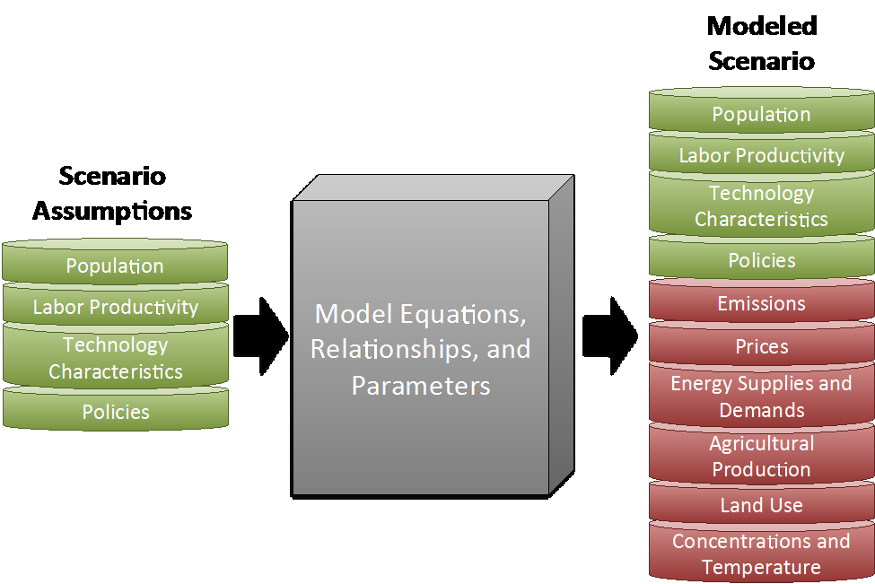
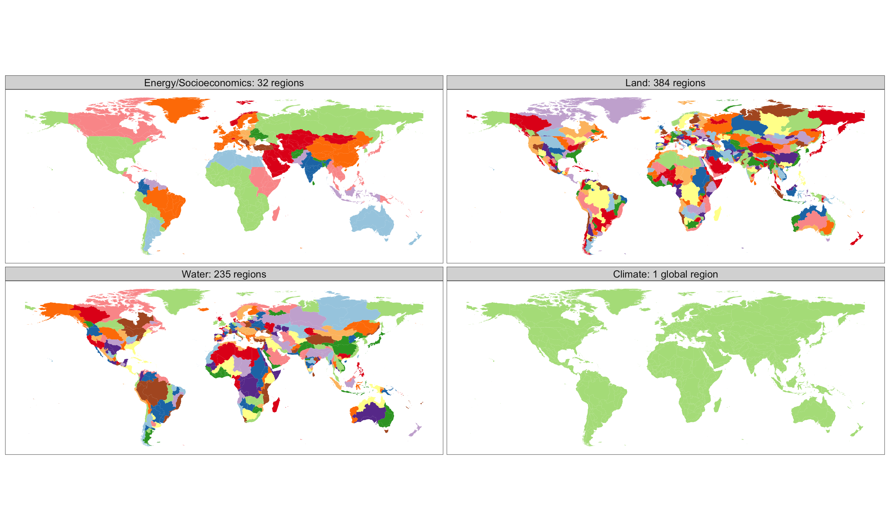
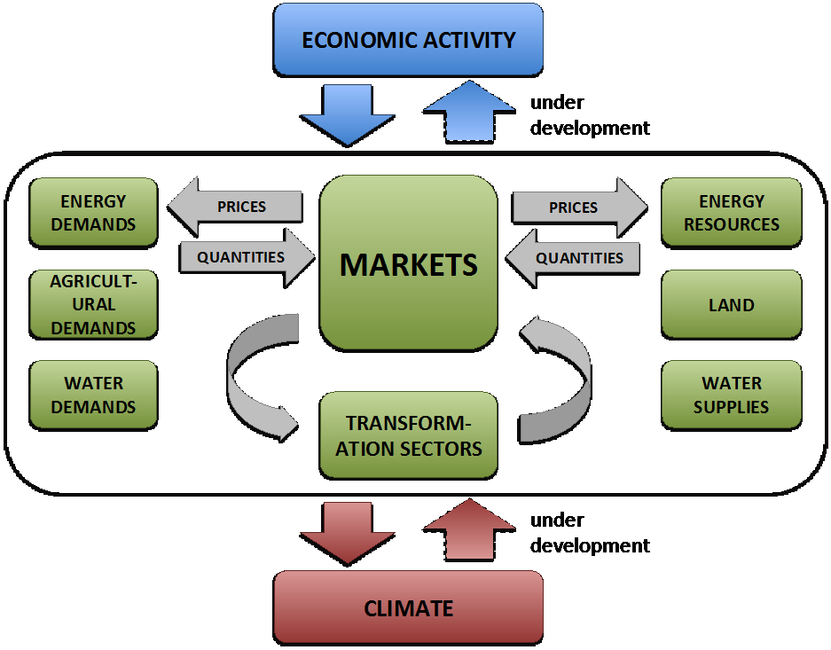

## Introduction

GCAM is a global model that represents the behavior of, and interactions between five systems: the energy system, water, agriculture and land use, the economy, and the climate. GCAM has been under development for over 30 years. Work began in 1980 with the work first documented in 1982 in working papers (Edmonds and Reilly, 1982a,b,c) and the first peer-reviewed publications in 1983 (Edmonds and Reilly, 1983a,b,c). A this point, the model was known as the Edmonds-Reilly (and subsequently the Edmonds-Reilly-Barnes) model. The model was renamed MiniCAM in the mid-1990s, the model code was re-written in object-oriented C++ (Kim et al. 2006) and renamed to GCAM in the mid-2000s. The first coupling to a carbon cycle model was published in Edmonds et al. (1984). The first use of GCAM (MiniCAM at the time) in conjunction with a Monte Carlo uncertainty analysis was published in Reilly et al. (1987).

Throughout its lifetime, GCAM has evolved in response to the need to address an expanding set of science and assessment questions. The original question that the model was developed to address was the magnitude of mid-21st-century global emissions of fossil fuel CO2. Over time GCAM has expanded its scope to include a wider set of energy producing, transforming, and using technologies, emissions of non-CO2 greenhouse gases, agriculture and land use, water supplies and demands, and physical Earth systems. GCAM has been used to produce scenarios for national and international assessments ranging from the very first IPCC scenarios (Response Strategies Working Group, 1990) through the present Shared Socioeconomic Pathways (Calvin et al., 2017). GCAM is increasingly being used in multi-model, multi-scale analysis, in which it is either soft- or hard-coupled to other models with different focuses and often greater resolution in key sectors. For example, a range of downscaling tools have been developed for use with GCAM to be able to land and water outputs at a grid resolution. Similarly, it has been coupled to a state of the art Earth system model (Collins, et al., 2015). Hundreds of papers have been published in peer-reviewed journals using GCAM over its lifetime and the GCAM system continues to be an important international tool for scientific inquiry. GCAM is also a community model being used by researchers across the globe, creating a shared global research enterprise. GCAM can be run on Windows, Linux, Mac, and high-performance computing systems.

## Background: Integrated Multi-Sector Modeling

GCAM is an integrated, multi-sector model that explores both human and Earth system dynamics. The role of models like GCAM is to bring multiple human and physical Earth systems together in one place to shed light on system interactions and provide scientific insights that would not otherwise be available from the pursuit of traditional disciplinary scientific research alone. GCAM is constructed to explore these interactions in a single computational platform with a sufficiently low computational requirement to allow for broad explorations of scenarios and uncertainties. Components of GCAM are designed to capture the behavior of human and physical systems, but they do not necessarily include the most detailed process-scale representations of its constituent components. On the other hand,  model components in principle provide a faithful representation of the best current scientific understanding of underlying behavior.

GCAM allows users to explore what-if scenarios, quantifying the implications of possible future conditions. These outputs are not predictions of the future; they are a way of analyzing the potential impacts of different assumptions about future conditions. GCAM reads in external "scenario assumptions" about key drivers (e.g., population, economic activity, technology, and policies) and then assesses the implications of these assumptions on key scientific or decision-relevant outcomes (e.g., commodity prices, energy use, land use, water use, emissions, and concentrations). 

 
Figure 1: Conceptual diagram of the way that IA models use scenario assumptions to produce fuller, modeled scenarios that include a wide range of additional information
{: .fig}

Developing and quantifying a single set of scenario assumptions is the most common way that a model such as GCAM is used to explore scientific and assessment questions. However, another class of question that GCAM has taken up is the systematic representation of uncertainty. As early as the 1980s, GCAM was used to map the implications of uncertain key input assumptions and parameters into implied distributions of outputs, such as greenhouse gas emissions, energy use, energy prices, and trade patterns. A range of techniques has been employed using GCAM to explore the potential range of future outcomes. Techniques include scenarios analysis, sensitivity analysis, and Monte Carlo simulations. Exploring and understanding the role of uncertainty in shaping events remains an important research use of GCAM.

## Overview of GCAM Computational Components 

The GCAM ecostystem includes a range of different tools, from data manipulation tools, the dynamic core of GCAM, and a range of disaggregation models, visualization tools and emulation tools. The GCAM release includes a data system for creatinig the XML inputs for GCAM and the dynamic core. Additional tools are produced and available separately and not included in the release version of GCAM.

The [GCAM Data System](https://github.com/JGCRI/gcamdata) combines and reconciles a wide range of different data sets, and systematically incorporates a range of future assumptions. The output of the data system is an XML dataset with historical and base-year data for calibrating the model along with assumptions about future trajectories such as GDP, population, and technology. It includes the necessary information for representing energy, water, land, and the economic system. The GCAM Data System is largely constructed in R, but accommodates inputs in a range of different formats. Creating new scenarios does not require the use of the GCAM data system. New, "add on" xml files can be created to overwrite key future scenario assumptions such as population, economic activity, and technology cost and performance, among others.

The GCAM core (discussed below) is the component of the model in which economic decisions are made (e.g., land use and technology choices), and in which dynamics and interactions are modeled within and among different human and Earth systems. The GCAM core is written in C++ and takes in inputs in XML. Outputs are written to a xml database.

Many applications of GCAM require information at finer spatial and temporal scales than is provided by the GCAM core. A number of additional disaggregation models have been developed to create this information. These models are not included in the release version of GCAM. 

## Overview of Integrated Dynamics in the GCAM Core

Supplied with input information from the GCAM Data System, the GCAM Core is the heart of the dynamic character of GCAM. GCAM takes in a set of assumptions and then processes those assumptions to create a full scenario of prices, energy and other transformations, and commodity and other flows across regions and into the future. GCAM represents five different interacting and interconnected systems. The interactions between these different systems all take place within the GCAM core; that is, they are not modeled as independent modules, but as one integrated whole. The five systems in then GCAM Core are as follows:

* [**Macro-economy**](macro-econ.html): This module takes population and labor productivity assumptions as inputs and produces regional Gross Domestic Product and regional populations as inputs for the other modules. The macroeconomy sets the scale of economic activity in GCAM. 

* [**Energy systems**](energy.html): The energy system is a detailed representation of the sources of energy supply, modes of energy transformation, and energy service demands such as passenger and freight transport, industrial energy use, and residential and commercial energy service demands. The module reports demands for and supplies of energy forms as well as emissions of greenhouse gases, aerosols and other short-lived species. Energy systems demand bioenergy from agriculture and land systems and water from water systems.

* [**Agriculture and Land Systems**](aglu.html): The agriculture and land systems provide in information about land use, land cover, carbon stocks and net emissions, the production of bioenergy, food, fiber, and forest products. Demands are driven by the size of the population, their income levels, and commodity prices. The module reports demands for and supplies of agricultural and other commodities, land and emissions of greenhouse gases, aerosols and other short-lived species. The demand for bioenergy is a derived demand by the energy sector. Agriculture and land systems demand water from water systems.

* [**Water Systems**](water.html): The water module provides information about water withdrawals and water consumption for energy, agriculture, and municipal uses.

* [**Physical Earth System**](hector.html): The physical Earth system in GCAM is modeled using Hector, a physical Earth system emulator that provides information about the composition of the atmosphere based on emissions provided by the other modules, ocean acidity, and climate.

The exact structure of the model explored in the GCAM core - for example, the number of regions and technologies - is data driven. In all cases, the GCAM core represents the entire world, but it is constructed with different levels of resolution for each of these different systems (see Figure 2). In the current release version of GCAM, the energy-economy system operates at 32 regions globally (see tables below), land is divided into >300 subregions, and water is tracked for 233 basins worldwide. The Earth system module operates at a global scale.

<table>
  <caption>Spatial scale of systems in the release version of GCAM</caption>
  <tr>
    <th class="header">GCAM Component</th>
    <th class="header">Geospatial Resolution</th>
  </tr>
  <tr>
    <td class="first_col">Macro-Economy</td>
    <td class="second_col">32 Geopolitical Regions</td>
  </tr>
    <tr>
    <td class="first_col">Energy System</td>
    <td class="second_col">32 Geopolitical Regions</td>
  </tr>
    <tr>
    <td class="first_col">Land System</td>
    <td class="second_col">384 subregions</td>
  </tr>
    <tr>
    <td class="first_col">Water Supplies</td>
    <td class="second_col">235 Hydrologic Basins</td>
  </tr>
    <tr>
    <td class="first_col">Physical Earth System</td>
    <td class="second_col">Global</td>
  </tr>
</table>
 

 
Figure 2: GCAM regional mapping
{: .fig}

| GCAM Region	| Countries |
|:-------------:|:---------:|
| Africa\_Eastern	| Burundi, Comoros, Djibouti, Eritrea, Ethiopia, Kenya, Madagascar, Mauritius, Reunion, Rwanda, Sudan, Somalia, Uganda |
| Africa\_Northern | Algeria, Egypt, Western Sahara, Libya, Morocco, Tunisia |
| Africa\_Southern | Angola, Botswana, Lesotho, Mozambique, Malawi, Namibia, Swaziland, Tanzania, Zambia, Zimbabwe |
| Africa\_Western	 | Benin, Burkina Faso, Central African Republic, Cote d’Ivoire, Cameroon, Democratic Republic of the Congo, Congo, Cape Verde, Gabon, Ghana, Guinea, Gambia, Guinea-Bissau, Equatorial Guinea, Liberia, Mali, Mauritania, Niger, Nigeria, Senegal, Sierra Leone, Sao Tome and Principe, Chad, Togo |
| Argentina | Argentina |
| Australia\_NZ	| Australia, New Zealand |
| Brazil | Brazil |
| Canada	    | Canada |
| Central America and the Caribbean	 | Aruba, Anguilla, Netherlands Antilles, Antigua & Barbuda, Bahamas, Belize, Bermuda, Barbados, Costa Rica, Cuba, Cayman Islands, Dominica, Dominican Republic, Guadeloupe, Grenada, Guatemala, Honduras, Haiti, Jamaica, Saint Kitts and Nevis, Saint Lucia, Montserrat, Martinique, Nicaragua, Panama, El Salvador, Trinidad and Tobago, Saint Vincent and the Grenadines |
| Central Asia | Armenia, Azerbaijan, Georgia, Kazakhstan, Kyrgyzstan, Mongolia, Tajikistan, Turkmenistan, Uzbekistan |
| China | China |
| Colombia | Colombia |
| EU-12 | Bulgaria, Cyprus, Czech Republic, Estonia, Hungary, Lithuania, Latvia, Malta, Poland, Romania, Slovakia, Slovenia |
| EU-15         |	Andorra, Austria, Belgium, Denmark, Finland, France, Germany, Greece, Greenland, Ireland, Italy, Luxembourg, Monaco, Netherlands, Portugal, Sweden, Spain, United Kingdom |
| Europe\_Eastern | Belarus, Moldova, Ukraine |
| European Free Trade Association |Iceland, Norway, Switzerland |
| Europe\_Non\_EU | Albania, Bosnia and Herzegovina, Croatia, Macedonia, Montenegro, Serbia, Turkey |
| India | India |
| Indonesia | Indonesia |
| Japan |	Japan |
| Mexico | Mexico |
| Middle East | United Arab Emirates, Bahrain, Iran, Iraq, Israel, Jordan, Kuwait, Lebanon, Oman, Palestine, Qatar, Saudi Arabia, Syria, Yemen |
| Pakistan | Pakistan |
| Russia | Russia |
| South Africa | South Africa |
| South America\_Northern	| French Guiana, Guyana, Suriname, Venezuela |
| South America\_Southern	| Bolivia, Chile, Ecuador, Peru, Paraguay, Uruguay |
| South Asia | Afghanistan, Bangladesh, Bhutan, Sri Lanka, Maldives, Nepal |
| Southeast Asia | American Samoa, Brunei Darussalam, Cocos (Keeling) Islands, Cook Islands, Christmas Island, Fiji, Federated States of Micronesia, Guam, Cambodia, Kiribati, Lao Peoples Democratic Republic, Marshall Islands, Myanmar, Northern Mariana Islands, Malaysia, Mayotte, New Caledonia, Norfolk Island, Niue, Nauru, Pacific Islands Trust Territory, Pitcairn Islands, Philippines, Palau, Papua New Guinea, Democratic Peoples Republic of Korea, French Polynesia, Singapore, Solomon Islands, Seychelles, Thailand, Tokelau, Timor Leste, Tonga, Tuvalu, Viet Nam, Vanuatu, Samoa |
| South Korea | South Korea |
| Taiwan | Taiwan |
| USA | United States |

Table: Mapping from GCAM region to country

The core operating principle for GCAM is that of market equilibrium. Representative agents in GCAM use information on prices, as well as other information that might be relevant, and make decisions about the allocation of resources. These representative agents exist throughout the model, representing, for example, regional electricity sectors, regional refining sectors, regional energy demand sectors, and land users who have to allocate land among competing crops within any given land region. Markets are the means by which these representative agents interact with one another. Agents indicate their intended supply and/or demand for goods and services in the markets. GCAM solves for a set of market prices so that supplies and demands are balanced in all these markets across the model. The [GCAM solution process](solver.html) is the process of iterating on market prices until this equilibrium is reached. Markets exist for physical flows such as electricity or agricultural commodities, but they also can exist for other types of goods and services, for example tradable carbon permits. 

As an example, in any single model period, GCAM derives a demand for natural gas starting with all of the uses to which natural gas might be put, such as passenger and freight transport, power generation, hydrogen production, heating, cooling and cooking, fertilizer production, and other industrial energy uses. Those demands depend on the external assumptions about, for example, electricity generating technology efficiencies, but also on the price of all of the commodities in the model. GCAM then calculates the amount of natural gas that suppliers would like to supply given their available technology for extracting resources and the market price. The model gathers this same information for all of the commodities and then adjusts prices so that in every market during that period supplies of everything from rice to solar power match demands.

 
Figure 3: Conceptual Schematic of the Operation of the GCAM Core
{: .fig}

GCAM is a dynamic recursive model, meaning that decision-makers do not know the future when making a decision today. (In contrast, intertemporal optimization models assume that agents know the entire future with certainty when they make decisions.) After it solves each period, the model then uses the resulting state of the world, including the consequences of decisions made in that period - such as resource depletion, capital stock retirements and installations, and changes to the landscape - and then moves to the next time step and performs the same exercise. For long-lived investments, decision-makers may account for future profit streams, but those estimates would be based on current prices. 

The release version of GCAM is typically operated in five-year time steps with 2015 as the final calibration year. However, the model has flexibility to be operated at different temporal resolutions through user-defined parameters. 

While the agents in the GCAM model are assumed to act to maximize their own self-interest, the model as a whole is not performing an optimization calculation. In fact, actors in GCAM can make decisions that "seemed like a good idea at the time", but which are not optimal from a larger social perspective and which the decision maker would not have made had the decision maker known what lay ahead in the future. For example, the model's actors do not know about future climate regulations, and could install fossil fuel power in the years preceding the implementation of such policies. 

Key Scenario Assumptions for the GCAM Core

* Socioeconomics: Population, labor participation, and labor productivity
* Energy Technology Characteristics: e.g., costs, performance, water requirements
* Agricultural Technology Characteristics: e.g., crop yields, costs, carbon contents, water requirements, fertilizer requirements
* Energy and Other Resources: e.g., fossil fuels, wind, solar, uranium, groundwater 
* Policies: e.g., emissions constraints, renewable portfolio standards

Key Scenario Results from the GCAM Core

* Energy System: energy demands, flows, technology deployments, and prices throughout the energy system.
* Agriculture and Land Use: prices and supplies of all agricultural and forest products, land use and land use change.
* Water: water demands and supplies for all agricultural, energy, and household uses
* Emissions: 24 greenhouse gases and short-lived species:  CO2, CH4, N2O, halocarbons, carbonaceous aerosols, reactive gases, sulfur dioxide.

## Changes from the Previous Version

A summary of key updates to GCAM between the current version ({{ page.gcam-version }}) and the previous version: [**Recent Updates**](updates.html).

## Regional Versions of GCAM 

In addition to disaggregation algorithms, another option for increased spatial resolution in GCAM is to increase the resolution at which the model operates within the GCAM Core. GCAM has been designed to allow for a "telescoping capability" to allow greater resolution in sectors or regions. Because GCAM is largely input-driven, creating higher resolution does not require changes to the structure of the code in the GCAM Core; it requires only changes to the GCAM Data System to create data at a higher resolution in the sectors or regions of interest. Two specific versions of GCAM have been created for this purpose. [GCAM-USA](gcam-usa.html) includes greater regional detail for the economic and energy systems in the United States, while retaining the same resolution for water and agriculture and retaining the same spatial resolution for energy and the economy in the remaining 31 regions in GCAM. A research version for China, GCAM-China uses the same approach, separating the energy and economic systems in China into provinces. 

## Community Modeling with GCAM

GCAM is a community model. This means that GCAM is fully available for [download](http://www.globalchange.umd.edu/archived-models/gcam/download/). A Community Listserv is available to users. The listserv is the primary means used for distributing information about GCAM. GCAM is also released via [GitHub](https://github.com/JGCRI/gcam-core), and uses GitHub resources, like issues. While the GCAM development group cannot provide technical support, the GCAM development group makes every effort to answer issues posted on GitHub. User questions and problems should be posted as issues on GitHub. The development team does not answer individual e-mails related to GCAM questions. 

Release versions of GCAM are the versions that are released to the GCAM community. These are provided at regular intervals, depending on the nature of underlying model developments. They are numbered so as to uniquely identify each release. In addition to release versions, researchers in the GCAM community may work with "research" versions of the model that are customized to particular needs or that are being developed to add new capabilities to the model. Researchers who download GCAM are welcome to make any changes they like to either the data input files or the underlying source code for their own research versions of the model. However, any revised version, with altered input data or model code, must be identified not as GCAM but as GCAM-xxxx. For example, the GCAM version that has been customized with input data specific for India by research at the India Institute of Management Ahmadabad is referred to as GCAM-IIM. Users are encouraged to report publications using GCAM to the coordinating researchers at the Joint Global Change Research Institute. 

As a community model, development of GCAM is open to the GCAM Community. Researchers who make model changes (code or data) that they feel may be useful to the broader GCAM community are encouraged to share those improvements with the community and to submit them for potential inclusion in a subsequent releases of the core GCAM.

## References

Calvin, K., B. Bond-Lamberty, L. Clarke, J. Edmonds, J. Eom, C. Hartin, S. Kim, P. Kyle, R. Link, R. Moss, H. McJeon, P. Patel, S. Smith, S. Waldhoff and M. Wise (2017). "The SSP4: A world of deepening inequality." Global Environmental Change 42: 284-296.

Collins, William D., Anthony P. Craig, John E. Truesdale, A. V. Di Vittorio, Andrew D. Jones, Benjamin Bond-Lamberty, Katherine V. Calvin, James A. Edmonds, Allison M. Thomson, Benjamine Bond-Lamberty, Pralit Patel, Sonny H. Kim, Peter E. Thornton, Jiafu Mao, Xiaoying Shi, Louise P. Chini, and George C. Hurtt. "The integrated Earth system model version 1: formulation and functionality." Geoscientific Model Development 8, no. 7 (2015): 2203-2219.

Edmonds, J. and J. Reilly. 1982a. "Global energy and CO2 to the year 2050," IEA/ORAU Working Paper Contribution No. 82-6. 

Edmonds, J. and J. Reilly. 1982b. "Global energy production and use to the year 2050," IEA/ORAU Working Paper Contribution No. 82-7.

Edmonds, J. and J. Reilly. 1982c. An introduction to the use of the IEA/ORAU, Long-term, global energy model," IEA/ORAU Working Paper Contribution No. 82-9. 

Edmonds, J. and J. Reilly. 1983a. "Global Energy and CO2 to the Year 2050," The Energy Journal, 4(3):21-47.

Edmonds, J. and J. Reilly. 1983b. "A Long-Term, Global, Energy-Economic Model of Carbon Dioxide Release From Fossil Fuel Use," Energy Economics, 5(2):74-88.

Edmonds, J. and J. Reilly. 1983c. "Global Energy Production and Use to the Year 2050," Energy, 8(6):419-32.

Edmonds, J., J. Reilly, J.R. Trabalka and D.E. Reichle. 1984. An Analysis of Possible Future Atmospheric Retention of Fossil Fuel CO2. TR013, DOE/OR/21400-1. National Technical Information Service, U.S. Department of Commerce, Springfield Virginia 22161. 

Kim, S.H., J. Edmonds, J. Lurz, S. J. Smith, and M. Wise (2006) The ObjECTS Framework for Integrated Assessment: Hybrid Modeling of Transportation. The Energy Journal 27(Special Issue 2): pp 63-91.

Reilly, J.M., Edmonds, J.A., Gardner, R.H., and Brenkert, A.L. 1987. "Uncertainty Analysis of the IEA/ORAU CO2 Emissions Model," The Energy Journal, 8(3):1-29. Response Strategies Working Group, Intergovernmental Panel on Climate Change. 1990. Emissions Scenarios.

